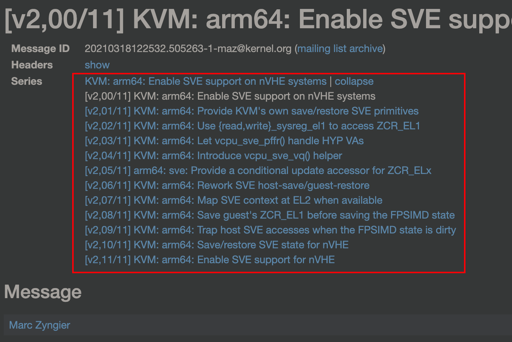

<!-- @import "[TOC]" {cmd="toc" depthFrom=1 depthTo=6 orderedList=false} -->

<!-- code_chunk_output -->

- [1. LKML](#1-lkml)
- [2. 怎么订阅](#2-怎么订阅)
- [3. 归档的邮件列表](#3-归档的邮件列表)

<!-- /code_chunk_output -->

# 1. LKML

内核社区的中心是内核邮件列表(Linux Kernel Mailing List，LKML)，我们可以在 http://vger.kernel.org/vger-lists.html 上面看到订阅这个邮件列表的细节。

注: https://lore.kernel.org/lists.html 也可以在这里看到.

大家知道，Linux kernel是由分布在世界各地的大牛们共同开发、维护的，这就需要一种交流工具，这种工具就是LKML。因而LKML主要有如下功能：

* patch的提交、审查
* patch、版本等发布公告
* 技术讨论、辩论
* 打口水仗

# 2. 怎么订阅

下面网址为LKML的主要列表：

http://vger.kernel.org/vger-lists.html

它有很多分类，如alsa、PM、PWM、USB、GIT等等，大家可以选择感兴趣的订阅。点击指定分类的超链接（这里以linux-pm为例），会看到如下的表格：

```
List: linux-pm;     ( subscribe / unsubscribe )

Info:

This is the mailing list for Linux Power Management development.

Archives:
http://marc.info/?l=linux-pm
http://dir.gmane.org/gmane.linux.power-management.general

Footer:

---
To unsubscribe from this list: send the line "unsubscribe linux-pm" in
the body of a message to majordomo@vger.kernel.org
More majordomo info at  http://vger.kernel.org/majordomo-info.html
```

该表格有4个字段：

* List为邮件列表分类的名字，这里为“linux-pm”；

* Info描述了该邮件列表的内容，这里主要是Linux电源管理相关的；

* Archives为该分类所有邮件列表的归档，记录了该主题有关的所有的交流过程；

注1：有了这个归档链接，其实可以不用订阅的，实时的去看一下就行了。另外，这些邮件列表的归档，对我们理解某个模块的设计理念是非常有帮助的，因为代码只是最终结论的展示，而为什么要这样设计，可以在邮件列表中的讨论中看到。

* Footer是一个提示，告诉大家怎么退订

订阅的方法很简单：

1）发送订阅邮件，格式如下

```
收件人：majordomo@vger.kernel.org

标题：可以为空。

邮件正文：subscribe linux-pm xxx@xxx.com

注2：subscribe为订阅关键字，linux-pm为分类名称，后面为需要订阅的邮箱地址。
```

2）发送后，订阅邮箱会收到一封邮件，要求你回复一个鉴权字符串。回复即可，格式如下（红色为鉴权字符串，要替换为自己收到的，另外注意自己的邮箱地址要正确）：

```
auth 25415058 subscribe linux-pm xxx@xxx.com
```

3）回复后，会收到欢迎邮件，订阅成功

注2：订阅邮箱尽量使用正常邮箱，比如工作邮箱。有些邮箱，如qq邮箱，可能会订阅失败。另外，一旦订阅成功，一定要及时查看、清理，否则会把邮箱撑爆。


# 3. 归档的邮件列表

其实归档的很多, 按照推荐排序如下:

1. linux官方的, 有模块的ml: https://patchwork.kernel.org/

优点:

a. 可从 `Series` 点进这个patch set, 也可从 `Submitter` 查看某个人的, 也就是有一定的过滤能力


b. 进了patch set后, 整个列表很清晰:



c. 进了具体某个 patch, 关于这个patch的所有讨论都会在一页显示出来, 而patch原本内容会在最下面

缺点:

a. 首页同一patch set的所有patch都会显示, 有点冗余


2. 有模块的: https://www.spinics.net/lists/


3. 有模块的: https://lore.kernel.org/lists.html

4. 整体的kernel, 不细分: https://www.mail-archive.com/linux-kernel@vger.kernel.org/
5. 整体的kernel, 不细分: https://lkml.org/lkml


