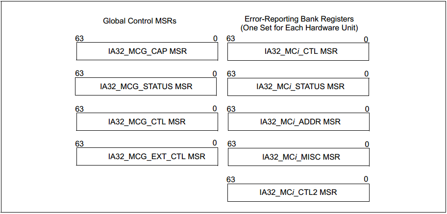
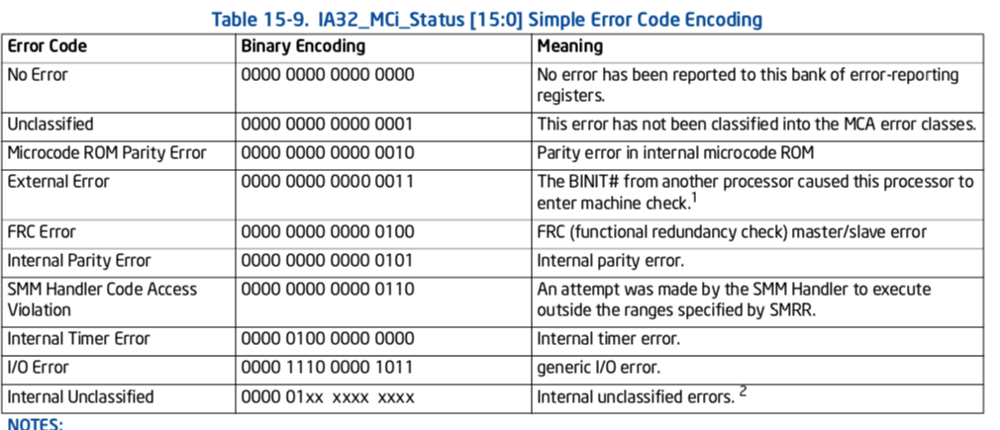

<!-- @import "[TOC]" {cmd="toc" depthFrom=1 depthTo=6 orderedList=false} -->

<!-- code_chunk_output -->

- [1 概述](#1-概述)
- [Machine Check MSR](#machine-check-msr)
  - [IA32_MCG_CAP MSR](#ia32_mcg_cap-msr)
  - [IA32_MCG_STATUS MSR](#ia32_mcg_status-msr)
  - [IA32_MCG_CTL MSR](#ia32_mcg_ctl-msr)
  - [IA32_MCG_EXT_CTL MSR](#ia32_mcg_ext_ctl-msr)
  - [IA32_MCi_CTL MSRs](#ia32_mci_ctl-msrs)
  - [IA32_MCi_STATUS MSRS](#ia32_mci_status-msrs)
- [参考](#参考)

<!-- /code_chunk_output -->

# 1 概述

Intel从奔腾4开始的CPU中增加了一种机制，称为MCA——Machine Check Architecture，它用来检测硬件（这里的Machine表示的就是硬件）错误，比如系统总线错误、ECC错误等等。

这套系统通过**一定数量的MSR**（Model Specific Register）来实现，这些MSR分为两个部分，一部分用来**进行设置**，另一部分用来**描述**发生的**硬件错误**。

当CPU检测到**不可纠正的MCE**（Machine Check Error）时，就会触发`#MC`（Machine Check Exception），通常软件会**注册相关的函数**来处理`#MC`，在这个函数中会通过**读取MSR**来**收集MCE的错误信息**，然后**重启系统**。当然由于**发生的MCE可能是非常致命**的，**CPU直接重启**了，**没有办法完成MCE处理函数**；甚至有可能在MCE处理函数中又触发了**不可纠正的MCE**，也会导致系统直接重启。

当然CPU还会检测到**可纠正的MCE**，当可纠正的MCE数量**超过一定的阈值**时，会触发**CMCI**（`Corrected Machine Check Error Interrupt`），此时软件可以捕捉到**该中断**并进行相应的处理。CMCI是在MCA之后才加入的，算是对MCA的一个增强，在此**之前**软件只能通过**轮询可纠正MCE相关的MSR**才能实现相关的操作。

# Machine Check MSR

MCA是通过一系列的MSR来实现，这里介绍下这些MSR寄存器，首先看下面的图：



上图基本包含了MCA相关的所有MSR。

它分为左右两个部分，左边的是全局的寄存器，右边表示的是多组寄存器。

i表示的是各个组的Index。这里的组有一个称呼是Error Reporting Register Bank。

MCA通过若干Bank的MSR寄存器来表示各种类型的MCE。

下面简单介绍一下这些寄存器。

## IA32_MCG_CAP MSR

这个MSR描述了当前CPU处理MCA的能力，具体每个位的作用如下所示：


* BIT0-7：表示的是CPU支持的Bank的个数；

* BIT8：1表示IA32_MCG_CTL有效，如果是0的话表示无效，读取该IA32_MCG_CTL这个MSR可能发生Exception（至少在UEFI下是这样）；

* BIT9：1表示IA32_MCG_EXT_CTL有效，反之无效，这个与BIT8的作用类似；

* BIT10：1表示支持CMCI，但是CMCI是否能用还需要通过IA32_MCi_CTL2这个MSR的BIT30来使能；

* BIT11：1表示IA32_MCi_STATUS这个MSR的BIT56-55是保留的，BIT54-53是用来上报Threshold-based Error状态的；

* BIT16-23：表示存在的Extended Machine Check State寄存器的个数；

* BIT24：1表示CPU支持Software Error Recovery；

* BIT25：1表示CPU支持增强版的MCA；

* BIT26：1表示支持更多的错误记录（需要UEFI、ACPI的支持）；

* BIT27：1表示支持Local Machine Check Exception；

## IA32_MCG_STATUS MSR

该MSR记录了**MCE发生时CPU的状态**，主要的BIT位介绍如下：


- 这里的IP指的是Instruction Pointer，指向当前的CPU指令；

- EIPV为1时表示当前的指令与导致MCE的原因相关；

- RIPV为1表示当前CPU从当前指令继续执行并不会有什么问题；

- bit 0: 设置后说明在生成机器检查异常时，可以在堆栈上按下的指令指针指向的指令处可靠地**重新启动程序执行**。 清零时，程序无法在推送的指令指针处可靠地重新启动。
- bit 1: 设置后说明生成机器检查异常时指令指针指向的指令与错误直接关联。 清除此标志时，指向的指令可能与错误无关。
- bit 2: 设置后说明生成机器检查异常。 软件可以设置或清除此标志。 设置MCIP时发生第二次机器检查事件将导致处理器进入关闭状态。 
- bit 3: 设置后说明生成本地`machine-check exception`. 这表示当前的机器检查事件仅传递给此逻辑处理器。

## IA32_MCG_CTL MSR

这个寄存器的存在依赖于`IA32_MCG_CAP`这个MSR的`BIT8`。

这个寄存器主要用来Disable（写1）或者Enable（写全0）**MCA功能**。

## IA32_MCG_EXT_CTL MSR

这个寄存器同样依赖于IA32_MCA_CAP这个MSR，这次依赖的是BIT9。该MSR的BIT位说明如下图所示：


目前有就BIT0有用，用来Disable（写1）或者Enable（写0）LMCE，这个LMCE的功能就是使硬件能够将某些MCE发送给单个的逻辑处理器，为什么要这样做目前还不是很 清楚。

以上都是全局的MSR，下面介绍**每个Bank对应的MSR**，

这些寄存器的第一个是IA32_MC0_CTL，它的地址一般都是400H。之后接着的是IA32_MC0_STATUS，IA32_MC0_ADDR，IA32_MC0_MISC，但是在之后并不是IA32_MC0_CTL2，而是IA32_MC1_CTL；对于IA32_MCi_CTL2来说，它的地址跟上面的这些不在一起，第一个IA32_MC0_CTL2是在280H，之后是IA32_MC1_CTL2在281H，以此类推。

## IA32_MCi_CTL MSRs

每个Bank的CTL的作用是用来控制在发生哪些MCA的时候来触发#MC：


这里的64个BIT位，设置某个BIT位就会使对应BIT位的MCA类型在发生时触发#MC。

## IA32_MCi_STATUS MSRS

这类MSR的作用就是显示MCE信息：


bd80000000100134的二进制如下:

```
1011 1101 1000 0000 0000 0000 0000 0000 
0000 0000 0001 0000 0000 0001 0011 0100
```

Bit 63: VAL. 表示本寄存器中包含有效的错误码
Bit 61: UC. 表示是无法纠正的MCE
Bit 60: EN. 表示处于允许报告错误的状态
Bit 59: MISCV. 表示MCi_MISC寄存器中含有对该错误的补充信息
Bit 58: ADDRV. 表示MCi_ADDR寄存器含有发生错误的内存地址
Bit 56: 发出未校正的可恢复（UCR）错误信号
Bit 55: UCR错误所需的恢复操作
`Bit[16: 31]`: 特定CPU型号相关的扩展错误码. 本例中是0x0010.
`Bit[0: 15]`: MCE错误码, 该错误码是所有CPU型号通用的，分为两类：simple error codes（简单错误码） 和 compound error codes（复合错误码），本例中0x0134表示Memory errors in the cache hierarchy(缓存层次结构中的内存错误)：

- Simple Error Codes:



- Compound Error Codes:


Bit 12: 0代表正常过滤

2位TT子字段（表15-11）表示事务的类型（数据，指令或通用）。 子字段适用于TLB，高速缓存和互连错误条件。 请注意，互连错误条件主要与P6系列和奔腾处理器相关，后者使用独立于系统总线的外部APIC总线。 当处理器无法确定事务类型时，将报告泛型类型。这里是Data.


2位LL子字段（参见表15-12）指示发生错误的存储器层次结构中的级别（级别0，级别1，级别2或通用）。 LL子字段也适用于TLB，高速缓存和互连错误条件。 Pentium 4，Intel Xeon，Intel Atom和P6系列处理器支持缓存层次结构中的两个级别和TLB中的一个级别。 同样，当处理器无法确定层次结构级别时，将报告泛型类型。


```
[root@SH-IDC1-10-5-8-61 yanbaoyue]# mcelog
Hardware event. This is not a software error.
MCE 0
CPU 19 BANK 14 TSC f3086e49d7de
RIP !INEXACT! 10:ffffffff816ab6a5
MISC 900010080000086 ADDR 5f14903680
TIME 1556364329 Sat Apr 27 19:25:29 2019
MCG status:RIPV MCIP
MCi status:
Error overflow
Uncorrected error
Error enabled
MCi_MISC register valid
MCi_ADDR register valid
SRAO
MCA: MEMORY CONTROLLER MS_CHANNEL1_ERR
Transaction: Memory scrubbing error
MemCtrl: Uncorrected patrol scrub error
STATUS fd001dc0001000c1 MCGSTATUS 5
MCGCAP f000814 APICID 60 SOCKETID 1
PPIN fd003dc0001000c1
CPUID Vendor Intel Family 6 Model 85
Hardware event. This is not a software error.
MCE 1
CPU 19 BANK 14 TSC f308a56e97a8
RIP !INEXACT! 10:ffffffff816ab6a5
MISC 900001001000086 ADDR 5f149ab080
TIME 1556364329 Sat Apr 27 19:25:29 2019
MCG status:RIPV MCIP
MCi status:
Error overflow
Uncorrected error
Error enabled
MCi_MISC register valid
MCi_ADDR register valid
SRAO
MCA: MEMORY CONTROLLER MS_CHANNEL1_ERR
Transaction: Memory scrubbing error
MemCtrl: Uncorrected patrol scrub error
STATUS fd003dc0001000c1 MCGSTATUS 5
MCGCAP f000814 APICID 60 SOCKETID 1
PPIN fd003a40001000c1
CPUID Vendor Intel Family 6 Model 85
Hardware event. This is not a software error.
MCE 2
CPU 43 BANK 14 TSC f308d5268140
RIP !INEXACT! 10:ffffffff816ab6a5
MISC 900100000000086 ADDR 5f14a5b480
TIME 1556364329 Sat Apr 27 19:25:29 2019
MCG status:RIPV MCIP
MCi status:
Error overflow
Uncorrected error
Error enabled
MCi_MISC register valid
MCi_ADDR register valid
SRAO
MCA: MEMORY CONTROLLER MS_CHANNEL1_ERR
Transaction: Memory scrubbing error
MemCtrl: Uncorrected patrol scrub error
STATUS fd003a40001000c1 MCGSTATUS 5
MCGCAP f000814 APICID 61 SOCKETID 1
CPUID Vendor Intel Family 6 Model 85

-----------------------
[166492.496342] mce: [Hardware Error]: CPU 19: Machine Check Exception: f Bank 1: bd80000000100134
[166492.496424] mce: [Hardware Error]: RIP 10:<ffffffffc1003eaa> {vvp_page_own+0xa/0xc0 [lustre]}
[166492.496541] mce: [Hardware Error]: TSC 1e4ee3d9dafdc ADDR 3b14a3c880 MISC 86
[166492.496609] mce: [Hardware Error]: PROCESSOR 0:50654 TIME 1556280681 SOCKET 1 APIC 60 microcode 2000057
[166492.496692] mce: [Hardware Error]: Machine check events logged
[166492.496767] mce: [Hardware Error]: Run the above through 'mcelog --ascii'
[166492.498942] Kernel panic - not syncing: Machine check from unknown source
```

# 参考

- x86架构——MCA: https://blog.csdn.net/jiangwei0512/article/details/62456226
