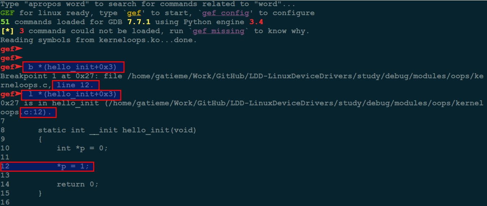
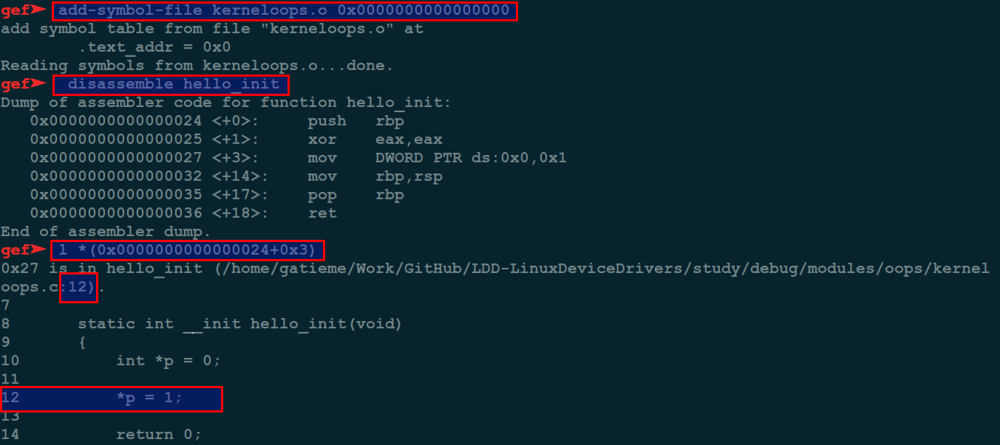
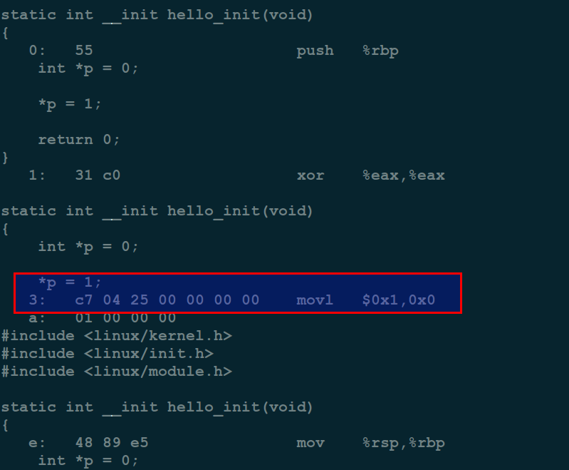

# soft panic

凡是非中断处理引发的模块崩溃都将导致 `soft panic`

在这种情况下, 驱动本身会崩溃, 但是还不至于让系统出现致命性失败, 因为它没有锁定中断处理例程. 导致 `hard panic`的原因同样对`soft panic`也有用(比如在运行时访问一个空指针).

# 驱动OOPS实例分析

## 导致 `OOPS` 的代码

模块代码, 有一处 `NULL` 指针异常

```cpp
//  http://blog.csdn.net/tommy_wxie/article/details/12521535
//  http://blog.chinaunix.net/uid-20651662-id-1906954.html
// kerneloops.c
#include <linux/kernel.h>
#include <linux/init.h>
#include <linux/module.h>

static int __init hello_init(void)
{
    int *p = 0;

    *p = 1;

    return 0;
}

static void __exit hello_exit(void)
{
    return;
}

module_init(hello_init);
module_exit(hello_exit);

MODULE_LICENSE("GPL");
```

makefile

```cpp
# -------------------------------------------------
#
# Makefile for the LDD-LinuxDeviceDrivers.
#
# Author: gatieme
# Create: 2016-07-29 15:50:46
# Last modified: 2016-07-29 16:10:29
# Description:
# 	This program is loaded as a kernel(v2.6.18 or later) module.
# 	Use "make install" to load it into kernel.
# 	Use "make remove" to remove the module out of kernel.
#
# -------------------------------------------------


#	my driver description
DRIVER_VERSION := "1.0.0"
DRIVER_AUTHOR  := "Gatieme @ AderStep Inc..."
DRIVER_DESC    := "Linux input module for Elo MultiTouch(MT) devices"
DRIVER_LICENSE := "Dual BSD/GPL"


MODULE_NAME := kerneloops
EXTRA_CFLAGS  += -g


ifneq ($(KERNELRELEASE),)

obj-m := $(MODULE_NAME).o #print_vmarea.o

else

KERNELDIR ?= /lib/modules/$(shell uname -r)/build

PWD := $(shell pwd)

modules:
	make -C $(KERNELDIR) M=$(PWD) modules

modules_install:
	make -C $(KERNELDIR) M=$(PWD) modules_install


insmod:
	sudo insmod $(MODULE_NAME).ko

reinsmod:
	sudo rmmod $(MODULE_NAME)
	sudo insmod $(MODULE_NAME).ko


rmmod:
	sudo rmmod $(MODULE_NAME)


clean:
	make -C $(KERNELDIR) M=$(PWD) clean
	rm -f modules.order Module.symvers Module.markers

.PHNOY:
	modules modules_install clean

endif
```


##1.2	重现 `OOPS`
-------

make后加载模块, 提示加载失败, 此时内核倒是了OOPS, 由于故障不严重, 系统并未死机


##1.3	`OOPS` 信息
-------

查看 `Kernel` 的日志, 或者 `dmesg` 打印日志可以查看 `OOPS` 信息


```cpp
[ 5235.513513] BUG: unable to handle kernel NULL pointer dereference at           (null)
[ 5235.513604] IP: [<ffffffffc0008003>] hello_init+0x3/0x1000 [kerneloops]
[ 5235.513671] PGD 0 
[ 5235.513696] Oops: 0002 [#1] SMP 
[ 5235.513736] Modules linked in: kerneloops(OE+) bbswitch(OE) cuse arc4 ath9k ath9k_common ath9k_hw uvcvideo videobuf2_vmalloc videobuf2_memops videobuf2_v4l2 videobuf2_core v4l2_common videodev i915 ath mac80211 rfcomm bnep media bluetooth cfg80211 intel_rapl x86_pkg_temp_thermal intel_powerclamp snd_hda_codec_hdmi kvm_intel snd_hda_codec_realtek drm_kms_helper kvm snd_hda_codec_generic snd_hda_intel snd_hda_codec snd_hda_core snd_hwdep drm snd_pcm acer_wmi sparse_keymap snd_seq_midi snd_seq_midi_event snd_rawmidi snd_seq snd_seq_device snd_timer snd mei_me mei irqbypass crct10dif_pclmul crc32_pclmul ghash_clmulni_intel aesni_intel i2c_algo_bit fb_sys_fops syscopyarea sysfillrect sysimgblt lpc_ich shpchp soundcore aes_x86_64 lrw gf128mul glue_helper ablk_helper cryptd nfsd joydev input_leds auth_rpcgss nfs_acl nfs serio_raw video mac_hid wmi lockd parport_pc ppdev coretemp grace sunrpc lp fscache parport binfmt_misc hid_generic psmouse pata_acpi usbhid tg3 hid sdhci_pci ptp sdhci pps_core fjes
[ 5235.514835] CPU: 1 PID: 9087 Comm: insmod Tainted: G           OE   4.4.0-72-generic #93~14.04.1-Ubuntu
[ 5235.514918] Hardware name: Acer Aspire 4752/Aspire 4752, BIOS V2.10 08/25/2011
[ 5235.514984] task: ffff88013c5e6200 ti: ffff880050050000 task.ti: ffff880050050000
[ 5235.515050] RIP: 0010:[<ffffffffc0008003>]  [<ffffffffc0008003>] hello_init+0x3/0x1000 [kerneloops]
[ 5235.515138] RSP: 0018:ffff880050053cc0  EFLAGS: 00010246
[ 5235.515187] RAX: 0000000000000000 RBX: ffffffff81e13080 RCX: 0000000000099cf4
[ 5235.515249] RDX: 0000000000099cf3 RSI: 0000000000000017 RDI: ffff8801a9003c00
[ 5235.515312] RBP: ffff880050053d38 R08: 000000000001a0a0 R09: ffffffff81002131
[ 5235.515374] R10: ffff8801afa5a0a0 R11: ffffea0004f13b80 R12: ffff88013c4eef00
[ 5235.515438] R13: 0000000000000000 R14: ffffffffc0008000 R15: ffff880050053eb0
[ 5235.515504] FS:  00002b2f9a71fb80(0000) GS:ffff8801afa40000(0000) knlGS:0000000000000000
[ 5235.515574] CS:  0010 DS: 0000 ES: 0000 CR0: 0000000080050033
[ 5235.515624] CR2: 0000000000000000 CR3: 000000005166b000 CR4: 00000000000406e0
[ 5235.515687] Stack:
[ 5235.515711]  ffff880050053d38 ffffffff8100213d ffff880050053eb0 ffff880050053d10
[ 5235.515842]  0000000000000246 000000000000002e ffffffff811de97d ffff8801a9003c00
[ 5235.515949]  ffffffff81183c84 0000000000000018 000000000da6966e ffffffffc05fe000
[ 5235.516085] Call Trace:
[ 5235.516127]  [<ffffffff8100213d>] ? do_one_initcall+0xcd/0x1f0
[ 5235.516185]  [<ffffffff811de97d>] ? kmem_cache_alloc_trace+0x1ad/0x220
[ 5235.516222]  [<ffffffff81183c84>] ? do_init_module+0x27/0x1d2
[ 5235.516283]  [<ffffffff81183cbd>] do_init_module+0x60/0x1d2
[ 5235.516346]  [<ffffffff81104104>] load_module+0x1424/0x1b10
[ 5235.516433]  [<ffffffff811008f0>] ? __symbol_put+0x40/0x40
[ 5235.516521]  [<ffffffff81206a61>] ? kernel_read+0x41/0x60
[ 5235.516610]  [<ffffffff811049be>] SYSC_finit_module+0x7e/0xa0
[ 5235.516706]  [<ffffffff811049fe>] SyS_finit_module+0xe/0x10
[ 5235.516802]  [<ffffffff81806eb6>] entry_SYSCALL_64_fastpath+0x16/0x75
[ 5235.516883] Code: <c7> 04 25 00 00 00 00 01 00 00 00 48 89 e5 5d c3 00 00 00 00 00 00 
[ 5235.517020] RIP  [<ffffffffc0008003>] hello_init+0x3/0x1000 [kerneloops]
[ 5235.517084]  RSP <ffff880050053cc0>
[ 5235.517117] CR2: 0000000000000000
[ 5235.528875] ---[ end trace 69ea8d586c904d41 ]---
```


##1.4 OOOPS信息分析
-------

```cpp
Oops: 0002 [#1] SMP
```

这个是 `OOPS` 信息的错误码

| bit | 描述 |
|:---:|:----:|
| bit 0 | 0 means no page found, 1 means a protection fault |
| bit 1 | 0 means read, 1 means write |
| bit 2 | 0 means kernel, 1 means user-mode |

[#1] — this value is the number of times the Oops occurred. Multiple Oops can be triggered as a cascading effect of the first one.
这个值是 `Oops` 发生的次数, 多个 `Oops` 可以级联效应触发


```cpp
[ 5235.514835] CPU: 1 PID: 9087 Comm: insmod Tainted: G           OE   4.4.0-72-generic #93~14.04.1-Ubuntu
```

表示这个 `OOPS` 发生在 `CPU1`, 当前运行的进程是9087号进程 insmod, `Tainted` 标识为 `G`, 内核版本是 `4.4.0-72-generic`, 操作系统为 `#93~14.04.1-Ubuntu`

其中Tainted的表示可以从内核中 `kernel/panic.c` 中找到

| Tainted | 描述 |
|:-------:|:---:|
| 'G' | if all modules loaded have a GPL or compatible license |
| 'P' | if any proprietary module has been loaded. Modules without a MODULE_LICENSE or with a MODULE_LICENSE that is not recognised by insmod as GPL compatible are assumed to be proprietary. |
| 'F' | if any module was force loaded by "insmod -f". |
| 'S' | if the Oops occurred on an SMP kernel running on hardware that hasn't been certified as safe to run multiprocessor. Currently this occurs only on various Athlons that are not SMP capable. |
| 'R' | if a module was force unloaded by "rmmod -f". |
| 'M' | if any processor has reported a Machine Check Exception. |
| 'B' | if a page-release function has found a bad page reference or some unexpected page flags. |
| 'U' | if a user or user application specifically requested that the Tainted flag be set. |
| 'D' | if the kernel has died recently, i.e. there was an OOPS or BUG. |
| 'W' | if a warning has previously been issued by the kernel. |
| 'C' | if a staging module / driver has been loaded. |
| 'I' | if the kernel is working around a sever bug in the platform's firmware (BIOS or similar). |

然后是其中关键的几句


```cpp
[ 5235.513604] IP: [<ffffffffc0008003>] hello_init+0x3/0x1000 [kerneloops]
```


接着是 `OOPS` 发生时, `CPU` 寄存器的信息

```cpp
[ 5235.514984] task: ffff88013c5e6200 ti: ffff880050050000 task.ti: ffff880050050000
[ 5235.515050] RIP: 0010:[<ffffffffc0008003>]  [<ffffffffc0008003>] hello_init+0x3/0x1000 [kerneloops]
[ 5235.515138] RSP: 0018:ffff880050053cc0  EFLAGS: 00010246
[ 5235.515187] RAX: 0000000000000000 RBX: ffffffff81e13080 RCX: 0000000000099cf4
[ 5235.515249] RDX: 0000000000099cf3 RSI: 0000000000000017 RDI: ffff8801a9003c00
[ 5235.515312] RBP: ffff880050053d38 R08: 000000000001a0a0 R09: ffffffff81002131
[ 5235.515374] R10: ffff8801afa5a0a0 R11: ffffea0004f13b80 R12: ffff88013c4eef00
[ 5235.515438] R13: 0000000000000000 R14: ffffffffc0008000 R15: ffff880050053eb0
[ 5235.515504] FS:  00002b2f9a71fb80(0000) GS:ffff8801afa40000(0000) knlGS:0000000000000000
[ 5235.515574] CS:  0010 DS: 0000 ES: 0000 CR0: 0000000080050033
[ 5235.515624] CR2: 0000000000000000 CR3: 000000005166b000 CR4: 00000000000406e0
```


接着是堆栈信息

```cpp
[ 5235.515687] Stack:
[ 5235.515711]  ffff880050053d38 ffffffff8100213d ffff880050053eb0 ffff880050053d10
[ 5235.515842]  0000000000000246 000000000000002e ffffffff811de97d ffff8801a9003c00
[ 5235.515949]  ffffffff81183c84 0000000000000018 000000000da6966e ffffffffc05fe000
```

回溯信息

```cpp
[ 5235.516085] Call Trace:
[ 5235.516127]  [<ffffffff8100213d>] ? do_one_initcall+0xcd/0x1f0
[ 5235.516185]  [<ffffffff811de97d>] ? kmem_cache_alloc_trace+0x1ad/0x220
[ 5235.516222]  [<ffffffff81183c84>] ? do_init_module+0x27/0x1d2
[ 5235.516283]  [<ffffffff81183cbd>] do_init_module+0x60/0x1d2
[ 5235.516346]  [<ffffffff81104104>] load_module+0x1424/0x1b10
[ 5235.516433]  [<ffffffff811008f0>] ? __symbol_put+0x40/0x40
[ 5235.516521]  [<ffffffff81206a61>] ? kernel_read+0x41/0x60
[ 5235.516610]  [<ffffffff811049be>] SYSC_finit_module+0x7e/0xa0
[ 5235.516706]  [<ffffffff811049fe>] SyS_finit_module+0xe/0x10
[ 5235.516802]  [<ffffffff81806eb6>] entry_SYSCALL_64_fastpath+0x16/0x75
```

以上是堆栈调用跟踪回溯信息, 在Oops发生之前调用的函数的列表.


然后是在 `Oops`发生时正在运行的机器代码部分的十六进制转储.

```cpp
cpp[ 5235.516883] Code: <c7> 04 25 00 00 00 00 01 00 00 00 48 89 e5 5d c3 00 00 00 00 00 00 
```


##1.5	发现问题所在
-------


其中最关键的信息, 就是PC/IP等寄存器的信息, 直接显示了正在执行的代码

```cpp
[ 5235.513604] IP: [<ffffffffc0008003>] hello_init+0x3/0x1000 [kerneloops]

[ 5235.517020] RIP  [<ffffffffc0008003>] hello_init+0x3/0x1000 [kerneloops]
```

不同的系统中提示的可能有所不同,　不同架构对 `PC/IP` 寄存器的叫法不同


`PC is at sello_init+0x3/0x1000`

或者

`EIP : hello_init+0x3/0x1000 [kerneloops]`

告诉我们内核是执行到 `hello_init+0x3/0x1000` 这个地址处出错的, 那么我们所需要做的就是找到这个地址对应的代码

>格式为 <symbol> +偏移/长度
>
>hello_init指示了实在hello_init中出现的异常
>
>0x3表示出错的偏移位置
>
>0x1000表示hello_init函数的大小


###1.5.1 通过gdb调试列出地址所对应的位置
-------

由于我们的是驱动出现的问题, 那么我们就用gdb直接调试驱动的 `KO` 文件, 如果是源内核出现的 `OOPS`, 那么只能用 `gdb` 对 `vmlinux` 文件进行调试

```
# gdb调试驱动
gdb kerneloops.ko

# l/list address列出对应的代码位置
l *(hello_init+0x3)

# 或者 b address在地址出插入断点, 也会提示断点的位置
b *(hello_init+0x3)
```




可以看到 `gdb` 提示 `hello_init+0x3` 对应的代码是驱动远大第 `12` 行

```cpp
    *p = 1;
```

由于 `p` 值一个 `NULL` 指针, 直接赋值, 导致 `NULL` 指针异常


此方法对于内核OOPS同样适用, 调试时将驱动 `KO` 文件替换为内核 `vmlinux` 文件

###1.5.2	addr2line将地址转换为对应的源代码
-------

```cpp
addr2line -e kerneloops.o hello_init+0x3
```
此方法对于内核OOPS同样适用, 调试时将驱动 `KO` 文件或者 `OBJ` 文件替换为内核 `vmlinux` 文件

###1.5.3	将gdb反汇编代码得到地址直接转换为对应的源代码
-------

对于驱动来说, 可以从`/sys/module/对应驱动名称/sections/.init.text` 查找到对应的地址信息

```cpp
#  调试驱动代码
gdb kerneloops.ko

#  接下来, 使用 `add-symbol-file` 将符号文件添加到调试器.
add-symbol-file kerneloops.o 0xffffffffa03e1000
#  将hello_init函数反汇编得到虚拟地址信息
disassemble hello_init
#list  address+offset的信息
l *(address+offset)
```




`add-symbol-file` 命令

*	第一个参数是驱动的 `obj` 文件 `kerneloops.o`

*	第二个参数是模块的文本部分的地址, 从/sys/module/XXX/sections/.init.text(其中 XXX 是模块名称)获取此地址


首先获取到地址信息

```cpp
cat /sys/module/kerneloops/sections/.init.text
OR 
nm kerneloops.ko | grep hello_init
OR 
nm kerneloops.o | grep hello_init
```


地址信息是0x0000000000000000


gdb调试驱动kerneloops.ko， 并添加调试信息

```cpp
gdb kerneloops.ko
add-symbol-file kerneloops.o 0x0000000000000000
```


接着将hello_init函数反汇编


```cpp
disassemble hello_init
```


可以得到hello_init的起始地址为 `0x0000000000000024`, 
那么hello_init+0x03的地址为0x0000000000000027
对应的代码`mov    DWORD PTR ds:0x0,0x1`
可以看到是个0异常

进一步的我们查阅其代码

```cpp
l *(0x0000000000000027)
```


同样可以得到最后异常的代码在地12行


此方法对于内核OOPS同样适用, 调试时将驱动 `KO` 文件或者 `OBJ` 文件替换为内核 `vmlinux` 文件， 通过 `nm vmlinux`和 `cat /proc/kallsyms` 获取到对应的地址信息

###1.5.4	使用objdump反汇编代码得到地址
-------

```cpp
objdump -D *.o得到反汇编代码

objdump -S *.o得到含有c源码的汇编
```
这要求之前的编译包含了 `debug`信息 `(-g)`, 而我们的Makefile中添加了 `-g` 调试选项


```cpp
objdump -S kerneloops.ko
OR
objdump -S kerneloops.o
```




可以很明显的看到hello_init偏移0x3出的汇编和对应的代码

```cpp
	*p = 1;
   3:	c7 04 25 00 00 00 00 	movl   $0x1,0x0
```

直接对地址 `0x0` 处写入 `0x1`


此方法对于内核OOPS同样适用, 调试时将驱动 `KO` 文件或者 `OBJ` 文件替换为内核 `vmlinux` 文件

#2	参考资料
-------

[根据内核Oops 定位代码工具使用— addr2line 、gdb、objdump](http://blog.csdn.net/u012719256/article/details/53365155)

[转载_Linux内核OOPS调试](http://blog.csdn.net/tommy_wxie/article/details/12521535)


[kernel panic/kernel oops分析](http://blog.chinaunix.net/uid-20651662-id-1906954.html)


[DebuggingKernelOops](https://wiki.ubuntu.com/DebuggingKernelOops)


[kerneloops package in Ubuntu](https://launchpad.net/ubuntu/+source/kerneloops)


[Understanding a Kernel Oops!](http://opensourceforu.com/2011/01/understanding-a-kernel-oops/)


[Kernel oops错误](http://blog.163.com/prodigal_s/blog/static/204537164201411611432884/)


[Kernel Oops Howto](http://madwifi-project.org/wiki/DevDocs/KernelOops)


[Kernel Panics](https://wiki.archlinux.org/index.php/Kernel_Panics)

[WiKipedia](https://en.wikipedia.org/wiki/Linux_kernel_oops)

[Oops中的error code解释](http://blog.csdn.net/mozun1/article/details/53306714)

<a rel="license" href="http://creativecommons.org/licenses/by-nc-sa/4.0/"></a>
<br>
本作品采用<a rel="license" href="http://creativecommons.org/licenses/by-nc-sa/4.0/">知识共享署名-非商业性使用-相同方式共享 4.0 国际许可协议</a>进行许可
