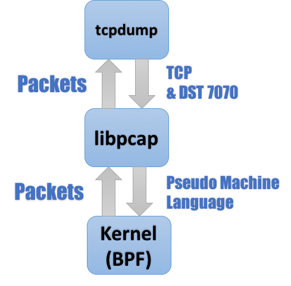
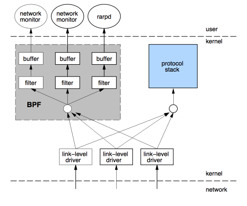
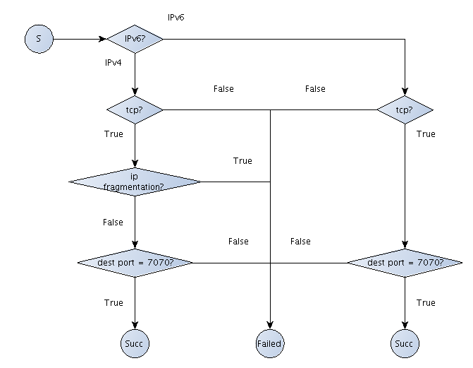

本文来自: https://www.ibm.com/developerworks/cn/linux/l-lo-eBPF-history/index.html , 2017年

数日之前，笔者参加某一技术会议之时，为人所安利了一款开源项目，演讲者对其性能颇为称道，称其乃基于近年在内核中炙手可热的 eBPF 技术。

对这 eBPF 的名号，笔者略有些耳熟，会后遂一番搜索学习，发现 eBPF 果然源于早年间的成型于 BSD 之上的传统技术 BPF(Berkeley Packet Filter)，但无论其性能还是功能已然都不是 BPF 可以比拟的了，慨叹长江后浪推前浪，前浪死在沙滩上之余，笔者也发现国内相关文献匮乏，导致 eBPF 尚不为大众所知，遂撰此文，记录近日所得，希冀可以为广大读者打开新世界的大门。

# 源头：一篇 1992 年的论文

考虑到 BPF 的知名度，在介绍 eBPF 之前，笔者自觉还是有必要先来回答另一个问题：

## 什么是 BPF?

笔者在前文中说过了，BPF 的全称是 `Berkeley Packet Filter`，顾名思义，这是一个用于**过滤(filter)网络报文(packet)的架构**。

其实 BPF 可谓是名气不大，作用不小的典范：如果笔者一开始提出 BPF 的同时还捎带上大名鼎鼎的 **tcpdump** 或 **wireshark**，估计绝大部分读者都会了然了：BPF 即为 tcpdump 抑或 wireshark 乃至**网络监控(Network Monitoring)领域**的基石。

今天我们看到的 BPF 的设计，最早可以追溯到 **1992** 年刊行在 USENIX conference 上的一篇论文：`The BSD Packet Filter: A New Architecture for User-level Packet Capture`。由于最初版本的 BPF 是实现于 **BSD 系统**之上的，于是在论文中作者称之为"`BSD Packet Filter`"；后来由于 BPF 的理念渐成主流，为各大操作系统所接受，B 所代表的 BSD 便也渐渐淡去，最终演化成了今天我们眼中的 `Berkeley Packet Filter`。

诚然，无论 BSD 和 Berkeley 如何变换，其后的 Packet Filter 总是不变的，这两个单词也基本概括了 BPF 的两大核心功能：

* 过滤(Filter): 根据外界输入的规则**过滤报文**；
* 复制(Copy): 将**符合条件的报文**由**内核空间复制到用户空间**；

以 tcpdump 为例：熟悉网络监控(network monitoring)的读者大抵都知道 tcpdump 依赖于 **pcap** 库，tcpdump 中的诸多核心功能都经由后者实现，其整体工作流程如下图所示：

图 1. Tcpdump 工作流程



由图 1 不难看出，位于**内核**之中的 **BPF 模块**是整个流程之中最核心的一环：它一方面接受 tcpdump 经由 libpcap 转码而来的**滤包条件**(Pseudo Machine Language) ，另一方面也将符合条件的报文复制到用户空间最终经由 libpcap 发送给 tcpdump。

读到这里，估计有经验的读者已经能够在脑海里大致勾勒出一个 BPF 实现的大概了，图 2 引自文献 1，读者们可以管窥一下当时 BPF 的设计：

图 2. BPF Overview



时至今日，传统 BPF 仍然遵循图 2 的路数：途经网卡驱动层的报文在上报给协议栈的同时会多出一路来传送给 BPF，再经后者过滤后最终拷贝给用户态的应用。除开本文提及的 tcpdump，当时的 RARP 协议也可以利用 BPF 工作(Linux 2.2 起，内核开始提供 rarp 功能，因此如今的 RARP 已经不再需要 BPF 了)。

整体来说，BPF 的架构还是相对浅显易懂的，不过要是深入细节的话就没那么容易了：因为其中的 filter 的设计（也是文献 1 中着墨最多的地方）要复杂那么一点点。

Pseudo Machine Language

估计在阅读本文之前，相当数量的读者都会误以为所谓的 Filter是挂在 tcpdump 末尾处的 expression 吧，类似于图 1 中的"tcp and dst port 7070"这样。但倘若我们如下文这样在 tcpdump 的调用中加入一个-d，还会发现其中大有乾坤：

清单 1 tcpdump -d

```
#以下代码可以在任意支持 tcpdump 的类 Unix 平台上运行，输出大同小异   
bash-3.2$ sudo tcpdump -d -i lo tcp and dst port 7070
(000) ldh [12]
(001) jeq #0x86dd jt 2 jf 6 #检测是否为 ipv6 报文，若为假(jf)则按照 ipv4 报文处理(L006)
(002) ldb [20]
(003) jeq #0x6 jt 4 jf 15 #检测是否为 tcp 报文
(004) ldh [56]
(005) jeq #0x1b9e jt 14 jf 15 #检测是否目标端口为 7070(0x1b9e)，若为真(jt)则跳转 L014
(006) jeq #0x800 jt 7 jf 15 #检测是否为 ipv4 报文
(007) ldb [23]
(008) jeq #0x6 jt 9 jf 15 #检测是否为 tcp 报文
(009) ldh [20]
(010) jset #0x1fff jt 15 jf 11 #检测是否为 ip 分片(IP fragmentation)报文
(011) ldxb 4*([14]&0xf)
(012) ldh [x + 16] #找到 tcp 报文中 dest port 的所在位置
(013) jeq #0x1b9e jt 14 jf 15 #检测是否目标端口为 7070(0x1b9e)，若为真(jt)则跳转 L014
(014) ret #262144 #该报文符合要求
(015) ret #0 #该报文不符合要求
```

根据 man page，tcpdump 的-d 会将输入的 expression 转义为一段"human readable"的"compiled packet-matching code"。当然，如清单 1 中的内容，对于很多道行不深的读者来说，基本是"human unreadable"的，于是笔者专门加入了一些注释加以解释，但是相较于-dd 和-ddd 反人类的输出，这确可以称得上是"一目了然"的代码了。

这段看起来类似于汇编的代码，便是 BPF 用于定义 Filter 的伪代码，亦即图 1 中 libpcap 和内核交互的 pseudo machine language(也有一种说法是，BPF 伪代码设计之初参考过当时大行其道的 RISC 令集的设计理念)，当 BPF 工作时，每一个进出网卡的报文都会被这一段代码过滤一遍，其中符合条件的(ret #262144)会被复制到用户空间，其余的(ret #0)则会被丢弃。

BPF 采用的报文过滤设计的全称是 CFG(Computation Flow Graph)，顾名思义是将过滤器构筑于一套基于 if-else 的控制流(flow graph)之上，例如清单 1 中的 filter 就可以用图 3 来表示：

图 3 基于 CFG 实现的 filter 范例



CFG 模型最大的优势是快，参考文献 1 中就比较了 CFG 模型和基于树型结构构建出的 CSPF 模型的优劣，得出了基于 CFG 模型需要的运算量更小的结论；但从另一个角度来说，基于伪代码的设计却也增加了系统的复杂性：一方面伪指令集已经足够让人眼花缭乱的了；另一方面为了执行伪代码，内核中还需要专门实现一个虚拟机(pseudo-machine)，这也在一定程度上提高了开发和维护的门槛。

当然，或许是为了提升系统的易用性，一方面 BPF 设计者们又额外在 tcpdump 中设计了我们今天常见的过滤表达式(实际实现于 libpcap，当然两者也都源于 Lawrence Berkeley Lab)，令过滤器真正意义上"Human Readable"了起来；另一方面，由于设计目标只是过滤字节流形式的报文，虚拟机及其伪指令集的设计相对会简单不少：整个虚拟机只实现了两个 32 位的寄存器，分别是用于运算的累加器 A 和通用寄存器 X；且指令集也只有寥寥 20 来个，如表 1 所示：


易用性方面的提升很大程度上弥补了 BPF 本身的复杂度带来的缺憾，很大程度上推动了 BPF 的发展，此后数年，BPF 逐渐称为大众所认同，包括 Linux 在内的众多操作系统都开始将 BPF 引入了内核。

鉴于 Linux 上 BPF 如火如荼的大好形势，本文余下的部分笔者将基于 Linux 上的 BPF 实现进行展开。

LSF: Linux 下的 BPF 实现
BPF 是在 1997 年首次被引入 Linux 的，当时的内核版本尚为 2.1.75。准确的说，Linux 内核中的报文过滤机制其实是有自己的名字的：Linux Socket Filter，简称 LSF。但也许是因为 BPF 名声太大了吧，连内核文档都不大买这个帐，直言 LSF 其实就是(aka)BPF。

当然，LSF 和 BPF 除了名字上的差异以外，还是有些不同的，首当其冲的分歧就是接口：传统的 BSD 开启 BPF 的方式主要是靠打开(open)/dev/bpfX 设备，之后利用 ioctl 来进行控制；而 linux 则选择了利用套接字选项(sockopt)SO_ATTACH_FILTER/SO_DETACH_FILTER 来执行系统调用，篇幅所限，这部分内容笔者就不深入了，有兴趣的读者可以通过移步socket 的 manual page或内核 filter 文档深入了解。这里笔者只给出一个例子来让读者们对 Linux 下的 BPF 的开发有一个直观的感受：

清单 2 BPF Sample

```cpp
#include <……>
// tcpdump -dd 生成出的伪代码块
// instruction format:
// opcode: 16bits; jt: 8bits; jf: 8bits; k: 32bits
static struct sock_filter code[] = {
    { 0x28, 0, 0, 0x0000000c }, // (000) ldh [12]
    { 0x15, 0, 4, 0x000086dd }, // (001) jeq #0x86dd jt 2 jf 6
    { 0x30, 0, 0, 0x00000014 }, // (002) ldb [20]
    { 0x15, 0, 11, 0x00000006 }, // (003) jeq #0x6 jt 4 jf 15
    { 0x28, 0, 0, 0x00000038 }, // (004) ldh [56]
    { 0x15, 8, 9, 0x00000438 }, // (005) jeq #0x438 jt 14 jf 15
    { 0x15, 0, 8, 0x00000800 }, // (006) jeq #0x800 jt 7 jf 15
    { 0x30, 0, 0, 0x00000017 }, // (007) ldb [23]
    { 0x15, 0, 6, 0x00000006 }, // (008) jeq #0x6 jt 9 jf 15
    { 0x28, 0, 0, 0x00000014 }, // (009) ldh [20]
    { 0x45, 4, 0, 0x00001fff }, // (010) jset #0x1fff jt 15 jf 11
    { 0xb1, 0, 0, 0x0000000e }, // (011) ldxb 4*([14]&0xf)
    { 0x48, 0, 0, 0x00000010 }, // (012) ldh [x + 16]
    { 0x15, 0, 1, 0x00000438 }, // (013) jeq #0x438 jt 14 jf 15
    { 0x6, 0, 0, 0x00040000 }, // (014) ret #262144
    { 0x6, 0, 0, 0x00000000 }, // (015) ret #0
};
int main(int argc, char **argv)
{
    // ……
    struct sock_fprog bpf = { sizeof(code)/sizeof(struct sock_filter), code };
    // ……
    // 1. 创建 raw socket
    s = socket(AF_PACKET, SOCK_RAW, htons(ETH_P_ALL));
    // ……
    // 2. 将 socket 绑定给指定的 ethernet dev
    name = argv[1]; // ethernet dev 由 arg 1 传入
    memset(&addr, 0, sizeof(addr));
    addr.sll_ifindex = if_nametoindex(name);
    // ……
    if (bind(s, (struct sockaddr *)&addr, sizeof(addr))) {
        // ……
    }
    // 3. 利用 SO_ATTACH_FILTER 将 bpf 代码块传入内核
    if (setsockopt(s, SOL_SOCKET, SO_ATTACH_FILTER, &bpf, sizeof(bpf))) {
        // ……
    }
    for (; ;) {
        bytes = recv(s, buf, sizeof(buf), 0); // 4. 利用 recv()获取符合条件的报文
        // ……
        ip_header = (struct iphdr *)(buf + sizeof(struct ether_header));
        inet_ntop(AF_INET, &ip_header->saddr, src_addr_str, sizeof(src_addr_str));
        inet_ntop(AF_INET, &ip_header->daddr, dst_addr_str, sizeof(dst_addr_str));
        printf("IPv%d proto=%d src=%s dst=%s\n",
        ip_header->version, ip_header->protocol, src_addr_str, dst_addr_str);
    }
    return 0;
}
```

篇幅所限，清单 2 中笔者只列出了部分代码，代码分析也以注释为主。有兴趣的读者可以移步这里阅读完全版。

由于主要是和过滤报文打交道，内核中(before 3.18)的 BPF 的绝大部分实现都被放在了net/core/filter.c下，篇幅原因笔者就不对代码进行详述了，文件不长，600 来行(v2.6)，比较浅显易懂，有兴趣的读者可以移步品评一下。值得留意的函数有两个，sk_attach_filter()和sk_run_filter()：前者将 filter 伪代码由用户空间复制进内核空间；后者则负责在报文到来时执行伪码解析。

演进：JIT For BPF
BPF 被引入 Linux 之后，除了一些小的性能方面的调整意外，很长一段时间都没有什么动静。直到 3.0 才首次迎来了比较大的革新：在一些特定硬件平台上，BPF 开始有了用于提速的 JIT(Just-In-Time) Compiler。

最先实现 JIT 的是x86平台，其后包括arm、ppc、S390、mips等一众平台纷纷跟进，到今天 Linux 的主流平台中支持 JIT For BPF 的已经占了绝大多数了。

BPF JIT 的接口还是简单清晰的：各平台的 JIT 编译函数都实现于bpf_jit_compile()之中(3.16 之后，开始逐步改为bpf_int_jit_compile())，如果 CONFIG_BPF_JIT 被打开，则传入的 BPF 伪代码就会被传入该函数加以编译，编译结果被拿来替换掉默认的处理函数 sk_run_filter()。JIT 的实现不在本文讨论之列，其代码基本位于 arch/<platform>/net 之下，有致力于优化的同学可以尝试学习一下。

打开 BPF 的 JIT 很简单，只要向/proc/sys/net/core/bpf_jit_enable 写入 1 即可；对于有调试需求的开发者而言，如果写入 2 的话，还可以在内核 log 中看到载入 BPF 代码时候 JIT 生成的优化代码，内核开发者们还提供了一个更加方便的工具bpf_jit_disam，可以将内核 log 中的二进制转换为汇编以便阅读。

JIT Compiler 之后，针对 BPF 的小改进不断：如将 BPF 引入 seccomp(3.4)；添加一些 debug 工具如 bpf_asm 和 bpf_dbg(3.14)。不过比较革命性的大动作就要等到 3.17 了，这次的改进被称为 extended BPF，即 eBPF。

进化：extended BPF

自 3.15 伊始，一个套源于 BPF 的全新设计开始逐渐进入人们的视野，并最终(3.17)被添置到了 kernel/bpf 下。这一全新设计最终被命名为了 extended BPF(eBPF)：顾名思义，有全面扩充既有 BPF 功能之意；而相对应的，为了后向兼容，传统的 BPF 仍被保留了下来，并被重命名为 classical BPF(cBPF)。

相对于 cBPF，eBPF 带来的改变可谓是革命性的：一方面，它已经为内核追踪(Kernel Tracing)、应用性能调优/监控、流控(Traffic Control)等领域带来了激动人心的变革；另一方面，在接口的设计以及易用性上，eBPF 也有了较大的改进。

Linux 内核代码的 samples 目录下有大量前人贡献的eBPF sample，这里笔者先挑选其中相对简单的 sockex1 来帮助读者们建立一个 eBPF 的初步印象：

清单 3 sockex1_user.c

```cpp
#include <…>
// 篇幅所限，清单 3 和 4 都只罗列出部分关键代码，有兴趣一窥全貌的读者可以移步 http://elixir.free-electrons.com/linux/v4.12.6/source/samples/bpf深入学习
int main(int ac, char **argv)
{
    // 1. eBPF 的伪代码位于 sockex1_kern.o 中，这是一个由 llvm 生成的 elf 格式文件，指令集为 bpf;
    snprintf(filename, sizeof(filename), "%s_kern.o", argv[0]);
    if (load_bpf_file(filename)) {
        // load_bpf_file()定义于 bpf_load.c，利用 libelf 来解析 sockex1_kern.o
        // 并利用 bpf_load_program 将解析出的伪代码 attach 进内核;
    }
    // 2. 因为 sockex1_kern.o 中 bpf 程序的类型为 BPF_PROG_TYPE_SOCKET_FILTER
    // 所以这里需要用用 SO_ATTACH_BPF 来指明程序的 sk_filter 要挂载到哪一个套接字上
    sock = open_raw_sock("lo");
    assert(setsockopt(sock, SOL_SOCKET, SO_ATTACH_BPF, prog_fd,
    sizeof(prog_fd[0])) == 0);
    //……
    for (i = 0; i < 5; i++) {
        // 3. 利用 map 机制获取经由 lo 发出的 tcp 报文的总长度
        key = IPPROTO_TCP;
        assert(bpf_map_lookup_elem(map_fd[0], &key, &tcp_cnt) == 0);
        // ……
    }
    return 0;
}
```

清单 4 sockex1_kern.c

```cpp
#include <……>
// 预先定义好的 map 对象
// 这里要注意好其实 map 是需要由用户空间程序调用 bpf_create_map()进行创建的
// 在这里定义的 map 对象，实际上会在 load_bpf_file()解析 ELF 文件的同时被解析和创建出来
// 这里的 SEC(NAME)宏表示在当前 obj 文件中新增一个段(section)
struct bpf_map_def SEC("maps") my_map = {
    .type = BPF_MAP_TYPE_ARRAY,
    .key_size = sizeof(u32),
    .value_size = sizeof(long),
    .max_entries = 256,
};
SEC("socket1")
int bpf_prog1(struct __sk_buff *skb)
{
    // 这个例子比较简单，仅仅是读取输入报文的包头中的协议位而已
    // 这里的 load_byte 实际指向了 llvm 的 built-in 函数 asm(llvm.bpf.load.byte)
    // 用于生成 eBPF 指令 BPF_LD_ABS 和 BPF_LD_IND
    int index = load_byte(skb, ETH_HLEN + offsetof(struct iphdr, protocol));
    long *value;
    // ……
    // 根据 key(&index，注意这是一个指向函数的引用)获取对应的 value
    value = bpf_map_lookup_elem(&my_map, &index);
    if (value)
        __sync_fetch_and_add(value, skb->len); //这里的__sync_fetch_and_add 是 llvm 中的内嵌函数，表示 atomic 加操作
    return 0;
}
// 为了满足 GPL 毒药的需求，所有会注入内核的 BPF 代码都须显式的支持 GPL 协议
char _license[] SEC("license") = "GPL";
```

对比一下清单 3&4 以及清单 2 的代码片段，很容易看出一些 eBPF 显而易见的革新：

* 用 C 写成的 BPF 代码(sockex1_kern.o)；
* 基于 map 的内核与用户空间的交互方式；
* 全新的开发接口；
除此之外，还有一些不那么明显的改进隐藏在内核之中：

* 全新的伪指令集设计；
* In-kernel verifier;
由一个文件(net/core/filter.c)进化到一个目录(kernel/bpf)，eBPF 的蜕变三言两语间很难交代清楚，下面笔者就先基于上述的几点变化来帮助大家入个门，至于个中细节，就只能靠读者以后自己修行了。

再见了汇编

利用高级语言书写 BPF 逻辑并经由编译器生成出伪代码来并不是什么新鲜的尝试，比如 libpcap 就是在代码中内嵌了一个小型编译器来分析 tcpdump 传入的 filter expression 从而生成 BPF 伪码的。只不过长久以来该功能一直没有能被独立出来或者做大做强，究其原因，主要还是由于传统的 BPF 所辖领域狭窄，过滤机制也不甚复杂，就算是做的出来，估计也不堪大用。

然而到了 eBPF 的时代，情况终于发生了变化：现行的伪指令集较之过去已经复杂太多，再用纯汇编的开发方式已经不合时宜，于是，自然而然的，利用 C 一类的高级语言书写 BPF 伪代码的呼声便逐渐高涨了起来。

目前，支持生成 BPF 伪代码的编译器只有 llvm 一家，即使是通篇使用 gcc 编译的 Linux 内核，samples 目录下的 bpf 范例也要借用 llvm 来编译完成。还是以 sockex1 为例，用户态下的代码 sockex_user.c 是利用 HOSTCC 定义的编译器编译的；但 sockex_kern.c 就需要用到 clang 和 llvm 了。在samples/bpf/Makefile中，可以看到：

清单 5 samples/bpf/Makefile

```

```