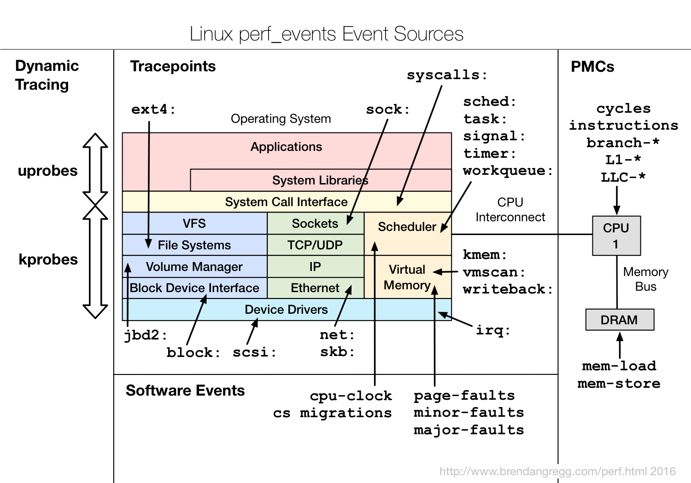

<!-- @import "[TOC]" {cmd="toc" depthFrom=1 depthTo=6 orderedList=false} -->

<!-- code_chunk_output -->

- [1. 系统级性能优化](#1-系统级性能优化)
- [Perf 简介](#perf-简介)
- [2. Perf 编译安装](#2-perf-编译安装)
  - [2.1. 测试](#21-测试)
  - [2.2. 编译](#22-编译)
  - [2.3. 安装](#23-安装)
  - [2.4. 帮助文档](#24-帮助文档)
- [3. Perf简介](#3-perf简介)
  - [3.1. 简单例子](#31-简单例子)
  - [3.2. 基本原理](#32-基本原理)
  - [3.3. 工作原理](#33-工作原理)
    - [3.3.1. Symbols](#331-symbols)
- [4. Perf 功能概述](#4-perf-功能概述)
  - [4.1. 全局性概况](#41-全局性概况)
  - [4.2. 全局细节](#42-全局细节)
  - [4.3. 特定功能分析](#43-特定功能分析)
  - [4.4. perf record](#44-perf-record)
  - [4.5. 可视化工具perf timechart](#45-可视化工具perf-timechart)
- [5. Perf性能事件](#5-perf性能事件)
  - [5.1. 三种工作模式](#51-三种工作模式)
  - [5.2. 基于事件的采样](#52-基于事件的采样)
  - [5.3. 三种类型性能事件](#53-三种类型性能事件)
    - [5.3.1. 动态追踪](#531-动态追踪)
    - [5.3.2. 事件限定符](#532-事件限定符)
  - [5.4. 性能事件的属性](#54-性能事件的属性)
    - [5.4.1. PMI中断和PEBS中断](#541-pmi中断和pebs中断)
    - [5.4.2. 性能事件的精度级别](#542-性能事件的精度级别)
    - [5.4.3. 其他属性](#543-其他属性)
  - [5.5. 没有预定义字符描述的性能事件](#55-没有预定义字符描述的性能事件)
  - [5.6. perf list查看所有性能事件](#56-perf-list查看所有性能事件)
  - [5.7. 性能事件指定错误](#57-性能事件指定错误)

<!-- /code_chunk_output -->

# 1. 系统级性能优化

系统级性能优化是指为了提高应用程序对操作系统资源与硬件资源的使用 效率，或者为了提高操作系统对硬件资源的使用效率而进行的代码优化。通过提 高对操作系统资源与硬件资源的利用率，使得应用程序与基础软硬件平台具有更 好的交互性，往往可以显著提升应用程序的执行速度和稳定性。

**系统级性能优化**包含**2个阶段**：

1. 性能剖析（**performance profiling**）：**寻找性能瓶颈**，查找引发性能问题的原因及热点代码。
2. 代码优化：针对具体的性能问题而**优化代码与编译选项**，以改善软件性能。

在代码优化阶段往往需要凭借开发者的经验，编写简洁高效的代码，甚至在汇编 语言级别合理使用各种指令，合理安排各种指令的执行顺序。

而在**性能剖析阶段**，则需要借助于现有的**profiling工具**，如 perf，VTune，Oprofile 等。

# Perf 简介

其中 perf 相比 较于其它工具而言，具有特殊的优势。它不仅开源，而且内置于内核源码树。在 如今 upstream kernel 的开发中，perf 是发展较快的领域之一。

perf_events是内核2.6+的一部分，用户空间工具perf在包`linux-tools-common`中，需要安装才能使用。

- 要想从剖析中获得更多内核相关信息，你需要`符号（Symbol）`和`栈追踪`，这可能需要安装额外的包，甚至使用**特定选项重新编译**你的内核。

- 剖析**用户空间代码**时，也要求目标应用程序的**调试信息（符号表**）被保留。

# 2. Perf 编译安装

在内核源码包中的位置 tools/perf。

## 2.1. 测试

```
[root@centos7 linux]# make -C tools/perf -f tests/make
```

## 2.2. 编译

```
[root@centos7 linux]# make -C tools/perf
```

## 2.3. 安装

```
[root@centos7 linux]# make -C tools/perf install
```

## 2.4. 帮助文档

```
man 1 perf
man 1 perf-stat
man 1 perf-top
man 1 perf-record
man 1 perf-report
man 1 perf-list
```

# 3. Perf简介

perf是一款Linux性能分析工具。Linux性能计数器是一个新的基于内核的子系统，它提供一个性能分析框架，比如硬件（CPU、PMU(Performance Monitoring Unit)）功能和软件(软件计数器、tracepoint)功能。通过perf，应用程序可以利用PMU、tracepoint和内核中的计数器来进行性能统计。它不但可以分析制定应用程序的性能问题（per thread），也可以用来分析内核的性能问题。

总之perf是一款很牛逼的综合性分析工具，大到系统全局性性能，再小到进程线程级别，甚至到函数及汇编级别。

相关文档: https://elixir.bootlin.com/linux/latest/source/tools/perf/Documentation

Perf是内置于Linux源代码树中的性能剖析(profiling)工具。它基于**事件采样**原理，以**性能事件**为基础，支持针对处理器相关性能指标与操作系统相关性能指标的性能剖析。可用于性能瓶颈的查找与热点代码的定位。

## 3.1. 简单例子

我们先通过一个例子来看看perf究竟能干什么。程序`[pi.c]`是一个简单的计算Pi的CPU密集型程序。很显然，`[pi.c]`的热点在函数`do_pi()`中。

```cpp
#include <stdio.h>
#include <math.h>
#include <sys/types.h>
#include <linux/unistd.h>

int do_pi(double *pi)
{
    double h, sum, x;
    long long n, i;

    n = 5000000;
    h = 1.0/n;
    sum = 0.0;

    for (i = 1; i <= n; i++) {
        x = h * (i - 0.5);
        sum += 4.0 / (1.0 + pow(x,2));
    }

    *pi = h *sum;
    return 0;
}

int main(void)
{
    double pi;

    printf("pid: %d\n", getpid());
    sleep(5);

    if (!do_pi(&pi)) {
        printf("PI is %f\n", pi);
    }
    return 0;
}
```
编译pi程序

```
gcc pi.c -lm -o pi
```

运行pi程序

```
./pi
```

根据程序显示的pid在命令行中执行

```
perf top -p $pid
```

该命令利用**默认的性能事件**"cycles"对`[pi]`进行热点分析。"cycles"是**处理器周期事件**。这条命令能够分析出消耗处理器周期最多的代码，在处理器频率稳定的前提下，我们可以认为perf给出的热点代码就是消耗时间最多的代码。

执行上述命令后，Perf会给出如下结果：


从上图可以看到，在`[pi]`程序执行期间，函数`do_pi()`消耗了62.57%的CPU周期，是消耗处理器周期最多的热点代码。这跟我们预想的一样。

## 3.2. 基本原理

那么Perf是怎么做到的呢？以`cycles`性能事件为例

首先，perf会通过系统调用`sys_perf_event_open`在内核中注册一个检测"**cycles**"**事件**的性能计数器。内核根据perf提供的信息在**PMU**上初始化一个**硬件性能计数器**（PMC：Performance Monitoring Counter）。PMC随着CPU周期的增加而自动累加。

在**PMU溢出**时，PMU触发一个PMI（Performance Monitoring Interrupt）中断。内核在PMI中断处理函数中保存**PMC的计数值**，触发中断时的**指令地址**（Register IP：Instruction Pointer），**当前时间戳**以及**当前进程**的**PID**，**TID**，**comm**等信息。我们把这些信息统称为一个**采样**（sample）。

内核会将收集到的sample放入用于跟**用户空间**通信的Ring Buffer。**用于空间**的perf分析程序采用**mmap机制**从ring buffer中读入采样，并对其解析。perf根据**pid**, comm等信息可以找到对应的进程。根据**IP**与**ELF文件**中的**符号表**可以查找到触发PMI中断的指令所在的函数。为了能够使perf读到函数名，我们的目标程序必须具备符号表。

如果perf在分析结果中**只看到一串地址**，而**没有对应的函数名**时，通常是由于在**编译时**利用**strip**删除了ELF文件中的符号信息。建议在性能剖析阶段，保留程序中的**sysbol table**与**debug info**等信息。

根据上述的perf采样原理可以得知，perf假设两次采样之间，即两次相邻的PMI中断之间系统执行的是同一个进程的同一个函数。这种假设会带来**一定的误差**，当感觉perf给出的**结果不准**时，不妨提高**采样频率**，perf会给出更加精确的结果。

## 3.3. 工作原理

perf利用Linux的trace特性，可以用于实时跟踪，统计event计数(perf stat)；或者使用采样(perf record)，报告(perf report|script|annotate)的使用方式进行诊断。

perf命令行接口并不能利用所有的Linux trace特性，有些trace需要通过ftrace接口得到。

参考 https://github.com/brendangregg/perf-tools



这张图大致列出了perf支持的跟踪事件，从kernerl到user space，支持块设备、网络、CPU、文件系统、内存等，同时还支持系统调用，用户库的事件跟踪。

我们看到perf支持这么多的事件和trace，它依赖了很多的接口来干这件事情。

### 3.3.1. Symbols

没有符号表，无法将内存地址翻译成函数和变量名。

例如，无符号表的跟踪显示如下

https://developer.aliyun.com/article/65255

# 4. Perf 功能概述

perf 命令用法还是挺简单的，根据功能区分了COMMAND，每个COMMAND有各自的用法。


每种功能使用命令`./perf --help CMD`查看用法等.

Perf是一个包含27种子工具的工具集，功能很全面。

No.|sub-commands|comment
:------:|------:|:------
01 | annotate      |根据数据文件（perf.data），注解被采样到的函数，显示指令级别的热点。
02 | archive       |根据数据文件中记录的build-id，将所有被采样到的ELF文件打成压缩包。利用此压缩包，可以在任何机器上分析数据文件中的采样数据。
03 | bench         |Perf中内置的benchmark，目前包括两套针对调度器和内存管理子系统的benchmark。
04 | buildid-cache |管理perf的buildid缓存。每个ELF文件都有一个独一无二的buildid。Buildid被perf用来关联性能数据与ELF文件。
05 | buildid-list  |列出数据文件中记录的所有buildid。
06 | config        |从配置文件中设置读取变量。
07 | data          |数据文件的相关处理。
08 | diff          |对比两个数据文件的差异。能够给出每个符号（函数）在热点分析上的具体差异。
09 | evlist        |列出数据文件中的所有性能事件。
10 | ftrace        |调用ftrace功能。
11 | inject        |该工具读取perf record工具记录的事件流，并将其定向到标准输出。在被分析代码中的任何一点，都可以向事件流中注入其他事件。
12 | kallsyms      |查询运行内核的符号信息。
13 | kmem          |针对内存子系统的分析工具。
14 | kvm           |此工具可以用来追踪、测试运行与KVM虚拟机上的Guest OS。
15 | list          |列出当前系统支持的所有性能事件。包括硬件性能事件、软件性能事件以及检查点。
16 | lock          |分析内核中的加锁信息。包括锁的争用情况，等待延迟等。
17 | mem           |剖析内存访问信息。
18 | record        |收集采样信息，并将其记录在数据文件中。随后可通过其他工具对数据文件进行分析。
19 | report        |读取perf record创建的数据文件，并给出热点分析结果。
20 | sched         |针对调度器子系统的分析工具。
21 | script        |执行perl或python写的功能扩展脚本、生成脚本框架、读取数据文件中的数据信息等。
22 | stat          |剖析某个特定进程的性能概况，包括CPU、Cache Miss率等。
23 | test          |Perf针对当前软硬平台的测试工具。可以用此工具测试当前软硬件平台是否能够支持perf的所有功能。
24 | timechart     |生成一幅描述处理器与各进程状态变化的矢量图。
25 | top           |类似于Linux的top命令，对系统性能进行实时分析。
26 | probe         |用于定义动态检查点。
27 | trace         |类似strace功能。

## 4.1. 全局性概况

* perf list查看当前系统支持的性能事件；
* perf bench对系统性能进行摸底；
* perf test对系统进行健全性测试；
* perf stat对全局性能进行统计；

## 4.2. 全局细节

* perf top可以实时查看当前系统进程函数占用率情况；
* perf probe可以自定义动态事件；

## 4.3. 特定功能分析

perf kmem针对slab子系统性能分析；
perf kvm针对kvm虚拟化分析；
perf lock分析锁性能；
perf mem分析内存slab性能；
perf sched分析内核调度器性能；
perf trace记录系统调用轨迹；

## 4.4. perf record

最常用功能perf record，可以系统全局，也可以具体到**某个进程**，更甚具体到**某一进程某一事件**；可宏观，也可以很微观。

* pref record记录信息到perf.data；
* perf report生成报告；
* perf diff对两个记录进行diff；
* perf evlist列出记录的性能事件；
* perf annotate显示perf.data函数代码；
* perf archive将相关符号打包，方便在其它机器进行分析；
* perf script将perf.data输出可读性文本；

## 4.5. 可视化工具perf timechart

perf timechart record记录事件；
perf timechart生成output.svg文档；

# 5. Perf性能事件

完整的性能事件列表见Intel手册`Performance Monitoring Events`

## 5.1. 三种工作模式

有三种工作模式：

* counting，在**内核上下文**对各种指标进行计数
* sampling，对事件进行采样，并将性能数据存放到**内核缓冲**，然后异步的写入到perf.data
* bpf，4.4版本内核引入的新特性，允许在内核中执行一段用户自定义的代码，以执行高效的过滤、汇总

## 5.2. 基于事件的采样

perf_events的采样是基于事件进行的。**采样的周期**以**事件的数量来表示**，而**非基于时间**。当**目标事件计数溢出指定的数值**，则产生一个采样。

样本中包含的信息取决于用户和工具指定的度量类型，但是最重要的信息是指令指针（instruction pointer），也就是程序被中断时所处的位置。

这种基于中断的采样，在现代处理器上存在刹车效应。也就是说，样本中记录的指针，和程序被中断以处理PMU事件时的指令指针，可能相隔数十个指令。

record子命令默认使用cycle事件，类似于定期采样。

## 5.3. 三种类型性能事件

利用perf剖析程序性能时，需要指定**当前测试**的**性能事件**。性能事件是指在**处理器**或**操作系统**中发生的，可能影响到程序性能的硬件事件或软件事件。比如Cache丢失，流水线停顿，页面交换等。这些事件会对程序的执行时间造成较大的负面影响。在优化代码时，应尽可能减少此类事件发生。

因此，必须先利用perf等性能剖析工具查找引发这些性能事件的热点代码以及热点指令。

perf定义的性能事件分为3类，分别是硬件性能事件、软件性能事件与Tracepoint Events。也可以以这三种事件为调优方向：

- Hardware Event由**PMU部件产生**，在特定的条件下探测性能事件是否发生以及发生的次数。比如cache命中。

来自CPU自己或CPU的PMU（Performance Monitoring Unit，性能监控单元），包含一系列微架构事件例如时钟周期、L1缓存丢失等。具体支持的事件类型取决于CPU型号

- Software Event是**内核产生的事件**，分布在各个功能模块中，统计和**操作系统相关性能事件**。比如进程切换，tick数等。

基于**内核计数器**的低级事件，例如CPU迁移、上下文切换、Minor Faults、Major Faults（页面错误）

- Tracepoint Event是内核中**静态tracepoint所触发的事件**，这些tracepoint用来判断程序运行期间内核的行为细节（这些tracepint的对应的sysfs节点在`/sys/kernel/debug/tracing/events`目录下）。比如slab分配器的分配次数等。

由内核中的ftrace实现，包括：
1. 内核**追踪点事件**，静态的、内核级的追踪点，**硬编码**到内核
2. 用户**静态定义追踪**（USDT），**用户态应用程序硬编码**的追踪点
3. 动态追踪，软件可以被动态instrumented，在任何位置创建事件。对于**内核软件**，使用**kprobes框架**，对于**用户软件**，使用**uprobes**
4. 定时追踪，以任意频率抓取快照，主要用于CPU剖析，工作机制是定期引发中断

### 5.3.1. 动态追踪

要启用内核动态追踪，需要使用内核编译参数`CONFIG_KPROBES=y`、`CONFIG_KPROBE_EVENTS=y`。要追踪基于帧指针的内核栈，需要内核编译参数`CONFIG_FRAME_POINTER=y`。

要启用**用户动态追踪**，需要使用内核编译参数`CONFIG_UPROBES=y`、`CONFIG_UPROBE_EVENTS=y`

### 5.3.2. 事件限定符

事件有多种表示方式，最简单的是它的字符串表示。引用事件时，可以指定限定符：

https://blog.gmem.cc/perf

## 5.4. 性能事件的属性

### 5.4.1. PMI中断和PEBS中断

**硬件性能事件**由处理器的PMU提供支持。

如前文所述，perf会对PMI中断发生时的PC寄存器进行采样。由于现代处理器的主频非常高，在加上深度流水线机制，从**性能事件被触发**，到处理器**响应PMI中断**，流水线上可能已处理过百条指令。那么**PMI中断**采到的**指令地址**就不再是处罚性能事件的那条指令的地址了，而可能具有**非常严重的偏差**。

为了解决这个问题，intel处理器通过**PEBS**（Precise Event Based Sampling）机制实现了**高精度事件采样**。PEBS通过硬件在**计数器溢出**时将处理器现场直接保存到内存（而**不是在相应中断时**才保存寄存器现场），从而使得perf能够真正触发性能事件的那条指令的地址，提高了采样精度。

在默认条件下，perf**不使用PEBS机制**。用户如果想要使用**高精度采样**，需要在指定性能事件时，在事件后调价后缀"`:p`"或"`:pp`"。

例如：

```
perf top -e cycles:pp
```

### 5.4.2. 性能事件的精度级别

Perf 在采样精度上定义了 4 个级别.

Level | Comment
---|---
0 | 无精度保证
1 | 采样指令与触发性能事件的指令之间的偏差为常数（:p）
2 | 需要尽量保证采样指令与触发性能事件的指令的偏差为0（:pp）
3 | 保证采样指令与触发性能事件的指令之间的偏差**必须为0**（:ppp）

目前X86处理器，包括Intel处理器与AMD处理器Jun仅能实现前3个精度级别。

### 5.4.3. 其他属性

除了精度级别以外，事件还具有其他几个属性，均可以通过"event:X"的方式予以指定。

attribute | Comment
---|---
u | 仅统计用户空间程序触发的性能事件。
k | 仅统计内核触发的性能事件。
h | 仅统计Hypervisor触发的性能事件。
G | 在KVM虚拟机中，仅攻击Guest系统触发的性能事件。
H | 仅统计Host系统触发的性能事件。
p | 精度级别。

## 5.5. 没有预定义字符描述的性能事件

另外需要补充的是，perf list工具仅列出了具有字符描述的**硬件性能事件**。而那些**没有预定义字符描述的性能事件**，也可以通过特殊方式使用。

这时，就需要我们**根据CPU的手册**，通过性能事件的标号配置PMU的性能计数器。可以采用如下方式：

```
perf top -e r[UMask+EventSelect]
```

举个例子，我们现在想统计所有**从内存中读过数据的指令的个数**，perf list中并未预定义此事件的字符描述。通过查找intel的处理器手册，我们找了此事件编码：


便可以通过以下方式使用此事件：

```
perf stat -e r010b ls
```

所以完整的性能事件列表见Intel手册`Performance Monitoring Events`


## 5.6. perf list查看所有性能事件

不同型号的 CPU 支持的硬件性能事件不尽相同。不同版本的内核提供的软件 性能事件与 Tracepoint events 也不尽相同。因此，perf提供了list工具以查看当前软硬件平台支持的性能事件列表。

使用方法如下：

```
# ./perf list -h

 Usage: perf list [<options>] [hw|sw|cache|tracepoint|pmu|sdt|event_glob]

    -d, --desc            Print extra event descriptions. --no-desc to not print.
    -v, --long-desc       Print longer event descriptions.
        --debug           Enable debugging output
        --deprecated      Print deprecated events.
        --details         Print information on the perf event names and expressions used internally by events.
```

执行命令后，perf将给出当前软硬件平台的所有性能事件。输出结果如下图所示。每行后面括弧里的信息表示该事件是**硬件事件**、**软件事件**还是Tracepoint events。


......


## 5.7. 性能事件指定错误

所以如果指定性能事件失败, 可能会有类似打印

```
./perf record -e syscalls:sys_enter ls
event syntax error: 'syscalls:sys_enter'
                     \___ unknown tracepoint

Error:	File /sys/kernel/debug/tracing/events/syscalls/sys_enter not found.
Hint:	Perhaps this kernel misses some CONFIG_ setting to enable this feature?.

Run 'perf list' for a list of valid events

 Usage: perf record [<options>] [<command>]
    or: perf record [<options>] -- <command> [<options>]

    -e, --event <event>   event selector. use 'perf list' to list available events
```
