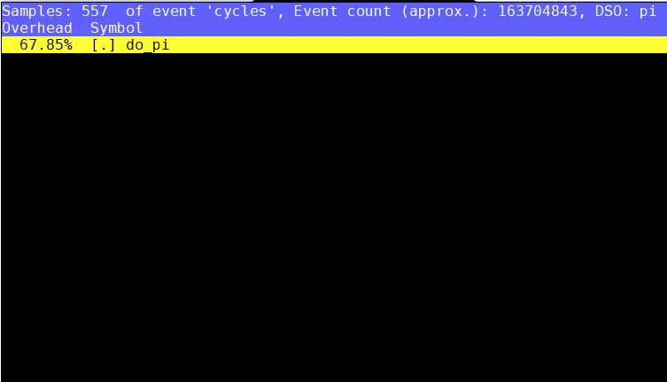

<!-- @import "[TOC]" {cmd="toc" depthFrom=1 depthTo=6 orderedList=false} -->

<!-- code_chunk_output -->

- [Perf top工具](#perf-top工具)
  - [基本使用方法](#基本使用方法)
  - [3种用户页面](#3种用户页面)
  - [4列信息](#4列信息)
  - [帮助信息](#帮助信息)
  - [annoate注解功能](#annoate注解功能)
  - [参数介绍](#参数介绍)

<!-- /code_chunk_output -->

# Perf top工具

top工具主要用于**实时剖析各个函数**在**某个性能事件**上的热度。利用perf top，能够直观地观察到当前的热点函数，并利用工具中内置的annotate功能，进一步查找特点指令。


## 基本使用方法

perf top的基本使用方法为：

```
perf top
```

该命令以**默认性能事件**"cycles（CPU周期数）"进行全系统的性能剖析，检测系统中的所有应用程序函数与内核函数的热度。

## 3种用户页面

perf提供了**3种用户页面**，分别是**tui**、**gtk**以及**tty**。其中可操作性最强，功能最丰富的界面是**tui**。

本文主要基于此界面讲解 perf。top 工具仅支持 tui 与 tty，默认界面为 tui。上图中展示的就是 tui 界面。

需要提一下的是，必须在系统安装 newt 软件包，perf 才能使能 tui 界面。

## 4列信息

top工具的界面具有4列信息。

右边第一列为**符号名**，也就是**函数名**。

左边第一列为该符号引发的性能事件在**整个检测域**中占的比例，我们将其称为该符号的**热度**。检测域是指perf监控的所有符号。默认情况下包括系统中**所有进程**、**内核**以及**内核模块的函数**。

左边第二列为该符号所在的**DSO**。**DSO**即**动态共享对象**（Dynamic Shared Object）的缩写。

第三列为**DSO的类型**。perf中DSO共有**5种类型**，分别是：**ELF可执行文件**，**动态链接库**，**内核**，**内核模块**和**VDSO**。当第三列为`[.]`时表示此符号属于**用户态的ELF文件**（包括可执行文件与动态链接库）。为`[k]`表示此符号属于**内核与内核模块**。

## 帮助信息

在tui界面下按'h','?'或'F1'键时，会弹出一个帮助窗口，如下图所示。


帮助窗口列出了**perf top**的**所有功能**。

## annoate注解功能

我们首先来看注解（**Annoate**）功能。注解功能可以**进一步深入分析某个符号**。给出**对应线程**的**代码**并且为**热点代码**标记出它们触发的性能事件在**整个测试域**中的**百分比**。

下面让我们来看一下如何使用注解功能。

在界面上按**上下键**，将光标在各个symbol间移动。选定**某个符号后**，按下**a键**，得到如下的界面。


上图显示的是`[pi]`程序中`do_pi()`函数的**注解**。从图上可以看到perf对`do_pi()`中的C代码给出了汇编语言的注解。并且给出了**各条指令的采样率**。从上图可以看到**耗时较多的指令**（如访存指令）比较容易被perf采到。

选定**某个符号**后按下热键'd'，perf会**过滤掉**所有**不属于此DSO的文件**。符号`do_pi`归属的DSO为**thread**。当在符号`do_pi`上按下'd'键后，perf过滤掉了所有不属于thread的符号。如下图所示。



类似于热键'd'，热键't'能够过滤**所有不属于当前符号所属线程的符号**。

热键'P'可以将pref top的当前显示的信息输出到文件perf.hist.X中。

右方向键也是热键，它可以打开 perf top 的功能菜单。菜单上列出的各项功能分别对应上述各个热键的功能。

## 参数介绍

Perf top的参数较多，本文只介绍几个常用的参数的使用方法。

* `'-e'` or `'--event' <event>`: 该参数用于**指定分析的性能事件**。默认情况下, cycles（CPU周期数）

可分析的性能事件可以参考**perf list**。

例如：我们希望利用top工具剖析系统中**Cache丢失次数**，可以采用以下命名：

```
perf top -e cache-misses
```

* `'-c'` or `'--count' <n>`: 该参数用于指定性能计数器的**采样周期**。默认情况下，**每秒采样4000次**。

* `'-p'` or `'--pid' <pid>`: 该参数用于指定分析**进程的pid**。指定pid后，perf top仅分析**目标进程**以及**目标进程创建的线程**。

* `'-t'` or `'--tid' <tid>`: 该参数用于指定分析**线程的tid**。指定tid后，perf top仅分析**目标线程**，**不包括**此线程**创建的其他线程**。

* `'-a'` or `'--all-cpus'`: 采集系统中**所有CPU产生的性能事件**。这就是perf top的**默认情况**。

* `'-C'` or `'--cpu' <cpu>`: 指定**待分析的CPU列表**。

如果系统中有4个CPU，如果仅需采集CPU0与CPU3的数据，可通过如下方法调用perf top：

```
perf top -C 0,3
```

* `'-k'` or `'--vmlinux' <file>`: 指定**带符号表的内核映像**所在的路径。

与GDB类似，perf只有在**DSO存在符号表**的情况下才能解析出**IP对应的具体符号**。

Perf通常采用以下顺序加载**内核符号**：

1. /proc/kallsyms
2. 用户通过'-k'参数指定的路径
3. 当前路径下的"vmlinux"文件
4. /boot/vmlinux
5. /boot/vmlinux-$(uts.release)
6. /lib/modules/$(uts.release)/build/vmlinux
7. /usr/lib/debug/lib/modules/$(uts.release)/build/vmlinux

* `'-K'` or `'--hide_kernel_symbols'`: 不显示属于内核的符号。对于只想分析应用程序的用户而言，使用此参数后，perf top的界面会清爽很多。

* `'-m'` or `'--mmap-pages' <n> `: 指定perf开辟的mmap页面的数量。mmap缓存主要用于用户空间与内核空间的数据通信。perf在内核中驱动将采集到的性能数据存入ring buffer，用户空间的分析程序则通过mmap机制从ring buffer中读取数据。

默认情况下，mmap的页面数量为128，此时mmap内存区域的大小为512KB。perf top默认每个2s读取一次性能数据，当内核生成性能数据的速度过快时，就可能因为缓冲区满导致数据丢失，从而影响到分析结果。在此情况下，用户可以通过'-m'参数扩大缓冲区，以避免性能数据的大量丢失。

* '-r' or '--realtime' <n> <n>：指定分析程序的实时优先级。如上文所述，如果perf分析程序读取数据的速度长期小于内核生成数据的速度时，就可能导致采样数据的大量丢失，影响分析精度。在系统负载过高时，分析程序可能会因为调度延迟过高而不能及时读取数据。因此，在高负载系统中可以通过参数'-r'将分析程序设置为实时进程，并为其设定较高的优先级。
> $> perf top -r 0

*上述命令中，0即为指定给分析程序的实时优先级。顺便说一句，Linux中实时优先级的范围是[0,99]，其中优先级0最高。不要与范围是[-20,19]的nice值搞混。

* '-d' or '--delay' <n>：指定perf top页面的刷新周期，<n>的单位为妙。默认值为2s。

* '-D' or '--dump-symtab' ：打印DSO的符号表，此功能主要用于perf自身的调试。该参数仅与'--stdio'（即TTY界面）配合使用时才起作用。启用此参数后，perf top会在退出时打印所有DSO的符号表。

* '-f' or '--count-filter' <n>：此参数主要用于符号过滤。指定此参数后，页面上将仅显示采样数大于<n>的符号。

* '-g' or '--group'：将计数器组合成计数器组。Perf在默认情况下会为每个计数器创建一个独立的ring buffer。如果将计数器组合成计数器组，perf则会将所有counter的数据输出到group leader的ring buffer中。当内核生成采样数据不多并且内存较为紧张时，可采用此参数以节省内存。

* '-i' or '--inherit'：采用此参数后，子进程将自动集成父进程的性能事件。从而使得perf能够采集到动态创建的进程的性能数据。但是当采用'-p'参数仅分析特定进程的性能数据时，继承机制会被禁用。这主要是出于性能的考虑。

* '--sym-annotate' <symbol name>：指定待解析的符号名。

* '-z' or '--zero'：更新页面的数据后，清除历史信息。

* '-F' or '--freq' <n>：指定采样频率，此参数与'-c'参数指定一个即可。两个参数同时指定时，perf仅使用'-c'指定的值作为采样周期。

* '-E' or '--entries' <n>：指定页面上的符号数。如果用户仅希望查看top <n>个符号，可以通过此参数实现。

* '-U' or '--hide_user_symbols'：仅显示属于内核的符号，隐藏属于用户空间的符号，即类型为[.]的符号。

* '--tui'：使用tui界面。tui为perf top的默认界面。如前所述，tui界面需要newt软件包的支持。如果用户打开perf top后，出现的不是tui界面，请检查系统中是否已安装newt包。

* '--stdio'：使用TTY页面。当系统中未装newt软件包时，此界面为默认界面。

* '-v' or '--verbose'：显示冗余信息，如符号地址、符号类型（全局、局部、用户、内核等）。

* '-s' or '--sort' <key[,key2]...>：指定界面显示的信息，以及这些信息的排序。

Perf提供的备选信息有：

option | comment
---|---
Comm | 触发事件的进程名
PID | 触发事件的进程号
DOS | 符号所属的DSO的名称
Symbol | 符号名
Parent | 调用路径的入口

* 当采用如下命令时，perf top会给出更加丰富的信息。
> $> perf top -s comm,pid,dso,parent,symbol

* '-n' or '--show-nr-samples'：显示每个符号对应的采样数量。
> $> perf top -n 

* '--show-total-period'：在界面上显示符号对应的性能事件总数。性能事件计数器在溢出时才会触发一次采样。两次采样之间的计数值即为这段事件内发生的事件总数，perf将其称之为周期（period）。

* 使用方法为：

> $>perf top --show-total-period

* '-g' or '--call-graph' ：在界面上显示函数的调用图谱。

* '--dsos' <dso_name[,dso_name...]>：仅显示dos名为dos_name的符号。可以同时指定多个dso，各个dso名字之间通过逗号隔开。

* '--comms' <comm[,comm...]>：仅显示属于进程"comm"的符号。

* '--symbols' <symbol[,symbol...]>：仅显示指定的符号。

* '-M' or '--disassembler-style'：显示符号注解时，可以通过此参数指定汇编语言的风格。

