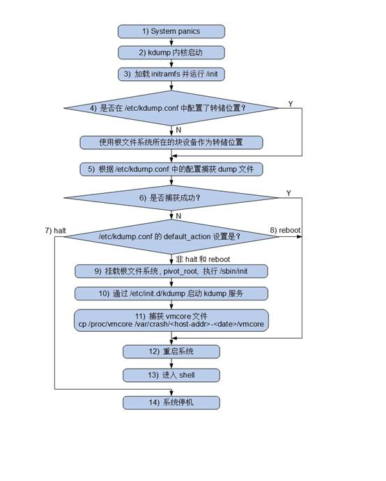

# kexec

Kexec 是实现 kdump 机制的关键，它包括 2 个组成部分：

* 一是**内核**空间的**系统调用** `kexec_load`，负责在**生产内核**（`production kernel` 或 first kernel）**启动时**将**捕获内核**（`capture kernel` 或 sencond kernel）**加载到指定地址**。

* 二是**用户**空间的工具 `kexec-tools`，他将**捕获内核的地址**传递给**生产内核**，从而**在系统崩溃的时候**能够**找到捕获内核的地址并运行**。

没有 kexec 就没有 kdump。先有 kexec 实现了在一个内核中可以启动另一个内核，才让 kdump 有了用武之地。kexec 原来的目的是为了节省 kernel 开发人员重启系统的时间，谁能想到这个“偷懒”的技术却孕育了最成功的内存转存机制呢？

# kdump

kdump 是当内核崩溃的时候，用来转储运行内存的一个工具.

Kdump 的概念出现在 2005 左右，是一种基于 kexec 的内核崩溃转储机制。当系统崩溃时，kdump 使用 kexec 启动到**第二个内核**。第二个内核通常叫做捕获内核，以很小内存启动以捕获转储镜像。**第一个内核保留了内存的一部分**给**第二内核启动用**。由于 kdump 利用 kexec 启动捕获内核，**绕过了 BIOS**，所以第一个内核的内存得以保留。这是**内核崩溃转储的本质**。

kdump 需要两个不同目的的内核，生产内核和捕获内核。捕获内核会在生产内核崩溃时启动起来，与相应的 ramdisk 一起组建一个微环境，用以对**生产内核**下的内存进行收集和转存。以便之后分析崩溃原因.

为什么需要一个特殊的capture kernel呢？因为原来的kernel已经出问题了，发生crash或hang了。

一旦内存信息收集完成，可以让系统将自动重启。

# 如何使用 kdump

构建系统和 dump-capture 内核，此操作有 2 种方式可选：

1）构建一个单独的**自定义转储捕获内核**以捕获内核转储；

2） 将**系统内核本身**作为**转储捕获内核**，这就不需要构建一个单独的转储捕获内核。

方法（2）只能用于**可支持可重定位内核**的**体系结构**上；目前 i386，x86_64，ppc64 和 ia64 体系结构支持可重定位内核。构建一个可重定位内核使得不需要构建第二个内核就可以捕获转储。但是可能有时想构建一个自定义转储捕获内核以满足特定要求。

# 如何访问捕获内存


捕获内核启动后，会像一般内核一样，去运行为它创建的ramdisk上的init程序。而各种转储机制都可以事先在init中实现。

为了在生产内核崩溃时能顺利启动捕获内核，捕获内核以及它的ramdisk是事先放到生产内核的内存中的。

生产内核的内存是通过 /proc/vmcore 这个文件交给捕获内核的。为了生成它，用户工具在生产内核中分析出内存的使用和分布等情况，然后把这些信息综合起来生成一个ELF头文件保存起来。捕获内核被引导时会被同时传递这个ELF文件头的地址，通过分析它，捕获内核就可以生成出 /proc/vmcore。有了 /proc/vmcore 这个文件，捕获内核的ramdisk中的脚本就可以通过通常的文件读写和网络来实现各种策略了。


在**内核崩溃之前**所有关于**核心映像**的**必要信息**都用 **ELF 格式编码**并**存储在保留的内存区域**中。**ELF 头**所在的**物理地址**被作为命令行参数（`fcorehdr=`）传递给**新启动的捕获内核**。

在 i386 体系结构上，启动的时候需要使用物理内存开始的 640K，而不管操作系统内核转载在何处。因此，这个 640K 的区域在重新启动第二个内核的时候由 kexec 备份。

在**第二个内核**中，“**前一个系统的内存**”可以通过两种方式访问：

1. 通过 `/dev/oldmem` 这个设备接口。

一个“捕捉”设备可以使用“raw”（裸的）方式 “读”这个设备文件并写出到文件。这是关于内存的 “裸”的数据转储，同时这些分析 / 捕捉工具应该足够“智能”从而可以知道从哪里可以得到正确的信息。ELF 文件头（通过命令行参数传递过来的 elfcorehdr）可能会有帮助。

2. 通过 `/proc/vmcore`。

这个方式是将转储输出为一个 ELF 格式的文件，并且可以使用一些文件拷贝命令（比如 cp，scp 等）将信息读出来。同时，gdb 可以在得到的转储文件上做一些调试（有限的）。这种方式保证了内存中的页面都以正确的途径被保存 ( 注意内存开始的 640K 被重新映射了 )。

# kdump 的优势

高可靠性

崩溃转储数据可从一个新启动内核的上下文中获取，而不是从已经崩溃内核的上下文。

多版本支持

LKCD(Linux Kernel Crash Dump)，netdump，diskdump 已被纳入 LDPs(Linux Documen-tation Project) 内核。SUSE 和 RedHat 都对 kdump 有技术支持。

# Kdump 实现流程

rhel 执行流程:



sles11 执行流程:


# 配置 kdump

如前面所述，支持 kdump 的系统使用**两个内核**进行工作。目前一些发行版，如 RedHat 和 SUSE 的 Linux 都**已经编译并设置好这两个内核**。

如果你使用其他发行版的 Linux 或者想自己编译内核支持 kdump，那么可以根据如下介绍进行。

## kexec-tools 和 kernel-debuginfo

Kdump 用到的各种工具都在 kexec-tools 中。

kernel-debuginfo 则是用来分析 vmcore 文件, 如果是编译的内核打开 `CONFIG_DEBUG_INFO=Y`。

从 rhel5 开始，kexec-tools 已被默认安装在发行版。而 novell 也在 sles10 发行版中把 kdump 集成进来。

```
yum install kexec-tools
```

或编译安装

```
./configure
make && make install
```

## 内核选项

配置**系统内核**和**捕捉内核**都需要的内核选项:

启用 kexec system call:

```
CONFIG_KEXEC=y
```

sysfs 文件系统支持:

```
CONFIG_SYSFS=y
```

编译内核带debug信息

```
CONFIG_DEBUG_INFO=Y
```

配置**捕捉内核**的与**架构无关**的选项：

内核 crash 时 dump:

```
CONFIG_CRASH_DUMP=y
```

下面这个是不是必须的??:

```
CONFIG_CRASH_CORE=y
```

`/proc/vmcore` 支持

```
CONFIG_PROC_VMCORE=y
```

配置**捕捉内核**的与架构相关的选项：

打开**可支持可重定位内核**, 将**系统内核本身**作为**转储捕获内核**，这就不需要构建一个单独的转储捕获内核

```
CONFIG_RELOCATABLE=y
```

为内核设置一个加载起始地址。在大多数的机器上，16M 是一个合适的值:

```
CONFIG_PHYSICAL_START=0x1000000
```

# 加载新的系统内核

编译**系统内核**和**捕捉内核**.

将重新编译好的系统内核添加到启动引导中，注意**不要将捕捉内核添加到启动引导菜单**中。

修改内核引导参数，为启动捕获内核预留内存:

通过下面的方法来配置 kdump 使用的内存大小。添加启动参数"crashkernel=Y@X"，这里，Y 是**为捕捉内核保留的内存大小**，X 是保留部分内存的开始位置。

对于 i386 和 x86_64, 编辑 /etc/grub.conf, 在内核行的最后添加"crashkernel=128M" 。

对于 ppc64，在 /etc/yaboot.conf 最后添加"crashkernel=128M"。

在 ia64, 编辑 /etc/elilo.conf，添加"crashkernel=256M"到内核行。

# kdump 配置文件

kdump 的配置文件是 /etc/kdump.conf（RHEL6.2）

每个文件头部都有选项说明，可以根据使用需求设置相应的选项。

# 启动 kdump 服务

在设置了预留内存后，需要重启机器，否则 kdump 是不可使用的。启动 kdump 服务：

```

```

# 测试配置是否有效

可以通过 kexec 加载内核镜像，让系统准备好去捕获一个崩溃时产生的 vmcore。可以通过 sysrq 强制系统崩溃。

```
echo c > /proc/sysrq-trigger 
```

这造成**内核崩溃**，如配置有效，系统将重启进入 kdump 捕获内核，当系统进程进入到启动 kdump 服务的点时，vmcore 将会拷贝到你在 kdump 配置文件中设置的位置。RHEL 的缺省目录是 : /var/crash；SLES 的缺省目录是 : /var/log/dump。然后系统重启进入到正常的内核。一旦回复到正常的内核，就可以在上述的目录下发现 vmcore 文件，即**内存转储文件**。


可以使用之前安装的 kernel-debuginfo 中的 crash 工具来进行分析（crash 的更多详细用法将在本系列后面的文章中有介绍）。


在捕捉内核被加载进入内存后，**如果系统崩溃开关被触发**，则系统会**自动切换进入捕捉内核**。

触发系统崩溃的开关有 `panic()`，`die()`，`die_nmi()` **内核函数**和 `sysrq` **触发事件**，可以使用其中任意的一个来触发内核崩溃。不过，在让内核崩溃之前，我们还需要做一些安装设置。


按照linux系统的设计哲学，内核只提供dump内存的机制，用户想要dump什么样的内存，dump多少内存是属于策略问题，由用户来决定。

在真实的使用场景中，主要有两种使用方式：

一种是dump某一个进程的地址空间来供用户在进程挂掉之后debug分析，也就是通常所说的coredump，这个在下一篇中描述；

另一种就是dump整个系统的内存空间，以便于系统管理员debug分析系统挂掉的原因，也就是本文描述的kdump。

由于dump内存的逻辑依然需要系统可以正常工作，管理系统的各种资源，所以kdump整个过程依赖kexec和一个额外的dump内核来保证整个流程正确的执行。


