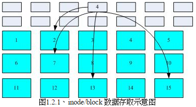
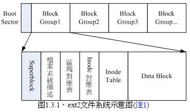

# 文件系统
---
## 文件系统特性 ##
磁盘分区完毕后必须进行**格式化**，因为每种操作系统所配置的文件属性/权限不同，为了存放这些文件所需的数据，因此就需要将分区进行格式化，从而成为操作系统能够使用的文件系统格式。

>Windows利用的文件系统主要是FAT，Linux是Ext2

传统的磁盘与文件系统应用中，一个分区就只能被格式化为一个文件系统，所以一个filesystem就是一个partition。新技术（LVM，软件磁盘阵列<software raid>）可以将一个分区格式化为多个文件系统，也能将多个分区合成一个文件系统（LVM，RAID）。现在我们称呼**一个可被挂在的数据为一个文件系统而不是一个分区**。

Linux的Ext2文件系统内的主要信息是：
 1. superblock：记录文件系统的整体信息，包括inode/block的总量、使用量、剩余量，以及文件系统的格式与相关信息等。
 2. inode：记录文件的属性（权限<rwx>和属性<所有者、群组、时间参数等>），一个文件占用一个inode，同时记录此文件的数据所在的block号码。
 3. block：实际记录文件的内容，若文件过大，会占用多个block。

文件系统会先格式化出来inode与block的块，假设某个文件的属性与权限数据放置到inode4号，而这个inode记录了文件数据的实际放置是在2、7、13、15这4个block号码，此时就可根据此来排列磁盘的阅读顺序，可一次性将4个block内容读出来，如下图：  
  
此数据访问方式是**索引式文件系统**（indexed allocation）

U盘（闪存）一般是FAT格式。FAT没有inode存在，每个block号码都记录在前一个block中，读取方式如下：  
  
如果同一个文件数据写入的block过于分散，则磁头需要转好几圈才能获取所有数据。  
>碎片整理也是因为上面这个原因，将同一个文件所属的blocks汇集在一起。Ext2就不太需要。

----------

## Linux的Ext2文件系统 ##
文件系统一开始就将inode与block规划好了，除非重新格式化（或者使用resizefs等命令更改文件系统大小），否则inode与block固定后就不变。

如果文件系统高达数百GB，那么将所有inode与block放置在一起是不明智的，因为inode与block数量太大，不易管理。因而Ext2系统在格式化时候基本上是区分为多个块组（block group）的，每个块组都有独立的inode/block/superblock系统。

在整体规划中，文件系统最前面有一个启动扇区（boot sector），这个启动扇区可以安装引导装载程序，，这样可以将不同的引导装载程序安装到个别的文件系统最前端，而不用覆盖整块硬盘唯一的MBR，这样也才能制作出多重引导的环境。

Ext2文件系统示意图：  
  
下面针对每个块进行阐述。  

----------

 **data block(数据块)**  
 
 - 放置文件内容的地方，ext2文件系统所支持的block大小有1KB,2KB,4KB三种而已。格式化时候block大小就固定了，而且每个block都有编号，方便inode记录。
 - block大小会引起Ext文件系统限制，block大小的区别，单个文件容量和最大文件系统总容量不相同。
 - 每个block内最多只能放置一个文件的数据。

----------

**inode table（inode表格）**

 - 该block group的所有文件inode。
 - inode主要记录文件的属性（权限<rwx>和属性<所有者、群组、时间参数等>），一个文件占用一个inode，同时记录此文件的数据所在的block号码。
 - inode记录的文件数据至少有下面这些：

> 
1. 该文件的访问模式（read/write/excute）
2. 该文件的所有者与组（owner/group）
3. 该文件的大小
4. 该文件创建或者状态改变的时间（ctime）
5. 最后一次读取的时间（atime）
6. 最近修改的时间（mtime）
7. 定义文件特性的标志（flag）， 如SetUID等
8. 该文件真正内容的指向（pointer）

 - 每个inode的大小固定为128bytes，记录一个block号码要4byte
 - 每个文件仅占用一个inode，因此文件系统能够创建的文件数量与inode的数量有关
 - 系统读取文件会先找到inode，并分析inode所记录的权限与用户是否符合，符合才会实际读取block的内容。
 - inode记录block号码的区域定义为12个直接，1个间接，1个双间接与1个三间接记录区。如下图：  

> 
问：这样inode可以记录多少个block？一个文件可以多大？以较小的1KB的block来说明。
答：
1. 12个直接指向：12， 12 * 1K = 12K， 记录器直接记录，所以12条
2. 间接，一个block间接作为记录器，1K / 4byte = 256， 256 * 1K = 256K， 记录一个block号码需要4byte，1K大概可以记录256条
3. 双间接，256 * 256 = 65535， 65535 * 1K = 65535K，双间接可以记录65535条
4. 三间接，256 * 256 * 256 = 16776960， 16776960 * 1K = 16776960K，三间接可以记录16776960条
总结：block大小=12 + 256 + 65535 + 16776960 = 16842763条， 单个文件大小可以有16G。比较一下文件系统限制表的结果可发现是一致的！但这个方法不能用在 2K 及 4K block 大小的计算中， 因为大于 2K 的 block 将会受到 Ext2 文件系统本身的限制，所以计算的结果会不太符合之故。

----------

**Superblock（超级块）**  

 -  记录整个文件系统基本相关信息的地方。记录的主要信息如下：
 > 
1. block与inode的数量
2. 未使用和已使用的block/inode数量
3. block与inode的大小（block为1K、2K、4K，inode大小为128 bytes）
4. 文件系统的挂载时间、最近一次写入数据的时间、最近一次检验磁盘（fsck）的时间等文件系统相关信息
5. 一个valid bit数值，若此文件系统已被挂载，则valid bit为0，未被挂载，则为1

 - superblock一般大小为1024bytes，相关信息可通过dumpe2fs命令查看。
 - 每个block group都可能含有superblock，但是一个文件系统只有一个superblock。除了第一个block group内含有superblock，后续的block group不一定含有，而若含有主要作为第一个block group内的superblock的备份，这样可以用来救援。

----------
**File System Description（文件系统描述）**

 - 记录当前block group的开始与结束的block号码，以及说明每个区段（superblock、bitmap、inodemap、datablock）分别位于哪一个block号码之间，也可通过dumpe2fs查看。

----------
**block bitmap（块对照表）**
 
- 记录当前block group中哪些block是空的。当删除某些文件时候，在block bitmap中相应到该block的标志位就要修改成“未使用”。

----------
**inode bitmap（inode对照表）**

 - 记录当前block group中使用于未使用的inode号码

