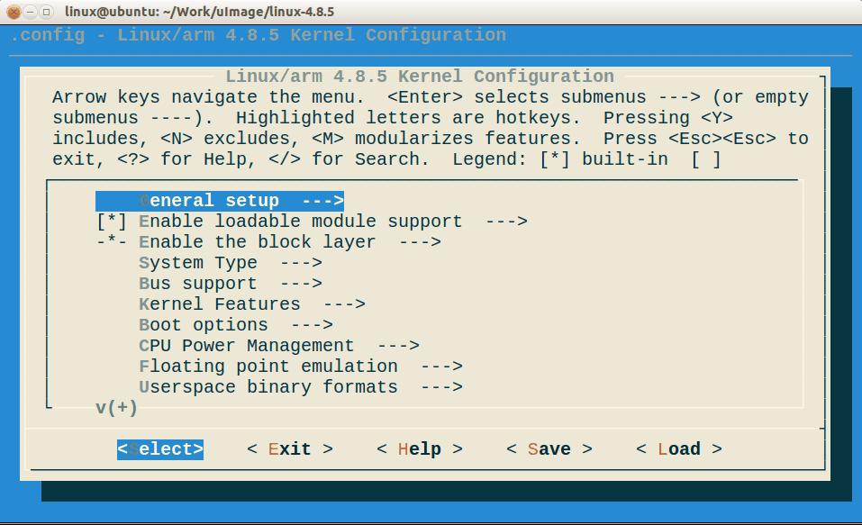
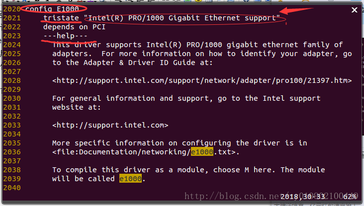
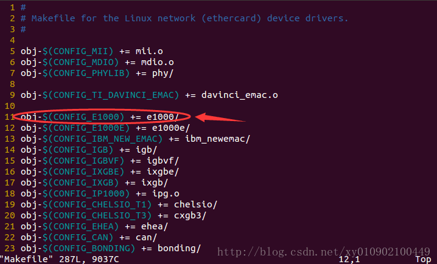
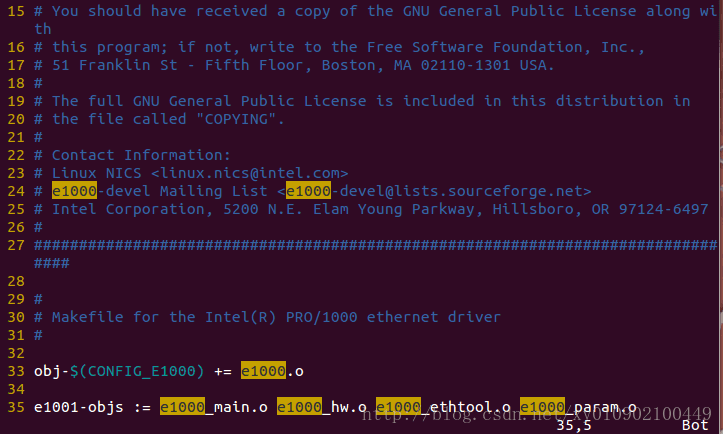
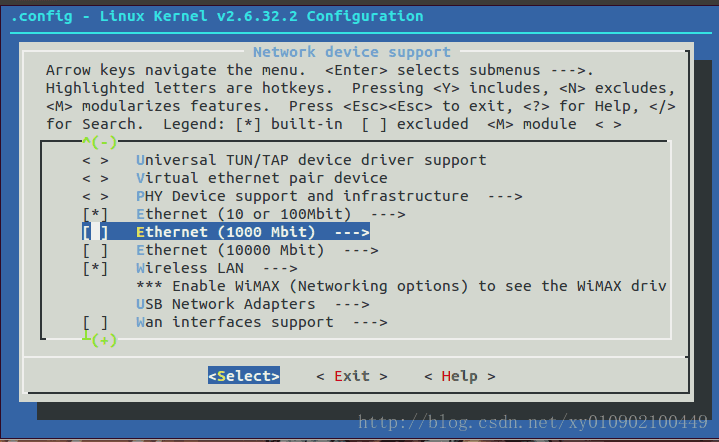
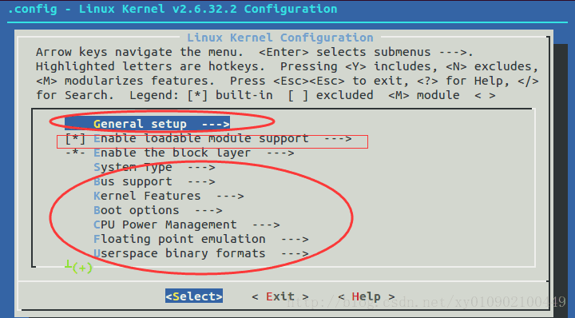

# Kconfig的格式

下面截取/drivers/net下的Kconfig文件中的部分内容：

```kconfig
# Network device configuration
menuconfig NETDEVICES
        default y if UML
        depends on NET
        bool "Network device support"
        ---help---
          You can say N here if you don't intend to connect your Linux box to any other computer at all.
……
config DM9000
        tristate "DM9000 support"
        depends on ARM || BLACKFIN || MIPS
        select CRC32
        select MII
        ---help---
          Support for DM9000 chipset.
 
          To compile this driver as a module, choose M here.  The module will be called dm9000.
……
source "drivers/net/arcnet/Kconfig"
source "drivers/net/phy/Kconfig"
```

Kconfig按照一定的格式来书写，menuconfig程序可以识别这种格式，然后从中提取出有效信息组成menuconfig中的菜单项。将来在做驱动移植等工作时，有时需要自己添加Kconfig中的一个配置项来将某个设备驱动添加到内核的配置项目中，这时候就需要对Kconfig的配置项格式有所了解，否则就不会添加。

menuconfig：表示菜单（本身属于一个菜单中的项目，但是他又有子菜单项目）、config表示菜单中的一个配置项（本身并没有子菜单下的项目）。一个menuconfig后面跟着的所有config项就是这个menuconfig的子菜单。这就是Kconfig中表示的目录关系。

NETDEVICES：menuconfig或者config后面空格隔开的大写字母表示的类似于 NETDEVICES 的就是这个配置项的配置项名字，这个字符串前面添加CONFIG_后就构成了“.config”文件中的配置项名字。

source：内核源码目录树中每一个Kconfig都会用source引入其所有子目录下的Kconfig，从而保证了所有的Kconfig项目都被包含进menuconfig中。这个也说明了：如果你自己在linux内核中添加了一个文件夹，一定要在这个文件夹下创建一个Kconfig文件，然后在这个文件夹的上一层目录的Kconfig中source引入这个文件夹下的Kconfig文件。

tristate：意思是三态（3种状态，对应Y、N、M三种选择方式），意思就是这个配置项可以被三种选择。

bool：是要么真要么假（对应Y和N）。意思是这个配置项只能被2种选择。

depends：意思是本配置项依赖于另一个配置项。如果那个依赖的配置项为Y或者M，则本配置项才有意义；如果依赖的哪个配置项本身被设置为N，则本配置项根本没有意义。depends项会导致make menuconfig的时候找不到一些配置项。所以在menuconfig中如果找不到一个选项，但是这个选项在Kconfig中却是有的，则可能的原因就是这个配置项依赖的一个配置项是不成立的。depends依赖的配置项可以是多个，还可以有逻辑运算。这种时候只要依赖项目运算式子的结果为真则依赖就成立。

select：表示depends on的值有效时，下面的select也会成立，将相应的内容选上。

default：表示depends on的值有效时，下面的default也会成立，将相应的选项选上，有三种选项，分别对应y，n，m。

help：帮助信息，解释这个配置项的含义，以及如何去配置他。

# Kconfig和.config文件和Makefile三者的关联

配置项被配置成Y、N、M会影响“`.config`”文件中的`CONFIG_XXX`变量的配置值。“.config”中的配置值（=y、=m、没有）会影响最终的编译链接过程。如果=y则会被编入（`built-in`），如果=m会被单独连接成一个”.ko”模块，如果没有则对应的代码不会被编译。那么这是怎么实现的？都是通过makefile实现的。

如makefile中：`obj-$(CONFIG_DM9000) += dm9000.o`， 

如果`CONFIG_DM9000`变量值为y，则obj += dm9000.o，因此dm9000.c会被编译；如果CONFIG_DM9000变量未定义，则dm9000.c不会被编译。如果CONFIG_DM9000变量的值为m则会被连接成“.ko”模块。

## 何为Kconfig? 它的作用是什么?

内核源码编译过程


1. 遍历每个源码目录（或配置指定的源码目录）Makefile
2. 每个目录的Makefile 会根据Kconfig来定制要编译对象
3. 回到顶层目录的Makeifle执行编译

那么我们就得出各个文件的作用：

* Kconfig ---> （每个源码目录下）提供选项
* .config ---> （源码顶层目录下）保存选择结果
* Makefile---> （每个源码目录下）根据.config中的内容来告知编译系统如何编译

说到底，Kconfig就是配置哪些文件编译，那些文件不用编译。后期linux内核都做出了如下的图形界面，但由于要进行Linux内核驱动开发，需要向将驱动的代码添加到Makefile中一起编译，所以Kconfig的一些语法也该了解，于是有了这篇文章。



### 基本使用方法

我们以简单的单选项为案例来演示

假比，我们做好了一个驱动，需要将选项加入到内核的编译选项中，可以按以下步骤操作：

#### 第一步 配置Kconfig

在driver目录下新建一个目录

```
mkdir driver/test 
```

进入test目录，创建Kconfig文件

```
config TEST
    bool "Test driver"
    help
    this is for test!!
```

这里定义了一个TEST的句柄，Kconfig可以通过这个句柄来控制Makefile中是否编译，"Test driver"是显示在终端的名称。 

具体的语法在Kconfig语法简介中介绍。

#### 第二步 配置Makefile

在同样的目录中，新建一个Makefile

```makefile
obj-$(CONFIG_TEST) += test.o
```

```
Obj-$(CONFIG_选项名) += xxx.o
/*当CONFIG_选项名=y时，表示对应目录下的xxx.c将被编译进内核
当CONFIG_选项名=m时对应目录下的xxx.c将被编译成模块*/
```

#### 第三步 配置上层目录的Makefile与Kconfig

##### 在上一层目录的Kconfig中

```
menu "Device Drivers"

source "drivers/test/Kconfig
```


表示将test文件夹中的Kconfig加入搜寻目录

##### 在上一层目录的Makefile中

```makefile
obj-y           += test/
```


结果，运行根目录的`.config`查看结果 


# Kconfig语法简介

## 单一选项

总体原则：每一个config就是一个选项，最上面跟着控制句柄，下面则是对这个选项的配置，如选项名是什么，依赖什么，选中这个后同时会选择什么。

```config

config CPU_S5PC100
    bool "选项名"
    select S5P_EXT_INT
    select SAMSUNG_DMADEV
    help
      Enable S5PC100 CPU support
```

* config —> 选项 
* CPU_S5PC100 —>句柄，可用于控制Makefile 选择编译方式 
* bool —>选择可能：TRUE选中、FALSE不选 选中则编译，不选中则不编译。 如果后面没有字符串名称，则表示其不会出现在选择软件列表中 
* select —> 当前选项选中后则select后指定的选项自动被选择

depend on 依赖，后面的四个选择其中至少一个被选择，这个选项才能被选

```
config DM9000
    tristate "DM9000 support"
```

tristate —> 选中并编译进内核、不选编译成模块

>运行结果: <M>test

## 选项为数字

```
config ARM_DMA_IOMMU_ALIGNMENT
    int "Maximum PAGE_SIZE order of alignment for DMA IOMMU buffers" ---->该选项是一个整型值
    range 4 9 ---->该选项的范围值
    default 8 ---->该选项的默认值
    help
      DMA mapping framework by default aligns all buffers to the smallest
      ...
```

`4-8`为这个数字的范围，运行结果


这里的defult其实也可以用在bool中

```
config STACKTRACE_SUPPORT
    bool    --->该选项可以选中或不选，且不会出现在选择列表中
    default y ---->表示缺省情况是选中
```

## if..endif

```
if ARCH_S5PC100 --->如果ARCH_S5PC100选项选中了，则在endif范围内的选项才会被选

config CPU_S5PC100
    bool "选项名"
    select S5P_EXT_INT
    select SAMSUNG_DMADEV
    help
      Enable S5PC100 CPU support

endif
```

举个例子，如果CPU没有选择使用多核CPU，则不会出现CPU个数的选项。

## choice多个选项

```
choice      --->表示选择列表
    prompt "Default I/O scheduler"         //主目录名字
    default DEFAULT_CFQ                    //默认CFQ
    help
      Select the I/O scheduler which will be used by default for all
      block devices.
 
    config DEFAULT_DEADLINE
        bool "Deadline" if IOSCHED_DEADLINE=y 
 
    config DEFAULT_CFQ
        bool "CFQ" if IOSCHED_CFQ=y
 
    config DEFAULT_NOOP
        bool "No-op"
 
endchoice
```

choice是单项选择题

## menu的用法

```
menu "Boot options"  ----> menu表示该选项是不可选的菜单，其后是在选择列表的菜单名

    config USE_OF
        bool "Flattened Device Tree support"
        select IRQ_DOMAIN
        select OF
        select OF_EARLY_FLATTREE
        help
        Include support for flattened device tree machine descriptions.
....

endmenu     ----> menu菜单结束
```

menu指的是不可编辑的menu，而menuconfig则是带选项的menu 

### menu和choice的区别 

menu 可以多选, choice 是单项选择题

# menuconfig的用法

```
menuconfig MODULES ---> menuconfig表示MODULE是一个可选菜单，其选中后是CONFIG_MODULES
    bool "菜单名"
    if MODULES
    ...
    endif # MODULES
```

说到底，menconfig 就是一个带选项的菜单，在下面需要用bool判断一下，选择成立后，进入 `if …endif` 中间得空间。

## 概述

在linux编写驱动的过程中，有两个文件是我们必须要了解和知晓的。这其中，一个是Kconfig文件，另外一个是Makefile文件。如果大家比较熟悉的话，那么肯定对内核编译需要的.config文件不陌生，在.config文件中，我们发现有的模块被编译进了内核，有的只是生成了一个module。


首先我们来学习什么Makefile，什么是Kconfig ，什么是.config 

Ｍakefile：一个文本形式的文件，其中包含一些规则告诉make编译哪些文件以及怎样编译这些文件。

Kconfig：一个文本形式的文件，其中主要作用是在内核配置时候，作为配置选项。

.config：文件是在进行内核配置的时候，经过配置后生成的内核编译参考文件。

Makefile 

2.6内核的Makefile分为5个组成部分： 

1. 最顶层的Makefile 
2. 内核的.config配置文件 
3. 在arch/$(ARCH) 目录下的体系结构相关的Makefile 
4. 在s目录下的 Makefile.* 文件，是一些Makefile的通用规则 
5. 各级目录下的大概约500个kbuild Makefile文件

顶层的Makefile文件读取 .config文件的内容，并总体上负责build内核和模块。Arch Makefile则提供补充体系结构相关的信息。 s目录下的Makefile文件包含了所有用来根据kbuild Makefile 构建内核所需的定义和规则。

这中间，我们如何让内核发现我们编写的模块呢，这就需要在Kconfig中进行说明。至于如何生成模块，那么就需要利用Makefile告诉编译器，怎么编译生成这个模块。模仿其实就是最好的老师，我们可以以内核中经常使用到的网卡e1000模块为例，说明内核中是如何设置和编译的。

首先，我们可以看一下，在2.6.32.60中关于e1000在Kconfig中是怎么描述的，



上面的内容是从drivers/net/Kconfig中摘录出来的。内容看上去不复杂，最重要的就是说明了模块的名称、用途、依赖的模块名、说明等等。只要有了这个说明，我们在shell下输入make menuconfig的时候，理论上我们就应该可以看到Intel（R）PR0/1000 Gigabit Ethernet support 这个选项了，输入y表示编译内核；输入n表示不编译；输入m表示模块编写，这是大家都知道的。

那么，有了这个模块之后，需要编译哪些文件中，我们在drivers/net/Makefile看到了这样的内容，



显然，这段代码只是告诉我们，要想编译e1000，必须要包含e1000这个目录，所以e1000目录下必然还有一个Makefile，果不其然，我们在e1000目录下果然找到了这个Makefile，内容如下，



看了这个文件，其实大家心理就应该有底了。原来这个e1000模块最终生成的文件就是e1000.ko，依赖的文件就是e1000_main.c、e1000_hw.c、e1000_ethtool.c、e1000_param.c这四个文件。只要CONFIG_E1000被设置了，那么这个模块就会被正常编译。我们要做的就是打开这个开关就可以了，剩下kernel会帮我们搞定一切。当然，如果大家想把这个模块拿出来，自己用一个独立的module编译也是可以的。但是我们在menuconfig中没有找到这个配置选项？这是怎么回事呢？



## Kconfig 语法

由于没有找到这个配置选项，我们只能从Kconfig的语法开始分析了。

### 基本构成

基本构成包括五种，menu/endmenu，menuconfig，config，choice/endchoice，source。下面就对每种详细介绍：

(1) menu/endmenu

    menu的作用，可以理解成一个目录，menu可以把其中一部分配置项包含到一个menu中，这样有利于配置的分类显示。menu与endmenu是一组指令，必须同时出现。menu和endmenu中包含的部分就是子目录中的配置项。

比如，在init/Kconfig中24行(可能不同)显示为：

menu "General setup"

这样，就会生成一个目录，特征就是右侧会出现一个箭头，如图1中第一行。当点击确认键时，会进入这个菜单项。make menuconfig 进入的第一个界面 基本所有选项都称为menu.

（2）menuconfig

menuconfig有点类似menu，但区别就在于menu后面多了一个config，这个menu是可以配置的，如图2中的第二行，前面比 menu类型多了一个方框，通过空格可以修改这个配置项的选中状态。而且从格式上来看，也是有区别的。如下图所示椭圆的都是menu 长方形的就是menuconfig了。



```
menuconfig MODULES
bool "Enable loadable module support"config
if MODULES
xx
endif
```

也就是说，配置项是位于if和endif中。其中的部分就是MODULES子目录显示的内容。如果选中了MODULE，那么if和endif中的内容可以显示。如果没有定义，就只能进入一个空目录。

(3) config

config是构成Kconfig的最基本单元，其中定义了配置项的详细信息。定义的格式参考arch/arm/Kconfig中的第8行。

```
config ARM  
         bool  
         default y  
         select xxxxxxxxxx  
         help  
           ???????????  
```

详细可以参阅 http://blog.csdn.net/xy010902100449/article/details/45131973

可知，config需要定义名称，与menuconfig相同。这个名称不但用于裁剪内核中，还用于配置项之间的相互依赖关系中。

config的类型有5种，分别是bool(y/n)，tristate(y/m/n)，string(字符串)，hex(十六进 制)，integer(整数)。其中，需要特别介绍一下bool和tristate，bool只能表示选中和不选，而tristate还可以配置成模块 (m)，特别对于驱动程序的开发非常有用。

其他语法如下：
————————————————
版权声明：本文为CSDN博主「颇锐克」的原创文章，遵循 CC 4.0 BY-SA 版权协议，转载请附上原文出处链接及本声明。
原文链接：https://blog.csdn.net/prike/article/details/79334609

# 参考

https://blog.csdn.net/prike/article/details/79334609