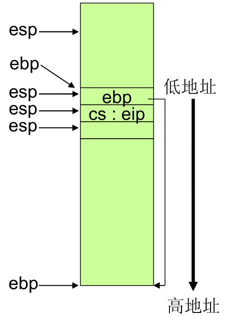

## 1. 三个法宝

- 存储程序计算机

- 函数调用堆栈

- 中断机制

### 1.1 堆栈

堆栈式C语言程序运行时必须的一个记录调用路径和参数的空间

- 函数调用框架

- 传递参数：32位x86是通过堆栈来传递参数，64位有点不同

- 保存返回地址：默认使用eax

- 提供局部变量空间

- 等等

C语言编译器对堆栈的使用有一套规则

了解堆栈存在的目的和编译器对堆栈使用的规则是理解操作系统一些关键性代码的基础

## 2. 深入理解函数调用堆栈

### 2.1 堆栈相关的寄存器

- esp，堆栈指针（stack pointer）

- ebp，基址指针（base pointer） 

### 2.2 堆栈操作

- push

栈顶地址减少4个字节（32位）

- pop 
 
栈顶地址增加4个字节

注：上面约定在不同CPU上可能不同

### 2.3 ebp作用

在C语言中用作记录当前函数调用基址。在嵌套的函数调用中，ebp值不一样。

### 2.4 其他关键寄存器

- CS:eip：总是指向下一条的指令地址

    - 顺序执行：总是指向地址连续的下一条指令
    - 跳转/分支：执行这样的指令的时候，cs:eip的值会根据程序需要被修改
    - call：把当前cs:eip的值压入栈顶，cs:eip指向被调用函数的入口地址
    - ret：从栈顶弹出原来保存在这里的cd:eip的值，放入cs:eip中
    - 发生中断时候？（中断机制是如何工作的）

### 2.5 深入理解函数调用堆栈的工作机制

#### 2.5.1 函数的堆栈框架

#### 2.5.2 函数堆栈框架的形成

- call xxx

    - 执行call之前
    - 执行call时，cs:eip原来的值指向call下一条指令，该值被保存到栈顶，然后cs:eip的值指向xxx的入口地址

- 进入xxx

    - 第一条指令： pushl %ebp
    
    - 第二条指令： movl %esp, %ebp
    
    - 函数体中的常规操作，可能会压栈、出栈
    
- 退出xxx
    - movl %ebp,%esp
    - popl %ebp
    - ret

## 3. 参数传递与局部变量
