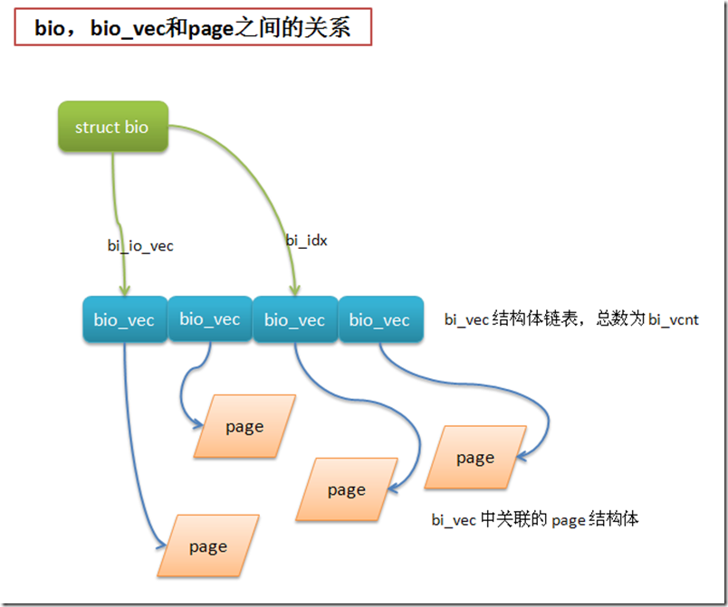

<!-- @import "[TOC]" {cmd="toc" depthFrom=1 depthTo=6 orderedList=false} -->

<!-- code_chunk_output -->

- [背景](#背景)
- [扇区和块](#扇区和块)
- [缓冲区和缓冲区头: 一个块](#缓冲区和缓冲区头-一个块)
- [bio 结构体: 一次块 I/O 操作](#bio-结构体-一次块-io-操作)
  - [I/O 向量](#io-向量)
  - [小结](#小结)
  - [新老方法对比](#新老方法对比)
- [请求队列](#请求队列)
- [I/O 调度程序](#io-调度程序)

<!-- /code_chunk_output -->

# 背景

两种基本设备类型:

* 字符设备: 按**字节流**的顺序**有序读写**. 串口和键盘等. 键盘输入字符串"wolf", 对键盘进行读操作得到**字符流**, 先 "w", 然后 "o", 再是 "l", 最后是 "x".

* 块设备: **随机**(不需要按顺序)读写**固定大小数据片**(chunks)的硬件设备, 固定大小的数据片就叫**块**. 硬盘、软盘驱动器、蓝光光驱和闪存等.

字符设备是顺序访问, 仅仅需要控制一个位置: 当前位置. 所以**不必**提供一个**专门子系统**管理.

块设备随机访问, 在介质的不同区间前后移动. 有**专门的子系统**: 块设备的**复杂性**; 块设备对**执行性能**要求很高.

# 扇区和块

块设备最小的可寻址单元是扇区, 即对块设备的I/O无法比对扇区还小的单元进行寻址和操作. 扇区大小一般是 2 的整数倍, 最常见是 512 字节.

块是文件系统的一种抽象 -- 只能基于块来访问文件系统. 即内核执行的**所有磁盘操作**都是按照**块**进行的, 虽然物理磁盘寻址是按扇区级进行的.

由于扇区是物理设备的最小可寻址单元, 而逻辑上最小的可寻址单元是块, 所以**块大小**只能**数倍于扇区大小**; 内核还要求块大小是 **2 的整数倍**, 而且**不能超过一个页**的长度(见12章和19章).

**块大小**最终要求: 必须是**扇区大小的整数倍**; 必须是 2 的倍数; 必须**小于页面大小**. 通常块大小是 512 字节、1KB 或 4KB.

* **扇区**, **物理设备**的最小可寻址单元, 也被称为 "**硬扇区**" 或 "**设备块**"

* **块**, **文件系统**的最小可寻址单元, 也被称为 "**文件块**" 或 "**I/O 块**"

```
#sudo fdisk -l
Disk /dev/sda: 500.1 GB, 500107862016 bytes, 976773168 sectors
Units = sectors of 1 * 512 = 512 bytes
Sector size (logical/physical): 512 bytes / 4096 bytes
I/O size (minimum/optimal): 4096 bytes / 4096 bytes
Disk identifier: 0x00000000
```

* Sector size: 扇区大小值. 逻辑大小是为了兼容以前的软件; 物理大小才是实际扇区大小

* I/O size: 块大小值.

# 缓冲区和缓冲区头: 一个块

内核通过文件系统访问块设备, 需要将**块**读入到**内存**时, 它要存储在一个缓冲区中. **每个缓冲区**与**一个块**对应, 它相当于是**块在内存中的表示**.

> 块是文件系统的最小寻址单元, 这个块对应磁盘上的多个扇区

块设备中的**一个或多个扇区**组成**一个块**, 一个块大小不超过一个页面, 所以**一个页**可以容纳一个或**多个**内存中的**块**(**缓冲区**).

**每个缓冲区**有一个对应的**描述符**, buffer_head 结构体, 称为**缓冲区头**, 包含内核操作缓冲区所需要的全部信息.

```cpp
struct buffer_head {
    unsigned long 		    b_state;	        /* 表示缓冲区状态 */
    struct buffer_head 		*b_this_page;	    /* 当前页中缓冲区 */
    struct page 		    *b_page;     	    /* 当前缓冲区所在内存页 */

    sector_t 			    b_blocknr;   	    /* 物理磁盘起始块号, 扇区号? */
    size_t 			        b_size;      	    /* buffer在内存中的大小 */
    char 			        *b_data;    	    /* 块映射在内存页中的数据 */

    struct block_device 	*b_bdev; 	        /* 关联的块设备 */
    bh_end_io_t 		    *b_end_io;  	    /* I/O完成方法 */
    void 			        *b_private;   	    /* 保留的 I/O 完成方法 */
    struct list_head 	    b_assoc_buffers;    /* 关联的其他缓冲区 */
    struct address_space	*b_assoc_map;	    /* 相关的地址空间 */
    atomic_t 			    b_count;      	    /* 引用计数 */
};
```

b_state 表示缓冲区的状态, 可以是 bh_state_bits 枚举中多个的组合.

```cpp
enum bh_state_bits {
    BH_Uptodate,    	/* 包含可用数据 */
    BH_Dirty,    	    /* 该缓冲区是脏的(说明缓冲的内容比磁盘中的内容新，需要回写磁盘) */
    BH_Lock,    	    /* 该缓冲区正在被I/O使用，锁住以防止并发访问 */
    BH_Req,        	    /* 该缓冲区有I/O请求操作 */
    BH_Uptodate_Lock,   /* 由内存页中的第一个缓冲区使用，使得该页中的其他缓冲区 */
    BH_Mapped,    	    /* 该缓冲区是映射到磁盘块的可用缓冲区 */
    BH_New,        	    /* 缓冲区是通过 get_block() 刚刚映射的，尚且不能访问 */
    BH_Async_Read,    	/* 该缓冲区正通过 end_buffer_async_read() 被异步I/O读操作使用 */
    BH_Async_Write,    	/* 该缓冲区正通过 end_buffer_async_read() 被异步I/O写操作使用 */
    BH_Delay,    	    /* 缓冲区还未和磁盘关联 */
    BH_Boundary,    	/* 该缓冲区处于连续块区的边界，下一个块不在连续 */
    BH_Write_EIO,    	/* 该缓冲区在写的时候遇到 I/O 错误 */
    BH_Ordered,    	    /* 顺序写 */
    BH_Eopnotsupp,    	/* 该缓冲区发生 “不被支持” 错误 */
    BH_Unwritten,    	/* 该缓冲区在磁盘上的位置已经被申请，但还有实际写入数据 */
    BH_Quiet,    	    /* 该缓冲区禁止错误 */

    BH_PrivateStart,	/* 不是表示状态，分配给其他实体的私有数据区的第一个bit */
};
```

块 I/O 层不会使用 BH_PrivateStart 或更高位. 可被其他程序使用.

操作缓冲区之前, 应先使用 get_bh() 增加引用计数, 确保该缓冲区头不再被分配出去; 完成操作后, 调用 put_bh() 减少引用计数.

与缓冲区对应的**磁盘物理块**(扇区?)由 `b_blocknr` 指向, 该值是 b_bdev 指明的块设备中的**逻辑块号**(扇区?).

与缓冲区对应的**内存物理页**由 b_page 表示, b_data 直接指向**相应的块**(位于 b_page 指向的**页面的某个位置**上), **块大小**由 b_size 域表示. 所以块在内存汇总的**起始位置**在 **b_data** 处, **结束位置**是 (`b_data + b_size`) 处.

**缓冲区头**目的: 仅仅是一个**描述符**, 说明**内存缓冲区**(在**特定页面上的字节序列**)和**块**的**映射关系**.

> 这个块就是磁盘上的物理块, 是一个逻辑概念, 对应多个连续的扇区

**2.6 内核以前**, 缓冲区头作为内核中的 **I/O 操作单元**, 不仅描述了块和物理内存的映射, 还是**所有块 I/O 操作的容器**.

通过缓冲区头来管理内核的所有块 I/O 操作有 2 个弊端:

1. 内核更倾向于**操作页面结构**, 因为简单且高效. 所以 2.6 中, 很多 I/O 操作都是通过内核直接对页面或地址空间进行操作的, 不再使用缓冲区头; **每个块**对应**一个缓冲区头**, 太耗内存(原来结构体巨大).

2. **每个缓冲区头**只能表示一个块, 内核对**大块数据**的 I/O 操作会被分解为**多个对 buffer_head 结构体**进行操作. 不必要的负担和空间浪费.

# bio 结构体: 一次块 I/O 操作

为改善上面缓冲区头的 2 个弊端, 引入了 bio, 它表示**一次块 I/O 操作**涉及的**所有内存页**.

块 I/O 操作的基本容器由 bio 结构体表示. 代表了正在现场的(**活动的**)以**片段**(segment)**链表**形式组织的块 I/O 操作. 不需要保证单个缓冲区一定要连续. **一个片段**就是**一小块连续的内存缓冲区**, 即让**一个缓冲区**分散在**内存的多个位置**上.

```cpp
/*
 * I/O 操作的主要单元，针对 I/O块和更低级的层 (ie drivers and
 * stacking drivers)
 */
struct bio {
    sector_t      	    bi_sector;    	/* 磁盘上相关扇区 */
    struct bio        	*bi_next;    	/* 请求列表 */
    struct block_device	*bi_bdev; 	    /* 相关的块设备 */
    unsigned long     	bi_flags;    	/* 状态和命令标志 */
    unsigned long	    bi_rw;        	/* 读还是写 */

    unsigned short   	bi_vcnt;    	/* bio_vecs的数目 */
    unsigned short   	bi_idx;        	/* bio_io_vect的当前索引 */

    /* Number of segments in this BIO after
     * physical address coalescing is performed.
     * 结合后的片段(segment)数目
     */
    unsigned int	    bi_phys_segments;
    unsigned int        bi_size;    	/* 剩余 I/O 计数 */

    /*
     * To keep track of the max segment size, we account for the
     * sizes of the first and last mergeable segments in this bio.
     * 第一个和最后一个可合并的段的大小
     */
    unsigned int        bi_seg_front_size;
    unsigned int        bi_seg_back_size;

    unsigned int        bi_max_vecs; 	/* bio_vecs数目上限 */
    unsigned int        bi_comp_cpu;    /* 结束CPU */

    atomic_t        	bi_cnt;    	    /* 使用计数 */
    struct bio_vec   	*bi_io_vec;	    /* bio_vec 链表(i/o 向量) */
    bio_end_io_t        *bi_end_io; 	/* I/O 完成方法 */
    void            	*bi_private;    /* bio结构体创建者的私有方法 */
    bio_destructor_t    *bi_destructor; /* bio撤销方法 */
    /*
     * We can inline a number of vecs at the end of the bio, to avoid
     * double allocations for a small number of bio_vecs. This member
     * MUST obviously be kept at the very end of the bio.
     * 内嵌在结构体末尾的 bio 向量，主要为了防止出现二次申请少量的 bio_vecs
     */
    struct bio_vec 	    bi_inline_vecs[0];
};
```

* bi_io_vec 指向一个 **bio_vec 结构体链表**, **每个**表示 I/O 操作的**一个片段**(segment); 

* bi_vcnt 表示这个**链表的个数**;

* bi_idx 表示**数组的当前索引**.



bi_cnt 代表了使用计数, 为 0 就应该释放该结构体内存. bio_get() 增加计数; bio_put() 减少计数.

## I/O 向量

整个 bio_io_vec 结构体数组表示了一个完整的缓冲区.

每个 bio_vec 结构都是一个 `<page, offset, len>` 的向量, 描述了**一个特定的片段**: <片段所在的物理页, 块在物理页中的偏移量, 从给定偏移量开始的块长度>.

```cpp
struct bio_vec {
    struct page     *bv_page;   /* 这个片段所在的物理页 */
    unsigned int    bv_len;     /* 这个片段以字节为单位的大小 */
    unsigned int    bv_offset;  /* 这个片段在所在的物理页中以字节为单位的偏移量 */
}
```

## 小结

总之, 每一个块 I/O 请求都是通过一个 bio 结构体表示; 每个请求包括一个或多个块, 这些块存储在 bio_vec 结构体数组中; 每个结构体数组项代表一个片段, 结构体会描述这个片段在物理页中的实际位置, 通过 I/O 向量形式表示: `<page, offset, len>`; I/O 操作的第一个片段由 bi_io_vec 结构体指向, 其他片段在其后依次放置, 共 bi_vcnt 个片段; 当块 I/O 请求使用各个片段时, bi_idx 域会更新, 从而总是指向当前片段.

## 新老方法对比

缓冲区头和bio并不是相互矛盾的，bio只是缓冲区头的一种改善，将以前缓冲区头完成的一部分工作移到bio中来完成。

bio 结构体代表 I/O 操作, 对应的是**内存中的一个或多个页**.

buffer_head 结构体代表一个内存缓冲区, 描述的仅仅是**磁盘中的一个块**.

> 这里的块是文件系统块, 会包含磁盘上多个扇区, 对磁盘而言, 这个块是逻辑概念

对内核来说，配合使用bio和缓冲区头 比 只使用缓冲区头更加的方便高效

bio相当于在缓冲区上又封装了一层，使得内核在 I/O操作时只要针对一个或多个内存页即可，不用再去管理磁盘块的部分

因为 buffer_head 关联的是单独页中的单独磁盘块, 所以会将请求按块进行划分, 只能以后再重新组合. bio 是轻量的, 描述的块可以不需要连续存储区, 并且不需要分割 I/O 操作.

bio 其他好处:

* bio 很容易处理高端内存, 因为它处理的是物理页而不是直接指针

* bio结构体既可以代表普通页I/O，也可以代表直接I/O

* bio结构体便于执行分散-集中（矢量化的）块I/O操作，操作中的数据可以取自多个物理页面

# 请求队列

挂起的块 I/O 请求会保存在请求队列中, 由 reques_queue 结构体表示, 包含一个双向请求链表以及相关控制信息.

内核, 比如文件系统, 将 I/O 请求加入到队列中, 队列只要不为空, 块设备驱动程序会从队列头获取请求, 然后将其送入对应的块设备. 队列中每一项都是一个单独的请求, 由 reques 结构体表示.

每个单独的请求可能要操作多个连续的磁盘块, 所以每个请求由多个 bit 结构体组成. 虽然磁盘上的块必须连续, 但是内存中这些块并不一定要连续 -- 每个 bio 结构体可以描述多个片段(片段是内存中连续的小区域), 而每个请求也可以包含多个 bio 结构体.

# I/O 调度程序


