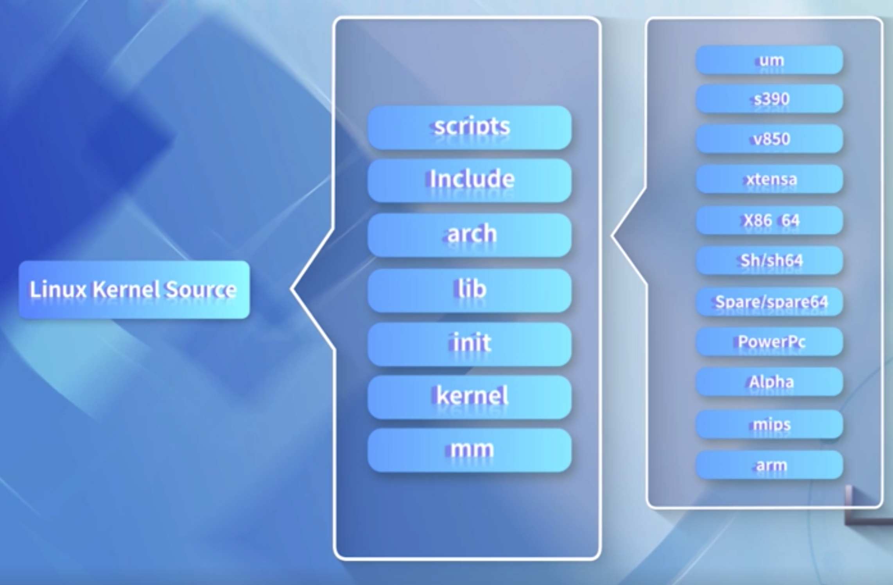

<!-- @import "[TOC]" {cmd="toc" depthFrom=1 depthTo=6 orderedList=false} -->

<!-- code_chunk_output -->

- [单内核与微内核](#单内核与微内核)
- [Linux内核源码目录结构](#linux内核源码目录结构)
- [可加载的Linux内核模块(LKM)](#可加载的linux内核模块lkm)
- [Linux内核模块编程入门](#linux内核模块编程入门)

<!-- /code_chunk_output -->

# 单内核与微内核

Linux是一个单内核结构


单内核结构, 也就是说操作系统的各个子系统比如说文件系统、内存管理、进程管理以及网络系统、进程通信它们互相之间可以直接调用， 

微内核结构, 只有一些核心代码放在微内核里, 比如核心的进程间通信、中断以及调度程序放在微内核, 而其他的比如文件系统、内存管理等可能以服务器的方式放在外部

单内核和微内核在业界一直有争议的, 各有特点. 

单内核由于子系统之间能相互调用, 所以它的性能比较高, 但是可维护性比较差; 

微内核的内核与服务器之间是一种通信的关系, 比如说当要发出一个请求的时候文件系统可能要和微内核进行通信, 而通信是有代价的, 所以微内核的效率比较低, 但是因为这种架构各个服务器之间相互独立, 它的可维护性比较好, 目前业界比如说Minix系统、QNX、L4、 谷歌最新的FUchsia操作系统都是微内核.

# Linux内核源码目录结构

当我们了解Linux的内核的时候, 我们直接进入源代码, 这里我们有一个Linux内核源码的目录结构




在这个目录下, mm目录下就存放的是内存管理的代码, fs目录就是文件系统的代码, ipc目录下就是进程间通信的代码, 以及驱动程序等等都是以各自目录形式存放在它的目录下, 通过源码目录结构可知它确实是一个单内核的结构

# 可加载的Linux内核模块(LKM)

前面提到, 单内核的模块有一个缺点就是可维护性比较差, 当我们想增加一个新功能, 比如要写一个驱动程序、写一个文件系统, 怎么样才能融入到内核里面? 因为Linux内核现在非常庞大, 要编译一次内核要花很长时间, 那能不能有种方法, 让我们写的代码, 不需要完全和Linux内核捆绑在一起, 所以Linux内核提供了一种机制叫做"可加载的Linux内核模块(LKM)", 什么意思呢? 就是说在Linux内核运行的过程中, 可以把这个模块加载进Linux内核, 当不需要这个模块时候, 即使Linux内核在运行, 我们可以把这个模块取下来, 即卸载. 

A loadable kernel module(LKM) is a mechanism for adding code to, or removing code form, the Linux kernel at run time.


# Linux内核模块编程入门

如何编写Linux内核模块呢, 我们编写一个helloworld这样一个简单程序一样, 看一下如何入门, 在普通用户下, 想要输出的话用printf, 那么在Linux内核下还能用printf这个函数吗? 不能再用了, 因为现在已经进入Linux内核编程了, **不能再使用库函数**了, 而必须使用**Linux内核的源代码**, 所以printf函数就换成printk(k也就是kernel的意思), 那输出到什么地方呢? 内核是没有显示终端的, 所以它的输出是输出到日志文件里头, 那这个printk函数包含在哪个头文件里面呢? 它有一个头文件叫kernel.h, 所以要写这个一个内核模块, 第一个要认识的函数就是printk.

在这里我们看到这个函数, 名字叫`lkp_init`, 名字可以自己取, 函数作用是模块的入口函数, 另一个函数`lkp_exit`, 相当于我们卸载模块的时候, 这个函数才会执行. 

`module_init`是用来调用初始化函数, 它的参数是一个函数名, 那么这个函数放在哪一个头文件里, module.h头文件.

这里还有两个不认识的东西, 就是`__init`和`__exit`, 什么意思呢, `__init`它告诉编译程序, 当这个模块执行完后把这个内存空间回收回来, 所以这两个函数到底什么时候执行呢, 当模块插入进来的时候, 它执行初始化的函数; 当模块卸载的时候, 它执行的是退出函数. 

任何模块都要包含的三个头文件:

```c
#include <linux/module.h>
#include <linux/kernel.h>
#include <linux/init.h>
```

* module.h头文件包含了对模块的版本控制;
* kernel.h包含了常用的内核函数;
* init.h包含了宏`__init`和`__exit`, 宏`__init`告诉编译程序相关的函数和变量仅用于初始化, 编译程序将标有`__init`的所有代码存储到特殊的内存段中, 初始化结束就释放这段内存.

在此使用了printk()函数, 该函数是由内核定义的, 功能与C库中的printf()类似, 它要把打印的日志输出到终端或系统日志. 字符串中的`<1>`是输出的级别, 表示立即在终端输出.


内核模块并不是独立的可执行文件, 但在**内核运行时**其目标文件被链接到内核中. 

如何编译内核模块呢, 不能用一般的编译方法