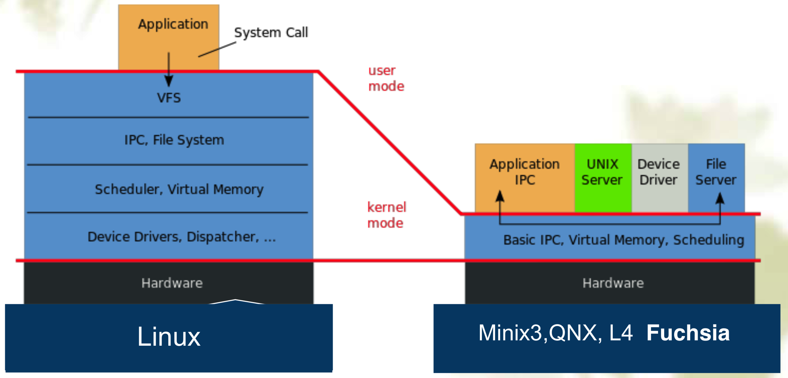
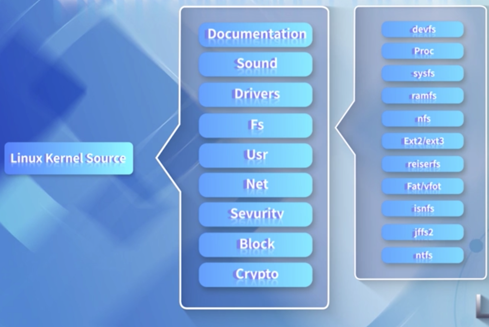
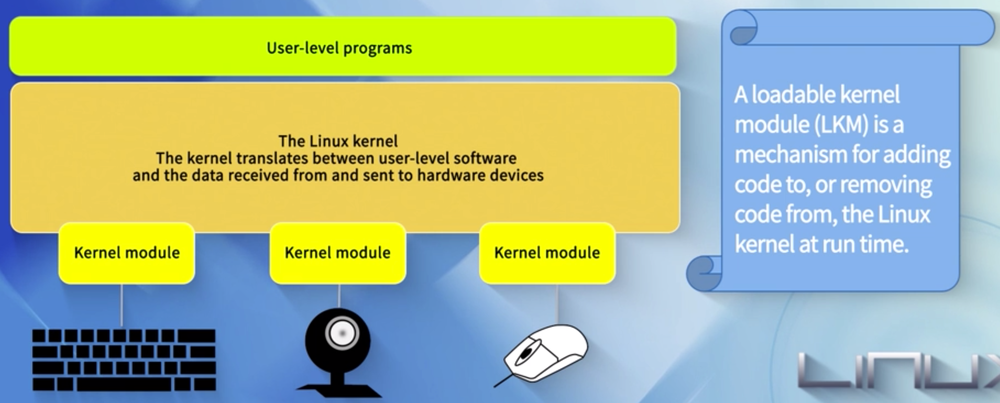

<!-- @import "[TOC]" {cmd="toc" depthFrom=1 depthTo=6 orderedList=false} -->

<!-- code_chunk_output -->

- [单内核与微内核](#单内核与微内核)
- [Linux内核源码目录结构](#linux内核源码目录结构)
- [可加载的Linux内核模块(LKM)](#可加载的linux内核模块lkm)

<!-- /code_chunk_output -->

# 单内核与微内核

Linux是一个单内核结构

单内核结构, 也就是说操作系统的各个子系统比如说文件系统、内存管理、进程管理以及网络系统、进程通信它们互相之间可以直接调用， 

微内核结构, 只有一些核心代码放在微内核里, 比如核心的进程间通信、中断以及调度程序放在微内核, 而其他的比如文件系统、内存管理等可能以服务器的方式放在外部

单内核和微内核在业界一直有争议的, 各有特点. 

单内核由于子系统之间能相互调用, 所以它的性能比较高, 但是可维护性比较差; 

微内核的内核与服务器之间是一种通信的关系, 比如说当要发出一个请求的时候文件系统可能要和微内核进行通信, 而通信是有代价的, 所以微内核的效率比较低, 但是因为这种架构各个服务器之间相互独立, 它的可维护性比较好, 目前业界比如说Minix系统、QNX、L4、 谷歌最新的FUchsia操作系统都是微内核.

# Linux内核源码目录结构

当我们了解Linux的内核的时候, 我们直接进入源代码, 这里我们有一个Linux内核源码的目录结构

在这个目录下, mm目录下就存放的是内存管理的代码, fs目录就是文件系统的代码, ipc目录下就是进程间通信的代码, 以及驱动程序等等都是以各自目录形式存放在它的目录下, 通过源码目录结构可知它确实是一个单内核的结构

# 可加载的Linux内核模块(LKM)

前面提到, 单内核的模块有一个缺点就是可维护性比较差, 当我们想增加一个新功能, 比如要写一个驱动程序、写一个文件系统, 怎么样才能融入到内核里面? 因为Linux内核现在非常庞大, 要编译一次内核要花很长时间, 那能不能有种方法, 让我们写的代码, 不需要完全和Linux内核捆绑在一起, 所以Linux内核提供了一种机制叫做"可加载的Linux内核模块(LKM)", 什么意思呢? 就是说在Linux内核运行的过程中, 可以把这个模块加载进Linux内核, 当不需要这个模块时候, 即使Linux内核在运行, 我们可以把这个模块取下来, 即卸载. 

如何编写Linux内核模块呢, 我们编写一个helloworld这样一个简单程序一样, 看一下如何入门, 