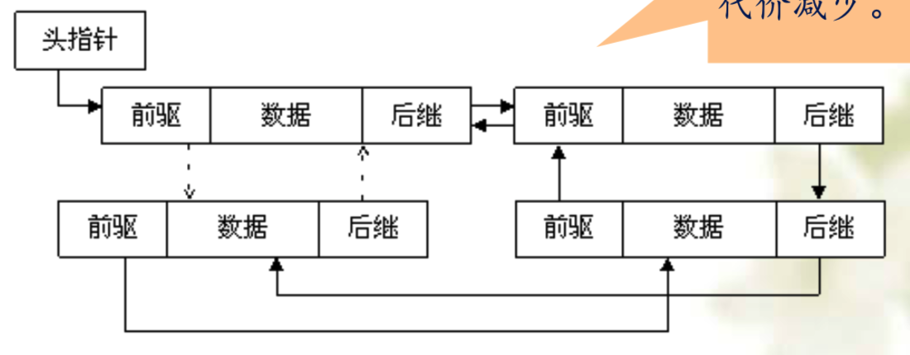

<!-- @import "[TOC]" {cmd="toc" depthFrom=1 depthTo=6 orderedList=false} -->

<!-- code_chunk_output -->

- [链表的演化](#链表的演化)

<!-- /code_chunk_output -->

# 链表的演化

在C语言中，一个基本的双向链表定义如下:

```c
struct my_list{
    void *mydata;
    struct my_list *next;
    struct my_list *prev;
};
```



这个链表画出图来的话是这样的, 它有前驱(prev)和后继(next), 这两个指针可以从两个方向来遍历链表, 从而使得遍历链表的效率得以提升.

为什么要把双链表作为一个重点来介绍呢? 

* 实际上, 对一个双链表减少一个指针域, 它自然就退化为一个单链表;

* 如果只能对链表的首尾进行插入或删除操作, 它就变成队列结构;

如果只能对链表的头进行插入或删除操作, 它就变成栈结构;

如果前驱和后继表示左右孩子的话, 它就变成一棵二叉树;

