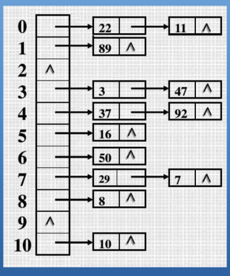
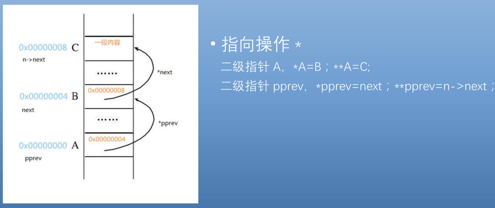

<!-- @import "[TOC]" {cmd="toc" depthFrom=1 depthTo=6 orderedList=false} -->

<!-- code_chunk_output -->

- [什么是哈希表](#什么是哈希表)
- [2 如何解决哈希表冲突](#2-如何解决哈希表冲突)
- [内核中的哈希表](#内核中的哈希表)

<!-- /code_chunk_output -->

Linux内核中还有一个专门用于哈希表的链表结构hlist

# 什么是哈希表

哈希表是数据结构中一种非常重要的用于查找的数据结构, 它的基本思想是将**关键字**和其**存储位置！！！** 之间建立起一种**映射关系**, 称为哈希函数, 通过哈希函数可以实现在时间复杂度O(1)下查找数据.


实际应用过程中常常有一种现象, 对于两个不同的关键字, 经过哈希函数运算以后, 它们具有同样的哈希地址, 如果我们对这种情况不特殊处理的话, 也就意味着这两个不同的关键字将被存储在同一个位置上, 这就是冲突现象.

# 2 如何解决哈希表冲突

在哈希表中解决冲突是一个重要的问题, 常见的方法有几种: 开放寻址法、再散列法和链地址法.

这里重点说明是链地址法. 基本思想是将具有相同哈希地址的记录链成一个链表, m个哈希地址就有m个链表(每个哈希地址对应一个链表), 然后用一个数组, 将这M个链表的头结点存储起来, 形成一个动态的结构. 



这部分内容, 有助于学习hlist. hlist是内核为我们提供了一个用于实现哈希表链地址法的一个数据结构. 

# 内核中的哈希表

可通过2.6版本来学习, 哈希表源码在include/linux/list.h文件中, 前面的以list开头的都是双循环链表的, hlist开头的都是哈希表相关的源码. 

首先看看内核中用于实现哈希表的两个数据结构, 一个是hlist_head, 是链表的头结点, 它有一个指向第一个链表体结构的的头结点指针first; 另一个是hlist_node, 是链表体结构, 它包含指向后一个节点的next指针, 特别的是, 它还包含一个二级指针pprev, 这个二级指针分析很关键, 而这个需要从其他代码中获取线索. 

```c
struct hlist_head{
    struct hlist_node *first;
};

struct hlist_node{
    struct hlist_node *next, **pprev;
}
```

首先查看前面的几个定义

```c
#define HLIST_HEAD_INIT { .first = NULL }
#define HLIST_HEAD(name) struct hlist_head name = {  .first = NULL }
#define INIT_HLIST_HEAD(ptr) ((ptr)->first = NULL)
#define INIT_HLIST_NODE(ptr) ((ptr)->next = NULL, (ptr)->pprev = NULL)
```

从名字看, 前三个是对于头结点初始化的宏, 最后一个是对于node节点初始化的宏.


```c
static inline int hlist_unhashed(const struct hlist_node *h)
{
	return !h->pprev;
}
```

`hlist_unhashed`用来判断是一个hlist_node节点是否经过哈希的, 如果该节点没有哈希, name指针域pprev应该是初始化时候的NULL, 返回值也就是true.

```c
static inline int hlist_empty(const struct hlist_head *h)
{
	return !h->first;
}
```

传入参数是hlist_head, 判断该链表是否为空.

上面两个操作都没有提到对二级指针pprev的操作, 所以还需要往下看

```c
static inline void __hlist_del(struct hlist_node *n)
{
	struct hlist_node *next = n->next;
	struct hlist_node **pprev = n->pprev;
	*pprev = next;
	if (next)
		next->pprev = pprev;
}
```

从名字看, 是对于哈希链表的节点进行删除操作. 

分析之前, 插入一下对于二级指针的介绍. 



一级指针见的都比较多也比较熟悉, 它指向的是某个变量, 也就是说一级指针中存储的是某个变量的地址, 而二级指针, 简单来说就是一个指向指针的指针, 二级指针中存储的是某个一级指针的地址.

如上图, A是二级指针, B是一级指针, C是一个变量. 

先来看B, 它是一个指向变量C的一级指针, 它通过存储变量C的地址来达到指向变量C的目的. 而A, 是一个指向指针B的二级指针, 它通过存储指针B的地址来达到指向指针B的目的.

接着是关于指向操作, 我们知道对于一个一级指针进行一次指向操作, 就相当于间接的引用这个指针指向的一个变量; 同理, 对于一个二级指针进行一次指向操作, 就相当于间接的引用. 它指向了那个一级指针了, 而对于一个二级指针进行两次指向操作, 就相当于对它指向的一级指针所指向的那个变量的间接引用.


现在就分析下执行过程, 传入的参数是hlist_node的指针n. 

* 先保存当前节点的next指针域
* 用一个二级指针pprev保存了当前节点的pprev指针域
* \*pprev就是对二级指针pprev的一次指向操作, 也就是对于pprev二级指针所指向的那个一级指针的间接引用, 该语句将next指针赋值给了该一级指针.
* 接着是一个判断, 当next指针不为空的情况下, 也就是当前节点的后续节点存在的情况下, 将pprev指针

