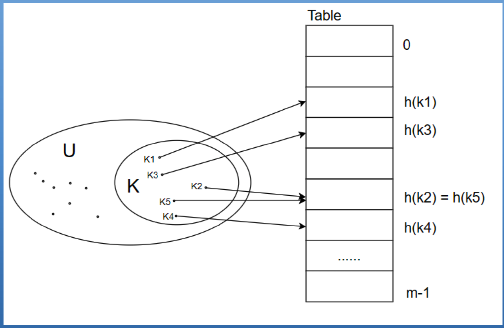

<!-- @import "[TOC]" {cmd="toc" depthFrom=1 depthTo=6 orderedList=false} -->

<!-- code_chunk_output -->

- [什么是哈希表](#什么是哈希表)
- [2 如何解决哈希表冲突](#2-如何解决哈希表冲突)

<!-- /code_chunk_output -->

Linux内核中还有一个专门用于哈希表的链表结构hlist

# 什么是哈希表

哈希表是数据结构中一种非常重要的用于查找的数据结构, 它的基本思想是将**关键字**和其**存储位置！！！** 之间建立起一种**映射关系**, 称为哈希函数, 通过哈希函数可以实现在时间复杂度O(1)下查找数据.

实际应用过程中常常有一种现象, 对于两个不同的关键字, 经过哈希函数运算以后, 它们具有同样的哈希地址, 如果我们对这种情况不特殊处理的话, 也就意味着这两个不同的关键字将被存储在同一个位置上, 这就是冲突现象.

# 2 如何解决哈希表冲突

在哈希表中解决冲突是一个重要的问题, 常见的方法有几种: 开放寻址法、再散列法和链地址法.

这里重点说明是链地址法. 基本思想是将具有相同哈希地址的记录链成一个链表, m个哈希地址就有m个链表(每个哈希地址对应一个链表), 然后用一个数组, 将这M个链表的头结点存储起来, 形成一个动态的结构. 

这部分内容, 有助于学习hlist. hlist是内核为我们提供了一个用于实现哈希表链地址法的一个数据结构. 

可通过2.6版本来学习, 哈希表源码在include/linux/list.h文件中, 前面的以list开头的都是双循环链表的, hlist开头的都是哈希表相关的源码. 

首先看看内核中用于实现哈希表的两个数据结构, 