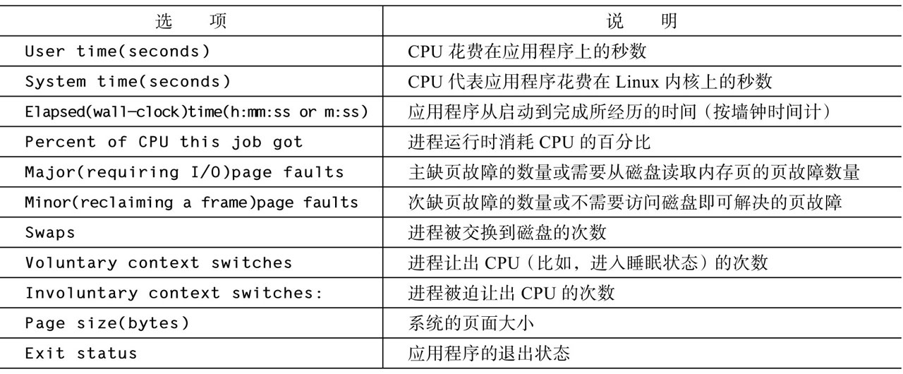

# time

time命令完成一项基本功能，当需要测试一条命令的性能时，通常会首先运行它。time命令如同秒表一样，可以测量命令执行的时间。它测量的时间有三种类型：第一种测量的是真正的或经过的时间，即程序开始到结束执行之间的时间；第二种测量的是用户时间，即CPU代表该程序执行应用代码所花费的时间；第三种测量的是系统时间，即CPU代表该程序执行系统或内核代码所花费的时间。

## CPU性能相关的选项

time命令（参见表4-1）调用方式如下：

```
time [-V] application
```

对application程序计时，在其完成后，在标准输出上显示它的CPU使用情况。

表4-1 time命令行选项



表4-2对time命令提供的有效输出统计信息进行了解释。其他项不进行测量，且总是显示为零。

表4-2 与CPU相关的time输出



这个命令是启动调查的良好开端。它显示了应用程序执行了多长时间，其中，多少时间花费在Linux内核上，多少时间花费在你的应用程序上。

## 用法示例

包含在Linux中的time命令是跨平台GNU工具的一部分。默认命令输出会打印命令运行的大量统计信息，即使Linux不支持它们。如果数据不可用，那么time就只打印一个零。下面的命令是对time的一个简单调用。你可以在清单4.1中看到，经过的时间（约3秒）远大于用户时间（0.9秒）和系统时间（0.13秒）的总和，这是因为应用程序的大部分时间是用来等待输入的，而少量的时间是用于处理器的。

清单4.1



清单4.2是time显示详细信息的例子。如同你看到的，这个输出比time的典型输出显示了更多的信息。遗憾的是，大部分统计数据都是零，因为Linux不支持它们。大多数情况下，详细模式下提供的信息与标准模式下提供的信息是一样的，但其统计信息的标签更具有描述性。在这个例子中，我们可以看到，进程运行时使用了15%的CPU，运行用户代码的时间为1.15秒，运行内核代码的时间为0.12秒。它累计有2087个主缺页故障，或需要访问磁盘的内存故障；有371个不需要访问磁盘的缺页故障。大量的主缺页故障表明，在应用程序试图使用内存时，操作系统在不断的访问磁盘，这极有可能意味着进行了大量的交换。
清单4.2

请注意，bash shell有内置time命令，因此，如果你运行bash并在没有指定执行路径的情况下执行time，你将得到如下输出：

bash内置的time命令是很有用的，但是它提供的是进程执行信息的子集。
4.2.2 strace
strace是当程序执行时，追踪其发起的系统调用的工具。系统调用是由或代表一个应用程序进行的Linux内核函数调用。strace可以展示准确的系统调用，它在确定应用程序是如何使用Linux内核的方面是相当有用的。在分析大型程序或你完全不懂的程序时，跟踪系统调用的频率和长度是特别有价值的。通过查看strace的输出，你可以了解应用程序如何使用内核，以及它依赖于什么类型的函数。
如果你完全理解了一个应用程序，但是它有向系统库（如libc或GTK）发起了调用，那么此时，strace也是很有用的。在这种情况下，即使你知道应用程序是如何进行每一个系统调用的，库也可能会代表你的应用程序进行更多的系统调用。strace可以迅速告诉你这些库都进行了哪些调用。
虽然strace主要用于跟踪进程与内核之间的交互，显示应用程序的每个系统调用的参数和结果，但是strace也可以提供不那么令人生畏的汇总信息。应用程序运行之后，strace会给出一个表格，显示每个系统调用的频率和该类型调用所花费的总的时间。这个表格可以作为理解你的程序与Linux内核之间交互的首个关键信息。
4.2.2.1 CPU性能相关的选项
如下的strace调用对性能测试是最有用的：

如果strace不带任何选项运行，它将在标准错误输出上显示给定命令的所有的系统调用。在试图发现为什么应用程序在内核中花费了大量时间时，这是很有帮助的。表4-3说明了一些strace选项，它们在跟踪性能问题时也是有用的。
表4-3 strace命令行选项

表4-4解释了strace汇总选项输出的统计信息。每一行输出都说明了特定系统调用的一组统计数据。
尽管上述说明的选项是与性能调查最相关的，但是strace也可以对其跟踪的系统调用进行类型过滤。strace说明页和--help选项详细解释了用于选择要跟踪哪些系统调用的选项。对一般的性能优化，通常没有必要使用它们；不过如果需要的话，它们也是存在可用的。
表4-4 与CPU相关的strace输出

4.2.2.2 用法示例
清单4.3是用strace收集一个应用程序的系统调用统计信息的例子。如你所见，strace提供了对系统调用非常好的分析，这些调用是代表应用程序执行的，在这里，这个应用程序就是oowriter。本例中，我们查看oowriter是如何使用read系统调用的。我们看到read占用了20%的时间，共消耗了0.44秒。它被调用了2427次，平均下来，一次调用的时间为184微秒。在这些调用中，有26次返回了错误。
清单4.3

strace善于跟踪进程，但是它在一个应用程序上运行时会产生一些开销。其结果就是，strace报告的调用次数可能会比它报告的每个调用的时间要更加可靠一些。应使用strace提供的次数作为调查的起点，而不是每个调用所花费时间的高度精确的测量值。
4.2.3 ltrace
ltrace与strace的概念相似，但它跟踪的是应用程序对库的调用而不是对内核的调用。虽然ltrace主要用于提供对库调用的参数和返回值的精确跟踪，但是你也可以用它来汇总每个调用所花的时间。这使得你既可以发现应用程序有哪些库调用，又可以发现每个调用时间是多长。
使用ltrace要小心，因为它会产生具有误导性的结果。如果一个库函数调用了另一个函数，则花费的时间要计算两次。比如，如果库函数foo()调用了函数bar()，则函数foo()的报告时间将是函数foo()代码运行的全部时间再加上函数bar()花费的时间。
记住了这个注意事项，ltrace就还是揭示应用程序如何表现的有用的工具。
4.2.3.1 CPU性能相关的选项
ltrace提供与strace相似的功能，其调用方法也和strace相近：

在上面的调用中，command是你想要ltrace跟踪的命令。如果ltrace不带选项，它将在标准错误输出上显示所有的库调用。表4-5解释了与性能调查最相关的ltrace选项。

表4-5 ltrace命令行选项
同样的，汇总模式（summary mode）提供了应用程序执行期间的库调用的性能统计信息。表4-6说明了这些统计数据的含义。
表4-6 与CPU相关的ltrace输出

就像strace, ltrace有大量的选项可以修改其跟踪的功能。ltrace的- -help命令描述了这些选项，详细情况见于ltrace说明页。
4.2.3.2 用法示例
清单4.4是ltrace运行于xeyes命令的简单例子。xeyes是一个XWindow应用程序，其功能是随着你的鼠标指针在屏幕上弹出一双眼睛。
清单4.4

在清单4.4中，库函数XSetWMProtocols、hypot、XQeuryPointer分别占用了在库中所花总时间的18.65%、17.19%和12.06%。消耗时间第二多的函数hypot，其调用次数为702次，而消耗时间第一多的函数XSetWMProtocols，其调用次数仅为1次。除非我们的应用程序能够完全删去对XSetWMProtocols的调用，否则不管它需要多少时间，我们都会被这个时间所制约。我们最好将注意力转向hypot。这个函数的每次调用都是相对轻量级的，因此，如果我们能减少它的调用次数，就有可能加快该应用程序的速度。假如xeyes应用程序是一个性能问题，那么hypot也许是第一个要被调查的函数。起初，我们想确定hypot是做什么的，但是又不清楚它记录在什么地方。那么是否有可能，我们可以找出hypot属于哪个库，然后阅读这个库的文档。本例中，我们不必先去找库，因为hypot函数有说明页。运行man hypot就可以告诉我们，hypot函数计算两点之间的距离（斜边），它是数学库libm的一部分。但是，库中函数有可能是没有说明页的，因此，我们需要确定这些没有说明页的函数是属于哪个库的。遗憾的是，ltrace不会明显地表示一个函数是来自于哪个库的。要指出这一点，我们必须使用Linux工具ldd和objdump。首先，ldd用于显示一个动态链接的应用程序使用了哪些库。其次，objdump用于在每个库中查找给定的函数。在清单4.5中，我们用ldd来查看xeyes应用程序使用了哪些库。
清单4.5

现在ldd命令已经显示了xeyes使用的库，我们可以用objdump命令来找出这些函数来自哪个库。在清单4.6中，我们在xeyes链接的每个库中查找hypot符号。objdump的选项-T列出了库依赖或提供的所有符号（主要是函数）。通过使用fgrep查看带有．text的输出行，我们可以发现是哪些库输出hypot函数。本例中，libm库是唯一含有hypot函数的库。
清单4.6

下一步应该浏览xeyes源代码找出hypot是在哪里被调用的，如果可能的话，减少其调用的次数。或者还有一种方法，查看hypot的源，并尝试优化库的源代码。
通过调查哪个库调用需要很长的时间来完成，ltrace使你能确定应用程序的每个库调用的成本。
4.2.4 ps（进程状态）
ps是极好的跟踪运行进程的命令。
它给出正在运行进程的详细的静态和动态统计信息。ps提供的静态信息包括命令名和PID，动态信息包括内存和CPU的当前使用情况。
4.2.4.1 CPU性能相关的选项
ps有许多不同的选项，能检索正在运行中的应用程序的各种统计信息。下面的调用给出了与CPU性能最相关的选项，并将显示给定PID的信息：

ps命令是出现最早的、功能丰富的用于提取性能信息的命令之一，因此，绝大多数人都会选择使用它。若只看全部功能的一个子集，它就更易于管理。表4-7包含了与CPU性能最相关的选项。
表4-7 ps命令行选项

除了CPU统计信息之外，ps还提供了数量庞大的各种统计信息，其中的一些，比如进程的内存使用情况，将在后续章节中讨论。
4.2.4.2 用法示例
这个例子是一个测试程序，它使用了88%的CPU，运行了6秒，但是消耗的CPU时间只有5秒：


清单4.7中，我们没有调查具体进程的CPU性能，而是查看了特定用户运行的全部进程。这可能会揭示特定用户消耗的资源量的信息。本例中，我们查看用户netdump运行的所有进程。幸运的是，netdump是一个很单调的用户，它只运行了bash和top，其中，bash不占用任何CPU，而top只占用了0.5%的CPU。
与time不同，ps使我们能监控当前正在运行的进程的信息。对于运行时间较长的工作，你可以用ps定期检查进程的状态（而不是在程序已经执行完后，用它来提供该程序执行的统计信息）。
清单4.7

4.2.5 ld.so（动态加载器）
执行一个动态链接应用程序时，首先运行的是Linux加载器ld.so。ld.so加载该应用程序所有的库，并将它使用的符号与库提供的函数关联起来。因为不同的库最初被链接到内存中的不同位置，这些位置还可能是重叠的，链接器需要对所有的符号进行排序，以确保每个符号都位于内存中的不同位置。一个符号从一个虚拟地址移动到另一个虚拟地址，就被称为重定位（relocation）。加载器做这项工作是需要时间的，如果它完全不用去做那就更好了。预链接应用程序的目标就是通过重排整个系统的系统库来完成这项工作，以保证它们不会相互重叠。需要进行大量重定位的应用程序可能没有被预链接过。
Linux加载器的运行不需要用户进行任何干预，只需执行一个动态程序即可，它是自动运行的。虽然加载器的执行对用户来说是隐藏的，但是它的执行仍然要花时间，这就有可能会延长应用程序的启动时间。当你要了解加载器的统计信息时，加载器展示的是其工作量，以便你能弄清楚它是否是瓶颈。
4.2.5.1 CPU性能相关的选项
对使用共享库的每一个Linux应用程序来说，ld命令的运行是不可见的。通过设置合适的环境变量，我们可以要求它显示其执行的信息。下面的调用会影响ld的执行：

加载器的调试能力完全用环境变量控制。表4-8是对这些变量的说明。

表4-8 ld环境变量
表4-9解释了一些ld.so可以提供的统计信息。时间为时钟周期，要将它转换为墙钟时间，就必须除以处理器的时钟速度。（该信息见于cat/proc/cpuinfo。）
ld能提供的信息有助于确定应用程序开始执行之前，设置动态库花费了多少时间。
表4-9 与CPU相关的ld.so输出

4.2.5.2 用法示例
在清单4.8中，我们运行一个应用程序，并用ld调试定义的环境变量。输出的统计信息保存在lddebug文件中。请注意，加载器显示了两组不同的统计数据。第一个显示了启动时发生的全部重定位，后一个则显示的是程序关闭后所有的统计信息。如果应用程序使用了函数这些可以是不同的值，比如使用函数dlopen，它允许共享库在程序开始执行后映射到该应用程序。本例中，我们看到加载器时间的83%都用在定位上。如果该应用程序已经预链接过，那么这个时间会下降到接近于零。
清单4.8

如果ld被确定为延长启动时间的原因，那么可以通过减少应用程序依赖的库的数量或者是在系统上运行prelink的方法来缩短启动时间。
4.2.6 gprof
剖析Linux应用程序的一种强有力的方法是使用gprof分析命令。gprof可以展示应用程序的调用图，并采样该应用程序的时间都花在了哪里。gprof的工作方式是，首先编译你的应用程序，然后运行该应用程序生成一个采样文件。gprof是非常强大的，但是它需要应用源程序，并且增加了编译开销。尽管gprof可以确定函数被调用的精确次数，以及函数所花的大致时间，但是其编译将有可能改变应用程序的时间特性，延缓程序的执行。
4.2.6.1 CPU性能相关的选项
要用gprof剖析一个应用程序，你必须访问应用程序源。然后还需用如下所示的gcc命令编译该程序：

首先，你必须用gcc的-gp选项来编译应用程序，开启剖析功能。须注意不要与可执行文件剥离，如果用-g3选项编译开启符号会更加有用。符号信息对使用gprof的源注释特性是必须的。当你运行被编译过的应用程序时，会生成一个输出文件。然后你可以用gprof命令来显示结果。gprof命令的调用如下：

表4-10说明的选项指定了gprof显示的信息。
表4-10 gprof命令行选项

对一个特定的剖析来说，并不是所有的输出统计信息都是可以得到的。哪个输出统计信息是可得的取决于应用程序是如何为了剖析而被编译的。
4.2.6.2 用法示例
用gprof剖析一个应用程序时，第一步是用剖析信息编译该程序。编译器（gcc）将剖析信息插入到应用程序中，该程序运行时，会被保存到名为gmon.out的文件里。burn测试程序相当简单。它清除了大范围的内存，然后调用了两个函数：a()和b()，这两个函数都要访问此内存区域。函数a()访问内存的频繁程度是函数b()的10倍。
首先，我们编译该应用程序：

运行程序后，我们可以分析输出，如清单4.9所示。
清单4.9

在清单4.9中，你可以看到gprof呈现的是我们已经知道的关于该应用程序的情况。程序有两个函数a()和b()。每个函数都调用了一次，a()完成的时间（91%）是b()完成时间（8.99%）的10倍。函数a()花费的时间为5.06秒，函数b()花费的时间为0.5秒。
清单4.10给出了测试程序的调用图。输出中列出的<spontaneous>注释的含义如下：尽管gprof没有记录main()的任何样本，但它推断出main()必然已经运行，因为函数a()和b()都有采样，而main是代码中唯一调用它们的函数。gprof没有记录main()的任何样本，很可能是因为这个函数太短了。
清单4.10

最后，gprof可以对源代码进行注释，以展示每个函数调用的频率。请注意，清单4.11没有显示函数消耗的时间；取而代之，它显示的是函数被调用的次数。在gprof前面的例子中，a()实际时长是b()的10倍，因此优化时需要多加小心。不要认为被多次调用的函数实际上使用CPU的时间也多，而被调用次数少的函数消耗的CPU时间必然也少。
清单4.11

gprof提供了一个很好的总结，可以显示应用程序中的函数以及源代码行运行的次数以及它们所花费的时间。
4.2.7 oprofile（II）
第2章中讨论过，你可以使用oprofile跟踪系统或应用程序中不同事件的位置。与gprof相比，oprofile是一个低开销的工具。与gprof不同，它在使用前不需要对应用程序进行二次编译。oprofile也可以测量gprof不支持的事件。目前，oprofile只支持那些gprof用内核补丁可以生成的调用图，而gprof能够在所有的Linux内核上运行。
4.2.7.1 CPU性能相关的选项
2.2.8节讨论的oprofile涉及的是如何用oprofile开始进行剖析。本小节介绍的则是oprofile用于分析进程级采样结果的部分。
oprofile有一系列工具来显示已收集的样本。第一个工具opreport显示的是样本在可执行文件和库的函数中分布情况。其调用形式如下：

表4-11解释了几个命令，它们能够修改由opreport提供的信息的等级。
第二个你能用来提取性能样本信息的命令是opannotate。opannotate可以将样本对应到具体的源代码行或汇编指令。其调用形式如下：

表4-11 opreport命令行选项

表4-12说明了该调用的选项，它们能让你指定opannotate提供的确切信息。这里有一个忠告：由于处理器硬件计数器在源代码行和指令级上的限制，样本可能不会准确对应到引发它的那一行。不过，它们会很接近实际的事件。
表4-12 opannotate命令行选项

使用opannotate和opreport时，指明应用程序的完整路径名总是最好的做法。如果不这样做，你可能会接收到一条神秘的错误信息（如果oprofile无法发现应用程序的样本）。默认情况下，在显示结果时，opreport只显示可执行文件名，这会与系统中多个有相同名称的可执行文件或库相混淆。因此，总是指定-f选项就可以让opreport显示应用程序的完整路径。
oprofile还可以提供一个命令opgprof用于输出由oprofile收集的样本，其输出形式能被gprof理解。该命令的调用方式如下：

该命令获取application的样本，并生成与gprof兼容的文件。之后，你就可以用gprof命令来查看该文件了。
4.2.7.2 用法示例
鉴于我们已经在2.2.8节中了解过oprofile，这里的例子向你展示的将是如何利用oprofile来跟踪源代码特定行的性能问题。本小节假设你已经用opcontrol命令启动了剖析。下一步就是运行有性能问题的程序。本例中，我们使用的是burn程序，就是在gprof示例中用过的程序。我们按如下方式启动测试程序：

程序完成后，我们必须将oprofile的缓冲区转储到硬盘，否则样本对opreport将是不可用的。用如下命令完成这一步：

接着，在清单4.12中，我们要求opreport告诉我们与测试程序/tmp/burn相关的样本。这能让我们对该应用程序消耗的周期数有个总体映像。本例中，我们看到应用程序有9939个样本。如果我们深入oprofile工具，我们将了解这些样本是如何在burn程序中分布的。
清单4.12

之后，在清单4.13中，我们想了解所有样本是属于burn程序中的哪些函数。由于我们使用了CPU_CLK_UNHANLTED事件，这大致对应于每个函数所花费的相对时间。通过查看输出，我们可以看到91%的时间花在了函数a()上，9%的时间花在了函数b()上。
清单4.13

在清单4.14中，我们要求opreport展示哪些虚拟地址有对应的样本。本例中，看上去似乎位于地址0x0804838a的指令拥有75%的样本。但是，现在还不清楚这条指令是做什么的，或者为什么有这么多样本。
清单4.14

通常，对我们更加有用的是知道使用所有CPU时间的源代码行，而不是使用它的指令的虚拟地址。找出一条特定指令与源代码行之间的对应关系并不总是容易的事儿。因此，在清单4.15中，我们要求opannotate来做这项困难的工作，向我们展示相对于原始源代码的样本（而并非指令的虚拟地址）。
清单4.15

正如你能在清单4.15中看到的一样，opannotate把大部分样本（86.59%）归因于函数a()中的for循环。可惜的是，for循环中这部分的代价并不会很高。对现代处理器来说，整数加上固定数的执行速度是非常快的。因此，oprofile报告的样本可能被归于错误的源代码行。而下面的代码行（test[i]++; ）其代价则非常高，因为它要访问内存子系统。这一行才应该是这些样本所对应的。
有些超出oprofile控制的原因会导致它对样本的错误对应。首先，处理器并不总是精确中断于导致事件发生的那一行。这可能会让样本被归于事件源头附近的指令，而不是引发事件的那条指令。其次，当源代码被编译时，编译器常常为了让执行更有效率而重排指令。编译器完成优化后，代码也许就不是按照其编写的顺序来执行。不同的源代码行可能被重排和组合。其结果就是，特定的指令也许是多个源代码行的结果，或者甚至于是编译器生成的中间代码段，而这段中间代码在原始源代码中是不存在的。因此，当编译器优化代码，生成机器指令时，原始源代码行与生成的机器指令之间可能不再有一对一的映射关系。这就使得让oprofile（和调试器）指出每条机器指令究竟对应哪一行源代码变得困难重重，甚至于不可能。不过，oprofile还是试图尽可能的准确，因此，通常你可以看看高样本计数代码行的上下几行，就可以找出真正代价高的那行代码。如果需要，你可以用opannotate来显示确切的汇编指令，以及正在接收所有样本的虚拟地址。这有可能发现汇编指令在做什么，从而手动将它映射回你的原始源代码。oprofile的样本归属并不准确，但它通常是足够接近的。即使存在这些限制，oprofile提供的文件显示了大致的源代码行以供调查，一般说来，这就足够找出应用程序的速度慢在了哪里。
4.2.8 语言：静态（C和C++）vs．动态（Java和Mono）
大多数Linux性能工具都支持对静态语言（如C和C++）的分析，本章描述的所有工具都能运用于由这些语言编写的应用程序。工具ltrace, strace和time可运用于由动态语言编写的应用程序，比如Java、Mono、Python和Perl。但是剖析工具gprof和oprofile不能用于这些类型的应用程序。幸运的是，大多数动态语言提供了并不只针对Linux的剖析基础工具来生成相似类型的配置文件。
对Java应用程序而言，如果运行java命令时带上了-Xrunhprof命令行选项，那么-Xrunhprof将对应用程序进行剖析。更多详细信息参见http://antprof.sourceforge.net/hprof.html。对Mono应用程序而言，如果mono可执行文件被传递了--profile标志，那么它将剖析该应用程序。更多详细信息参见http://www.mono-project.com/docs/advanced/performance-tips/。Perl和Python也有相似的剖析功能，Perl的Devel::DProf的说明见于网址http://perl.com/pub/a/2004/06/25/profiling.html，而Python的profiler的说明则见于新网址：https://docs.python.org/3/library/index.html。
