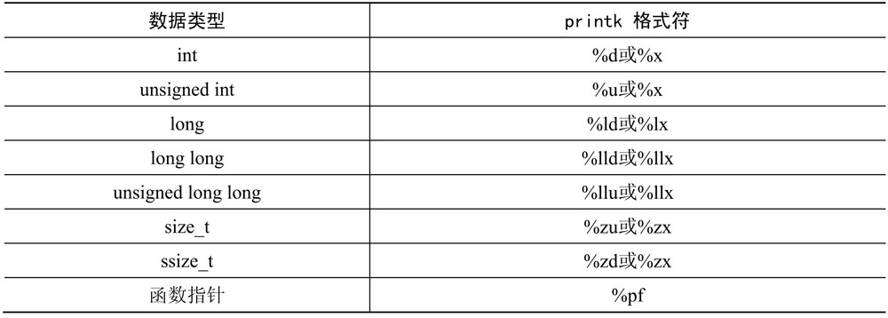

# printk

很多内核开发者最喜欢的调试工具是printk。printk是内核提供的格式化打印函数，它和C库所提供的printf()函数类似。printk()函数和printf()函数的一个重要区别是前者提供打印等级，内核根据这个等级来判断是否在终端或者串口中打印输出。从多年的工程实践经验来看，printk是最简单有效的调试方法。

```cpp
//[include/linux/kern_levels.h]

#define KERN_EMERG KERN_SOH "0"    /* system is unusable */
#define KERN_ALERT  KERN_SOH "1"    /* action must be taken immediately */
#define KERN_CRIT   KERN_SOH "2"    /* critical conditions */
#define KERN_ERR   KERN_SOH "3"    /* error conditions */
#define KERN_WARNING   KERN_SOH "4"      /* warning conditions */
#define KERN_NOTICE KERN_SOH "5"    /* normal but significant condition */
#define KERN_INFo   KERN_SOH "6"    /* informational */
#define KERN_DEBUG  KERN_SOH "7"    /* debug-level messages */
```

Linux内核为printk定义了8个打印等级，`KERN_EMERG`等级最高，`KERN_DEBUG`等级最低。在内核配置时，有一个宏来设定系统默认的打印等级`\2ONFIG_MESSAGE_LOGLEVEL_DEFAULT`，通常该值设置为4，那么只有打印等级高于4时才会打印到终端或者串口，即只有`KERN_EMERG～KERN_ERR`。通常在产品开发阶段，会把系统默认等级设置到最低，以便在开发测试阶段可以暴露更多的问题和调试信息，在产品发布时再把打印等级设置为0或者4。

```cpp
//[arch/arm/configs/vexpress_defconfig]

CONFIG_MESSAGE_LOGLEVEL_DEFAULT=8 //默认打印等级设置为0，即打开所有的打印信息
```

此外，还可以通过在启动内核时传递commandline给内核的方法来修改系统默认的打印等级，例如传递“`loglevel=8`”给内核启动参数。

```
# qemu-system-arm -M vexpress-a9  -m 1024M -kernel arch/arm/boot/zImage \
-append "rdinit=/linuxrc console=ttyAMA0 loglevel=8" -dtb \
arch/arm/boot/dts/vexpress-v2p-ca9.dtb -nographic
```

在系统运行时，也可以修改系统的打印等级。

```
# cat /proc/sys/kernel/printk     //printk默认4个等级
7     4    1     7

# echo 8 > /proc/sys/kernel/printk  //打开所有的内核打印
```

上述内容分别表示控制台打印等级、默认消息打印等级、最低打印等级和默认控制台打印等级。

在实际调试中，把**函数名字**（`__func__`）和**代码行号**（`__LINE__`）打印出来也是一个很好的小技巧。

```cpp
printk(KERN_EMERG "figo: %s, %d", __func__, __LINE__);
```

读者需要注意printk打印的格式，否则在编译时会出现很多的WARNNING，如表6.1所示。

表6.1 printk打印格式



内核还提供了一些在实际工程中会用到的有趣的打印。

- 打印**内存buffer**的数据函数`print_hex_dump()`。
- 打印**堆栈函数**`dump_stack()`。

# 动态打印

动态打印（Dynamic Printk Debugging）是内核子系统开发者最喜欢的打印手段之一。在系统运行时，动态打印可以由系统维护者动态打开哪些内核子系统的打印，可以有选择性地打开某些模块的打印，而printk是全局的，只能设置打印等级。要使用动态打印，必须在内核配置时打开CONFIG_DYNAMIC_DEBUG宏。内核代码里使用了大量pr_debug()/dev_dbg()函数来打印信息，这些就使用了动态打印技术，另外还需要系统挂载debugfs文件系统。
动态打印在debugfs文件系统中有一个control文件节点，文件节点记录了系统中所有使用动态打印技术的文件名路径、打印所在的行号、模块名字和要打印的语句。

      # cat /sys/kernel/debug/dynamic_debug/control

      […]
      mm/cma.c:372 [cma]cma_alloc =_ "%s(cma %p, count %d, align %d)\012"
      mm/cma.c:413 [cma]cma_alloc =_ "%s(): memory range at %p is busy, retrying\012"
      mm/cma.c:418 [cma]cma_alloc =_ "%s(): returned %p\012"
      mm/cma.c:439 [cma]cma_release =_ "%s(page %p)\012"
      […]
例如上面的cma模块，代码路径是mm/cma.c文件，打印语句所在行号是372，所在函数是cma_alloc()，要打印的语句是“%s(cma %p, count %d, align %d)\012”。在使用动态打印技术之前，可以先通过查询control文件获知系统有哪些动态打印语句，例如”cat control| grep xxx”。
下面举例来说明如何使用动态打印技术。

      // 打开svcsock.c文件中所有动态打印语句
      # echo 'file svcsock.c +p' > /sys/kernel/dynamic_debug/control

      // 打开usbcore模块所有动态打印语句
      # echo  'module usbcore +p' >  /sys/kernel/dynamic_debug/control

      // 打开svc_process()函数中所有的动态打印语句
      # echo 'func svc_process +p' >  /sys/kernel/dynamic_debug/control

      // 关闭svc_process()函数中所有的动态打印语句
      # echo 'func svc_process -p' > /sys/kernel/dynamic_debug/control

      // 打开文件路径中包含usb的文件里所有的动态打印语句

      # echo -n '*usb* +p' > /sys/kernel/dynamic_debug/control

      // 打开系统所有的动态打印语句
      # echo -n '+p' >  /sys/kernel/dynamic_debug/control
上面是打开动态打印语句的例子，除了能打印pr_debug()/dev_dbg()函数中定义的输出外，还能打印一些额外信息，例如函数名、行号、模块名字和线程ID等。
❑ p：打开动态打印语句。
❑ f：打印函数名。
❑ l：打印行号。
❑ m：打印模块名字。
❑ t：打印线程ID。
在调试一些系统启动方面的代码，例如SMP初始化、USB核心初始化等，这些代码在系统进入shell终端时已经初始化完成，因此无法及时打开动态打印语句。这时可以在内核启动时传递参数给内核，在系统初始化时动态打开它们，这是一个实际工程中非常好用的技巧。例如调试SMP初始化的代码，查询到ARM SMP模块有一些动态打印语句。

      / # cat /sys/kernel/debug/dynamic_debug/control | grep smp
      arch/arm/kernel/smp.c:354 [smp]secondary_start_kernel =pflt "CPU%u: Booted
      secondary processor\012"
在内核commandline中添加“smp.dyndbg=+plft”字符串。

      #qemu-system-arm -M vexpress-a9  -m 1024M -kernel arch/arm/boot/zImage
      -append "rdinit=/linuxrc console=ttyAMA0 loglevel=8 smp.dyndbg=+plft" -dtb
      arch/arm/boot/dts/vexpress-v2p-ca9.dtb -nographic -smp 4

      […]
      / # dmesg | grep "Booted"  //查询SMP模块的动态打印语句是否打开？
      [0] secondary_start_kernel:354: CPU1: Booted secondary processor
      [0] secondary_start_kernel:354: CPU2: Booted secondary processor
      [0] secondary_start_kernel:354: CPU3: Booted secondary processor
      / #
还可以在各个子系统的Makefile中添加ccflags来打开动态打印。

# RAM Console

# OOPS分析

# BUG_ON()和WARN_ON()