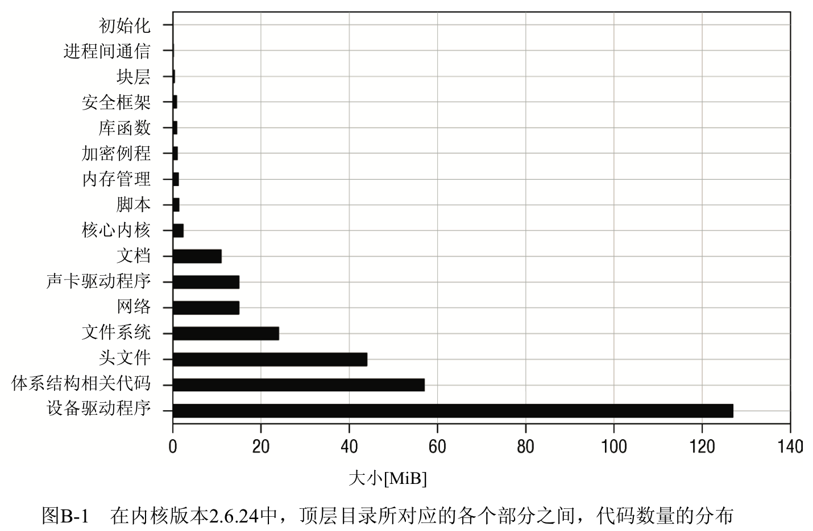

内核源代码的主目录包含了若干子目录，对源代码的内容进行了粗略的分类。关键的内核组件位于下列目录中。

- kernel目录包含了内核的**核心组件的代码**。其中只包含大约120个文件，总共大约80 000行代 17 码。对Linux这种规模的项目来说，这个数字小到令人惊讶。开发者强调，有一点非常重要: 除非绝对必要，否则不要向该目录添加内容;凡修改该目录中文件的补丁，都会被极端谨慎 地处理，而且在最后接受之前，通常会进行长期的讨论。
- 高层的**内存管理**代码位于**mm**/目录。内存管理子系统由大约45 000行代码组成，几乎与内核本身的规模相同。
- 用于**初始化内核的代码**位于**init**/目录。附录D将讨论相关内容。
- **System V IPC机制**的实现位于**ipc**/目录，已经在第5章讨论过。
- sound/包含了**声卡的驱动程序**。因为有许多**针对各种不同总线的设备**，该目录包含了一些总线相关的子目录，其中包含了对应的驱动程序的源代码。尽管声卡驱动程序有自身的目录， 但它们与其他设备驱动程序没什么不同。
- **fs**/保存了所有文件系统实现的源代码，在内核源代码中大约占25 MiB的空间。
- **net**/包含了网络实现的代码，其中分为两部分，一个核心部分，另一部分用于实现各种协议。网络子系统大约有15 MiB，它是最大的内核组件之一。
- lib/包含了通用库例程，可用于内核的所有部分，包括用于实现各种树的数据结构和数据压缩的例程。
- `drivers/`在源代码中所占的空间最大，大约130 MiB。但其中只有少量成员会出现在编译后的内核中，因为尽管Linux现在支持大量的驱动程序，但对每个具体的系统而言，仅需要少量驱 动程序。该目录根据不同的策略进一步进行细分。其中包括总线相关的子目录(如 `drivers/pci/`)，其中包括特定总线类型的扩展卡的所有驱动程序，总线自身的驱动程序也在 相应目录中。还有一些特定于类别的子目录，如`media/`和`isdn/`。其中包含了同一类的扩展卡的驱动程序，但这些可能是使用不同总线的。
- include/包含了所有具备公开导出函数的头文件。如果函数仅由一个子系统私下使用，或仅用于一个文件，内核就将在使用该函数的C源代码文件的同一目录下插入一个头文件。这里会区分两种类型的包含文件:特定于处理器的信息在子目录`include/arch-arch/`中给出，而通 用的体系结构无关定义则在include/linux/中提供。在配置内核时，会创建一个符号链接(include/asm)指向适当的体系结构目录。在编译内核源代码时，会适当地设置C编译器的头 文件搜索路径，使得可以通过`#include<file.h>`将`include/linux`目录下的文件包含进来， 而这种做法通常只适用于/usr/include/下的标准包含文件。
- `crypto/`包含了加密层的文件(在本书没有讨论)。其中包含了各种密码算法的实现，主要用于支持IPSec(加密的IP连接)。
- `security/`目录下的文件主要用于安全框架和密钥管理。对内核版本2.6.24来说，其中仅包含 SELinux安全框架，但对内核版本2.6.25来说，其中还将包含SMACK框架(在本书撰写时内核 版本2.6.25仍然处于开发中。
- `Documentation/`包含了大量文本文件，给出了内核各方面相关的文档，但其中一些文档非常旧(对内核开发者来说，为软件写文档可不是他们乐于干的)。
- `arch/`保存了所有体系结构相关的文件，既包括包含文件，也包括C语言和汇编语言源文件。 对内核支持的每种处理器体系结构，都有一个独立的子目录。各个特定于体系结构的目录只是稍有不同，其结构类似于内核的顶层目录，其下包含了诸如`arch/mm/`、`arch/kernel`等子目录。
- `scripts/`包含了编译内核或进行其他任务所需的所有的脚本和实用程序。 

内核各部分之间源代码大小的分布，如图B-1所示。

注: SELinux扩展了内核的经典的自主访问控制(DAC，discretionary access control)权限模型，加入了基于角色的 访问控制方案、强制访问控制(MAC，mandatory access control)和多级安全性(MLS，multilevel security)。 这里不讨论这些专门的主题，因为其实现比较冗长、底层的概念也比较复杂，相关的选项只在少量Linux发行版上 可用。