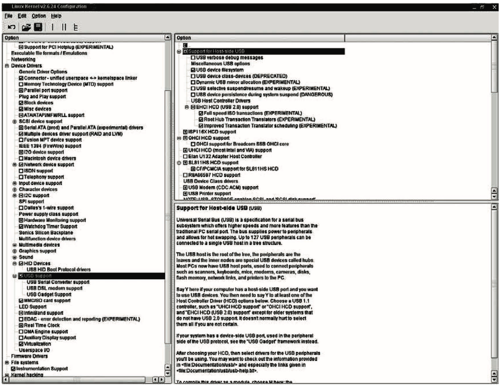
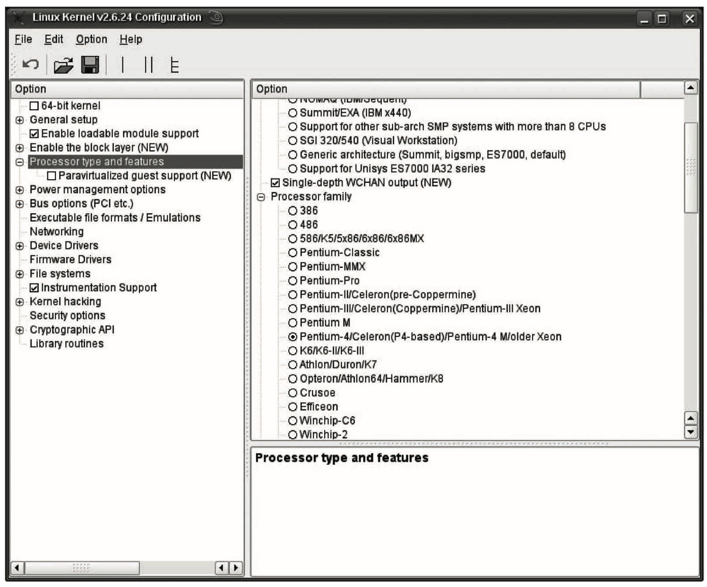

内核在编译之前必须进行配置。

根据一系列选项，用户可以决定将**哪些函数**包含在**内核**中、**哪些函数**编译为**模块**、哪些函数**排除掉**。

为此，开发者必须提供一个**表明哪些特性可用**的系统。

所以，内核采用了一种称之为**Kconfig的配置语言**，将在本节后面部分讨论。

该配置语言必须解决下列问题。

- 各组件可以**持久编译到内核**中、可以**编译为组件**或直接**忽略掉**(在某些环境下，可能无法将某些组件编译为模块)。
- 在配置选项之间，可能存在**相互依赖关系**。换言之，某些选项只能与一个或多个其他选项连同使用。
- 必须能够给出一个**可用选项列表**，供用户从中选择。有些情形，需要提示用户输入编号(或类似的值)。
- 必须能够**层次化**地编排各种配置选项(在一个**树型结构**中)。
- 配置选项可能依体系结构而不同。
- 配置语言不应该过于复杂，因为编写配置脚本并非大多数内核程序员喜欢做的事情。 

**配置信息**应该**散布在整个源代码树**中，使得没必要维护一个巨型的中枢配置文件，这种巨型配置文件将难于打补丁。在代码包含了可配置选项的**每个子目录**中，都必须有一个配置文件。

# 配置文件示例

配置文件的语法并不特别复杂，如以下取自USB子系统的例子所示(稍作修改):

```config
drivers/usb/Kconfig
#
# USB device configuration
#

menuconfig "USB support"
        bool "USB support"
        depends on HAS_IOMEM
        default y
        ---help---
         This option adds core support for Universal Serial Bus (USB).
         You will also need drivers from the following menu to make use of it.
if USB_SUPPORT

config USB_ARCH_HAS_HCD
        boolean
        default y if USB_ARCH_HAS_OHCI
        ...
        default PCI

config USB_ARCH_HAS_OHCI
        boolean
        # ARM:
        default y if SA1111
        default y if ARCH_OMAP
        # PPC:
        default y if STB03xxx
        default y if PPC_MPC52xx
        # MIPS:
        default y if SOC_AU1X00
        # more:
        default PCI

config USB
        tristate "Support for USB"
        depends on USB_ARCH_HAS_HCD
        ---help---
          Universal Serial Bus (USB) is a specification for a serial bus
          subsystem which offers higher speeds and more features than the
          traditional PC serial port. The bus supplies power to peripherals
          ...

source "drivers/usb/core/Kconfig"
source "drivers/usb/host/Kconfig"
...
source "drivers/usb/net/Kconfig"

comment "USB port drivers"
        depends on USB

config USB_USS720
        tristate "USS720 parport driver"
        depends on USB && PARPORT
        ---help---
          This driver is for USB parallel port adapters that use the Lucent
          Technologies USS-720 chip. These cables are plugged into your USB
          port and provide USB compatibility to peripherals designed with
          parallel port interfaces.
          ...

source "drivers/usb/gadget/Kconfig"

endif # USB_SUPPORT
```

图B\-2说明了如何在屏幕上显示定义的树型结构，使得用户可以选择想要的选项。

图B-2 USB子系统配置结构的屏幕显示:



menuconfig产生一个菜单项，其标题是一个字符串，在这里是USB support。在用户用make menuconfig或图形化的make xconfig或make gconfig配置内核时，该菜单项会作为一个新子树的根 出现。所做的选择保存在一个变量中，这里是USB_SUPPORT，有两个可能的值，因为这是一个布尔型变量，由bool标明。如果取消对USB_SUPPORT的选择，那么配置树中不会出现与USB相关的其他配置 信息，这可以由if字句保证。

通过source，可以将更多的配置文件关联进来(按照惯例，它们都名为Kconfig)。这些配置文件的文本内容，将直接包含到嵌入的配置文件中进行解释。

comment在配置选项列表中创建一个注释。注释的文本会显示，但用户不能进行选择。

实际的配置选项通过config指定。对每个选项来说，只有一个config类型的数据项。config之后的字符串称之为配置符号(configuration symbol)，可接受用户选择。每个选项都需要一个类型，来定义用户可以进行什么样类型的选择。在本例中，选择的类型是三态的，即可以选择下面的一个: “compiled in”、“modular”或“do not compile”。根据所做的选择，配置符号会分布赋值y、m、n。除了三态之外，内核还提供了其他的选择类型，将在本节稍后讨论。

配置选项的依赖关系通过depends on指定。其他的配置符号传递到该语句作为参数，它们可用使用C语言中的逻辑运算符连接起来(&&、||、!，分别是与、或、非)。除非所指定的前提条件满足， 否则菜单项是不显示的。

`--help--`表示其后的文字是帮助文本，如果用户不确认配置项的语义，就可以显示帮助文本。

缩进的改变表示帮助文本结束，内核就知道又需要处理通常的配置语句了。 例子中给出了两个配置选项。第一个定义了USB配置符号，所有其他配置项都依赖该选项。但除非存在一个USB宿主机控制器，否则该选项是不显示的。显示与否，取决于USB_ARCH_HAS_HCD配置 选项为true还是false。为该选项指定true值有不同的方式，例子中给出了以下两种方式:

- 直接支持某种宿主机控制器芯片组(例子中的OHCI);
- 支持PCI总线(即配置符号PCI为true)。 

如果设置了USB_ARCH_HAS_OHCI，那么OHCI芯片组支持是可用的。在支持PCI总线时，总是这样。但有些系统可能在没有PCI支持的情况下使用该芯片组。这些系统将显式列出并包括进来，例如基于 ARM的机器和一些基于PPC的型号。

第二个配置选项(USS720)依赖两件事情。系统不仅要支持USB，还需要支持并行端口。否则， 驱动选项根本不会显示。

如例子所示，在注释之间以及配置选项之间，可能存在依赖关系。除非选中了USB支持，否则USB Port drivers项不会显示。

配置树的生成从`arch/arch/Kconfig`开始，它首先由配置文件读取。所有其他Kconfig文件都通 过source递归地包含进来。

# Kconfig的语言要素

前一个例子并没有完全使用Kconfig语言的所有选项。本节根据内核源代码中的文档，对其所有语言特性给出一个系统化的概述.

注: 该文档在`Documentation/kbuild/kconfig-language.txt`中.

## 菜单

菜单使用以下命令指定:

```
menu "string" 
    <attributes> 

<configuration options> 

endmenu
```

其中string是菜单的名称。menu和endmenu之间所有项都解释为该菜单的菜单项，自动地从菜单继承了依赖关系(将添加到菜单项现存的依赖关系中)。

关键字menuconfig用于定义一个配置符号和一个子菜单。那么下述写法可以进行调整:

```
menu "Bit bucket compression support" 

    config BIT_BUCKET_ZLIB 
        tristate "Bit bucket compression support
```

可以调整为下述更简短的格式:

```
menuconfig BIT_BUCKET_ZLIB
        tristate "Bit bucket compression support"
```

另一个关键字mainmenu，只能出现在配置层次结构的顶部(且只能出现一次)，用于为整个层次 结构指定一个标题。因而该项只用于arch/arch/Kconfig中，因为这些文件表示配置层次结构的起始 点。例如，用于Sparc64处理器的版本包含以下项:

```
mainmenu "Linux/UltraSPARC Kernel Configuration"
```

## 配置选项

配置选项由关键字config开头，必须后接一个配置符号。

```
config <symbol> 
    <type-name> "Description" 
    <attributes>
```

类型名(`<type-name>`)表示选项的类型。如前所述，tristate类型的值为以下一种状态:y、 n或m。其他的选项类型如下所示:

- bool用于返回y或者n的布尔查询，即是否选中该项。  string查询一个字符串。
- hex和integer分别读取十六进制和十进制数。 

还可以使用下列语法:

```
config <symbol> 
    <type-name> 
    prompt "Description
```

从功能上讲，它与前者是等价的，但较为简短。

如果要求用户从一组选项中选择一个，则必须使用choice，其语法如下：

```
choice 
    <attributes> 

config <symbol_1> 
    <type-name> 
    <attributes> 

... 

config <symbol_n> 
    <type-name> 
    <attributes> 

endchoice
```

每个配置选项都有自身的配置符号，如果选中对应的选项，则其值是y，否则为n。choice通常 表示为配置前端界面上的一组单选按钮，如图B\-3所示。

图B\-3 用choice在IA\-32平台上选择CPU



图B-3中CPU选择部分的源代码如下所示(为提高可读性，已经省去了帮助文本):

```
choice
        prompt "Processor family"
        default M686 if X86_32

config M386
        bool "386"
        depends on X86_32 && !UML
        ---help---
        这里用于为用户的CPU选择处理器类型。该信息用于优化。为编译在所有x86 CPU类型上都能运行的
        内核（可能不是最快），可以在这里指定"386"类型。
        ...

config M486
        bool "486"

config M586
        bool "586/K5/5x86/6x86/6x86MX"

config M586TSC
        bool "Pentium-Classic"

config M586MMX
        bool "Pentium-MMX"

config M686
        bool "Pentium-Pro"

config MPENTIUMII
        bool "Pentium-II/Celeron(pre-Coppermine)"

...

config MGEODE_LX
        bool "Geode GX/LX"

config MCYRIXIII
        bool "CyrixIII/VIA-C3"

config MVIAC3_2
        bool "VIA C3-2 (Nehemiah)"

...
endchoice
```

## 属性

属性用于更准确地指定配置选项的效果。内核源代码的下列片段使用了属性:

```
config SWAP 
        bool "Support for paging of anonymous memory (swap)" 
        depends on MMU & BLOCK 
        default y
```

depends on指定，仅当为带有MMU的系统编译内核时，而且在块层编译到内核值时，才能选中SWAP。default表示默认情况下选择y，如果用户不修改设置，该值将自动地指派给SWAP符号。

在我们讲解如何指定依赖关系（在下一小节讲述）之前，先来了解下列属性。
 
- default指定了配置项的默认设置。对于bool查询，可能的默认值是y或n。对于tristate类型来说，m是第三种可能性。对于其他类型的选项，必须指定默认值。string需要指定字符串，而integer和hex需要指定数值。
- range限制了数值选项的可能范围。第一个参数指定下限，第二个参数指定上限。
- 在使用select语句选中配置项的情况下，select用于自动地选择其他的配置选项。这种逆向依赖机制只能用于tristate和bool类型的选项。
- help和--help--用于加入帮助文本，如前文所示。

所有这些属性都可能后接if子句，其中指定了应用该属性的条件。类似depends on，这里也会将该属性依赖的符号通过逻辑运算符连接起来进行判断，如下例（虚构的）所示：

```
config ENABLE_ACCEL
  bool "Enable device acceleration"
  default n

...

config HYPERCARD_SPEEDUP
  integer "HyperCard Speedup"
  default 20 if ENABLE_ACCEL
  range 1 20 
```

## 依赖关系

前文解释过，配置项的依赖关系可以通过逻辑子句指定，其语法类似于C语言。依赖关系的规范结构如下所示：

```
depends [on] <expr>
<expr> ::= <Symbol>
           <Symbol> '=' <Symbol>
           <Symbol> ''=' <Symbol>
        '  (' <expr> ')'
        '! ' <expr>
        <expr> '&&' <expr>
        <expr> '||' <expr>
```

可能的表达式按其解释次序依次列出。换言之，排在前面的表达式，其优先级高于排在后面的。

操作的语义与C语言语法中对应的操作相同：y = 2，n = 0，而m = 1。除非依赖关系计算的结果非0，否则菜单项是不可见的。

一种特定的依赖关系通过"EXPERIMENTAL"指定。仍然处于试验阶段的驱动程序必须用该依赖关 系标记(如果该驱动程序自身还有其他依赖关系，则需要用&&逻辑操作连接)。因为内核在 init/Kconfig中提供了一个配置选项，允许用户将该符号设置为y或n(提示用户处于开发阶段和/或 不完整的代码/驱动程序)，对渴求稳定性的用户来说，很容易从配置选项中删除此类驱动程序。字符串"(Experimental)"应该出现在末尾，表明该驱动程序的代码实际上是试验性的。

# 处理配置信息

按下列步骤处理配置信息。

(1) 内核首先由用户配置。这预先假定已经准备好所有可能选项的一个列表，并以文本或图形方 式呈现出来(可用的配置已经根据所选的体系结构进行了限制，这一点无须用户干涉)。

(2) 接下来将用户的选择保存到一个独立的文件中，一直保持到下一次(重新)配置之前，并保 证所用的工具能够访问该文件。

(3)所选的配置符号必须存在，对于由一系列Makefile实现的联编系统和内核源代码中的预处理器 语句来说，都要求如此。

在发起内核配置时，有各种make目标(make destconfig)。各自都有不同的用途。

- menuconfig提供了一个控制台驱动的前端，而xconfig和gconfig则提供了基于各种X11工具包(Qt或GTK)的图形用户界面。
- oldconfig分析已经保存在.config中的配置选项，对可能在内核更新之后添加、但尚未进行选择的选项作出提示。
- defconfig应用由体系结构维护者定义的默认配置(相关信息保存在arch/arch/defconfigk中)。
- allyesconfig创建一个新的配置文件，其中所有选择都设置为y(在支持y值的选项处)。allmodconfig也将所有选项都设置为y，但在可能的情况下会使用m。allnoconfig产生一个最低限度的配置，其中删除了编译关键内核组件不需要的其他选项。 

这三种目标在建立新的内核发布版时，用于进行测试。通常，最终用户在使用它们时都存在问题。 所有配置选项都必须分析各个Kconfig文件中的配置信息，还必须保存结果配置。内核源代码为此提供了libkconfig库。它提供了例程来执行适当的任务。本附录不讨论解析器的实现，其中采用 了Bison和Flex这两个解析器和词法分析器的生成工具。相关的源代码可参见scripts/kconfig/zconf.y和zconf.l。

用户定义的配置选项保存在`.config`中，如下所示:

```config
wolfgang@meitner> cat .config
#
# Automatically generated make config: don't edit # Linux kernel version: 2.6.24
# Thu Mar 20 00:09:15 2008
#
CONFIG_64BIT=y
# CONFIG_X86_32 is not set
CONFIG_X86_64=y
CONFIG_X86=y
CONFIG_GENERIC_TIME=y
...
#
# General setup
#
CONFIG_EXPERIMENTAL=y
CONFIG_LOCK_KERNEL=y
CONFIG_INIT_ENV_ARG_LIMIT=32 CONFIG_LOCALVERSION="-default" CONFIG_LOCALVERSION_AUTO is not set
...
CONFIG_PLIST=y
CONFIG_HAS_IOMEM=y
CONFIG_HAS_IOPORT=y
CONFIG_HAS_DMA=y
CONFIG_CHECK_SIGNATURE=y
```

所有配置符号的前缀都是CONFIG_字符串。如果设置了相关配置项，则在其后附加= y或= n。未设置的选项使用\#号注释掉。

为使内核源代码能够看到所选的配置，必须包含`<config.h>`文件。该文件又将`<autoconf.h>`包含到源代码中。后者包含了预处理器可以提取的配置信息，如下所示:

```
<autoconf.h>
/*
* Automatically generated C config: don't edit
* Linux kernel version: 2.6.24
* Thu Mar 20 00:09:26 2008
*/
#define AUTOCONF_INCLUDED
#define CONFIG_USB_SISUSBVGA_MODULE 1
#define CONFIG_USB_PHIDGETMOTORCONTROL_MODULE 1
#define CONFIG_VIDEO_V4L1_COMPAT 1
#define CONFIG_PCMCIA_FMVJ18X_MODULE 1
...
#define CONFIG_USB_SERIAL_SIERRAWIRELESS_MODULE 1
#define CONFIG_VIDEO_SAA711X_MODULE 1
#define CONFIG_SATA_INIC162X_MODULE 1
#define CONFIG_AIC79XX_RESET_DELAY_MS 15000
#define CONFIG_NET_ACT_GACT_MODULE 1
...
#define CONFIG_USB_BELKIN 1
#define CONFIG_NF_CT_NETLINK_MODULE 1
#define CONFIG_NCPFS_PACKET_SIGNING 1
#define CONFIG_SND_USB_AUDIO_MODULE 1
#define CONFIG_I2C_I810_MODULE 1
#define CONFIG_I2C_I801_MODULE 1
```

配置符号的前缀仍然是`CONFIG_`。每个选中的选项都定义为1。模块选项同样定义为1，但预处理 器符号末尾附加了`_MODULE`字符串。未选择的配置项用undef明确地标记为未定义。数值和字符串都替换为用户选择的值。

这使得可以向源代码中插入对配置信息的查询。例如:

```
#ifdef CONFIG_SYMBOL
/* 设置SYMBOL情况下的代码 */ 
#else
/* 未设置SYMBOL情况下的代码 */ 
#endif
```