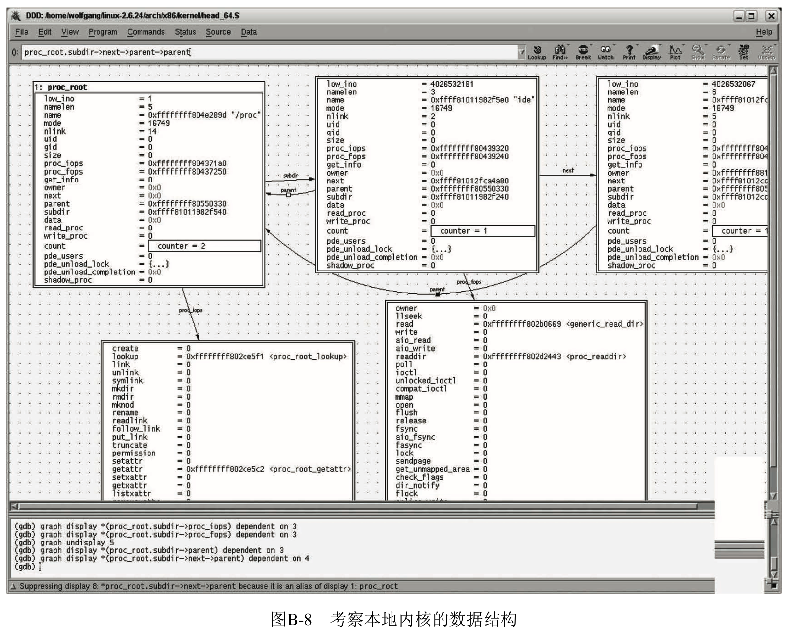

不仅要阅读**静态的源代码**，还需要在**内核运行时**密切观察，以跟踪其内部的动态过程。

对**普通的C语言程序**，程序员很清楚如何做到这一点。使用**编译器生成的调试信息**和**一个外部调试器**，就可以**逐行单步跟踪程序的执行**(或者，如果需要，可以**逐行汇编跟踪**)，来查看和修改数据结构，并在任一点暂停程序的控制流。

这只能借助于内核通过ptrace系统调用(在第13章讲过)提供的一些特别的特性来完成。

与**普通的C程序不同**，内核本身**没有**由**外部实例**提供的**运行环境**，内核本身负责**提供用户空间程序所需的这个运行环境**。因而，不可能用经典方式来调试内核本身。

# GDB和DDD

GDB代表`GNU debugger`，它是**默认的Linux调试器**。**每个Linux发行版**都带有**直接可用的GDB二进制文件**，可以用适当的软件包管理系统。当然，读者完全可以自行从www.gnu.org网站(或其他镜像) 取得源代码进行编译，但本附录就不讨论这些了。

该调试器提供了非常广泛的选项，本附录只简要概述其用法。GDB的详细讲述，可以参见其附带的用法指南(makeinfo格式)，也可以用info gdb查看。

为**调试一个程序**(在这方面，**内核也不例外**)，**编译器**必须将**特别的调试信息**集成到**二进制文件**中，以便调试器获取二进制文件和源代码之间关系的所有必要信息。

在**gcc编译**时必须选中`-g`选项， 如下所示:

```
gcc -g test.c -o test
```

因为包含了**调试符号**，导致生成的可执行文件长度增长颇多。

在**内核编译**期间也必须启用`-g`。在**早期版本**中，该选项必须以`CFLAGS_KERNEL`的名目进入到主 Makefile。但在内核版本2.5开发期间，**内核配置**进入了一个**独立的选项**，`Kernel hacking->Compile
the kernel with debug info`，用于设置该选项。同一菜单中，还包括了`Compile the kernel with frame pointers`选项，也应该被选中，因为它用于**限制活动记录或栈帧**(参见附录C)，能够向调试器提供有用信息。

GDB能够完成下列工作。

- **逐行**跟踪程序执行，可以按**源代码逐行**执行或按**汇编语句逐行**执行。
- 确定程序中使用的**所有符号类型**。
- 显示或操作**符号的当前值**。
- **反引用**程序中的**指针**或访问随机的**存储单元**，以**读取**或**修改**其值。
- 设置**断点**，使得程序在执行到源代码中给定位置时暂停，同时启用调试器。
- 设置**条件断点**，在给定条件满足时暂停程序执行。例如，当某个变量的值设置为预定义值时。 

具体可用的内核调试选项，取决于所使用的方法。 用于执行这些操作的命令语法都易学易记，因为都是基于C语言的。这在GDB文档中解释得很好。

类似于大多数UNIX工具，GDB也是**基于文本**的。这有优点也有缺点，特别是，在文本界面下，**无法**通过**图形指针可视化显示**数据结构之间的关系。同样，GDB的源代码视图也不怎么理想，因为它只能显示很短一段源代码。

DDD是**Data Display Debugger**的简称，开发该调试器是为了改进GDB的这些不足，现在所有流行的发行版都包含了DDD。作为**X11**下的一个**图形化工具**，它弥补了GDB的不足。DDD是GDB的一个用户界面， 因而也支持GDB的所有特性。因为在DDD中也可用直接输入所有的GDB命令，所有选项都是可用的，不仅仅是那些直接集成到图形用户界面中的特性。

DDD软件包带有很好的使用指南，特别地，其用户界面非常直观，因此本附录不解释如何使用 它。

# 本地内核

**proc文件系统**包含了一个文件，名为**kcore**。其中包含了**内核当前状态的映像**，格式为**ELF内存转储格式**(参见附录E)。因为GDB内存转储文件是可以**读取和处理**的，因而可以**与内核及其调试符号联用**，来可视化显示数据结构并读取其**内部状态**。GDB内存转储文件通常用于用户空间程序的事后分 析，以查明其崩溃原因。

必须用内核映像(包含调试符号)的名称和kcore文件的名称作为参数来调用DDD:

```
ddd /home/wolfgang/linux-2.6.24/vmlinux /proc/kcore
```

很显然，尽管不能对运行内核设置断点或类似项，DDD很适于考察系统的数据结构，如图B-8 所示。



首先从内核中定义为**全局变量**的**数据结构实例**开始。输入`graph display proc_root`，即告知DDD显示`fs/proc_root.c`中声明的`proc_dir_entry类型`的实例`proc_root`。通过双击，可以打开与该数据结构关联的其他实例。

>如果指针没有类型信息(对于标准双链表，经常是这样)，可以在GDB的输入栏指定C语言风格的类型转换。

如果要使DDD检测**指向同一内存区**的**指针**，并将箭头重定向到该结构的一个现存表示，而不是重 新插入一个新的图示，则需要启用`Data->Detect Aliases`选项。在前一个例子中就是这样，parent 指针都(正确地)指向了同一个数据元素。请注意，在DDD以这种模式运作时，速度会慢很多。

内存转储文件在由调试器处理时，内核通常不会修改转储文件，因而GDB不会注意到内核内存某些 值的改变，改变必须通过kcore文件才能传播。如果内存的内容与用户的修改相关，该用户必须用core /proc/kcore显式重新加载内存转储文件。DDD会自动将修改的值以黄色背景显示，使之易于识别。

# KGDB

两台通过网络或串行电缆连接的机器，提供了一个更好的调试环境，此时可用的选项几乎与调试普通应用程序相同。KGDB补丁在内核中安装一段简短的存根代码，向在第二台系统上运行的调试器提供了一个接口。因为GDB支持**远程调试**，内核可以利用这种调试形式，来提供断点、单步跟踪等特性。

KGDB没有包含在内核版本2.6.24中，但经过多年努力，在读者阅读本书时，它应该已经包含在内核版本2.6.26中了。如果需要对旧版本的内核提供KGDB支持，还有相关的补丁可用。

在获得一个具备KGDB支持的内核后，配置中包含了新的菜单项`Kernel hacking->KGDB : kernel debugging with remote gdb`，该选项必须启用。如果使用串行接口进行数据传输，必须对 特定硬件进行正确设置。当然，内核二进制映像还应该包含调试符号。 14

因为在撰写本书时，KGDB仍然处于比较激烈的演化过程中，对于如何将gdb连接到一个运行中 的内核，读者可以参考Documentation/DocBook/kgdb.html(可以用make htmldocs生成)。