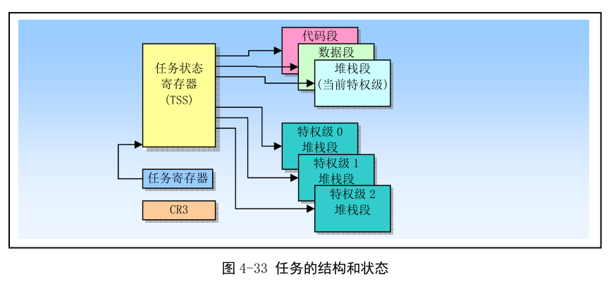
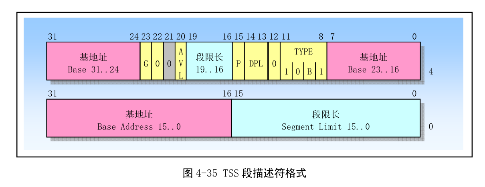

- 4.7 任务管理
    - 4.7.1 任务的结构和状态
    - 4.7.2 任务的执行
    - 4.7.3 任务管理数据结构
    - 4.7.4 任务切换
    - 4.7.5 任务链
    - 4.7.6 任务地址空间
    
任务（Task）时处理器可以分配、调度、执行和挂起的一个工作单元。它可用于执行程序、任务或进程、操作系统服务、中断或异常处理过程和内核代码。

80x86提供了一种机制，可以用来保存任务的状态、分派任务执行以及从一个任务切换到另一个任务。当工作在保护模式下，处理器所有运行都在任务中。即使简单系统也必须至少定义一个任务。更复杂系统可以使用处理器的任务管理来支持多任务应用。

80x86提供了多任务的硬件支持。通过中断、异常、跳转或调用，可以执行一个任务。当这些控制转移形式之一和某个描述符表中指定项的内容一起使用时，这个描述符就是一类导致新任务开始执行的描述符。描述符表中与任务相关的描述符有两类：任务状态段描述符和任务门。当执行权传给这任何一类描述符时，都会造成任务切换。

任务切换不会把任何信息压入堆栈中，处理器的状态信息都被保存在内存中称为任务状态段（Task State Segment）的数据结构中。

## 1. 任务的结构和状态

一个任务由两部分组成：任务执行空间和TSS。任务执行空间包括代码段、堆栈段和一个或多个数据段。如图。若OS使用了处理器的特权级保护机制，那么任务执行空间就需要为每个特权级提供一个独立的堆栈空间。TSS指定了构成任务执行空间的各个段，并且为任务状态信息提供存储空间。在多任务环境中，TSS也为任务之间的链接提供处理方法。

一个任务的使用是由其TSS的段选择符来指定。当一个任务被加载进处理器中执行，那么该任务的段选择符、基地址、段限长以及TSS段描述符属性就会被加载进任务寄存器TR（Task Register）中。如果使用了分页机制，那么任务使用的页目录表基地址就会被加载进控制寄存器CR3中，当前执行任务的状态由处理器的以下内容组成：

- 所有通用寄存器和段寄存器信息。

- 标志寄存器EFLAGS、程序指针EIP、控制寄存器CR3、任务寄存器和LDTR寄存器。

- 段寄存器指定的任务当前执行空间。

- I/O映射位图基地址和I/O位图信息（在TSS中）。

- 特权级0、1和2的堆栈指针（在TSS中）。

- 链接至前一个任务的链指针（在TSS中）。

## 2. 任务的执行

软件或处理器可以用以下方法之一来调度一个任务：

- 使用CALL指令明确地调用

- 使用JMP指令命令跳转（Linux使用）

- （处理器）隐含调用一个中断句柄处理任务

- 隐含地调用一个异常句柄处理任务
 
所有方法都会使用一个指向任务门或任务TSS段的选择符来确定一个任务。当使用CALL或JMP调度时，指令中的选择符既可以直接选择任务的TSS，也可选择存放由TSS选择符的任务门。当调度一个任务来处理一个中断或异常，IDT中该中断或异常表项必须是一个任务门，并且其中含有中断或异常处理任务的TSS选择符。

当调度一个任务，会自动发生任务切换。切换期间，当前运行任务的执行环境（任务状态或上下文）会被保存到它TSS中并暂停该任务执行。新任务会被加载到处理器中，并从加载的EIP指向的指令出开始执行新任务。

调用者调用了被调用者，调用者的YSS段选择符会被保存在被调用者TSS中，从而提供一个返回调用者的链接。对于所有80x86处理器，任务是不可递归调用的。

中断或异常可以通过切换到一个任务来处理。这时，处理器不仅能执行任务切换来处理中断或异常，而且也会在中断或异常处理任务返回时自动切换回被中断的任务中。这种方式可以处理在中断任务执行时发生的中断。

任务切换的一部分，处理器也会切换到另一个LDT和CR3。

使用处理器的任务管理功能来处理多任务应用时可选的，也可用软件来实现多任务。

## 3. 任务管理数据结构

处理器定义了以下支持多任务的寄存器和数据结构：任务状态段TSS、TSS描述符、任务寄存器TR、任务门描述符和标志寄存器EFLAGS中的NT标志。使用这些数据结构，处理器可以从一个任务切换到另一个任务，同时保存原任务上下文，以允许任务重新执行。

### 3.1 任务状态段

下图给出32位CPU使用的TSS的格式。TSS中各字段可分为两大类：动态字段和静态字段。

（1） 动态字段。当任务切换而被挂起时，处理器会更新动态字段的内容。

- 通用寄存器字段。保存EAX、ECX、EDX、EBX、ESP、EBP、ESI和EDI寄存器的内容。

- 段选择符字段。用于保存ES、CS、SS、DS、FS和GS段寄存器的内容。

- 标志寄存器RFLAGS字段，切换之前保存。

- 指令指针EIP字段。切换之前保存EIP寄存器内容。

- 先前任务链接字段。含有前一个任务TSS段选择符（在调用、中断或异常激活的任务切换时更新）。该字段（通常也称为后链接字段（Back link field））允许任务使用IRET指令切换到前一个任务。

（2） 静态字段。处理器会读取静态字段的内容，但通常不改变。这些是在任务被创建时设置的。

- LDT段选择符字段。含有任务的LDT段的选择符。

- CR3控制寄存器字段。含有任务使用的页目录物理基地址。CR3通常也被称为页目录基地址寄存器（Page directory base register，PDBR）

- 特权级0、1、2的堆栈指针字段。这些堆栈指针由堆栈选择符（SS0、SS1和SS2）和栈中偏移量指针（ESP0、ESP1、ESP2）组成。注意，对于指定的一个任务，这些字段值不变。因此，如果发生任务中发生堆栈切换，寄存器SS和ESP内容将变化。

- 调试陷阱（Debug Trap）T标志字段。该字段位于字节0x64位0处。当设置时，处理器切换到该任务的操作会产生一个调试异常。

- I/O位图基地址字段。该字段含有从TSS段开始处到I/O许可位图处的16位偏移值。

若使用了分页机制，那么任务切换期间应该避免处理器操作的TSS段（前104字节）中含有内存页边界。如果TSS这部分包含内存页边界，那么该边界处两边的页面都必须同时并且连续存在于内存中。另外，如果使用了分页机制，那么与原任务TSS和新任务TSS相关的页面，以及对应的描述符表项应该是可读写的。

### 3.2 TSS描述符

与其他段一样，任务状态段TSS也是使用段描述符来定义的。下图给出TSS描述符的格式。TSS描述符只能存放在GDT中。

类型字段TYPE中的忙标志B用于指明任务是否处于忙状态。忙状态的任务是当前正在执行的任务或等待执行（被挂起）的任务。值为0b1001的类型字段表明任务处于非活动状态；而值为0b1011的类型字段表示任务正忙。任务是不可以递归执行的，因此处理器使用忙标志B来检测任何企图对被中断执行任务的调用。

其中基地址、段限长、描述符特权级DPL、颗粒度G和存在位具有与数据段描述符中相应字段同样的功能。当G=0时，限长字段必须具有等于或大于103（0x67）的值，即TSS段的最小长度不得小于104字节。若TSS段中还包含I/O许可位图，那么TSS段长度需要更大一些。

若使用跳转或调用指令，任何可以访问TSS描述符的程序都能造成任务切换。可以访问TSS描述符的程序其CPL数值必须小于等于TSS描述符的DPL。多数系统，TSS的DPL应该设置为小于3。这样，只有具有特权级的软件才能执行任务切换。多任务应用中，某些TSS可以设为3，使得在用户特权级上也能任务切换。

访问一个TSS段描述符并没有给程序读写该描述符的能力。若想读或修改一个TSS段描述符，可使用映射到内存相同位置的数据段描述符（即别名描述符）来操作。把TSS描述符加载进任何段寄存器将导致一个异常。企图使用TI标志置位的选择符（即当前LDT中的选择符）来访问TSS段也将导致异常。

### 3.3 任务寄存器

任务寄存器TR（Task Register）中存放16位的段选择符以及当前任务TSS段的整个描述符（不可见部分）。这些信息是从GDT中当前任务的TSS描述符中复制过来的。处理器使用任务寄存器TR的不可见部分来缓冲TSS段描述符内容。

指令LTR和STR用于加载和保存任务寄存器的可见部分，即TSS段的选择符。LTR指令只能被特权级0的程序执行。LTR指令通常用于系统初始化期间给TR寄存器加载初始值（例如，任务0的TSS段选择符），随后在系统运行阶段，TR内容会在任务切换时自动地被改变。

### 3.4 任务门描述符

任务门描述符（Task gate desctiptor）提供对一个任务间接、受保护的引用，格式见图。任务门描述符可以被存放在GDT、LDT或IDT表中。

任务门描述符中的TSS选择符字段指向GDT中的一个TSS段描述符。这个TSS选择符字段中的RPL域不可用。任务门描述符中的DPL用于在任务切换时控制对TSS段的访问。当程序通过任务门调用或跳转到一个任务时，程序的CPL以及指向任务门的门选择符的RPL值必须小于或等于任务门描述符中的DPL。请注意，当使用任务门时，目标TSS段描述符的DPL忽略不用。

程序可以通过任务门描述符或TSS段描述符来访问一个任务。下图时LDT、GDT和IDT表中的任务门如何都指向同一个任务。

