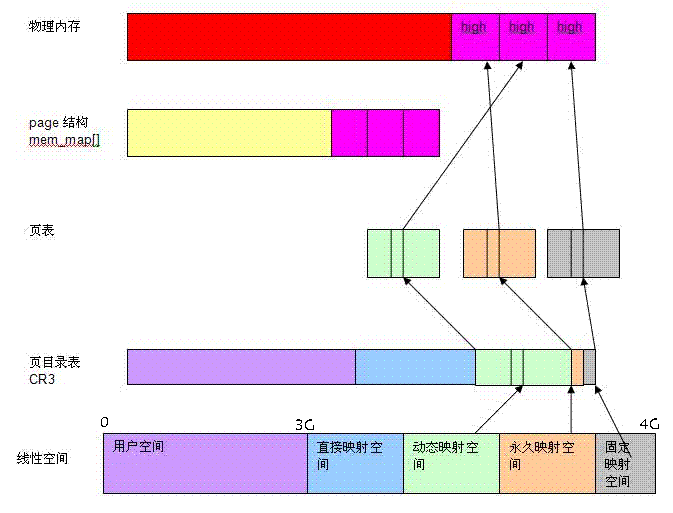

前面已经分析过了Intel的内存映射和linux的基本使用情况，已知head\_32.S仅是建立临时页表，内核还是要建立内核页表，做到全面映射的。下面就基于RAM大于896MB，而小于4GB ，并且CONFIG\_HIGHMEM配置了高端内存的环境情况进行分析。

建立内核页表前奏，了解两个很关键的变量：

- max\_pfn：**最大物理内存页面帧号**；

- max\_low\_pfn：**低端内存区（直接映射空间区的内存）的最大可用页帧号**；

#### max\_pfn 

max\_pfn 的值来自setup\_arch()中，setup\_arch()函数中有：

max\_pfn = e820\_end\_of\_ram\_pfn();

那么接下来看一下e820\_end\_of\_ram\_pfn()的实现：

```
# /arch/x86/kernel/e820.c

unsigned long __init e820_end_of_ram_pfn(void)
{
    return e820_end_pfn(MAX_ARCH_PFN, E820_RAM);
}
```

e820\_end\_of\_ram\_pfn()直接封装调用e820\_end\_pfn()，而其入参为MAX\_ARCH\_PFN和E820\_RAM，其中MAX\_ARCH\_PFN的定义（x86的32bit环境且非PAE）为：

```
#  define MAX_ARCH_PFN  (1ULL<<(32-PAGE_SHIFT))
```

最终值为0x100000(2\^20=2\^32/2^12(4K一个页面))，它表示的是**4G物理内存的最大页面帧号**；而E820\_RAM为：

```
#define E820_RAM  1
```

接下来看一下e820\_end\_pfn()函数实现：

```
# /arch/x86/kernel/e820.c

/*
 * Find the highest page frame number we have available
 */
static unsigned long __init e820_end_pfn(unsigned long limit_pfn, unsigned type)
{
    int i;
    unsigned long last_pfn = 0;
    unsigned long max_arch_pfn = MAX_ARCH_PFN;
 
    for (i = 0; i < e820.nr_map; i++) {
        struct e820entry *ei = &e820.map[i];
        unsigned long start_pfn;
        unsigned long end_pfn;
 
        if (ei->type != type)
            continue;
 
        start_pfn = ei->addr >> PAGE_SHIFT;
        end_pfn = (ei->addr + ei->size) >> PAGE_SHIFT;
 
        if (start_pfn >= limit_pfn)
            continue;
        if (end_pfn > limit_pfn) {
            last_pfn = limit_pfn;
            break;
        }
        if (end_pfn > last_pfn)
            last_pfn = end_pfn;
    }
 
    if (last_pfn > max_arch_pfn)
        last_pfn = max_arch_pfn;
 
    printk(KERN_INFO "e820: last_pfn = %#lx max_arch_pfn = %#lx\n",
             last_pfn, max_arch_pfn);
    return last_pfn;
}
```

这个函数用来**查找最大物理的页面帧号**，通过对e820图的内存块信息得到内存块的起始地址，将起始地址右移PAGE\_SHIFT(12)，算出其起始地址对应的页面帧号，如果足够大，超出了limit\_pfn则设置最大页面帧号为limit\_pfn，否则则设置为遍历中找到的最大的last\_pfn。

e820\_end\_of\_ram\_pfn()函数的调用位置：

```
start_kernel()                        #/init/main.c

└─>setup_arch()                       #/arch/x86/kernel/setup.c

├─>e820_end_of_ram_pfn()              #/arch/x86/kernel/e820.c

└─>find_low_pfn_range()               #/arch/x86/kernel/e820.c
```

其中find\_low\_pfn\_range()用于**查找低端内存的最大页面数**，max\_low\_pfn则在这里面初始化。

#### max\_low\_pfn

find\_low\_pfn\_range()代码实现：

```
# /arch/x86/mm/init_32.c

/*
 * Determine low and high memory ranges:
 */
void __init find_low_pfn_range(void)
{
    /* it could update max_pfn */
 
    if (max_pfn <= MAXMEM_PFN)
        lowmem_pfn_init();
    else
        highmem_pfn_init();
}
```

函数实现很简单，**根据max\_pfn是否大于MAXMEM\_PFN，从而判断是否初始化高端内存，也可以认为是启用**。那么来看一下MAXMEM\_PFN的宏定义：

```
# /arch/x86/include/asm/setup.h

#define MAXMEM_PFN               PFN_DOWN(MAXMEM)
```

其中PFN_DOWN(x)的定义为：

```
# /include/linux/pfn.h

#define PFN_DOWN(x)              ((x) >> PAGE_SHIFT)
```

**PFN\_DOWN(x)是用来返回小于x的最后一个页面号**，对应的还有个**PFN\_UP(x)是用来返回大于x的第一个页面号**，此外还有个**PFN\_PHYS(x)返回的是x的物理页面号**。接着看MAXMEM的定义：

```
# arch/x86/include/asm/pgtable_32_types.h

#define MAXMEM                   (VMALLOC_END - PAGE_OFFSET - __VMALLOC_RESERVE)
```

64位在文件arch/x86/include/asm/pgtable\_64\_types.h中

那么VMALLOC\_END的定义则为：

```
# arch/x86/include/asm/pgtable_32_types.h

#define VMALLOC_END              (PKMAP_BASE - 2 * PAGE_SIZE)

#define PKMAP_BASE               ((FIXADDR_BOOT_START - PAGE_SIZE * (LAST_PKMAP + 1)) & PMD_MASK)
```

其中**PKMAP\_BASE是永久映射空间的起始地址**，**LAST\_PKMAP则是永久映射空间的映射页面数**，定义为：

```
# arch/x86/include/asm/pgtable_32_types.h

#define LAST_PKMAP 1024
```

另外PAGE\_SHIFT和PAGE\_SIZE的定义为：

```
#define PAGE_SHIFT               12

#define PAGE_SIZE                (_AC(1,UL) << PAGE_SHIFT)
```

而**FIXADDR\_BOOT\_START是临时固定映射空间起始地址**，其的相关宏定义：

```
#define FIXADDR_BOOT_SIZE        (__end_of_fixed_addresses << PAGE_SHIFT)

#define FIXADDR_BOOT_START       (FIXADDR_TOP - FIXADDR_BOOT_SIZE)

unsigned long __FIXADDR_TOP = 0xfffff000;

extern unsigned long __FIXADDR_TOP;

#define FIXADDR_TOP              ((unsigned long)__FIXADDR_TOP)
```

这里其中的\_\_end\_of\_fixed\_addresses是来自fixed\_addresses枚举值，是固定映射的一个标志。此外这里的FIXADDR\_TOP是固定映射区末尾，而另外还有一个这里未列出的FIXADDR\_START，是固定映射区起始地址。

既然到此，顺便介绍一下内核空间映射情况。


内核空间(**在x86结构中，Linux内核虚拟地址空间划分0\~3G为用户空间，3\~4G为内核空间，也就是说内核能使用的线性地址空间只有1G**)，如上图，分为直接内存映射区和高端内存映射区。其中

- 直接内存映射区是指**3G到3G+896M的线性空间**，直接**对应物理地址就是0到896M**（前提是有超过896M的物理内存），其中896M是high\_memory值，使用kmalloc()/kfree()接口操作申请释放；该区域的线性地址和物理地址存在线性转换关系：线性地址=3G+物理地址。

- 而高端内存映射区则是至超多896M物理内存的空间，它又分为动态映射区、永久映射区和固定映射区。
    
    - 动态内存映射区，又称之为vmalloc映射区或非连续映射区（noncontiguous memory allocation），是指VMALLOC\_START到VMALLOC\_END的地址空间，申请释放操作接口是vmalloc()/vfree()，通常用于将**非连续的物理内存映射为连续的线性地址内存空间**；特点是：**线性空间连续，但是对应的物理空间不一定连续**。vmalloc分配的线性地址所对应的物理页可能处于低端内存，也可能处于高端内存。

    - 永久映射区，又称之为KMAP区或持久映射区（permanent kernel mapping），是指自PKMAP\_BASE开始共LAST\_PKMAP个页面大小的空间，操作接口是kmap()/kunmap()，用于**将高端内存长久映射到内存虚拟地址空间中**；该区域可访问高端内存。访问方法是使用alloc\_page(\_GFP\_HIGHMEM)分配高端内存页或者使用kmap函数将分配到的高端内存映射到该区域。
    
    - 固定映射区，也称之为**临时内核映射区（temporary kernel mapping）**，是指FIXADDR\_START到FIXADDR\_TOP的地址空间，操作接口是kmap\_atomic()/kummap\_atomic()，用于解决**持久映射不能用于中断处理程序而增加的临时内核映射**。该区域和4G的顶端只有4k的隔离带，其每个地址项都服务于特定的用途，如ACPI\_BASE等。

关于内核空间映射情况图。





PMD_MASK涉及的宏定义：

```
# /include/asm-generic/pgtable-nopmd.h

#define PMD_SHIFT                PUD_SHIFT

#define PMD_SIZE                 (1UL << PMD_SHIFT)

#define PMD_MASK                 (~(PMD_SIZE-1))

# /include/asm-generic/pgtable-nopud.h

#define PUD_SHIFT                PGDIR_SHIFT

# arch/x86/include/asm/Pgtable-2level_types.h

#define PGDIR_SHIFT              22
```

PMD_MASK计算结果是：0xFFC00000，其实是用于数据对齐而已。

已知PAGE\_OFFSET默认的为0xC0000000(3G)，而\_\_VMALLOC_RESERVE为：

```
unsigned int __VMALLOC_RESERVE = 128 << 20;
```

最后在个人的实验环境上，得出**MAXMEM_PFN的值为0x377fe**。

Linux是一个支持多硬件平台的操作系统，各种硬件芯片的分页并非固定的2级（页全局目录和页表），仅仅Intel处理器而言，就存在3级的情况（页全局目录、页中间目录和页表），而到了64位系统的时候就成了4级分页。所以Linux为了保持良好的兼容性和移植性，系统设计成了以下的**4级分页模型**，根据平台环境和配置的情况，**通过将页上级目录和页中间目录的索引位设置为0，从而隐藏了页三级目录和页中间目录的存在**。也就是为什么存在PMD\_SHIFT、PUD\_SHIFT和PGDIR\_SHIFT，还有pgtable-nopmd.h、pgtable-nopud.h和Pgtable-2level\_types.h的原因了。


由此管中窥豹，看到了Linux内存分页映射模型的存在和相关设计，暂且也就先了解这么多。

分析宏是一件很乏味的事情，不过以小见大却是一件很有意思的事情。

```
# /arch/x86/mm/init_32.c

/*

 * We have more RAM than fits into lowmem - we try to put it into
 * highmem, also taking the highmem=x boot parameter into account:
 */
static void __init highmem_pfn_init(void)
{
    max_low_pfn = MAXMEM_PFN;
 
    if (highmem_pages == -1)
        highmem_pages = max_pfn - MAXMEM_PFN;
 
    if (highmem_pages + MAXMEM_PFN < max_pfn)
        max_pfn = MAXMEM_PFN + highmem_pages;
 
    if (highmem_pages + MAXMEM_PFN > max_pfn) {
        printk(KERN_WARNING MSG_HIGHMEM_TOO_SMALL,
            pages_to_mb(max_pfn - MAXMEM_PFN),
            pages_to_mb(highmem_pages));
        highmem_pages = 0;
    }
#ifndef CONFIG_HIGHMEM
    /* Maximum memory usable is what is directly addressable */
    printk(KERN_WARNING "Warning only %ldMB will be used.\n", MAXMEM>>20);
    if (max_pfn > MAX_NONPAE_PFN)
        printk(KERN_WARNING "Use a HIGHMEM64G enabled kernel.\n");
    else
        printk(KERN_WARNING "Use a HIGHMEM enabled kernel.\n");
    max_pfn = MAXMEM_PFN;
#else /* !CONFIG_HIGHMEM */
#ifndef CONFIG_HIGHMEM64G
    if (max_pfn > MAX_NONPAE_PFN) {
        max_pfn = MAX_NONPAE_PFN;
        printk(KERN_WARNING MSG_HIGHMEM_TRIMMED);
    }
#endif /* !CONFIG_HIGHMEM64G */
#endif /* !CONFIG_HIGHMEM */
}
```

highmem\_pfn\_init()看起来很长，貌似很复杂，实际上仅仅是把max\_low\_pfn设置为MAXMEM\_PFN，而highmem\_pages设置为max\_pfn - MAXMEM\_PFN，至于后面的几乎都是为了防止某些数据过大过小引起翻转而做的保障性工作。需要说明的是这里的**max\_low\_pfn作为直接映射空间区的内存最大可用页帧号，并不是896M大小内存的页面数**。896M只是定义高端内存的一个界限，至于直接映射内存大小只定义了不超过896M而已。

此外还有一个准备操作，在setup\_arch()函数中调用的页表缓冲区申请操作early\_alloc\_pgt\_buf()：

```
# /arch/x86/mm/init.c

void __init early_alloc_pgt_buf(void)
{
    unsigned long tables = INIT_PGT_BUF_SIZE;
    phys_addr_t base;
 
    base = __pa(extend_brk(tables, PAGE_SIZE));
 
    pgt_buf_start = base >> PAGE_SHIFT;
    pgt_buf_end = pgt_buf_start;
    pgt_buf_top = pgt_buf_start + (tables >> PAGE_SHIFT);
}
```

理解该函数前先看一下里面调用的extend\_brk()：

```
# /arch/x86/kernel/setup.c

void * __init extend_brk(size_t size, size_t align)
{
    size_t mask = align - 1;
    void *ret;
 
    BUG_ON(_brk_start == 0);
    BUG_ON(align & mask);
 
    _brk_end = (_brk_end + mask) & ~mask;
    BUG_ON((char *)(_brk_end + size) > __brk_limit);
 
    ret = (void *)_brk_end;
    _brk_end += size;
 
    memset(ret, 0, size);
 
    return ret;
}
```

可以看到是从系统开启分页管理（head\_32.s代码）中使用到的\_\_brk\_base保留空间申请一块内存出来，申请的空间大小为：

```
#define INIT_PGT_BUF_SIZE        (6 * PAGE_SIZE)
```

也就是24Kbyte，同时将\_brk\_end标识的位置后移。里面涉及的几个全局变量作用：

- pgt\_buf\_start：标识该缓冲空间的起始页框号；

- pgt\_buf\_end：当前和pgt\_buf\_start等值，但是它用于表示该空间未被申请使用的空间起始页框号；

- pgt\_buf\_top：则是用来表示缓冲空间的末尾，存放的是该末尾的页框号。

在setup\_arch()中，紧接着early\_alloc\_pgt\_buf()还有reserve\_brk()：

```
# /arch/x86/kernel/setup.c

static void __init reserve_brk(void)
{
    if (_brk_end > _brk_start)
        memblock_reserve(__pa_symbol(_brk_start),
                 _brk_end - _brk_start);
 
    /* Mark brk area as locked down and no longer taking any
       new allocations */
    _brk_start = 0;
}
```

其主要是用来将early\_alloc\_pgt\_buf()申请的空间在memblock算法中做reserved保留操作，避免被其他地方申请使用引发异常。