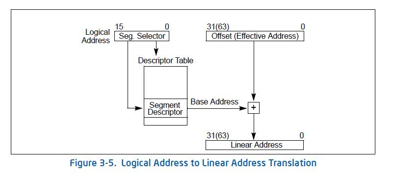

linux首次进入的保护模式的内存映射方式，然后再看一下linux是如何实现保护模式的进入，进入前做了什么准备和设置。

Intel文档中的图来说明这个保护模式的保护功能：


linux并不使用段保护。

此保护模式是如何做地址映射的呢？再借用Intel文档的图片来说明：



逻辑地址还是那样表现方式：“段选择：地址偏移”，现在的段寄存器值真实地起到了选择符的作用了，通过GDTR寄存器找到段描述符表，根据段选择符找到对应的表项，结合描述符里的基地址（Base Address）加上地址偏移（Offset），最终得到了线性地址。此时的线性地址就确切地是物理地址了，因为没有开启页式映射。那么我们可以推测一下如果要切换到该保护模式需要做什么：

1、 要有一个段描述符表；

2、 GDTR指向该描述符表首地址；

3、 设置段寄存器以便查找段描述符；

4、 开启保护模式功能；

进入保护模式的函数go_to_protected_mode:

```
#/arch/x86/boot/pm.c
 
/*
 * Actual invocation sequence
 */
void go_to_protected_mode(void)
{
    /* Hook before leaving real mode, also disables interrupts */
    realmode_switch_hook();
 
    /* Enable the A20 gate */
    if (enable_a20()) {
        puts("A20 gate not responding, unable to boot...\n");
        die();
    }
 
    /* Reset coprocessor (IGNNE#) */
    reset_coprocessor();
 
    /* Mask all interrupts in the PIC */
    mask_all_interrupts();
 
    /* Actual transition to protected mode... */
    setup_idt();
    setup_gdt();
    protected_mode_jump(boot_params.hdr.code32_start,
                (u32)&boot_params + (ds() << 4));
}
```

realmode\_switch\_hook()根据注释和函数命名可以知道这是在实模式切换前的钩子函数调用的地方；enable\_a20()开启A20；reset\_coprocessor()是把协处理器重置一下；mask\_all\_interrupts()则是把中断关了，避免切换过程中出现状况。

细说一下setup\_idt()和setup\_gdt()，函数名字告诉我们这是设置idt和gdt的，看一下两者具体代码吧：

```
#/arch/x86/boot/pm.c

/*
 * Set up the IDT
 */
static void setup_idt(void)
{
    static const struct gdt_ptr null_idt = {0, 0};
    asm volatile("lidtl %0" : : "m" (null_idt));
}
```

根据setup\_idt()的实现，可以明显看到这没做什么，纯粹置一下idt为空的描述符表。

```
#/arch/x86/boot/pm.c
 
static void setup_gdt(void)
{
    /* There are machines which are known to not boot with the GDT
       being 8-byte unaligned. Intel recommends 16 byte alignment. */
    static const u64 boot_gdt[] __attribute__((aligned(16))) = {
        /* CS: code, read/execute, 4 GB, base 0 */
        [GDT_ENTRY_BOOT_CS] = GDT_ENTRY(0xc09b, 0, 0xfffff),
        /* DS: data, read/write, 4 GB, base 0 */
        [GDT_ENTRY_BOOT_DS] = GDT_ENTRY(0xc093, 0, 0xfffff),
        /* TSS: 32-bit tss, 104 bytes, base 4096 */
        /* We only have a TSS here to keep Intel VT happy;
           we don't actually use it for anything. */
        [GDT_ENTRY_BOOT_TSS] = GDT_ENTRY(0x0089, 4096, 103),
    };
    /* Xen HVM incorrectly stores a pointer to the gdt_ptr, instead
       of the gdt_ptr contents. Thus, make it static so it will
       stay in memory, at least long enough that we switch to the
       proper kernel GDT. */
    static struct gdt_ptr gdt;
 
    gdt.len = sizeof(boot_gdt)-1;
    gdt.ptr = (u32)&boot_gdt + (ds() << 4);
 
    asm volatile("lgdtl %0" : : "m" (gdt));
}
```

而setup\_gdt()则可以看到做了不少事情了。先看一下GDT\_ENTRY(0xc09b, 0, 0xfffff)做了什么转换，其结果是怎样的。

```
/* Constructor for a conventional segment GDT (or LDT) entry */
/* This is a macro so it can be used in initializers */
#define GDT_ENTRY(flags, base, limit) \
    ((((base) & _AC(0xff000000,ULL)) << (56-24)) | \
     (((flags) & _AC(0x0000f0ff,ULL)) << 40) | \
     (((limit) & _AC(0x000f0000,ULL)) << (48-16)) | \
     (((base) & _AC(0x00ffffff,ULL)) << 16) | \
     (((limit) & _AC(0x0000ffff,ULL))))
```

这是一个64bit的数据，稍微算一下，这个转换后的值应该为：

> 0x00CF9B000000FFFF

这就是段描述符表项的内容。我们对比一下段描述符的格式：


把数据和格式对齐一下：


先看一下基地址是多少（黄色部分）：


是的，就是0x00000000。而段限长为0xfffff（绿色部分）:


由于基地址是0x00000000，所以逻辑地址的偏移量就是实际内存地址空间。所以也就说linux并不使用段保护,因为并没有明显地区分各个段（仔细看一下GDT\_ENTRY\_BOOT\_DS表项的设置，其基地址同样是0x00000000）。

至于其他的位则分别用来表示该表项指向的段内存的访问权限了，具体此时段权限这里就不详细说明了，感兴趣的可以根据手册分析。以上的是GDT\_ENTRY\_BOOT\_CS的情况，GDT\_ENTRY\_BOOT\_DS同理，至于GDT\_ENTRY\_BOOT\_TSS，注释也说了，这里用不到，何况现在还没有任务的概念，不可能会有什么所谓的任务切换出现。OK，理解完了段描述符，那么现在不难明白GDT\_ENTRY(flags, base, limit)做了些什么，实际上就是在把各项数据设置到段描述符对应的位上面。继续往下看setup\_gdt()的函数实现，可以看到boot\_gdt是定义了段描述符表，然后设置gdt，最后通过汇编指令lgdtl把gdt的表项设置上去。至此段描述符表有了，而且随着lgdtl指令的执行，GDTR也随之设置上了。设置上去了，那是不是就生效了？不是的，还有关键的保护模式功能还没开启呢。