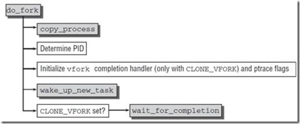
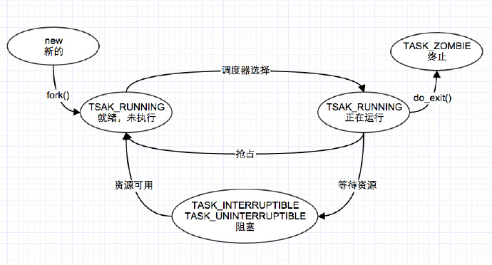

- 1 用户空间创建进程/线程的三种方法
- 2 fork, vfork, clone系统调用的实现
    - 2.1 关于do\_fork和\_do\_frok

>参照
>
>[分析Linux内核创建一个新进程的过程](http://blog.luoyuanhang.com/2015/07/27/%E5%88%86%E6%9E%90Linux%E5%86%85%E6%A0%B8%E5%88%9B%E5%BB%BA%E4%B8%80%E4%B8%AA%E6%96%B0%E8%BF%9B%E7%A8%8B%E7%9A%84%E8%BF%87%E7%A8%8B)
>
>

# 1 用户空间创建进程/线程的三种方法

**Unix标准的复制进程**的**系统调用**是**fork**（即分叉），但是Linux，BSD等操作系统并不止实现这一个，确切的说**linux实现了三个**，fork,vfork,clone（确切说**vfork创造出来的是轻量级进程**，也叫线程，是共享资源的进程）

| 系统调用 | 描述 |
|:-------------:|:-------------|
| fork | fork创造的**子进程是父进程的完整副本**，**复制了父亲进程的资源**，包括内存的task\_struct内容 |
| vfork | vfork创建的**子进程与父进程共享数据段**,而且由vfork()创建的**子进程将先于父进程运行** |
| clone | Linux上**创建线程**一般使用的是**pthread库**.实际上linux也给我们提供了**创建线程的系统调用，就是clone** |

>关于**用户空间(！！！**)使用fork, vfork和clone, 请参见
>
>[Linux中fork，vfork和clone详解（区别与联系）](http://blog.csdn.net/gatieme/article/details/51417488)

**fork, vfork和clone**的**系统调用**的**入口地址**分别是**sys\_fork,sys\_vfork和sys\_clone**,而他们的**定义是依赖于体系结构**的, 因为在**用户空间和内核空间之间传递参数的方法因体系结构而异**

>**系统调用的参数传递**
>
>**系统调用的实现与C库不同**,普通**C函数**通过将**参数的值**压入到**进程的栈**中进行参数的传递。由于**系统调用**是**通过中断进程从用户态到内核态**的一种特殊的函数调用，**没有用户态或者内核态的堆栈**可以被用来在调用函数和被调函数之间进行参数传递。**系统调用通过CPU的寄存器来进行参数传递**。在进行**系统调用之前**，系统调用的**参数被写入CPU的寄存器**，而在**实际调用系统服务例程之前**，内核**将CPU寄存器的内容拷贝到内核堆栈**中，实现参数的传递。

因此不同的体系结构可能采用不同的方式或者不同的寄存器来传递参数，而上面**函数的任务**就是**从处理器的寄存器**中**提取用户空间提供的信息**,并调用**体系结构无关的\_do\_fork（或者早期的do\_fork）函数**,负责**进程的复制**

即**不同的体系结构**可能需要采用**不同的方式或者寄存器来存储函数调用的参数**，因此linux在设计系统调用的时候,将其划分成**体系结构相关的层次**和**体系结构无关的层次**,前者复杂**提取出依赖与体系结构的特定的参数**，后者则**依据参数的设置执行特定的真正操作**

# 2 fork, vfork, clone系统调用的实现

## 2.1 关于do\_fork和\_do\_frok

>The commit 3033f14ab78c32687 ("clone: support passing tls argument via C
rather than pt\_regs magic") introduced \_do\_fork() that allowed to pass
@tls parameter.
>
>参见 http://lists.openwall.net/linux-kernel/2015/03/13/30

linux2.5.32以后, 添加了**TLS(Thread Local Storage)机制**,**clone**的标识**CLONE\_SETTLS**接受一个参数来**设置线程的本地存储区**。sys\_clone也因此增加了一个int参数来传入相应的tls\_val。**sys\_clone通过do\_fork**来调用copy\_process完成进程的复制，它调用特定的copy\_thread和copy\_thread把相应的系统调用参数从**pt\_regs寄存器列表中提取出来**，但是会导致意外的情况。

>only one code path into copy\_thread can pass the CLONE_SETTLS flag, and
that code path comes from sys\_clone with its architecture-specific
argument-passing order.

前面我们说了，在实现函数调用的时候，sys\_clone等将特定体系结构的参数从寄存器中提取出来,然后到达do\_fork这步的时候已经应该是体系结构无关了,但是我们**sys\_clone**需要设置的**CLONE\_SETTLS的tls**仍然是个依赖与体系结构的参数, 这里就会出现问题。

因此**linux-4.2之后**选择引入一个新的**CONFIG\_HAVE\_COPY\_THREAD\_TLS**，和一个新的**COPY\_THREAD\_TLS**接受TLS参数为额外的长整型（系统调用参数大小）的争论。改变sys\_clone的TLS参数unsigned long，并传递到**copy\_thread\_tls**。

```c
/* http://lxr.free-electrons.com/source/include/linux/sched.h?v=4.5#L2646  */
extern long _do_fork(unsigned long, unsigned long, unsigned long, int __user *, int __user *, unsigned long);
extern long do_fork(unsigned long, unsigned long, unsigned long, int __user *, int __user *);


/* linux2.5.32以后, 添加了TLS(Thread Local Storage)机制, 
	在最新的linux-4.2中添加了对CLONE_SETTLS 的支持 
    底层的_do_fork实现了对其的支持, 
    dansh*/
/*  */
#ifndef CONFIG_HAVE_COPY_THREAD_TLS
/* For compatibility with architectures that call do_fork directly rather than
 * using the syscall entry points below. */
long do_fork(unsigned long clone_flags,
              unsigned long stack_start,
              unsigned long stack_size,
              int __user *parent_tidptr,
              int __user *child_tidptr)
{
        return _do_fork(clone_flags, stack_start, stack_size,
                        parent_tidptr, child_tidptr, 0);
}
#endif
```

我们会发现，**新版本**的系统中**clone的TLS设置标识**会通过**TLS参数传递**,**因此\_do\_fork替代了老版本的do\_fork**。

**老版本的do\_fork**只有在如下情况才会定义

- 只有当系统**不支持通过TLS参数**传递而是**使用pt\_regs寄存器列表**传递时

- **未定义CONFIG\_HAVE\_COPY\_THREAD\_TLS宏**

| 参数 | 描述 |
| ------------- |:-------------|
| clone\_flags | 与clone()参数flags相同,用来控制进程复制过的一些属性信息,描述你需要**从父进程继承那些资源**。该**标志位的4个字节**分为**两部分**。**最低的一个字节**为**子进程结束**时**发送给父进程的信号代码**，通常为**SIGCHLD**；**剩余的三个字节**则是各种clone标志的组合（本文所涉及的标志含义详见下表），也就是若干个标志之间的或运算。通过clone标志可以有选择的对父进程的资源进行复制； |
| stack\_start | 与clone()参数stack\_start相同, **子进程用户态(！！！)堆栈的地址** |
| regs | 是一个指向了**寄存器集合的指针**,其中以原始形式,**保存了调用的参数**,该**参数使用的数据类型**是**特定体系结构的struct pt\_regs**，其中**按照系统调用执行时寄存器在内核栈上的存储顺序**,保存了**所有的寄存器**,即**指向内核态堆栈通用寄存器值的指针**，**通用寄存器的值**是在从**用户态切换到内核态时被保存到内核态堆栈中的**(指向pt\_regs结构体的指针。当系统发生**系统调用**，即**用户进程从用户态切换到内核态**时，该结构体**保存通用寄存器中的值**，并**被存放于内核态的堆栈**中) |
| stack\_size | **用户状态下栈的大小**, 该参数通常是不必要的, **总被设置为0** |
| parent\_tidptr | 与clone的ptid参数相同,**父进程在用户态下pid的地址**，该参数在**CLONE\_PARENT\_SETTID标志被设定时有意义** |
| child\_tidptr | 与clone的ctid参数相同,**子进程在用户态下pid的地址**，该参数在**CLONE\_CHILD\_SETTID标志被设定时有意义** |

其中clone\_flags如下表所示


# 3 sys\_fork的实现

**不同体系结构**下的fork实现**sys\_fork**主要是**通过标志集合区分**,在大多数体系结构上,典型的fork实现方式与如下

**早期实现**

| 架构 | 实现 |
| ------------- |:-------------:|
| arm | [arch/arm/kernel/sys_arm.c, line 239](http://lxr.free-electrons.com/source/arch/arm/kernel/sys_arm.c?v=2.4.37#L239) |
| i386 | [arch/i386/kernel/process.c, line 710](http://lxr.free-electrons.com/source/arch/i386/kernel/process.c?v=2.4.37#L710) |
| x86_64 | [arch/x86_64/kernel/process.c, line 706](http://lxr.free-electrons.com/source/arch/x86_64/kernel/process.c?v=2.4.37#L706) |

```c
asmlinkage long sys_fork(struct pt_regs regs)
{
    return do_fork(SIGCHLD, regs.rsp, &regs, 0);
}
```
**新版本**

>http://lxr.free-electrons.com/source/kernel/fork.c?v=4.5#L1785

```c
#ifdef __ARCH_WANT_SYS_FORK
SYSCALL_DEFINE0(fork)
{
#ifdef CONFIG_MMU
        return _do_fork(SIGCHLD, 0, 0, NULL, NULL, 0);
#else
        /* can not support in nommu mode */
        return -EINVAL;
#endif
}
#endif
```

我们可以看到**唯一使用的标志是SIGCHLD**。这意味着在子进程终止后将发送信号SIGCHLD信号通知父进程, 

由于写时复制(COW)技术,**最初父子进程的栈地址相同**,但是如果操作栈地址闭并写入数据,则COW机制会为每个进程分别创建一个新的栈副本

如果**do\_fork成功**,则**新建进程的pid作为系统调用的结果返回**, 否则返回错误码

# 4 sys\_vfork的实现

**早期实现**

| 架构 | 实现 |
| ------------- |:-------------:|
|arm | [arch/arm/kernel/sys_arm.c, line 254](http://lxr.free-electrons.com/source/arch/arm/kernel/sys_arm.c?v=2.4.37#L254) |
| i386 | [arch/i386/kernel/process.c, line 737](http://lxr.free-electrons.com/source/arch/i386/kernel/process.c?v=2.4.37#L737) |
| x86_64 | [arch/x86_64/kernel/process.c, line 728](http://lxr.free-electrons.com/source/arch/x86_64/kernel/process.c?v=2.4.37#L728) |

```c
asmlinkage long sys_vfork(struct pt_regs regs)
{
    return do_fork(CLONE_VFORK | CLONE_VM | SIGCHLD, regs.rsp, &regs, 0);
}
```

**新版本**

>http://lxr.free-electrons.com/source/kernel/fork.c?v=4.5#L1797

```c
#ifdef __ARCH_WANT_SYS_VFORK
SYSCALL_DEFINE0(vfork)
{
        return _do_fork(CLONE_VFORK | CLONE_VM | SIGCHLD, 0,
                        0, NULL, NULL, 0);
}
#endif
```

可以看到sys\_vfork的实现与sys\_fork只是略微不同, 前者使用了**额外的标志CLONE\_VFORK | CLONE\_VM**

# 5 sys\_clone的实现

**早期实现**

| 架构 | 实现 |
| ------------- |:-------------:|
|  arm | [arch/arm/kernel/sys_arm.c, line 247](http://lxr.free-electrons.com/source/arch/arm/kernel/sys_arm.c?v=2.4.37#L247) |
|  i386 | [arch/i386/kernel/process.c, line 715](http://lxr.free-electrons.com/source/arch/i386/kernel/process.c?v=2.4.37#L715) |
|  x86_64  | [arch/x86_64/kernel/process.c, line 711](http://lxr.free-electrons.com/source/arch/x86_64/kernel/process.c?v=2.4.37#L711) |

sys\_clone的实现方式与上述系统调用类似, 但实际差别在于do\_fork如下调用
```
casmlinkage int sys_clone(struct pt_regs regs)
{
    /* 注释中是i385下增加的代码, 其他体系结构无此定义
    unsigned long clone_flags;
    unsigned long newsp;

    clone_flags = regs.ebx;
    newsp = regs.ecx;*/
    if (!newsp)
        newsp = regs.esp;
    return do_fork(clone_flags, newsp, &regs, 0);
}
```

**新版本**

>http://lxr.free-electrons.com/source/kernel/fork.c?v=4.5#L1805

```c
#ifdef __ARCH_WANT_SYS_CLONE
#ifdef CONFIG_CLONE_BACKWARDS
SYSCALL_DEFINE5(clone, unsigned long, clone_flags, unsigned long, newsp,
                 int __user *, parent_tidptr,
                 unsigned long, tls,
                 int __user *, child_tidptr)
#elif defined(CONFIG_CLONE_BACKWARDS2)
SYSCALL_DEFINE5(clone, unsigned long, newsp, unsigned long, clone_flags,
                 int __user *, parent_tidptr,
                 int __user *, child_tidptr,
                 unsigned long, tls)
#elif defined(CONFIG_CLONE_BACKWARDS3)
SYSCALL_DEFINE6(clone, unsigned long, clone_flags, unsigned long, newsp,
                int, stack_size,
                int __user *, parent_tidptr,
                int __user *, child_tidptr,
                unsigned long, tls)
#else
SYSCALL_DEFINE5(clone, unsigned long, clone_flags, unsigned long, newsp,
                 int __user *, parent_tidptr,
                 int __user *, child_tidptr,
                 unsigned long, tls)
#endif
{
        return _do_fork(clone_flags, newsp, 0, parent_tidptr, child_tidptr, tls);
}
#endif
```

我们可以看到**sys\_clone的标识不再是硬编码**的,而是通过**各个寄存器参数传递到系统调用**,因而我们需要提取这些参数。

另外，**clone也不再复制进程的栈**,而是**可以指定新的栈地址**,在**生成线程时,可能需要这样做**,线程可能与父进程共享地址空间，但是**线程自身的栈可能在另外一个地址空间**

另外还指令了用户空间的两个指针(parent\_tidptr和child\_tidptr), 用于**与线程库通信**

# 6 创建子进程的流程

## 6.1 \_do\_fork的流程

>\_do\_fork和do\_fork在进程的复制的时候并没有太大的区别,他们就只是在**进程tls复制**的过程中实现有细微差别

**所有进程复制(创建)的fork机制**最终都调用了**kernel/fork.c中的\_do\_fork**(一个体系结构无关的函数),

>其定义在 http://lxr.free-electrons.com/source/kernel/fork.c?v=4.2#L1679

\_do\_fork以调用copy\_process开始,后者执行生成新的进程的实际工作,并**根据指定的标志复制父进程的数据**。在子进程生成后, 内核必须执行下列收尾操作:

1. 调用**copy\_process**为子进程**复制出一份进程信息**

2. 如果是**vfork**（设置了**CLONE\_VFORK和ptrace标志**）初始化完成处理信息

3. 调用**wake\_up\_new\_task**将**子进程加入调度器**，为之分配CPU

4. 如果是**vfork**，**父进程等待子进程完成exec替换自己的地址空间**

>我们从<深入linux内核架构>中找到了早期的流程图，基本一致可以作为参考



```c
long _do_fork(unsigned long clone_flags,
      unsigned long stack_start,
      unsigned long stack_size,
      int __user *parent_tidptr,
      int __user *child_tidptr,
      unsigned long tls)
{
    struct task_struct *p;
    int trace = 0;
    long nr;
  
    /*
     * Determine whether and which event to report to ptracer.  When
     * called from kernel_thread or CLONE_UNTRACED is explicitly
     * requested, no event is reported; otherwise, report if the event
     * for the type of forking is enabled.
     */
    if (!(clone_flags & CLONE_UNTRACED)) {
    if (clone_flags & CLONE_VFORK)
        trace = PTRACE_EVENT_VFORK;
    else if ((clone_flags & CSIGNAL) != SIGCHLD)
        trace = PTRACE_EVENT_CLONE;
    else
        trace = PTRACE_EVENT_FORK;
  
    if (likely(!ptrace_event_enabled(current, trace)))
        trace = 0;
    }
  	/*  复制进程描述符，copy_process()的返回值是一个 task_struct 指针  */
    p = copy_process(clone_flags, stack_start, stack_size,
         child_tidptr, NULL, trace, tls);
    /*
     * Do this prior waking up the new thread - the thread pointer
     * might get invalid after that point, if the thread exits quickly.
     */
    if (!IS_ERR(p)) {
    struct completion vfork;
    struct pid *pid;
  
    trace_sched_process_fork(current, p);
  	/*  得到新创建的进程的pid信息  */
    pid = get_task_pid(p, PIDTYPE_PID);
    nr = pid_vnr(pid);
  
    if (clone_flags & CLONE_PARENT_SETTID)
        put_user(nr, parent_tidptr);
  	
    /*  如果调用的 vfork()方法，初始化 vfork 完成处理信息 */
    if (clone_flags & CLONE_VFORK) {
        p->vfork_done = &vfork;
        init_completion(&vfork);
        get_task_struct(p);
    }
	/*  将子进程加入到调度器中，为其分配 CPU，准备执行  */
    wake_up_new_task(p);
  
    /* forking complete and child started to run, tell ptracer */
    if (unlikely(trace))
        ptrace_event_pid(trace, pid);
  	
    /*  如果是 vfork，将父进程加入至等待队列，等待子进程完成  */
    if (clone_flags & CLONE_VFORK) {
        if (!wait_for_vfork_done(p, &vfork))
        ptrace_event_pid(PTRACE_EVENT_VFORK_DONE, pid);
    }
  
    put_pid(pid);
    } else {
    nr = PTR_ERR(p);
    }
    return nr;
}
```

## 6.2 copy\_process流程

>http://lxr.free-electrons.com/source/kernel/fork.c?v=4.5#L1237

1. 调用dup\_task\_struct复制当前的task\_struct

2. 检查进程数是否超过限制

3. 初始化自旋锁、挂起信号、CPU定时器等

4. 调用sched\_fork初始化进程数据结构，并把进程状态设置为TASK\_RUNNING

5. 复制所有进程信息，包括文件系统、信号处理函数、信号、内存管理等

6. 调用copy\_thread\_tls初始化**子进程内核栈**

7. 为新进程分配并设置新的 pid

>我们从<深入linux内核架构>中找到了早期的流程图，基本一致可以作为参考


```c
/*
 * This creates a new process as a copy of the old one,
 * but does not actually start it yet.
 *
 * It copies the registers, and all the appropriate
 * parts of the process environment (as per the clone
 * flags). The actual kick-off is left to the caller.
 */
static struct task_struct *copy_process(unsigned long clone_flags,
                    unsigned long stack_start,
                    unsigned long stack_size,
                    int __user *child_tidptr,
                    struct pid *pid,
                    int trace,
                    unsigned long tls)
{
    int retval;
    struct task_struct *p;

    retval = security_task_create(clone_flags);
    if (retval)
        goto fork_out;
	//  复制当前的 task_struct
    retval = -ENOMEM;
    p = dup_task_struct(current);
    if (!p)
        goto fork_out;

    ftrace_graph_init_task(p);

    //初始化互斥变量
    rt_mutex_init_task(p);

#ifdef CONFIG_PROVE_LOCKING
    DEBUG_LOCKS_WARN_ON(!p->hardirqs_enabled);
    DEBUG_LOCKS_WARN_ON(!p->softirqs_enabled);
#endif

	//检查进程数是否超过限制，由操作系统定义
    retval = -EAGAIN;
    if (atomic_read(&p->real_cred->user->processes) >=
            task_rlimit(p, RLIMIT_NPROC)) {
        if (p->real_cred->user != INIT_USER &&
            !capable(CAP_SYS_RESOURCE) && !capable(CAP_SYS_ADMIN))
            goto bad_fork_free;
    }
    current->flags &= ~PF_NPROC_EXCEEDED;

    retval = copy_creds(p, clone_flags);
    if (retval < 0)
        goto bad_fork_free;

    /*
     * If multiple threads are within copy_process(), then this check
     * triggers too late. This doesn't hurt, the check is only there
     * to stop root fork bombs.
     */
	//检查进程数是否超过 max_threads 由内存大小决定
    retval = -EAGAIN;
    if (nr_threads >= max_threads)
        goto bad_fork_cleanup_count;

    delayacct_tsk_init(p);  /* Must remain after dup_task_struct() */
    p->flags &= ~(PF_SUPERPRIV | PF_WQ_WORKER);
    p->flags |= PF_FORKNOEXEC;
    INIT_LIST_HEAD(&p->children);
    INIT_LIST_HEAD(&p->sibling);
    rcu_copy_process(p);
    p->vfork_done = NULL;

    //  初始化自旋锁
    spin_lock_init(&p->alloc_lock);
	//  初始化挂起信号
    init_sigpending(&p->pending);

    //  初始化 CPU 定时器
    posix_cpu_timers_init(p);
	//  ......

    /* Perform scheduler related setup. Assign this task to a CPU. 
    	初始化进程数据结构，并把进程状态设置为 TASK_RUNNING
    */
    retval = sched_fork(clone_flags, p);
    if (retval)
        goto bad_fork_cleanup_policy;
	retval = perf_event_init_task(p);

    /*	复制所有进程信息，包括文件系统、信号处理函数、信号、内存管理等   */
    if (retval)
        goto bad_fork_cleanup_policy;
    retval = audit_alloc(p);
    if (retval)
        goto bad_fork_cleanup_perf;
    /* copy all the process information */
    shm_init_task(p);
    retval = copy_semundo(clone_flags, p);
    if (retval)
        goto bad_fork_cleanup_audit;
    retval = copy_files(clone_flags, p);
    if (retval)
        goto bad_fork_cleanup_semundo;
    retval = copy_fs(clone_flags, p);
    if (retval)
        goto bad_fork_cleanup_files;
    retval = copy_sighand(clone_flags, p);
    if (retval)
        goto bad_fork_cleanup_fs;
    retval = copy_signal(clone_flags, p);
    if (retval)
        goto bad_fork_cleanup_sighand;
    retval = copy_mm(clone_flags, p);
    if (retval)
        goto bad_fork_cleanup_signal;
    retval = copy_namespaces(clone_flags, p);
    if (retval)
        goto bad_fork_cleanup_mm;
    retval = copy_io(clone_flags, p);
    if (retval)
        goto bad_fork_cleanup_namespaces;
    /*    初始化子进程内核栈
    	linux-4.2新增处理TLS
        之前版本是	retval = copy_thread(clone_flags, stack_start, stack_size, p);
        */
    retval = copy_thread_tls(clone_flags, stack_start, stack_size, p, tls);
    if (retval)
        goto bad_fork_cleanup_io;

	/*  为新进程分配新的pid  */
    if (pid != &init_struct_pid) {
        pid = alloc_pid(p->nsproxy->pid_ns_for_children);
        if (IS_ERR(pid)) {
            retval = PTR_ERR(pid);
            goto bad_fork_cleanup_io;
        }
    }

	/*  设置子进程的pid  */
    /* ok, now we should be set up.. */
    p->pid = pid_nr(pid);
    if (clone_flags & CLONE_THREAD) {
        p->exit_signal = -1;
        p->group_leader = current->group_leader;
        p->tgid = current->tgid;
    } else {
        if (clone_flags & CLONE_PARENT)
            p->exit_signal = current->group_leader->exit_signal;
        else
            p->exit_signal = (clone_flags & CSIGNAL);
        p->group_leader = p;
        p->tgid = p->pid;
    }

    p->nr_dirtied = 0;
    p->nr_dirtied_pause = 128 >> (PAGE_SHIFT - 10);
    p->dirty_paused_when = 0;

    p->pdeath_signal = 0;
    INIT_LIST_HEAD(&p->thread_group);
    p->task_works = NULL;

    /*
     * Make it visible to the rest of the system, but dont wake it up yet.
     * Need tasklist lock for parent etc handling!
     */
    write_lock_irq(&tasklist_lock);

	/*  调用fork的进程为其父进程  */
    /* CLONE_PARENT re-uses the old parent */
    if (clone_flags & (CLONE_PARENT|CLONE_THREAD)) {
        p->real_parent = current->real_parent;
        p->parent_exec_id = current->parent_exec_id;
    } else {
        p->real_parent = current;
        p->parent_exec_id = current->self_exec_id;
    }

    spin_lock(&current->sighand->siglock);

    // ......

    return p;
}
```

## 6.3 dup\_task\_struct流程

>http://lxr.free-electrons.com/source/kernel/fork.c?v=4.5#L334

```c
static struct task_struct *dup_task_struct(struct task_struct *orig)
{
	struct task_struct *tsk;
	struct thread_info *ti;
	int node = tsk_fork_get_node(orig);
	int err;

	//分配一个 task_struct 节点
	tsk = alloc_task_struct_node(node);
	if (!tsk)
		return NULL;

	//分配一个 thread_info 节点，包含进程的内核栈，ti 为栈底
	ti = alloc_thread_info_node(tsk, node);
	if (!ti)
		goto free_tsk;

	//将栈底的值赋给新节点的栈
	tsk->stack = ti;

	//……

	return tsk;

}
```

1. 调用alloc\_task\_struct\_node分配一个**task\_struct节点**

2. 调用alloc\_thread\_info\_node分配一个**thread\_info节点**，其实是**分配了一个thread\_union联合体**,将**栈底返回给ti**

```c
union thread_union {
   struct thread_info thread_info;
  unsigned long stack[THREAD_SIZE/sizeof(long)];
};
```

- 最后将**栈底的值ti**赋值给**新节点的栈**

- 最终执行完**dup\_task\_struct**之后，**子进程除了tsk->stack指针不同**之外，**全部都一样**！

## 6.4 sched\_fork流程

```c
int sched_fork(unsigned long clone_flags, struct task_struct *p)
{
	unsigned long flags;
	int cpu = get_cpu();

	__sched_fork(clone_flags, p);

	//  将子进程状态设置为 TASK_RUNNING
	p->state = TASK_RUNNING;

	//  ……

	//  为子进程分配 CPU
	set_task_cpu(p, cpu);

	put_cpu();
	return 0;
}
```

我们可以看到sched\_fork大致完成了两项重要工作，

- 一是将子进程状态设置为TASK\_RUNNING，

- 二是**为其分配CPU**

## 6.5 copy\_thread和copy\_thread\_tls流程

我们可以看到**linux-4.2**之后增加了copy\_thread\_tls函数和CONFIG\_HAVE\_COPY\_THREAD\_TLS宏

但是如果**未定义CONFIG\_HAVE\_COPY\_THREAD\_TLS宏**默认则使用copy\_thread同时将定义copy\_thread\_tls为copy\_thread

**单独这个函数**是因为**这个复制操作与其他操作都不相同**,这是一个**特定于体系结构的函数**，用于**复制进程中特定于线程(thread\-special)的数据**,重要的就是填充task\_struct->thread的各个成员，这是一个thread\_struct类型的结构, 其**定义是依赖于体系结构**的。它包含了**所有寄存器(和其他信息**)，内核在进程之间**切换时需要保存和恢复的进程的信息**。

该函数用于**设置子进程的执行环境**，如子进程运行时**各CPU寄存器的值**、子进程的**内核栈的起始地址**（**指向内核栈的指针通常也是保存在一个特别保留的寄存器**中）

```c
#ifdef CONFIG_HAVE_COPY_THREAD_TLS
extern int copy_thread_tls(unsigned long, unsigned long, unsigned long,
            struct task_struct *, unsigned long);
#else
extern int copy_thread(unsigned long, unsigned long, unsigned long,
            struct task_struct *);

/* Architectures that haven't opted into copy_thread_tls get the tls argument
 * via pt_regs, so ignore the tls argument passed via C. */
static inline int copy_thread_tls(
        unsigned long clone_flags, unsigned long sp, unsigned long arg,
        struct task_struct *p, unsigned long tls)
{
    return copy_thread(clone_flags, sp, arg, p);
}
#endif
```

| 内核 | 实现 |
| ------------- |:-------------|
| 4.5 | [arch/x86/kernel/process_32.c, line 132](http://lxr.free-electrons.com/source/arch/x86/kernel/process_32.c?v=4.5#L132) |
| 4.5 | [arch/x86/kernel/process_64.c, line 155](http://lxr.free-electrons.com/source/arch/x86/kernel/process_64.c?v=4.5#L155) |

下面我们来看32位架构的copy\_thread\_tls函数，他与原来的copy\_thread变动并不大,只是多了后面TLS的设置信息

```c
int copy_thread_tls(unsigned long clone_flags, unsigned long sp,
    unsigned long arg, struct task_struct *p, unsigned long tls)
{
    struct pt_regs *childregs = task_pt_regs(p);
    struct task_struct *tsk;
    int err;
	/*  获取寄存器的信息  */
    p->thread.sp = (unsigned long) childregs;
    p->thread.sp0 = (unsigned long) (childregs+1);
    memset(p->thread.ptrace_bps, 0, sizeof(p->thread.ptrace_bps));

    if (unlikely(p->flags & PF_KTHREAD)) {
        /* kernel thread
        	内核线程的设置  */
        memset(childregs, 0, sizeof(struct pt_regs));
        p->thread.ip = (unsigned long) ret_from_kernel_thread;
        task_user_gs(p) = __KERNEL_STACK_CANARY;
        childregs->ds = __USER_DS;
        childregs->es = __USER_DS;
        childregs->fs = __KERNEL_PERCPU;
        childregs->bx = sp;     /* function */
        childregs->bp = arg;
        childregs->orig_ax = -1;
        childregs->cs = __KERNEL_CS | get_kernel_rpl();
        childregs->flags = X86_EFLAGS_IF | X86_EFLAGS_FIXED;
        p->thread.io_bitmap_ptr = NULL;
        return 0;
    }
    /*  将当前寄存器信息复制给子进程  */
    *childregs = *current_pt_regs();
    /*  子进程 eax 置 0，因此fork 在子进程返回0  */
    childregs->ax = 0;
    if (sp)
        childregs->sp = sp;
	/*  子进程ip 设置为ret_from_fork，因此子进程从ret_from_fork开始执行  */
    p->thread.ip = (unsigned long) ret_from_fork;
    task_user_gs(p) = get_user_gs(current_pt_regs());

    p->thread.io_bitmap_ptr = NULL;
    tsk = current;
    err = -ENOMEM;

    if (unlikely(test_tsk_thread_flag(tsk, TIF_IO_BITMAP))) {
        p->thread.io_bitmap_ptr = kmemdup(tsk->thread.io_bitmap_ptr,
                        IO_BITMAP_BYTES, GFP_KERNEL);
        if (!p->thread.io_bitmap_ptr) {
            p->thread.io_bitmap_max = 0;
            return -ENOMEM;
        }
        set_tsk_thread_flag(p, TIF_IO_BITMAP);
    }

    err = 0;

    /*
     * Set a new TLS for the child thread?
     * 为进程设置一个新的TLS
     */
    if (clone_flags & CLONE_SETTLS)
        err = do_set_thread_area(p, -1,
            (struct user_desc __user *)tls, 0);

    if (err && p->thread.io_bitmap_ptr) {
        kfree(p->thread.io_bitmap_ptr);
        p->thread.io_bitmap_max = 0;
    }
    return err;
}
```

copy\_thread 这段代码为我们解释了两个相当重要的问题！

一是，**为什么fork在子进程中返回0**，原因是childregs->ax = 0;这段代码**将子进程的 eax 赋值为0**

二是，**p->thread.ip = (unsigned long) ret\_from\_fork**;将子进程的 ip 设置为 ret\_form\_fork 的**首地址**，因此**子进程是从 ret\_from\_fork 开始执行的**

# 7 总结

fork, vfork和clone的系统调用的入口地址分别是sys\_fork,sys\_vfork和sys\_clone,而他们的定义是依赖于体系结构的, 而他们最终都**调用了\_do\_fork**（**linux-4.2之前的内核中是do\_fork**），在\_do\_fork中通过copy\_process复制进程的信息，**调用wake\_up\_new\_task将子进程加入调度器**中

fork系统调用对应的kernel函数是sys\_fork，此函数简单的调用kernel函数\_do\_fork。一个**简化版的\_do\_fork**执行如下：

1. copy\_process()此函数会做fork的大部分事情，它主要完成讲**父进程的运行环境复制到新的子进程**，比如信号处理、文件描述符和进程的代码数据等。

2. wake\_up\_new\_task()。计算此进程的**优先级和其他调度参数**，将**新的进程加入到进程调度队列并设此进程为可被调度的**，以后这个进程可以被进程调度模块调度执行。

## 7.1 简化的copy\_process()流程

1. dup\_task\_struct中为其分配了**新的堆栈**.分配一个**新的进程控制块**，包括**新进程在kernel中的堆栈**。新的进程控制块会复制父进程的进程控制块，但是**因为每个进程都有一个kernel堆栈**，新进程的堆栈将被设置成新分配的堆栈
2. 初始化一些新进程的统计信息，如此进程的运行时间
3. copy\_semundo()复制父进程的semaphore undo\_list到子进程
4. copy\_files()、copy\_fs()复制父进程**文件系统相关**的环境到子进程
5. copy\_sighand()、copy\_signal()复制父进程**信号处理相关**的环境到子进程
6. copy\_mm()复制父进程**内存管理相关**的环境到子进程，包括**页表、地址空间和代码数据**
7. copy\_thread(\_tls)中将**父进程的寄存器上下文复制给子进程**，保证了**父子进程的堆栈信息是一致**的.设置子进程的执行环境，如子进程运行时各CPU寄存器的值、子进程的kernel栈的起始地址
8. 调用了sched\_fork()，将其置为TASK\_RUNNING.设置子进程调度相关的参数，即子进程的运行CPU、初始时间片长度和静态优先级等
9. 将**ret\_from\_fork的地址**设置为**eip寄存器的值**
10. 为**新进程分配并设置新的pid**
11. 将子进程加入到全局的进程队列中
12. 设置子进程的进程组ID和对话期ID等
13. 最终子进程从ret\_from\_fork开始执行

简单的说，copy\_process()就是将父进程的运行环境复制到子进程并对某些子进程特定的环境做相应的调整。

## 7.2 进程退出

此外**应用程序**使用**系统调用exit()来结束一个进程**，此**系统调用接受一个退出原因代码**，**父进程**可以**使用wait()系统调用**来**获取此代码**，从而**知道子进程退出的原因**。对应到kernel，此系统调用sys\_exit\_group()，它的基本流程如下：

1. 将信号SIGKILL加入到其他线程的信号队列中，并唤醒这些线程。

2. 此线程执行do\_exit()来退出。

do\_exit()完成线程退出的任务，其主要功能是将线程占用的系统资源释放，do\_exit()的基本流程如下： 

1. 将进程内存管理相关的资源释放

2. 将进程ICP semaphore相关资源释放

3. \_\_exit\_files()、\_\_exit\_fs()将进程文件管理相关的资源释放。

4. exit\_thread()只要目的是释放平台相关的一些资源。

5. exit\_notify()在Linux中进程退出时要将其退出的原因告诉父进程，父进程调用wait()系统调用后会在一个等待队列上睡眠。

6. schedule()调用进程调度器，因为此进程已经退出，切换到其他进程。

进程的创建到执行过程如下图所示



# 8 参考链接

- [分析Linux内核创建一个新进程的过程](http://blog.luoyuanhang.com/2015/07/27/%E5%88%86%E6%9E%90Linux%E5%86%85%E6%A0%B8%E5%88%9B%E5%BB%BA%E4%B8%80%E4%B8%AA%E6%96%B0%E8%BF%9B%E7%A8%8B%E7%9A%84%E8%BF%87%E7%A8%8B/)
- [Linux中fork，vfork和clone详解（区别与联系）](https://blog.csdn.net/gatieme/article/details/51417488)