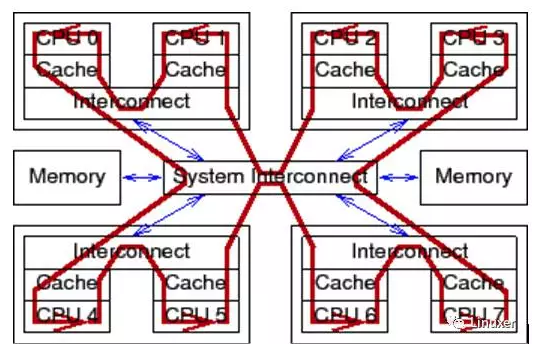
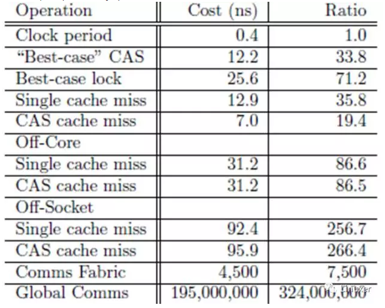
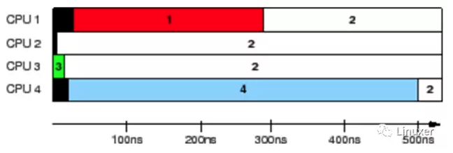
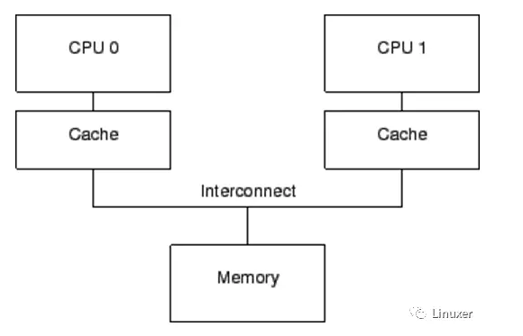
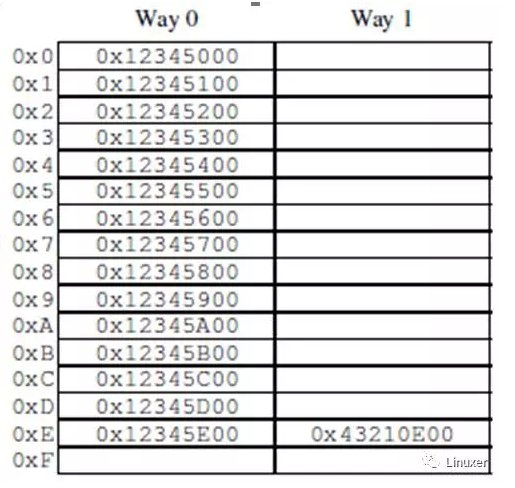
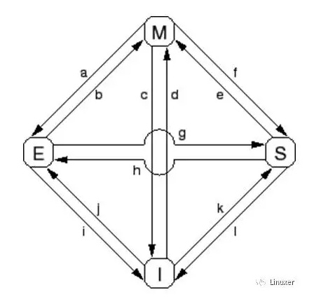

<!-- @import "[TOC]" {cmd="toc" depthFrom=1 depthTo=6 orderedList=false} -->

<!-- code_chunk_output -->

- [1. 来自于霍金的难题](#1-来自于霍金的难题)
- [2. 原子操作有多慢？](#2-原子操作有多慢)
- [3. 变量可以拥有多个值](#3-变量可以拥有多个值)
- [4. 为什么需要MESI](#4-为什么需要mesi)
- [5. MESI的四种状态](#5-mesi的四种状态)
- [6. MESI消息](#6-mesi消息)
- [7. MESI状态转换](#7-mesi状态转换)

<!-- /code_chunk_output -->


# 1. 来自于霍金的难题

据说斯蒂芬·霍金曾经声称**半导体制造商**面临两个基本问题：

（1）有限的光速

（2）物质的原子本质

第一个难题，决定了在一个CPU周期内，电信号无法在整个系统所有CPU中广播。换句话说，某个CPU指令对一个内存地址的写操作，不会在这条指令执行完毕后，马上被其他CPU识别到操作结果。例如：CPU0对全局变量foo执行foo = 1，当CPU 0执行完相应的汇编代码后，其他CPU核仍然看到foo赋值前的值。刚接触操作系统的读者，需要注意这一点。

第二个难题，导致我们至少需要一个原子来存储二进制位。没有办法在一个原子中存储一个字、一段内存、一个完整的寄存器内容......最终的结果是，硬件工程师没有办法缩小芯片流片面积。当CPU核心增加时，核间通信的负担会变得更加沉重。

当然，作为理论物理学家，霍金的这两个问题都是理论性的。半导体制造商很有可能已经逼近这两个限制。虽然如此，还是有一些研发报告关注于如何规避这两个基本限制。

其中一个绕开物质原子本质的办法是一种称为“high-K绝缘体”的材料，这种材料允许较大的器件模拟超小型器件的电气属性。这种材料存在一些重大的生产困难，但是总算能将研究的前沿再推进一步。另一个比较奇异的解决方法是在单个电子上存储多个比特位，这是建立在单个电子可以同时存在于多个能级的现象之上。不过这种方法还有待观察，才能确定能否在产品级的半导体设备中稳定工作。

还有一种称为“量子点”的解决方法，使得可以制造体积小得多的半导体设备，不过该方法还处于研究阶段。

第一个限制不容易被绕过，虽然量子技术、甚至弦论，理论上允许通信速度超过光速。但是这仅仅是理论研究，实际工程中还未应用。

# 2. 原子操作有多慢？

这里的原子操作，是特指Linux内核中，类似于`atomic_long_add_return`这样的API。简单的说，就是当**某个原子操作完成**时，确保**所有CPU核**已经**识别到对原子变量的修改**，并且在**原子操作期间**，**其他CPU核不会同步对该变量进行修改**。这必然要求相应的电信号在所有的CPU之间广播。如下图：



对于普通变量操作（非原子操作）来说，电信号则不必在所有CPU核之间传播并来回传递：


不能忘记一点：**Linux操作系统可以运行在超过1024个CPU的大型系统中。在这些大型系统中，在所有CPU之间广播传递电信号，需要花费“很长”的时间**。

但是，很长究竟是多长？



在上表中，一次“CAS cache miss”的CPU周期是266，够长了吧？而这个测试结果，是在比较新的、4核CPU的多核系统中进行的。在老一点的系统中，或者在更多CPU核心的系统中，这个时间更长。

# 3. 变量可以拥有多个值

这不是天方夜谭。

假设**CPU 0**向全局变量foo写入一个值1，我们会很自然的认为：其他CPU会立即识别到foo的值为1。即使有所疑惑，我们可能也会退一步认为，在稍后某个时刻，其他“所有”CPU都会“同时”识别到foo的值为1。而不会出现一种奇怪的现象：在某个时刻，CPU 1识别到其值为1，而CPU 2识别到其值为0。不幸的是，是时候告别这种想法了。并行计算就是这么神奇和反直觉。如果不能理解这一点，就没办法真正理解RCU。

要明白这一点，考虑下面的代码片段。它被**几个CPU并行的执行**。**第1行**设置共享变量的值为**当前CPU的ID**，第2行调用`gettb()`函数对几个值进行初始化，该函数**读取硬件时间计数**，这个计数值由**SOC硬件**给出，并且在**所有CPU之间共享**。当然，这个硬件计数值主要是在power架构上有效，笔者在powerpce500架构上经常使用它。第3-8行的循环，记录变量在当前CPU上保持的时间长度。

```cpp
state.variable = mycpu;
lasttb = oldtb = firsttb = gettb();
while (state.variable == mycpu) {
    lasttb = oldtb;
    oldtb = gettb();
    if (lasttb - firsttb >1000)
    break;
}
```

在退出循环前，`firsttb` 将保存一个时间戳，这是赋值的时间。lasttb也保存一个时间戳，它是对共享变量保持最后赋予的值时刻的采样值，如果在进入循环前，共享变量已经变化，那么就等于firsttb。

这个数据是在一个1.5GHz POWER5 8核系统上采集的。每一个核包含一对硬件线程。CPU 1、2、3和4记录值，而CPU 0控制测试。时间戳计数器周期是5.32ns，这对于我们观察缓存状态来说是足够了。



上图的结果，展示出每个CPU识别到变量保持的时间。每一个水平条表示该CPU观察到变量的时间，左边的黑色区域表示相应的CPU第一次计数的时间。在最初5ns期间, 仅仅CPU 3拥有变量的值。在接下来的10ns，CPU 2和3看到不一致的变量值，但是随后都一致的认为其值是“2”。 但是，CPU 1在整个300ns内认为其值是“1”，并且 CPU 4 在整个500ns内认为其值是“4”。

这真是一个匪夷所思的测试结果。同一个变量，竟然在不同的CPU上面被看到不同的值！！！！

如果不理解硬件，就不会接受这个匪夷所思的测试结果。当然了，此时如果有一位大师站在你的面前，你也不能够跟随大师的节奏起舞。

# 4. 为什么需要MESI

请不要说：我还不知道MESI是什么？

简单的说，MESI是一种**内存缓存一致性协议**。

现代CPU的速度比现代内存系统的速度快得多。2006 年的CPU可以在每纳秒内执行十条指令。但是需要很多个十纳秒才能从物理内存中取出一个数据。它们的速度差异（超过2个数量级）导致在现代CPU中出现了数兆级别的缓存。这些缓存与CPU是相关联的，如下图。典型的，缓存可以在几个时钟周期内被访问。借助于CPU流水线的帮助，我们暂且可以认为，缓存能够抵消内存对CPU性能的影响。



CPU缓存和内存之间的数据流是固定长度的块，称为“缓存行”，其大小通常是2的N次方。范围从16到256字节不等。当一个特定的数据第一次被CPU访问时，它在**缓存**中还**不存在**，这称为“**cache miss**”(或者可被更准确的称为“`startup cache miss`”或者“`warmupcache miss`”)。“cache miss”意味着：CPU在**从物理内存中读取数据(cache主要用于读数据)**时，它必须等待(或处于“**stalled**”状态) 数百个CPU周期。但是，数据将被装载入CPU缓存以后，后续的访问将在缓存中找到，因此可以全速运行。

经过一段时间后，CPU的缓存将会被填满，后续的缓存缺失需要换出缓存中现有的数据，以便为最近的访问项腾出空间。这种“cache miss”被称为“`capacity miss`”，因为它是由于**缓存容量限制**而造成的。但是，即使此时缓存还没有被填满，大量缓存也可能由于一个新数据而被换出。这是由于**大量的缓存是通过硬件哈希表来实现的，这些哈希表有固定长度的哈希桶**（或者叫“sets”，CPU设计者是这样称呼的），如下图。



这个缓存有16个“sets”和2“路”，共32个“缓存行”，每个节点包含一个256字节的“缓存行”（一行/2路是256字节大小），它是一个256字节对齐的内存块。这个缓存行稍微显得大了一点，但是这使得十六进制的运行更简单。从硬件的角度来说，这是一个两路组相联缓存，类似于带16个桶的软件哈希表，每个桶的哈希链最多有两个元素。**大小(本例中是32个缓存行) 和相连性(本例中是2)都被称为缓存的“geometry”**。由于缓存是硬件实现的，哈希函数非常简单：**从内存地址中取出4位**（哈希桶数量16）作为哈希键值。

在程序代码位于地址0x43210E00- 0x43210EFF，并且程序依次访问地址0x12345000-0x12345EFF时，图中的情况就可能发生。假设程序正准备访问地址0x12345F00，这个地址会哈希到 0xF行，该行的两路都是空的，因此可以提供对应的256字节缓存行。如果程序访问地址0x1233000，将会哈希到第0行，相应的256字节缓存行可以放到第1路。但是，如果程序访问地址0x1233E00，将会哈希到第0xE行，必须有一个缓存行被替换出去，以腾出空间给新的行。如果随后访问被替换的行，会产生一次“cache miss”，这样的缓存缺失被称为“associativitymiss”。

更进一步说，我们仅仅考虑了读数据的情况。当写的时候会发生什么呢？

由于在一个**特定的CPU写数据前**，让**所有CPU**都意识到**数据被修改**这一点是非常重要的。因此，它必须首先**从其他CPU缓存中移除，或者叫“invalidated”（使无效！！！）**。一旦“使无效”操作完成，CPU可以安全的修改数据项。如果数据**存在于该CPU缓存**中，但是是**只读的**，这个过程称为“**write miss！！！**”。一旦某个特定的CPU使其他CPU完成了“使无效”操作，该CPU可以反复的重新写（或者读）数据。

**所以这里说的写数据, 只是发送了"使无效"！！！**, 但是下面又说当前缓存行没有则发送"**读使无效**"??

最后，如果另外某个CPU试图访问数据项，将会引起一次缓存缺失，此时，由于第一个CPU**为了写而使得缓存项无效**，这被称为“`communication miss`”。因为这通常是由于几个CPU使用缓存通信造成的（例如，一个用于互斥算法的锁使用这个数据项在CPU之间进行通信）。

很明显，所有CPU必须小心的维护数据的一致性视图。这些问题由“缓存一致性协议”来防止，常用的缓存一致性是MESI。

# 5. MESI的四种状态

MESI 存在“modified”，“exclusive”，“shared”和“invalid”四种状态，协议可以在一个指定的缓存行中应用这四种状态。因此，协议在**每一个缓存行**中维护一个**两位的状态标记**，这个标记附着在缓存行的物理地址和数据后面。

处于“**modified**”状态的缓存行是由于**相应的CPU最近进行了内存存储**。并且相应的内存确保**没有在其他CPU的缓存中出现！！！**。因此，“modified”状态的缓存行可以被认为**被CPU所“拥有**”。由于该缓存保存了“最新”的数据，因此**缓存**最终有责任**将数据写回到内存**，也应当**为其他缓存提供数据**，并且必须在缓存其他数据之前完成这些事情。

“**exclusive**”状态非常类似于“modified”状态，唯一的差别是该**缓存行还没有被相应的CPU修改**，这也表示**缓存行中的数据**及**内存中的数据**都是**最新**的。但是，由于CPU能够在任何时刻将数据存储到该行，而不考虑其他CPU，因此，处于“exclusive”状态也可以认为**被相应的CPU所“拥有**”。也就是说，由于**物理内存中的值是最新的**，该行可以直接丢弃而**不用回写到内存**，也不用通知其他CPU。

处于“**shared**”状态的缓存行可能已经被复制到**至少一个其他CPU的缓存**中，这样在**没有得到其他CPU的许可时**，**不能向缓存行存储数据**。与“exclusive”状态相同，此时**内存中的值是最新**的，因此可以不用向内存回写值而直接丢弃缓存中的值，也不用通知其他CPU。

处于“**invalid**”状态的行是空的，换句话说，它**没有保存任何有效数据**。当**新数据进入缓存**时，它被放置到一个处于“**invalid**”状态的**缓存行**。这个方法是比较好的，因为替换其他状态的缓存行将引起大量的缓存缺失。

由于所有CPU必须维护缓存行中的数据一致性视图，因此缓存一致性协议提供消息以标识系统中缓存行的动作。

# 6. MESI消息

MESI协议需要在CPU之间通信。如果CPU在**单一共享总线**上，只需要如下消息就足够了：

- **读消息**：“读”消息包含**要读取的缓存行！！！的物理地址**。

- **读响应消息**：“读响应”消息包含**较早前**的“**读**”消息的**数据**。这个“**读响应**”消息可能由**物理内存！！！** 或者**其他CPU**的**缓存！！！**提供。例如，如果**一个缓存**处于“**modified！！！**” 状态，那么，**它的缓存**必须提供“**读响应**”消息。

- **使无效消息**：“使无效”消息包含要**使无效的缓存行的物理地址**。**其他的缓存**必须从它们的缓存中**移除相应的数据**并且**响应此消息**。

- **使无效应答**：一个接收到“**使无效**”消息的CPU必须在**移除指定数据后**响应一个“使无效应答”消息。

- **读使无效**：“读使无效”消息包含**缓存行要读取的物理地址**。同时**指示其他缓存移除数据**。因此，它同时包含一个“**读**”消息和一个“**使无效**”消息。“读使无效”消息同时需要“**读响应**”消息以及“**使无效应答**”消息**进行答应**。

- **写回**：“写回”消息包含要**回写到物理内存的地址和数据**。(并且也许会“探测”其他CPU的缓存)。这个消息允许缓存在**必要时换出**处于“**modified**”状态的数据以腾出空间。

再次重申，所有这些消息均需要在CPU之间传播电信号，都面临霍金提出的那两个IT难题。

# 7. MESI状态转换



- Transition (a)：**缓存行被写回到物理内存**，但是CPU仍然将它保留在缓存中，并在以后修改它。这个转换需要一个“**写回**”消息。

- Transition (b)：CPU将数据**写到缓存行**，该缓存行目前处于**排它访问**。不需要发送或者接收任何消息。

- Transition (c)：CPU收到一个“**读使无效**”消息，相应的缓存行已经被修改。CPU必须使无效本地副本，然后响应“读响应”和 “使无效应答”消息，同时发送数据给请求的CPU，标示它的本地副本不再有效。

- Transition (d)：CPU进行一个`原子读—修改—写操作`，相应的**数据没有在它的缓存**中。它发送一个“**读使无效**”消息，通过“读响应”消息接收数据。一旦它接收到一个完整的“使无效应答”响应集合，CPU就完成此转换。

- Transition (e)：CPU进行一个`原子读—修改—写操作`，相应的数据在**缓存中是只读**的(shared???)。它必须发送一个“**使无效**”消息，并等待“使无效应答”**响应集合**以完成此转换。

- Transition (f)：其他某些CPU读取缓存行，其数据由本CPU提供，本CPU包含一个只读副本。数据只读的原因，可能是由于数据已经回写到内存中。这个转换开始于接收到一个“读”消息，最终本CPU响应了一个“读响应” 消息。

- Transition (g)：其他CPU读取数据，并且数据是从本CPU的缓存或者物理内存中提供的。无论哪种情况，本CPU都会保留一个只读副本。这个事务开始于接收到一个“读”消息，最终本CPU响应一个“读响应”消息。

- Transition (h)：当前CPU很快将要写入一些数据到缓存行，于是发送一个“使无效”消息。直到它接收到所有“使无效应答”消息后，CPU才完成转换。可选的，所有其他CPU通过“写回”消息将缓存行的数据换出（可能是为其他缓存行腾出空间）。这样，当前CPU就是最后一个缓存该数据的CPU。

- Transition (i)：其他某些CPU进行了一个原子读—修改—写操作，相应的缓存行仅仅被本CPU持有。本CPU将缓存行变成无效状态。这个转换开始于接收到“读使无效”消息，最终本CPU响应一个“读响应”消息以及一个“使无效应答”消息。

- Transition (j)：**本CPU保存一个数据到缓存行**，但是数据还**没有在它的缓存行**中。因此发送一个“**读使无效**”消息。直到它接收到“**读响应**”消息以及**所有“使无效应答”消息**后，才完成事务。缓存行可能会很快转换到“**修改**”状态，这是在存储完成后由Transition (b)完成的。

- Transition (k)：本CPU装载一个数据，但是数据还没有在缓存行中。CPU发送一个“读”消息，当它接收到相应的“读响应”消息后完成转换。

- Transition (l)：其他CPU**存储一个数据到缓存行**，但是该缓存行处于只读状态（因为其他CPU也持有该缓存行）。这个转换开始于接收到一个“使无效”消息，当前CPU最终响应一个“使无效应答”消息。
