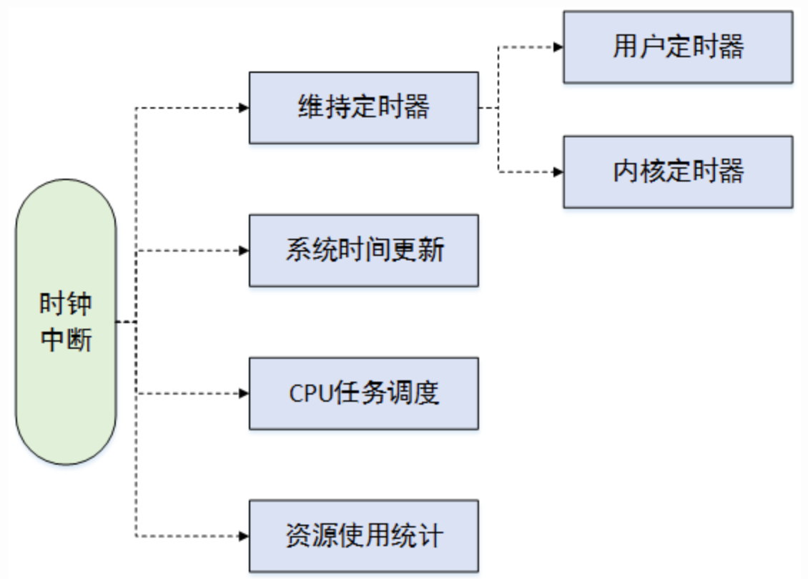

操作系统时钟从作用上分为两种: 计时和定时器

硬件方面，x86 主流平台，计时靠tsc，定时靠local apic timer。

软件方面，linux, 低精度，高精度，先低精度然后切换到高精度。

通过timer的中断，OS实现的功能包括但不局限于上图：

定时器的维护，包括用户态和内核态，当指定时间段过去后触发事件操作，比如IO操作注册的超时定时器等；
更新系统的运行时间、wall time等，此外还保存当前的时间和日期，以便能通过time()等接口返回给用户程序，内核中也可以利用其作为文件和网络包的时间戳；
调度器在调度任务分配给CPU时，也会去对task的运行时间进行统计计算，比如CFS调度，Round-Robin调度等；
资源使用统计，比如系统负载的记录等，此外用户使用top命令也能进行查看；

