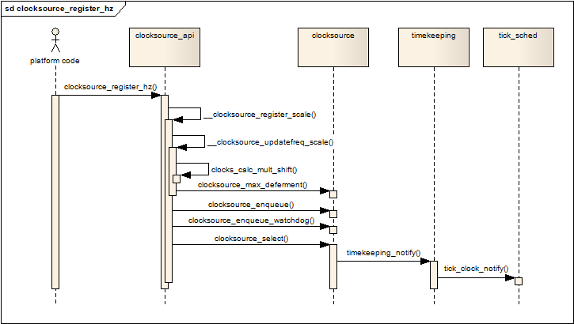

<!-- @import "[TOC]" {cmd="toc" depthFrom=1 depthTo=6 orderedList=false} -->

<!-- code_chunk_output -->

- [1. 简介](#1-简介)
- [2. struct clocksource结构体](#2-struct-clocksource结构体)
  - [2.1. rating: 时钟源的精度](#21-rating-时钟源的精度)
  - [2.2. read回调函数](#22-read回调函数)
  - [2.3. mult和shift字段](#23-mult和shift字段)
- [3. clocksource的注册和初始化](#3-clocksource的注册和初始化)
- [4. clocksource watchdog](#4-clocksource-watchdog)
- [5. 建立clocksource的简要过程](#5-建立clocksource的简要过程)
- [6. 参考](#6-参考)

<!-- /code_chunk_output -->

# 1. 简介

clock source用于为linux内核提供一个**时间基线**，如果你用linux的**date命令**获取**当前时间**，内核会**读取当前的clock source**(时钟源)，转换并返回合适的时间单位给用户空间。

在**硬件层**，时钟源通常实现为一个由**固定时钟频率驱动的计数器**，计数器只能**单调地增加**，直到**溢出为止**。

**时钟源**是内核计时的基础，
* **系统启动**时，内核通过**硬件RTC**获得**当前时间**，
* 在这以后，在大多数情况下，内核通过**选定的时钟源**更新**实时时间信息**（墙上时间），而**不再读取RTC**的时间。

本节的内核代码树基于V3.4.10。

# 2. struct clocksource结构体

内核用一个clocksource结构对真实的时钟源进行软件抽象，现在我们从clock source的数据结构开始，它的定义如下：

```cpp
// include/linux/clocksource.h
struct clocksource {
	/*
	 * Hotpath data, fits in a single cache line when the
	 * clocksource itself is cacheline aligned.
	 */
	cycle_t (*read)(struct clocksource *cs);
	cycle_t cycle_last;
	cycle_t mask;
	u32 mult;
	u32 shift;
	u64 max_idle_ns;
	u32 maxadj;
#ifdef CONFIG_ARCH_CLOCKSOURCE_DATA
	struct arch_clocksource_data archdata;
#endif
 
	const char *name;
	struct list_head list;
	int rating;
	int (*enable)(struct clocksource *cs);
	void (*disable)(struct clocksource *cs);
	unsigned long flags;
	void (*suspend)(struct clocksource *cs);
	void (*resume)(struct clocksource *cs);
 
	/* private: */
#ifdef CONFIG_CLOCKSOURCE_WATCHDOG
	/* Watchdog related data, used by the framework */
	struct list_head wd_list;
	cycle_t cs_last;
	cycle_t wd_last;
#endif
} ____cacheline_aligned;
```

只关注clocksource中的几个重要的字段。

## 2.1. rating: 时钟源的精度

**同一个设备**下，可以有**多个时钟源**，每个时钟源的**精度**由驱动它的**时钟频率**决定，比如一个由**10MHz**时钟驱动的时钟源，他的精度就是**100ns**。

clocksource结构中有一个**rating字段**，代表着该时钟源的**精度范围**，它的取值范围如下：

* 1--99： 不适合于用作实际的时钟源，只用于启动过程或用于测试；
* 100--199：基本可用，可用作真实的时钟源，但不推荐；
* 200--299：精度较好，可用作真实的时钟源；
* 300--399：很好，精确的时钟源；
* 400--499：理想的时钟源，如有可能就必须选择它作为时钟源；

## 2.2. read回调函数

**时钟源本身不会产生中断**，要获得时钟源的当前计数，只能通过主动调用它的read回调函数来获得当前的计数值，注意这里**只能获得计数值**，也就是所谓的cycle，要获得相应的时间，必须要借助clocksource的mult和shift字段进行转换计算。

## 2.3. mult和shift字段


# 3. clocksource的注册和初始化

通常，clocksource要在**初始化阶段**通过`clocksource_register_hz`函数通知内核它的工作时钟的频率，调用的过程如下：



由上图可见，最终大部分工作会转由`__clocksource_register_scale`完成，该函数首先完成对mult和shift值的计算，然后根据mult和shift值，最终通过`clocksource_max_deferment`获得**该clocksource**可接受的**最大IDLE时间**，并记录在clocksource的`max_idle_ns`字段中。

`clocksource_enqueue`函数负责按clocksource的rating的大小，把该clocksource按顺序挂在**全局链表**`clocksource_list`上，rating值越大，在链表上的**位置越靠前**。

每次**新的clocksource**注册进来，都会触发`clocksource_select()`函数被调用，它按照**rating值**选择**最好的clocksource**，并记录在全局变量`curr_clocksource`中，然后通过`timekeeping_notify`函数通知timekeeping，当前clocksource已经变更，关于timekeeping，我将会在后续的博文中阐述。

# 4. clocksource watchdog

系统中可能同时会注册多个clocksource，各个clocksource的精度和稳定性各不相同，为了筛选这些注册的clocksource，内核启用了一个定时器用于监控这些clocksource的性能，定时器的周期设为**0.5秒**：

# 5. 建立clocksource的简要过程

在系统的启动阶段，内核注册了一个基于**jiffies**的clocksource，代码位于`kernel/time/jiffies.c`：

当然，如果平台级的代码在**初始化**时也会注册真正的**硬件clocksource**，所以经过`clocksource_select()`函数后，`curr_clocksource`将会被设为最合适的clocksource。如果clocksource_select函数认为需要切换更好的时钟源，它会通过timekeeping_notify通知timekeeping系统，使用新的clocksource进行时间计数和更新操作。

# 6. 参考

https://blog.csdn.net/DroidPhone/article/details/7975694