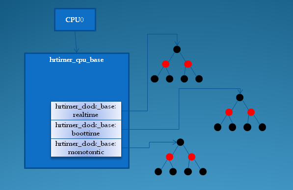

<!-- @import "[TOC]" {cmd="toc" depthFrom=1 depthTo=6 orderedList=false} -->

<!-- code_chunk_output -->

- [1. 简介](#1-简介)
- [2. 如何组织hrtimer?](#2-如何组织hrtimer)
- [3. hrtimer如何运转](#3-hrtimer如何运转)
  - [3.1. 添加一个hrtimer](#31-添加一个hrtimer)
  - [3.2. hrtimer的到期处理](#32-hrtimer的到期处理)
    - [3.2.1. 低精度模式](#321-低精度模式)
    - [3.2.2. 高精度模式](#322-高精度模式)
- [4. 切换到高精度模式](#4-切换到高精度模式)
- [5. 模拟tick事件](#5-模拟tick事件)
- [6. 参考](#6-参考)

<!-- /code_chunk_output -->

# 1. 简介

上一篇文章，我介绍了传统的低分辨率定时器的实现原理。而随着内核的不断演进，大牛们已经对这种低分辨率定时器的精度不再满足，而且，硬件也在不断地发展，系统中的定时器硬件的精度也越来越高，这也给高分辨率定时器的出现创造了条件。内核从2.6.16开始加入了高精度定时器架构。在实现方式上，内核的高分辨率定时器的实现代码几乎没有借用低分辨率定时器的数据结构和代码，内核文档给出的解释主要有以下几点：

* 低分辨率定时器的代码和jiffies的关系太过紧密，并且默认按32位进行设计，并且它的代码已经经过长时间的优化，目前的使用也是没有任何错误，如果硬要基于它来实现高分辨率定时器，势必会打破原有的时间轮概念，并且会引入一大堆#if--#else判断；

* 虽然大部分时间里，时间轮可以实现O(1)时间复杂度，但是当有进位发生时，不可预测的O(N)定时器级联迁移时间，这对于低分辨率定时器来说问题不大，可是它大大地影响了定时器的精度；

* 低分辨率定时器几乎是为“超时”而设计的，并为此对它进行了大量的优化，对于这些以“超时”未目的而使用定时器，它们大多数期望在超时到来之前获得正确的结果，然后删除定时器，精确时间并不是它们主要的目的，例如网络通信、设备IO等等。

为此，内核为高精度定时器重新设计了一套软件架构，它可以为我们提供纳秒级的定时精度，以满足对精确时间有迫切需求的应用程序或内核驱动，例如多媒体应用，音频设备的驱动程序等等。以下的讨论用hrtimer(high resolution timer)表示高精度定时器。

# 2. 如何组织hrtimer?

我们知道，低分辨率定时器使用5个链表数组来组织timer_list结构，形成了著名的时间轮概念，对于高分辨率定时器，我们期望组织它们的数据结构至少具备以下条件：

* 稳定而且快速的查找能力；
* 快速地插入和删除定时器的能力；
* 排序功能；

内核的开发者考察了多种数据结构，例如基数树、哈希表等等，最终他们选择了**红黑树**（rbtree）来**组织hrtimer**，红黑树已经以库的形式存在于内核中，并被成功地使用在内存管理子系统和文件系统中，随着系统的运行，hrtimer不停地被创建和销毁，新的hrtimer按顺序被插入到红黑树中，树的最左边的节点就是最快到期的定时器，内核用一个hrtimer结构来表示一个高精度定时器：

```cpp
struct hrtimer {
	struct timerqueue_node		node;
	ktime_t				_softexpires;
	enum hrtimer_restart		(*function)(struct hrtimer *);
	struct hrtimer_clock_base	*base;
	unsigned long			state;
        ......
};
```

定时器的**到期时间**用`ktime_t`来表示，\_**softexpires**字段记录了**时间**，**定时器一旦到期**，function字段指定的回调函数会被调用，该函数的返回值为一个枚举值，它决定了该hrtimer**是否需要被重新激活**：

```cpp
enum hrtimer_restart {
	HRTIMER_NORESTART,	/* Timer is not restarted */
	HRTIMER_RESTART,	/* Timer must be restarted */
};
```

state字段用于表示hrtimer当前的状态，有几下几种位组合：

```cpp
#define HRTIMER_STATE_INACTIVE	0x00  // 定时器未激活
#define HRTIMER_STATE_ENQUEUED	0x01  // 定时器已经被排入红黑树中
#define HRTIMER_STATE_CALLBACK	0x02  // 定时器的回调函数正在被调用
#define HRTIMER_STATE_MIGRATE	0x04  // 定时器正在CPU之间做迁移
```

hrtimer的**到期时间**可以基于以下几种**时间基准系统**：

```cpp
enum  hrtimer_base_type {
	HRTIMER_BASE_MONOTONIC,  // 单调递增的monotonic时间，不包含休眠时间
	HRTIMER_BASE_REALTIME,   // 平常使用的墙上真实时间
	HRTIMER_BASE_BOOTTIME,   // 单调递增的boottime，包含休眠时间
	HRTIMER_MAX_CLOCK_BASES, // 用于后续数组的定义
};
```

和低分辨率定时器一样，处于效率和上锁的考虑，**每个cpu**单独管理属于**自己的hrtimer**，为此，专门定义了一个结构`hrtimer_cpu_base`：

```cpp
struct hrtimer_cpu_base {
        ......
	struct hrtimer_clock_base	clock_base[HRTIMER_MAX_CLOCK_BASES];
};
```

其中，`clock_base`数组为每种时间基准系统都定义了一个`hrtimer_clock_base`结构，它的定义如下：

```cpp
struct hrtimer_clock_base {
	struct hrtimer_cpu_base	*cpu_base;  // 指向所属cpu的hrtimer_cpu_base结构
        ......
	struct timerqueue_head	active;     // 红黑树，包含了所有使用该时间基准系统的hrtimer
	ktime_t			resolution; // 时间基准系统的分辨率
	ktime_t			(*get_time)(void); // 获取该基准系统的时间函数
	ktime_t			softirq_time;// 当用jiffies
	ktime_t			offset;      // 
};
```

active字段是一个`timerqueue_head`结构，它实际上是对rbtree的进一步封装：

```cpp
struct timerqueue_node {
	struct rb_node node;  // 红黑树的节点
	ktime_t expires;      // 该节点代表队hrtimer的到期时间，与hrtimer结构中的_softexpires稍有不同
};
 
struct timerqueue_head {
	struct rb_root head;          // 红黑树的根节点
	struct timerqueue_node *next; // 该红黑树中最早到期的节点，也就是最左下的节点
};
```

`timerqueue_head`结构在**红黑树的基础**上，增加了一个**next字段**，用于保存树中**最先到期的定时器节点**，实际上就是树的最左下方的节点，有了next字段，当到期事件到来时，系统不必遍历整个红黑树，只要取出next字段对应的节点进行处理即可。

`timerqueue_node`用于表示**一个hrtimer节点**，它在标准红黑树节点`rb_node`的基础上增加了**expires字段**，该字段和hrtimer中的`_softexpires`字段一起，设定了**hrtimer的到期时间的一个范围**，hrtimer可以在`hrtimer._softexpires`至`timerqueue_node.expires`之间的**任何时刻到期**，我们也称`timerqueue_node.expires`为**硬过期时间(hard**)，意思很明显：到了此时刻，定时器一定会到期，有了这个范围可以选择，定时器系统可以让**范围接近的多个定时器**在**同一时刻同时到期**，这种设计可以**降低进程频繁地被hrtimer进行唤醒**。经过以上的讨论，我们可以得出以下的图示，它表明了每个cpu上的hrtimer是如何被组织在一起的：

每个cpu的hrtimer组织结构:



总结一下：

* **每个cpu**有一个`hrtimer_cpu_base`结构；
* `hrtimer_cpu_base`结构管理着**3种不同的时间基准系统的hrtimer**，分别是：实时时间，启动时间和单调时间；
* 每种时间基准系统通过它的active字段（`timerqueue_head`结构指针），指向它们各自的红黑树；
* 红黑树上，按到期时间进行排序，最先到期的hrtimer位于最左下的节点，并被记录在active.next字段中；
* **3种时间基准**的最先到期时间可能不同，所以，它们之中最先到期的时间被记录在`hrtimer_cpu_base`的expires_next字段中。

# 3. hrtimer如何运转

hrtimer的实现需要一定的硬件基础，它的实现依赖于我们前几章介绍的timekeeper和clock_event_device，如果你对`timekeeper`和`clock_event_device`不了解请参考以下文章：

* Linux时间子系统之三：时间的维护者：timekeeper，
* Linux时间子系统之四：定时器的引擎：clock_event_device。

**hrtimer系统**需要通过**timekeeper**获取**当前的时间**，计算**与到期时间的差值**，并根据该差值，设定该cpu的`tick_device`（`clock_event_device`）的下一次的**到期时间**，时间一到，在`clock_event_device`的**事件回调函数**中处理到期的hrtimer。

现在你或许有疑问：前面在介绍`clock_event_device`时，我们知道，**每个cpu**有自己的`tick_device`，通常用于**周期性**地产生**进程调度**和**时间统计的tick事件**，这里又说要用tick_device调度hrtimer系统，通常cpu只有一个tick_device，那他们如何协调工作？这个问题也一度困扰着我，如果再加上`NO_HZ`配置带来tickless特性，你可能会更晕。这里我们先把这个疑问放下，我将在后面的章节中来讨论这个问题，现在我们只要先知道，一旦开启了hrtimer，`tick_device`所关联的`clock_event_device`的事件回调函数会被修改为：`hrtimer_interrupt`，并且会被设置成工作于`CLOCK_EVT_MODE_ONESHOT`单触发模式。

## 3.1. 添加一个hrtimer

要添加一个hrtimer，系统提供了一些api供我们使用，首先我们需要定义一个hrtimer结构的实例，然后用`hrtimer_init`函数对它进行初始化，它的原型如下：

```cpp
void hrtimer_init(struct hrtimer *timer, clockid_t which_clock,
			 enum hrtimer_mode mode);
```

`which_clock`可以是`CLOCK_REALTIME`、`CLOCK_MONOTONIC`、`CLOCK_BOOTTIME`中的一种，mode则可以是**相对时间**`HRTIMER_MODE_REL`，也可以是**绝对时间**`HRTIMER_MODE_ABS`。设定回调函数：

```cpp
timer.function = hr_callback;
```

如果定时器**无需指定一个到期范围**，可以在**设定回调函数**后直接使用`hrtimer_start`**激活该定时器**：

```cpp
int hrtimer_start(struct hrtimer *timer, ktime_t tim,
			 const enum hrtimer_mode mode);
```

如果需要指定到期范围，则可以使用`hrtimer_start_range_ns`激活定时器：

```cpp
hrtimer_start_range_ns(struct hrtimer *timer, ktime_t tim,
			unsigned long range_ns, const enum hrtimer_mode mode);
```

要取消一个hrtimer，使用hrtimer_cancel：

```cpp
int hrtimer_cancel(struct hrtimer *timer);
```

以下两个函数用于推后定时器的到期时间：

```cpp
extern u64
hrtimer_forward(struct hrtimer *timer, ktime_t now, ktime_t interval);
 
/* Forward a hrtimer so it expires after the hrtimer's current now */
static inline u64 hrtimer_forward_now(struct hrtimer *timer,
				      ktime_t interval)
{
	return hrtimer_forward(timer, timer->base->get_time(), interval);
}
```

以下几个函数用于获取定时器的当前状态：

```cpp
static inline int hrtimer_active(const struct hrtimer *timer)
{
	return timer->state != HRTIMER_STATE_INACTIVE;
}
 
static inline int hrtimer_is_queued(struct hrtimer *timer)
{
	return timer->state & HRTIMER_STATE_ENQUEUED;
}
 
static inline int hrtimer_callback_running(struct hrtimer *timer)
{
	return timer->state & HRTIMER_STATE_CALLBACK;
}
```

hrtimer_init最终会进入__hrtimer_init函数，该函数的主要目的是初始化hrtimer的base字段，同时初始化作为红黑树的节点的node字段：

```cpp
static void __hrtimer_init(struct hrtimer *timer, clockid_t clock_id,
			   enum hrtimer_mode mode)
{
	struct hrtimer_cpu_base *cpu_base;
	int base;
 
	memset(timer, 0, sizeof(struct hrtimer));
 
	cpu_base = &__raw_get_cpu_var(hrtimer_bases);
 
	if (clock_id == CLOCK_REALTIME && mode != HRTIMER_MODE_ABS)
		clock_id = CLOCK_MONOTONIC;
 
	base = hrtimer_clockid_to_base(clock_id);
	timer->base = &cpu_base->clock_base[base];
	timerqueue_init(&timer->node);
        ......
}
```

`hrtimer_start`和`hrtimer_start_range_ns`最终会把实际的工作交由`__hrtimer_start_range_ns`来完成：

```cpp
int __hrtimer_start_range_ns(struct hrtimer *timer, ktime_t tim,
		unsigned long delta_ns, const enum hrtimer_mode mode,
		int wakeup)
{
        ......        
        /* 取得hrtimer_clock_base指针 */
        base = lock_hrtimer_base(timer, &flags); 
        /* 如果已经在红黑树中，先移除它: */
        ret = remove_hrtimer(timer, base); ......
        /* 如果是相对时间，则需要加上当前时间，因为内部是使用绝对时间 */
        if (mode & HRTIMER_MODE_REL) {
                tim = ktime_add_safe(tim, new_base->get_time());
                ......
        } 
        /* 设置到期的时间范围 */
        hrtimer_set_expires_range_ns(timer, tim, delta_ns);
        ...... 
        /* 把hrtime按到期时间排序，加入到对应时间基准系统的红黑树中 */
        /* 如果该定时器的是最早到期的，将会返回true */
        leftmost = enqueue_hrtimer(timer, new_base);
        /* 
        * Only allow reprogramming if the new base is on this CPU. 
        * (it might still be on another CPU if the timer was pending) 
        * 
        * XXX send_remote_softirq() ?
        * 定时器比之前的到期时间要早，所以需要重新对tick_device进行编程，重新设定的的到期时间
        */
        if (leftmost && new_base->cpu_base == &__get_cpu_var(hrtimer_bases))
                hrtimer_enqueue_reprogram(timer, new_base, wakeup);
        unlock_hrtimer_base(timer, &flags);
        return ret;
}
```

## 3.2. hrtimer的到期处理

**高精度定时器系统**有**3个入口**可以对**到期定时器**进行处理，它们分别是：

* **没有切换到高精度模式**时，在**每个jiffie**的**tick事件中断**中进行查询和处理；
* 在`HRTIMER_SOFTIRQ`**软中断**中进行查询和处理；
* 切换到**高精度模式**后，在每个`clock_event_device`的**到期事件中断**中进行查询和处理；

### 3.2.1. 低精度模式

因为系统并不是一开始就会支持高精度模式，而是在系统启动后的某个阶段，等待所有的条件都满足后，才会切换到高精度模式，当系统还没有切换到高精度模式时，所有的高精度定时器运行在低精度模式下，在每个jiffie的tick事件中断中进行到期定时器的查询和处理，显然这时候的精度和低分辨率定时器是一样的（HZ级别）。低精度模式下，每个tick事件中断中，hrtimer_run_queues函数会被调用，由它完成定时器的到期处理。hrtimer_run_queues首先判断目前高精度模式是否已经启用，如果已经切换到了高精度模式，什么也不做，直接返回：

```cpp
void hrtimer_run_queues(void)
{
 
	if (hrtimer_hres_active())
		return;
```

如果hrtimer_hres_active返回false，说明目前处于低精度模式下，则继续处理，它用一个for循环遍历各个时间基准系统，查询每个hrtimer_clock_base对应红黑树的左下节点，判断它的时间是否到期，如果到期，通过__run_hrtimer函数，对到期定时器进行处理，包括：调用定时器的回调函数、从红黑树中移除该定时器、根据回调函数的返回值决定是否重新启动该定时器等等：

```cpp
	for (index = 0; index < HRTIMER_MAX_CLOCK_BASES; index++) {
		base = &cpu_base->clock_base[index];
		if (!timerqueue_getnext(&base->active))
			continue;
 
		if (gettime) {
			hrtimer_get_softirq_time(cpu_base);
			gettime = 0;
		}
 
		raw_spin_lock(&cpu_base->lock);
 
		while ((node = timerqueue_getnext(&base->active))) {
			struct hrtimer *timer;
 
			timer = container_of(node, struct hrtimer, node);
			if (base->softirq_time.tv64 <=
					hrtimer_get_expires_tv64(timer))
				break;
 
			__run_hrtimer(timer, &base->softirq_time);
		}
		raw_spin_unlock(&cpu_base->lock);
	}
```

上面的`timerqueue_getnext`函数返回红黑树中的左下节点，之所以可以在while循环中使用该函数，是因为`__run_hrtimer`会在移除旧的左下节点时，新的左下节点会被更新到`base->active->next`字段中，使得循环可以继续执行，直到没有新的到期定时器为止。

### 3.2.2. 高精度模式

切换到高精度模式后，原来给cpu提供tick事件的`tick_device`（`clock_event_device`）会被高精度定时器系统接管，它的中断事件回调函数被设置为`hrtimer_interrupt`，红黑树中最左下的节点的定时器的到期时间被编程到该`clock_event_device`中，这样每次`clock_event_device`的中断意味着至少有一个高精度定时器到期。另外，当timekeeper系统中的时间需要修正，或者`clock_event_device`的到期事件时间被重新编程时，系统会发出`HRTIMER_SOFTIRQ`软中断，软中断的处理函数`run_hrtimer_softirq`最终也会调用`hrtimer_interrupt`函数对到期定时器进行处理，所以在这里我们只要讨论`hrtimer_interrupt`函数的实现即可。

`hrtimer_interrupt`函数的**前半部分**和低精度模式下的`hrtimer_run_queues`函数完成相同的事情：它用一个for循环遍历各个时间基准系统，查询每个`hrtimer_clock_base`对应红黑树的左下节点，判断它的时间是否到期，如果到期，通过`__run_hrtimer`函数，对到期定时器进行处理，所以我们只讨论后半部分，在处理完所有到期定时器后，下一个到期定时器的到期时间保存在变量`expires_next`中，接下来的工作就是把这个到期时间编程到`tick_device`中：

```cpp
void hrtimer_interrupt(struct clock_event_device *dev)
{
        ......
	for (i = 0; i < HRTIMER_MAX_CLOCK_BASES; i++) {
                ......
		while ((node = timerqueue_getnext(&base->active))) {
                        ......
			if (basenow.tv64 < hrtimer_get_softexpires_tv64(timer)) {
				ktime_t expires;
 
				expires = ktime_sub(hrtimer_get_expires(timer),
						    base->offset);
				if (expires.tv64 < expires_next.tv64)
					expires_next = expires;
				break;
			}
 
			__run_hrtimer(timer, &basenow);
		}
	}
 
	/*
	 * Store the new expiry value so the migration code can verify
	 * against it.
	 */
	cpu_base->expires_next = expires_next;
	raw_spin_unlock(&cpu_base->lock);
 
	/* Reprogramming necessary ? */
	if (expires_next.tv64 == KTIME_MAX ||
	    !tick_program_event(expires_next, 0)) {
		cpu_base->hang_detected = 0;
		return;
	}
```

如果这时的`tick_program_event`返回了非0值，表示过期时间已经在当前时间的前面，这通常由以下原因造成：
* 系统正在被调试跟踪，导致时间在走，程序不走；
* 定时器的回调函数花了太长的时间；
* 系统运行在虚拟机中，而虚拟机被调度导致停止运行；

为了避免这些情况的发生，接下来系统提供3次机会，重新执行前面的循环，处理到期的定时器：

```cpp
	raw_spin_lock(&cpu_base->lock);
	now = hrtimer_update_base(cpu_base);
	cpu_base->nr_retries++;
	if (++retries < 3)
		goto retry;
```

如果3次循环后还无法完成到期处理，系统不再循环，转为计算本次总循环的时间，然后把`tick_device`的到期时间强制设置为当前时间加上本次的总循环时间，不过推后的时间被限制在100ms以内：

```cpp
	delta = ktime_sub(now, entry_time);
	if (delta.tv64 > cpu_base->max_hang_time.tv64)
		cpu_base->max_hang_time = delta;
	/*
	 * Limit it to a sensible value as we enforce a longer
	 * delay. Give the CPU at least 100ms to catch up.
	 */
	if (delta.tv64 > 100 * NSEC_PER_MSEC)
		expires_next = ktime_add_ns(now, 100 * NSEC_PER_MSEC);
	else
		expires_next = ktime_add(now, delta);
	tick_program_event(expires_next, 1);
	printk_once(KERN_WARNING "hrtimer: interrupt took %llu ns\n",
		    ktime_to_ns(delta));
}
```

# 4. 切换到高精度模式

# 5. 模拟tick事件


# 6. 参考

https://blog.csdn.net/droidphone/article/details/8074892