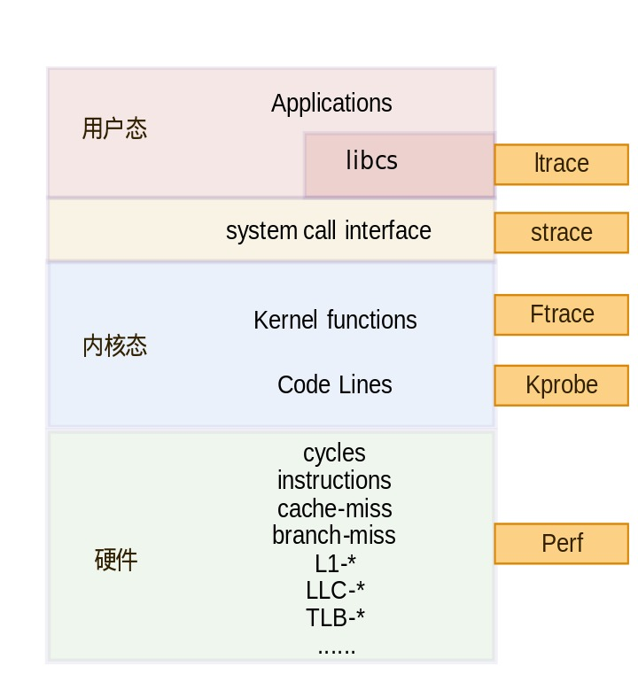
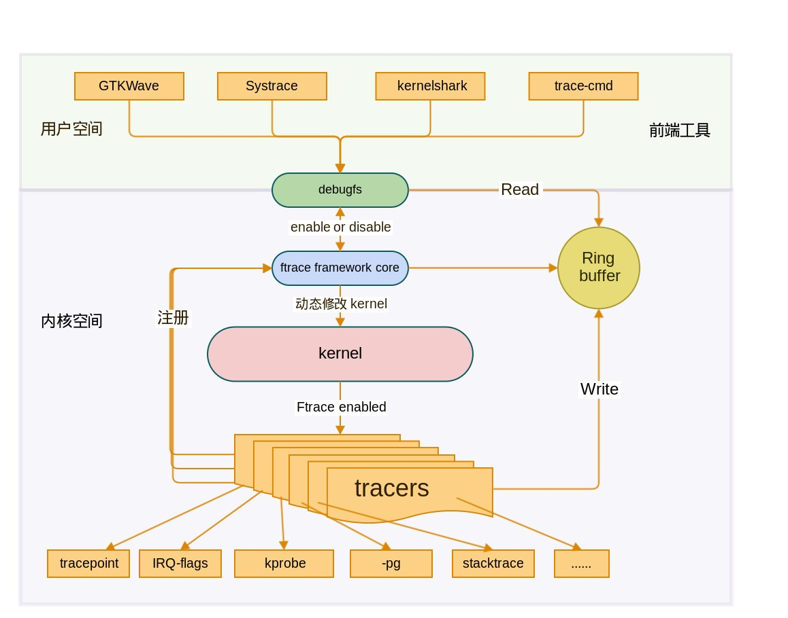

<!-- @import "[TOC]" {cmd="toc" depthFrom=1 depthTo=6 orderedList=false} -->

<!-- code_chunk_output -->

- [1. 什么是 Ftrace](#1-什么是-ftrace)
  - [1.1. Linux tracing overview](#11-linux-tracing-overview)
  - [1.2. Ftrace overview](#12-ftrace-overview)
- [2. Ftrace 实现原理](#2-ftrace-实现原理)
  - [2.1. Ftrace function tracer footstone: -pg](#21-ftrace-function-tracer-footstone-pg)
  - [2.2. Dynamic function tracing](#22-dynamic-function-tracing)
  - [2.3. Function Graph tracer](#23-function-graph-tracer)
  - [2.4. High resolution trace clock: `sched_clock()`](#24-high-resolution-trace-clock-sched_clock)
  - [2.5. User space tracing](#25-user-space-tracing)
  - [2.6. More](#26-more)
- [3. Ftrace 开发实践](#3-ftrace-开发实践)
  - [3.1. Filesystem tracing for broken symlink](#31-filesystem-tracing-for-broken-symlink)
  - [3.2. Latency v.s. throughput](#32-latency-vs-throughput)
  - [3.3. Home Idle tracing for power jitter](#33-home-idle-tracing-for-power-jitter)
  - [3.4. Home idle tracing (Cont.)](#34-home-idle-tracing-cont)
  - [3.5. Home idle tracing (Cont.)](#35-home-idle-tracing-cont)
  - [3.6. Graphic tracing for display performance tuning](#36-graphic-tracing-for-display-performance-tuning)
  - [3.7. Graphic tracing (Cont.)](#37-graphic-tracing-cont)
  - [3.8. Thermal tracing for board temprature control](#38-thermal-tracing-for-board-temprature-control)
  - [3.9. Thermal tracing (Cont.)](#39-thermal-tracing-cont)
  - [3.10. Thermal tracing (Cont.)](#310-thermal-tracing-cont)
  - [3.11. Thermal tracing (Cont.)](#311-thermal-tracing-cont)
- [4. Ftrace 在线演示](#4-ftrace-在线演示)
  - [4.1. Linux Lab 介绍](#41-linux-lab-介绍)
  - [4.2. Linux Lab 介绍（Cont.）](#42-linux-lab-介绍cont)
  - [4.3. Online Ftrace Demo](#43-online-ftrace-demo)
  - [4.4. Online KFT Demo](#44-online-kft-demo)
  - [4.5. Online KFT Demo (Cont.)](#45-online-kft-demo-cont)
- [5. 相关参考资料](#5-相关参考资料)

<!-- /code_chunk_output -->

# 1. 什么是 Ftrace

## 1.1. Linux tracing overview



## 1.2. Ftrace overview



ftrace 组成:


Ftrace 有两大组成部分，一是 framework，另外就是一系列的 tracer 。每个 tracer 完成不同的功能，它们统一由 framework 管理。 ftrace 的 trace 信息保存在 ring buffer 中，由 framework 负责管理。 Framework 利用 debugfs 系统在 /debugfs 下建立 tracing 目录，并提供了一系列的控制文件。

# 2. Ftrace 实现原理

## 2.1. Ftrace function tracer footstone: -pg

以 MIPS 为例：`arch/mips/kernel/mcount.S`

* Ftrace: `gcc -pg`

```
        $ echo 'main(){}' | \
          mipsel-linux-gnu-gcc -x c -S -o - - -pg | grep mcount

          subu	$sp,$sp,8  # _mcount pops 2 words from  stack
          jal	_mcount
```

* KFT: `gcc -finstrument-functions`

```
        $ echo 'main(){}' | \
          mipsel-linux-gnu-gcc -x c -S -o - - \
          -finstrument-functions | egrep "enter\)|exit\)"

          lw $25,%call16(__cyg_profile_func_enter)($28)
          lw $25,%call16(__cyg_profile_func_exit)($28)
```
## 2.2. Dynamic function tracing

以 MIPS 为例：`arch/mips/kernel/ftrace.c`

* 编译阶段
    * `scripts/recordmcount.{pl,c}` 扫描所有 `.text` 中的 `mcount` 调用点并创建`__mcount_loc` 段

* 引导阶段
    * 调用 `ftrace_process_locs` 把所有 `mcount` 调用点替换为 nop 指令：`ftrace_make_nop()`

* 跟踪阶段
    * 调用 `ftrace_run_update_code`，替换回 `mcount` 调用点：`ftrace_make_call()`

## 2.3. Function Graph tracer

* 模拟实现 `__cyg_profile_func_exit`

* 在 `_mcount` 中记录、劫持并恢复函数返回地址
    * `prepare_ftrace_return`
        * 记录，劫持并模拟enter：`ftrace_push_return_trace`
    * `return_to_handler`
        * 用于劫持原有的返回地址
        * 然后调用 `ftrace_return_to_handler`，并模拟exit：`ftrace_pop_return_trace`
        * 恢复原来的返回地址并跳回

## 2.4. High resolution trace clock: `sched_clock()`

* 高精度：`us/ns`
    * `kernel/sched_clock.c` 定义的 `sched_clock()` 基于 `jiffies`，精度不够
* 快速高效
    * 无锁，直接读硬件计数器，X86：`rdtsc/rdtscll`，MIPS: `read_c0_count()`
    * `Cycles` 转 `ns` 算法优化：`arch/x86/include/asm/timer.h`
* 不能溢出
    * 32 位转 64 位

```
include/linux/cnt32_to_63.h: cnt32_to_63()
```

* 稳定性
    * 计数频率要求稳定，如果 clock 跟处理器频率关联，需要关闭 cpufreq
* notrace: `__attribute__((no_instrument_function))`
    * 不能跟踪，否则会死循环
    
        `_mcount() -> sched_clock() -> _mcount()`

## 2.5. User space tracing

* 可通过 `trace_marker` 模拟实现用户态函数跟踪

* Systrace 实现
    * Java

```
        Trace.traceBegin(tag, name)/Trace.traceEnd(tag)
```

    * Native

```
        ATRACE_BEGIN(name)/ATRACE_END()
```

* 实现原理
    * atrace_init_once()

```
        atrace_marker_fd = open("/sys/kernel/debug/tracing/trace_marker", O_WRONLY);
```

    * `ATRACE_BEGIN(name)`

```
        snprintf(buf, ATRACE_MESSAGE_LENGTH, "B|%d|%s", getpid(), name);
        write(atrace_marker_fd, buf, len);
```

    * `ATRACE_END()`

```
        char c = 'E';
        write(atrace_marker_fd, &c, 1);
```

## 2.6. More

* KFT: Normal buffer

* Ftrace: Ring buffer
    * trace_pipe

# 3. Ftrace 开发实践

## 3.1. Filesystem tracing for broken symlink

* 问题：F2FS 某个符号链接偶尔创建异常导致系统启动失败
    * 符号链接文件存在，但是指向为空
* 排查：排查是所有链接异常还是单一情况
    * 通过 `trace_printk` 跟踪
    * 经 `/sys/kernel/debug/tracing/trace` 查看
    * fs/f2fs/namei.c:

```
    err = f2fs_add_link(dentry, inode);
    if (err)
        goto out;
    trace_printk("dir ino %ld, target %s, sym %s.\n",
        dir->i_ino, dentry->d_name.name, symname);
    f2fs_unlock_op(sbi);
```

* 结论：发现其他符号链接创建正常
* 根源：异常掉电导致符号链接创建不完整并且无 f2fsck 无覆盖此类情况

## 3.2. Latency v.s. throughput

* Latency tracing
    * cyclictest：长时间跑+后台负载，测试latency
    * irqsoff tracer：用于跟踪引起延迟的原因
    
        echo irqsoff > /sys/kernel/debug/tracing/current_tracer

* Max Latency：+10ms
    * 主要延迟在 USB driver: `dwc3_interrupt()` 中
    * 观察后发现是 `dwc3_interrupt()` 没有线程化

* 中断线程化
    * 增加 `dwc3_thread_interrupt()`
    * 数据延迟经 `cylictest` 验证较为稳定
    * 参照 [drivers/usb/dwc3/gadget.c](http://git.kernel.org/cgit/linux/kernel/git/torvalds/linux.git/plain/drivers/usb/dwc3/gadget.c) 线程化

* Latency 消失，但造成 Throughput 衰退
    * 发现 RNDIS 下降明显
    * iperf 线程化前：91／72
    * iperf 线程化后：45／39

## 3.3. Home Idle tracing for power jitter

\ThisCenterWallPaper{1}{images/power-supply}

## 3.4. Home idle tracing (Cont.)

* top: process level
* perf top: function level
* Ftrace workqueue event tracer: workqueue function level

        $ echo workqueue:workqueue_queue_work > /sys/kernel/debug/tracing/set_event
        $ cat /sys/kernel/debug/tracing/trace

* 实时渲染数据流 + 快捷捕获后台执行环境
    * 软件示波器：[oscilloscope](https://github.com/tinyclub/tinydraw/raw/master/oscope/oscilloscope.py)
    * 快捷按键捕获后台数据
    * 根据某个触发条件自动捕获：Max, Avg

## 3.5. Home idle tracing (Cont.)

\ThisCenterWallPaper{1}{images/oscilloscope}

## 3.6. Graphic tracing for display performance tuning

* 从应用层加跟踪点

        + Trace.traceBegin(Trace.TRACE_TAG_VIEW, "performaTraversals");
        performTraversals();
        + Trace.traceEnd(Trace.TRACE_TAG_VIEW);

* 通过 Systrace 启动跟踪

        $ systrace.py --time=10 -o trace.html gfx sched view wm

* 分析跟踪结果
    * 通过 Chrome 浏览器解析 `trace.html`

## 3.7. Graphic tracing (Cont.)

\ThisCenterWallPaper{1.3}{images/systrace-graphic}

## 3.8. Thermal tracing for board temprature control

\ThisCenterWallPaper{1}{images/temp-meature}

## 3.9. Thermal tracing (Cont.)

* 从内核中定义跟踪点（tracepoints）
    * `include/trace/events/thermal.h`

        TRACE_EVENT(thermal_temperature,
        ...
        TP_printk("thermal_zone=%s id=%d temp_prev=%d temp=%d",
          __get_str(thermal_zone), __entry->id, __entry->temp_prev,
          __entry->temp));
    

* 从内核中调用跟踪点
    * `driver/thermal/thermal_core.c: update_temperature()`
          
        trace_thermal_temperature(tz);

* Systrace 工作目标

        $ systrace.py --time=10 -o trace.html temp sched gfx

## 3.10. Thermal tracing (Cont.)

* 在 atrace 中启用该事件
    * `frameworks/native/cmds/atrace/atrace.cpp: k_categories`

        {"temp","Thermal temperature",0,{
        {REQ,"/sys/kernel/debug/tracing/events/thermal/thermal_temperature/enable" },}},

* 在 Systrace 中解析
    * 需要增加专门的解析代码
        * 或修改 `script.js`
        * 或添加独立的解析文件 `thermal_parser.html` 并追加到 `ftrace_importer.html`
        * `thermalTemperatureEvent: function()`:`

                // js 正则表达式提取 ftrace thermal 相关数据
                var event = /thermal_zone=(.+) id=(\d) temp_prev=(\d+) temp=(\d+)/.exec(eventBase.details);
                // 拿到 thermal zone 名字
                var name = event[1];
                // 拿到温度
                var thermalTemperature = parseInt(event[4]);
                // 调用 Systrace 框架提供的显示函数画出温度曲线；
                this.thermalTemperatureSlice(ts, name, thermalTemperature);
          
    * 并绑定上述事件到解析代码
        * `function ThermalParser(importer)`

                importer.registerEventHandler('thermal_temperature',
                ThermalParser.prototype.thermalTemperatureEvent.bind(this));

## 3.11. Thermal tracing (Cont.)

\ThisCenterWallPaper{1}{images/systrace-temp}

# 4. Ftrace 在线演示

## 4.1. Linux Lab 介绍

* 基于 Docker/Qemu 的嵌入式 Linux 开发环境
* 首页：<http://tinylab.org/linux-lab>
* 仓库：<https://github.com/tinyclub/linux-lab>
* 访问：<http://tinylab.cloud:6080/labs>
* 特性
    * Docker 容器化
    * 可通过 Web 访问的 LXDE Desktop（基于noVNC）
    * 预安装 4 大架构的交叉编译器
    * 集成 Uboot, Linux Kernel, Buildroot
    * 支持大量 Qemu 虚拟的开发板（免费）
    * 灵活配置、编译和引导

## 4.2. Linux Lab 介绍（Cont.）

\ThisCenterWallPaper{1.0}{images/linux-lab}

## 4.3. Online Ftrace Demo

* Doc: doc/ftrace

* Demo: <http://showterm.io/346ea62996736d1716458>

* Linux Lab Host

        $ make list             # List supported boards
        $ make BOARD=malta boot
  
* Qemu Malta Board

        # tools/trace.sh function_graph "ls -l"
        # head -15 trace.log
    
        # tracer: function_graph
        #
        # CPU  DURATION                  FUNCTION CALLS
        # |     |   |                     |   |   |   |
         0)               |          unlock_page() {
         0)   0.541 us    |            page_waitqueue();
         0)   0.584 us    |            __wake_up_bit();
         0) + 16.333 us   |          }

## 4.4. Online KFT Demo


* Doc: doc/kft/kft_kickstart.txt

* Demo: <http://showterm.io/50d1a5f2c7dd27877d3d1>

* Linux Lab Host

        $ make test FEATURE=kft LINUX=v2.6.36 BOARD=malta TEST=prepare

* Qemu Malta Board

        # cat /proc/kft
        status: run id 0, primed, triggered, complete
    
        config:
          mode 0
          trigger start entry start_kernel
          trigger stop entry to_userspace
          filter mintime 500
          filter maxtime 0
          logentries 100000

## 4.5. Online KFT Demo (Cont.)

        # cat /proc/kft_data
         Entry    Delta     PID        Function                        Caller
        -------- -------- -------- ----------------                 ------------
           686      876      0.0 start_kernel                     rest_init
          4954      717      0.0 clockevents_register_notifier    start_kernel
          6589     4913      0.0 printk                           start_kernel
          6663     4780      0.0 vprintk                          printk
          7128     1606      0.0 vscnprintf                       vprintk
          7208     1433      0.0 vsnprintf                        vscnprintf
          9437      583      0.0 vprintk                          printk
         10090     1198      0.0 release_console_sem              vprintk
         11687     4712      0.0 cpu_probe                        setup_arch
         11789     2419      0.0 cpu_probe                        setup_arch
         11855     2007      0.0 decode_configs                   cpu_probe
         11889     1066      0.0 decode_configs                   cpu_probe
         14418     1851      0.0 cpu_probe                        setup_arch

# 5. 相关参考资料

--------------------

* [KFT](http://elinux.org/Using_Kernel_Function_Trace)
* [Ftrace](http://www.ibm.com/developerworks/cn/linux/l-cn-ftrace/index.html)
* [Trace-cmd](https://lwn.net/Articles/410200/)
* [Kernelshark](http://people.redhat.com/srostedt/kernelshark/HTML/)
* [Pytimerchart](http://packages.python.org/pytimechart/userguide.html)
* [Systrace](https://developer.android.com/studio/profile/systrace.html)
* [Kprobes](http://www-users.cs.umn.edu/~boutcher/kprobes/)
* [Djprobe](https://www.kernel.org/doc/ols/2007/ols2007v1-pages-189-200.pdf)
* [SystemTap](http://elinux.org/System_Tap)
* [Perf](http://www.brendangregg.com/perf.html)
* [Oprofile](http://oprofile.sourceforge.net/doc/internals/index.html)
* [LTTng](http://lttng.org/docs/) 
* [Oscilloscope](http://tinylab.org/oscilloscope-realtime-rendering-software-oscilloscope-data-streams/)
