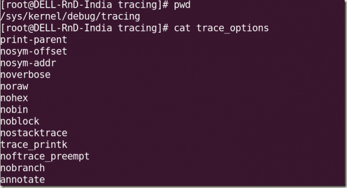

<!-- @import "[TOC]" {cmd="toc" depthFrom=1 depthTo=6 orderedList=false} -->

<!-- code_chunk_output -->

- [基本介绍](#基本介绍)
- [预备知识](#预备知识)
- [设置ftrace](#设置ftrace)
  - [配置debugfs](#配置debugfs)
  - [配置tracer选项](#配置tracer选项)
- [跟踪](#跟踪)
  - [tracing目录](#tracing目录)
  - [启用追踪器](#启用追踪器)
  - [开始追踪](#开始追踪)
  - [Trace选项](#trace选项)
- [ftrace之特殊进程](#ftrace之特殊进程)
- [函数图跟踪器](#函数图跟踪器)
- [动态跟踪](#动态跟踪)
- [事件跟踪](#事件跟踪)
- [参考](#参考)

<!-- /code_chunk_output -->

本文探索如何建立ftrace并能理解如何跟踪函数。ftrace对于内核开发者和设备驱动开发者在调试内核问题的时候应该很有用。

# 基本介绍

ftrace（函数跟踪）是内核跟踪的“瑞士军刀”。它是**内建**在**Linux内核**中的一种**跟踪机制**。它能深入内核去发现里面究竟发生了什么，并调试它。

ftrace**不只是一个函数跟踪工具**，它的跟踪能力之强大，还能调试和分析诸如延迟、意外代码路径、性能问题等一大堆问题。它也是一种很好的学习工具。

ftrace是由Steven Rostedy和Ingo Molnar在内核2.6.27版本中引入的。它有自己**存储跟踪数据**的**环形缓冲区**，并使用**GCC配置机制**。

# 预备知识

你需要一台有内核开发环境的32位或者64位Linux机器，内核版本越新越好（内核越新，跟踪选项就越多）。

# 设置ftrace

## 配置debugfs

使用ftrace要求你的机器上配置有debugfs。

debugfs应该被挂载在/sys/kernel/debugfs，如果跟踪选项已启用，你应该能够在debugfs下面看到一个叫tracing的目录。

如果没有挂载debugfs，请按以下操作：

```
# mount -t debugfs nodev /sys/kernel/debug
```

## 配置tracer选项

如果你看不到tracing子目录的话，你应该在内核配置上启用相关选项，然后重编译内核。

请在你的内核配置中找到如图所示的选项，启用它们：

Kernel Hacking -> Tracers:

1. Kernel Function Tracer (FUNCTION_TRACER) 
2. Kernel Function Graph Tracer (FUNCTION_GRAPH_TRACER) 
3. Enable/disable ftrace dynamically (DYNAMIC_FTRACE) 
4. Trace max stack (STACK_TRACER)


根据你的架构，在选择上面的选项时，一些其他的选项根据依赖关系可能也会自动被启用。上面所列的选项主要是用于跟踪所用。内核编译完成之后，你只需要重启机器，tracing功能就可以用了。

# 跟踪

## tracing目录

tracing目录（`/sys/kernel/debug/tracing`）中的文件（如图2所示）控制着跟踪的能力。根据你在内核配置时的选项的不同，这里列的文件可能稍有差异。你可以在内核源代码目录下/Documentation/trace[1]目录中找到这些文件的信息。


让我们看看里面几个重要的文件： 

- `available_tracers`: 这表示**哪些**被编译里系统的**跟踪器**。 
- `current_tracer`: 这表示**当前启用**的哪个跟踪器。可以通过**echo**向表输入一个新的跟踪器来改变相应值。 
- `tracing_enabled`: 让你可以**启用或者禁用当前跟踪功能** 
- `trace`: 实际的**跟踪输出**。 
- `set_ftrace_pid`: 设置跟踪所作用的进程的PID。 

要找到**哪些跟踪器可用**，你可以对`available_tracers`文件执行cat操作。

与输出空间分离的跟踪器有：nop（它**不是一个跟踪器**，是**默认设置的一个值**）、函数（函数跟踪器）、函数图（函数图跟踪器），等等，如下所示：

```
# cat /sys/kernel/debug/tracing/available_tracers
hwlat blk function_graph wakeup_dl wakeup_rt wakeup function nop
```

## 启用追踪器

当你知道你需要使用**哪个跟踪器**后，**启用**它（ftrace**每次只能打开一个跟踪器**）：

```
# cat current_tracer ##查看当前在用哪个跟踪器。 

# echo function > current_tracer ##选择一个特定的跟踪器。 

# cat current_tracer ##检查是否是你所设置的跟踪器。
```

## 开始追踪

使用下面的命令可以开始跟踪：

```
# echo 1 > tracing_enabled ##初始化跟踪。 

# cat trace > /tmp/trace.txt ##将跟踪文件保存到一个临时文件。 

# 停顿一会儿

# echo 0 > tracing_enabled ##禁用跟踪功能 

# cat /tmp/trace.txt ##查看trace文件的输出。
```

现在trace文件的输入在trace.txt文件中。通过上面操作所得到的函数跟踪的一个示例输出如图3所示。


## Trace选项

让我们从tracer的选项开始。tracing的输入可以由一个叫`trace_options`的文件控制。可以通过更新`/sys/kernel/debug/tracing/trace_options`文件的选项来**启用或者禁用各种域**。

`trace_options`的一个示例如图1所示。



要**禁用一个跟踪选项**，只需要在相应行首加一个“no”即可。比如, `echo notrace_printk > trace_options`。（no和选项之间没有空格。）要再次启用一个跟踪选项，你可以这样：`echo trace_printk > trace_options`。

# ftrace之特殊进程

ftrace允许你对一个特殊的进程进行跟踪。在`/sys/kernel/debug/tracing`目录下，文件`set_ftrace_pid`的值要更新为你想跟踪的进程的PID。

以下traceprocess.sh示例脚本向你展示了如何抓取当前运行的进程的PID，并进行相应跟踪。

```

```

如图中跟踪ls命令所示。


当跟踪完成后，你需要清除`set_ftrace_pid`文件，请用如下命令：

```
> set_ftrace_pid
```

# 函数图跟踪器

函数图跟踪器对函数的进入与退出进行跟踪，这对于跟踪它的执行时间很有用。函数执行时间**超过10微秒**的标记一个`“+”`号，**超过1000微秒**的标记为一个`“！”`号。通过`echo function_graph > current_tracer`可以启用函数图跟踪器。示例输入如图3所示。


有很多跟踪器，所有的列表在`linux/Documentation/trace/ftrace.txt`文件中找得到。通过将跟踪器的名字echo到`current_tracer`文件中可以启用或禁用相应跟踪器。

# 动态跟踪

我们会很轻易地被淹没在函数跟踪器所抛给我们的大量数据中。有一种动态的方法可以过滤出我们所需要的函数，排除那些我们不需要的：在文件`set_ftrace_filter`中指明。（首先从`available_filter_functions`文件中找到你需要的函数。）图4就是一个动态跟踪的例子。


如你所看到的，你甚至可以对函数的名字使用**通配符**。我需要用所有的`vmalloc_`函数，通过`echo vmalloc_* > set_ftrace_filter`进行设置。

# 事件跟踪

也可以在系统特定事件触发的时候打开跟踪。可以在available_events文件中找到所有可用的系统事件：

```
# cat available_events | head -10
devlink:devlink_hwmsg
sunrpc:rpc_call_status
sunrpc:rpc_bind_status
sunrpc:rpc_connect_status
sunrpc:rpc_task_begin
sunrpc:rpc_task_run_action
sunrpc:rpc_task_complete
sunrpc:rpc_task_sleep
sunrpc:rpc_task_wakeup
sunrpc:rpc_socket_state_change
```

比如，为了启用某个事件，你需要：`echo sys_enter_nice >> set_event`（注意你是将事件的名字追加到文件中去，使用>>追加定向器，不是>）。要禁用某个事件，需要在名字前加上一个“!”号：echo '!sys_enter_nice' >> set_event。图5是一个事件跟踪场景示例。同样，可用的事件是列在事件目录里面的。


# 参考

https://www.cnblogs.com/jefree/p/4439007.html