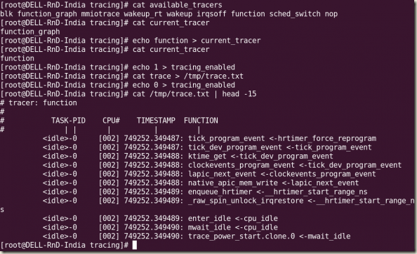
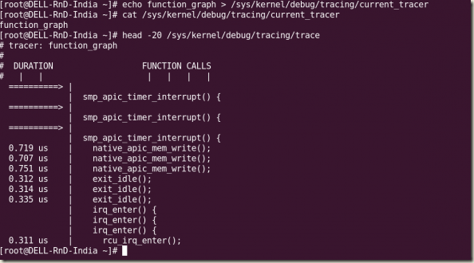
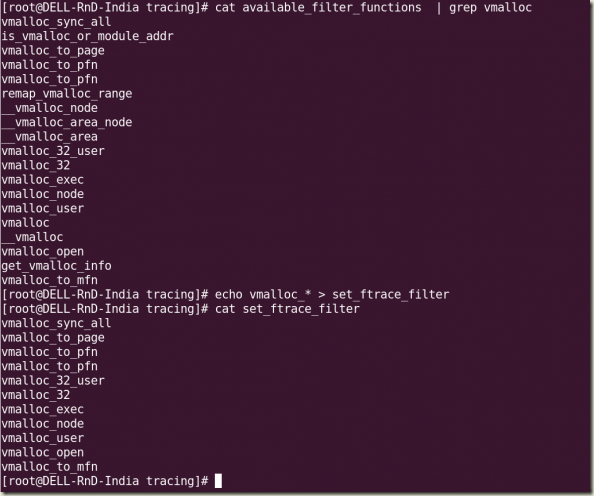
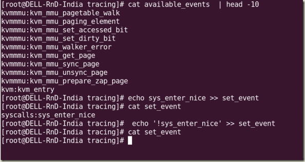

<!-- @import "[TOC]" {cmd="toc" depthFrom=1 depthTo=6 orderedList=false} -->

<!-- code_chunk_output -->

  - [4.3. 设置追踪器](#43-设置追踪器)
  - [4.4. 开始追踪并查看](#44-开始追踪并查看)
  - [4.5. 清空trace](#45-清空trace)
- [5. Trace选项(启用或禁用)](#5-trace选项启用或禁用)
- [6. ftrace之特殊进程](#6-ftrace之特殊进程)
- [7. 函数图跟踪器](#7-函数图跟踪器)
- [8. 动态跟踪(过滤只查看)](#8-动态跟踪过滤只查看)
- [9. trace_printk](#9-trace_printk)
- [10. 事件跟踪](#10-事件跟踪)
- [11. trace-cmd and KernelShark](#11-trace-cmd-and-kernelshark)
- [12. 参考](#12-参考)

<!-- /code_chunk_output -->
## 4.3. 设置追踪器


## 4.4. 开始追踪并查看

使用下面的命令可以开始跟踪：

```


```

现在trace文件的输入在trace.txt文件中。通过上面操作所得到的函数跟踪的一个示例输出如图3所示。



一旦将函数追踪器启动，ftrace会记录所有函数的运行情况, 如果想要禁用或只查看某一些, 需要通过`trace_options`或`set_ftrace_pid`或`set_ftrace_filter`, 然后再设置`current_tracer`并开启追踪

```
# cat  available_tracers
blk function_graph mmiotrace wakeup_rtwakeup function nop

# echo schedule > set_ftrace_filter     ## 仅记录schedule
# cat set_ftrace_filter
schedule

# echo function > current_tracer
# cat current_tracer
function

# echo 1 > tracing_on

# 停顿会儿

# echo 0 > tracing_on
# cat trace > /tmp/trace.txt
# > trace
```

## 4.5. 清空trace

```
# echo 0 > tracing_on   ## 禁用跟踪功能

# echo 0 > trace        ## 或者 > trace
```

# 5. Trace选项(启用或禁用)

让我们从tracer的选项开始。

tracing的输入可以由一个叫`trace_options`的文件控制。

可以通过更新`/sys/kernel/debug/tracing/trace_options`文件的选项来**启用或者禁用各种域**。

`trace_options`的一个示例如图1所示。


要**禁用一个跟踪选项**，只需要在相应行首加一个“no”即可。

比如, `echo notrace_printk > trace_options`。（no和选项之间没有空格。）要再次启用一个跟踪选项，你可以这样：`echo trace_printk > trace_options`。

# 6. ftrace之特殊进程

ftrace允许你对一个特殊的进程进行跟踪。在`/sys/kernel/debug/tracing`目录下，文件`set_ftrace_pid`的值要更新为你想跟踪的进程的PID。

以下traceprocess.sh示例脚本向你展示了如何抓取当前运行的进程的PID，并进行相应跟踪。

```

```

如图中跟踪ls命令所示。


当跟踪完成后，你需要清除`set_ftrace_pid`文件，请用如下命令：

```
> set_ftrace_pid
```

# 7. 函数图跟踪器

函数图跟踪器对函数的进入与退出进行跟踪，这对于跟踪它的执行时间很有用。函数执行时间**超过10微秒**的标记一个`“+”`号，**超过1000微秒**的标记为一个`“！”`号。通过`echo function_graph > current_tracer`可以启用函数图跟踪器。示例输入如图3所示。



有很多跟踪器，所有的列表在`linux/Documentation/trace/ftrace.txt`文件中找得到。通过将跟踪器的名字echo到`current_tracer`文件中可以启用或禁用相应跟踪器。

# 8. 动态跟踪(过滤只查看)

我们会很轻易地被淹没在函数跟踪器所抛给我们的大量数据中。

有一种动态的方法可以过滤出我们所需要的函数，排除那些我们不需要的：在文件`set_ftrace_filter`中指明。（首先从`available_filter_functions`文件中找到你需要的函数。）

注: 在编译内核时配置了动态 ftrace （选中 CONFIG_DYNAMIC_FTRACE 选项）后使用.

图4就是一个动态跟踪的例子。



如你所看到的，你甚至可以对函数的名字使用**通配符**。

我需要用所有的`vmalloc_`函数，通过`echo vmalloc_* > set_ftrace_filter`进行设置。

另外，在参数前面加上`:mod:`，可以仅追踪指定模块中包含的函数（注意，模块必须已经加载）。例如：

```
root@thinker:/sys/kernel/debug/tracing# echo 'write*:mod:ext3' > set_ftrace_filter
```

仅追踪**ext3模块**中包含的以**write开头**的函数。


`set_ftrace_notrace`用于指定不跟踪的函数。如果一个函数名同时出现在这两个文件中，则这个函数的执行状况不会被跟踪。

# 9. trace_printk

`trace_printk`打印调试信息后，将`current_tracer`设置为**nop**，将`tracing_on`设置为1，调用相应模块执行，即可通过trace文件看到`trace_printk`打印的信息。

# 10. 事件跟踪

也可以在系统**特定事件触发**的时候打开跟踪。可以在`available_events`文件中找到所有可用的系统事件：

```
# cat available_events | head -10
devlink:devlink_hwmsg
sunrpc:rpc_call_status
sunrpc:rpc_bind_status
sunrpc:rpc_connect_status
sunrpc:rpc_task_begin
sunrpc:rpc_task_run_action
sunrpc:rpc_task_complete
sunrpc:rpc_task_sleep
sunrpc:rpc_task_wakeup
sunrpc:rpc_socket_state_change
```

比如，为了启用某个事件，你需要：`echo sys_enter_nice >> set_event`（注意你是将事件的名字追加到文件中去，使用`>>`追加定向器，不是`>`）。要禁用某个事件，需要在名字前加上一个“!”号：`echo '!sys_enter_nice' >> set_event`。

图5是一个事件跟踪场景示例。同样，可用的事件是列在事件目录里面的。



有关事件跟踪的更多细节，请阅读内核目录下`Documents/Trace/events.txt`文件。

# 11. trace-cmd and KernelShark

trace-cmd是由Steven Rostedt在2009年发在LKML上的，它可以让操作跟踪器更简单。以下几步是获取最新的版本并装在你的系统上，包括它的GUI工具KernelShark。

```
wget http://ftp.be.debian.org/pub/linux/analysis/trace-cmd/trace-cmd-1.0.5.tar.gz

tar -zxvf trace-cmd-1.0.5.tar.gz

cd trace-cmd*

make

make gui # compiles GUI tools (KernelShark)[3]

make install

make install_gui # installs GUI tools
```

有了trace-cmd，跟踪将变得小菜一碟（见图6的示例用法）：

```
trace-cmd list ##to see available events 

trace-cmd record -e syscalls ls ##Initiate tracing on the syscall 'ls' 

##(A file called trace.dat gets created in the current directory.) 

trace-cmd report ## displays the report from trace.dat
```


通过上面的make install_gui命令安装的KernelShark可以用于分析trace.dat文件中的跟踪数据，如图7所示。


# 12. 参考

https://www.cnblogs.com/jefree/p/4439007.html