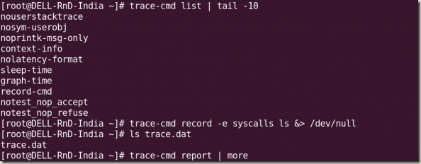
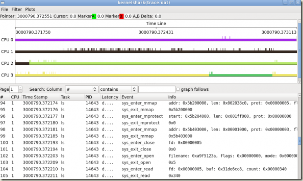

<!-- @import "[TOC]" {cmd="toc" depthFrom=1 depthTo=6 orderedList=false} -->

<!-- code_chunk_output -->

- [5. Trace选项(启用或禁用)](#5-trace选项启用或禁用)
- [8.](#8)
- [9. trace_printk](#9-trace_printk)
- [10. 事件跟踪](#10-事件跟踪)
- [11. trace-cmd and KernelShark](#11-trace-cmd-and-kernelshark)
- [12. 参考](#12-参考)

<!-- /code_chunk_output -->

# 5. Trace选项(启用或禁用)

让我们从tracer的选项开始。

tracing的输入可以由一个叫`trace_options`的文件控制。

可以通过更新`/sys/kernel/debug/tracing/trace_options`文件的选项来**启用或者禁用各种域**。

`trace_options`的一个示例如图1所示。


要**禁用一个跟踪选项**，只需要在相应行首加一个“no”即可。

比如, `echo notrace_printk > trace_options`。（no和选项之间没有空格。）要再次启用一个跟踪选项，你可以这样：`echo trace_printk > trace_options`。
# 8. 
# 9. trace_printk

`trace_printk`打印调试信息后，将`current_tracer`设置为**nop**，将`tracing_on`设置为1，调用相应模块执行，即可通过trace文件看到`trace_printk`打印的信息。

# 10. 事件跟踪

也可以在系统**特定事件触发**的时候打开跟踪。可以在`available_events`文件中找到所有可用的系统事件：

```
# cat available_events | head -10
devlink:devlink_hwmsg
sunrpc:rpc_call_status
sunrpc:rpc_bind_status
sunrpc:rpc_connect_status
sunrpc:rpc_task_begin
sunrpc:rpc_task_run_action
sunrpc:rpc_task_complete
sunrpc:rpc_task_sleep
sunrpc:rpc_task_wakeup
sunrpc:rpc_socket_state_change
```

比如，为了启用某个事件，你需要：`echo sys_enter_nice >> set_event`（注意你是将事件的名字追加到文件中去，使用`>>`追加定向器，不是`>`）。要禁用某个事件，需要在名字前加上一个“!”号：`echo '!sys_enter_nice' >> set_event`。

图5是一个事件跟踪场景示例。同样，可用的事件是列在事件目录里面的。


有关事件跟踪的更多细节，请阅读内核目录下`Documents/Trace/events.txt`文件。

# 11. trace-cmd and KernelShark

trace-cmd是由Steven Rostedt在2009年发在LKML上的，它可以让操作跟踪器更简单。以下几步是获取最新的版本并装在你的系统上，包括它的GUI工具KernelShark。

```
wget http://ftp.be.debian.org/pub/linux/analysis/trace-cmd/trace-cmd-1.0.5.tar.gz

tar -zxvf trace-cmd-1.0.5.tar.gz

cd trace-cmd*

make

make gui # compiles GUI tools (KernelShark)[3]

make install

make install_gui # installs GUI tools
```

有了trace-cmd，跟踪将变得小菜一碟（见图6的示例用法）：

```
trace-cmd list ##to see available events 

trace-cmd record -e syscalls ls ##Initiate tracing on the syscall 'ls' 

##(A file called trace.dat gets created in the current directory.) 

trace-cmd report ## displays the report from trace.dat
```



通过上面的make install_gui命令安装的KernelShark可以用于分析trace.dat文件中的跟踪数据，如图7所示。



# 12. 参考

https://www.cnblogs.com/jefree/p/4439007.html