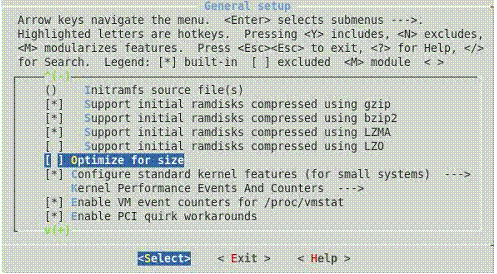
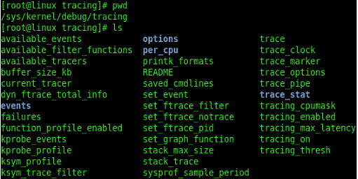

# 简介

## ftrace

ftrace 是 Linux 内核中提供的一种调试工具。使用 ftrace 可以对内核中发生的事情进行跟踪，这在调试 bug 或者分析内核时非常有用。

## 本文概述

本系列文章对 ftrace 进行了介绍，分为三部分。本文是第一部分，介绍了内核相关的编译选项、用户态访问 ftrace 的接口、ftrace 的数据文件，并对 ftrace 提供的跟踪器的用途进行了介绍，以使读者更好的了解和使用该工具。

## 主要用途

ftrace 是内建于 Linux 内核的跟踪工具，从 2.6.27 开始加入主流内核。使用 ftrace 可以调试或者分析内核中发生的事情。

ftrace 提供了**不同的跟踪器**，以用于**不同的场合**，比如跟踪**内核函数调用**、对**上下文切换**进行跟踪、查看**中断被关闭的时长**、跟踪**内核态中的延迟**以及**性能问题**等。

系统开发人员可以使用 ftrace 对内核进行**跟踪调试**，以找到内核中出现的问题的根源，方便对其进行修复。

另外，对内核感兴趣的读者还可以通过 ftrace 来观察**内核中发生的活动**，了解内核的**工作机制**。

# ftrace内核编译选项

使用 ftrace ，首先要将其**编译进内核**。

## 内核源码编译选项

内核源码目录下的 `kernel/trace/Makefile` 文件给出了 ftrace 相关的**编译选项**。

清单 1. ftrace 相关的配置选项列表:

```
CONFIG_FUNCTION_TRACER 
CONFIG_FUNCTION_GRAPH_TRACER 
CONFIG_CONTEXT_SWITCH_TRACER 
CONFIG_NOP_TRACER 
CONFIG_SCHED_TRACER 
...
```

ftrace 相关的配置选项比较多，针对不同的跟踪器有各自对应的配置选项。不同的选项有不同的依赖关系，内核源码目录下的 `kernel/trace/Kconfig` 文件描述了这些**依赖关系**。读者可以参考 `Makefile` 文件和 `Konfig` 文件，然后选中自己所需要的跟踪器。

## make menuconfig配置项

通常在配置内核时，使用 `make menuconfig` 会更直观一些。

以 2.6.33.1 版本的内核为例，要将 ftrace 编译进内核，可以选中 Kernel hacking （图 1 ）下的 Tracers 菜单项（图 2 ）。

图 1. Kernel hacking:


图 2. Tracers:


进入 Tracers 菜单下，可以看到内核支持的跟踪器列表。如图 3 所示，这里选中了所有的跟踪器，读者可以根据自己的需要选中特定的跟踪器。

图 3. 内核支持的跟踪器列表:


这里要注意，如果是在 32 位 x86 机器上，编译时不要选中 General setup 菜单项（图 4 ）下的 Optimize for size 选项（图 5 ），否则就无法看到图 3 中的 `Kernel Function Graph Tracer` 选项。这是因为在 Konfig 文件中，针对 32 位 x86 机器，表项 `FUNCTION_GRAPH_TRACER` 有一个特殊的依赖条件：

```
depends on !X86_32 || !CC_OPTIMIZE_FOR_SIZE
```

图 4. General setup


图 5. Optimize for size



# debugfs支持

## 内核编译选项

ftrace 通过 **debugfs** 向**用户态**提供了**访问接口**，所以还需要将 debugfs 编译进内核。

激活对 debugfs 的支持，可以直接编辑内核配置文件 `.config` ，设置 `CONFIG_DEBUG_FS=y` ；或者在 `make menuconfig` 时到 `Kernel hacking` 菜单下选中对 debugfs 文件系统的支持，如图 6 所示。

图 6. debugfs 编译选项


配置完成后，**编译安装新内核**，然后**启动到新内核**。 

## 内核编译

注意，激活 ftrace 支持后，编译内核时会使用编译器的 `-pg` 选项，这是在 `kernel/trace/Makefile` 文件中定义的，如清单 2 所示。

清单 2. 激活编译选项 `-pg`

```
ifdef CONFIG_FUNCTION_TRACER 
ORIG_CFLAGS := $(KBUILD_CFLAGS) 
KBUILD_CFLAGS = $(subst -pg,,$(ORIG_CFLAGS)) 
... 
endif 
...
```

使用 `-pg` 选项会在编译得到的内核映像中加入大量的调试信息。一般情况下，只是在开发测试阶段激活 ftrace 支持，以调试内核，修复 bug 。最终用于发行版的内核则会关闭 `-pg` 选项，也就无法使用 ftrace。

# 通过 debugfs 访问 ftrace

ftrace 通过 debugfs 向用户态提供访问接口。配置内核时激活 debugfs 后会创建目录 `/sys/kernel/debug` ，debugfs 文件系统就是挂载到该目录。要挂载该目录，需要将如下内容添加到 `/etc/fstab` 文件：

```
debugfs  /sys/kernel/debug  debugfs  defaults  0  0
```

或者可以在运行时挂载：

```
mount  -t  debugfs  nodev  /sys/kernel/debug
```

激活内核对 ftrace 的支持后会在 debugfs 下创建一个 **tracing 目录** /sys/kernel/debug/tracing 。该目录下包含了 ftrace 的控制和输出文件，如图 7 所示。根据编译内核时针对 ftrace 的设定不同，该目录下实际显示的文件和目录与这里也会不同。

图 7. tracing 目录下的文件



# ftrace 的数据文件

/sys/kernel/debug/trace 目录下文件和目录比较多，有些是各种跟踪器共享使用的，有些是特定于某个跟踪器使用的。

在**操作这些数据文件**时，通常使用 echo 命令来修改其值，也可以在程序中通过文件读写相关的函数来操作这些文件的值。

下面只对部分文件进行描述，读者可以参考内核源码包中 `Documentation/trace` 目录下的**文档**以及 `kernel/trace` 下的**源文件**以了解其余文件的用途。 

- README文件提供了一个简短的使用说明，展示了 ftrace 的操作命令序列。可以通过 cat 命令查看该文件以了解概要的操作流程。
- `current_tracer`用于设置或显示当前使用的跟踪器；使用 echo 将跟踪器名字写入该文件可以切换到不同的跟踪器。系统启动后，其缺省值为 nop ，即不做任何跟踪操作。在执行完一段跟踪任务后，可以通过向该文件写入 nop 来重置跟踪器。
- `available_tracers`记录了当前编译进内核的跟踪器的列表，可以通过 cat 查看其内容；其包含的跟踪器与图 3 中所激活的选项是对应的。写 `current_tracer` 文件时用到的跟踪器名字必须在该文件列出的跟踪器名字列表中。
- `trace`文件提供了查看获取到的跟踪信息的接口。可以通过 cat 等命令查看该文件以查看跟踪到的内核活动记录，也可以将其内容保存为记录文件以备后续查看。
- `tracing_enabled`用于控制 `current_tracer` 中的跟踪器是否可以跟踪内核函数的调用情况。写入 0 会关闭跟踪活动，写入 1 则激活跟踪功能；其缺省值为 1 。
- `set_graph_function`设置要清晰显示调用关系的函数，显示的信息结构类似于 C 语言代码，这样在分析内核运作流程时会更加直观一些。在使用 function_graph 跟踪器时使用；缺省为对所有函数都生成调用关系序列，可以通过写该文件来指定需要特别关注的函数。
- `buffer_size_kb`用于设置单个 CPU 所使用的跟踪缓存的大小。跟踪器会将跟踪到的信息写入缓存，每个 CPU 的跟踪缓存是一样大的。跟踪缓存实现为环形缓冲区的形式，如果跟踪到的信息太多，则旧的信息会被新的跟踪信息覆盖掉。注意，要更改该文件的值需要先将 current_tracer 设置为 nop 才可以。
- tracing_on用于控制跟踪的暂停。有时候在观察到某些事件时想暂时关闭跟踪，可以将 0 写入该文件以停止跟踪，这样跟踪缓冲区中比较新的部分是与所关注的事件相关的；写入 1 可以继续跟踪。 
- available_filter_functions记录了当前可以跟踪的内核函数。对于不在该文件中列出的函数，无法跟踪其活动。 
- set_ftrace_filter和 set_ftrace_notrace在编译内核时配置了动态 ftrace （选中 CONFIG_DYNAMIC_FTRACE 选项）后使用。前者用于显示指定要跟踪的函数，后者则作用相反，用于指定不跟踪的函数。如果一个函数名同时出现在这两个文件中，则这个函数的执行状况不会被跟踪。这些文件还支持简单形式的含有通配符的表达式，这样可以用一个表达式一次指定多个目标函数；具体使用在后续文章中会有描述。注意，要写入这两个文件的函数名必须可以在文件 available_filter_functions 中看到。缺省为可以跟踪所有内核函数，文件 set_ftrace_notrace 的值则为空。

# ftrace 跟踪器

ftrace 当前包含多个跟踪器，用于跟踪不同类型的信息，比如进程调度、中断关闭等。可以查看文件 available_tracers 获取内核当前支持的跟踪器列表。在编译内核时，也可以看到内核支持的跟踪器对应的选项，如之前图 3 所示。

nop跟踪器不会跟踪任何内核活动，将 nop 写入 current_tracer 文件可以删除之前所使用的跟踪器，并清空之前收集到的跟踪信息，即刷新 trace 文件。
function跟踪器可以跟踪内核函数的执行情况；可以通过文件 set_ftrace_filter 显示指定要跟踪的函数。
function_graph跟踪器可以显示类似 C 源码的函数调用关系图，这样查看起来比较直观一些；可以通过文件 set_grapch_function 显示指定要生成调用流程图的函数。
sched_switch跟踪器可以对内核中的进程调度活动进行跟踪。 
irqsoff跟踪器和 preemptoff跟踪器分别跟踪关闭中断的代码和禁止进程抢占的代码，并记录关闭的最大时长，preemptirqsoff跟踪器则可以看做它们的组合。 
ftrace 还支持其它一些跟踪器，比如 initcall、ksym_tracer、mmiotrace、sysprof 等。ftrace 框架支持扩展添加新的跟踪器。读者可以参考内核源码包中 Documentation/trace 目录下的文档以及 kernel/trace 下的源文件，以了解其它跟踪器的用途和如何添加新的跟踪器。


# 参考

https://www.cnblogs.com/jefree/p/4438982.html