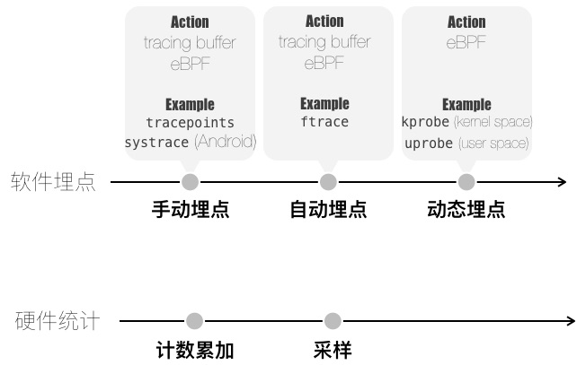
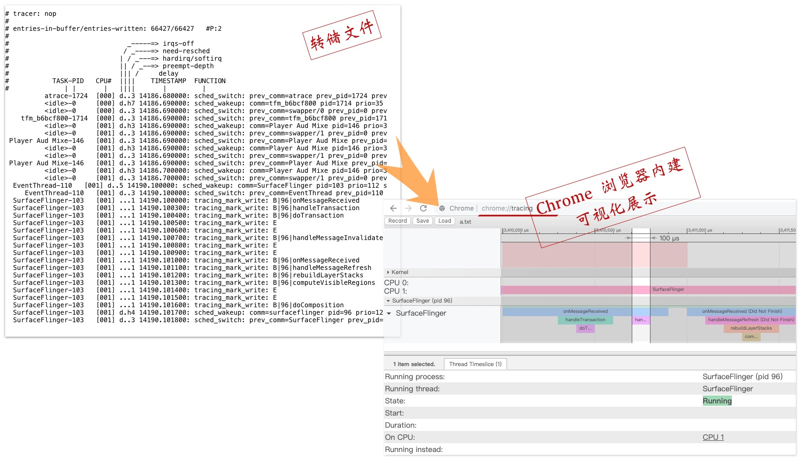
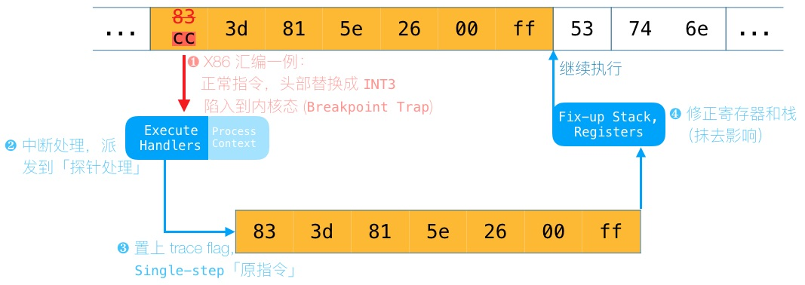
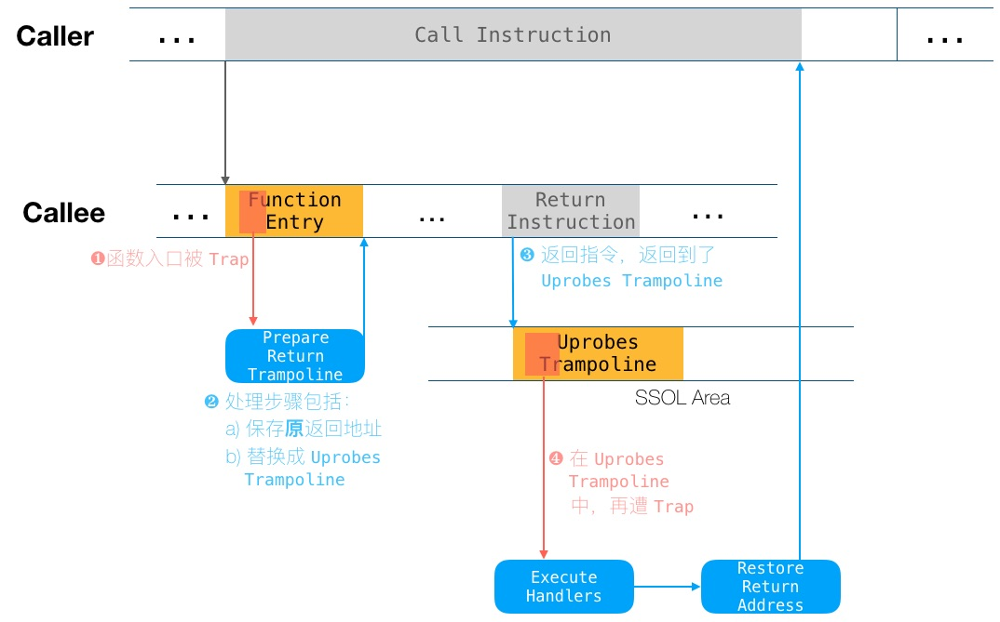

# Linux profiling 手段一览



为方便介绍，将 Linux Profiling 手段分为两大类：

- 软件埋点：

    - 手动埋点：主动调用 trace 函数来实现埋点。

    Android systrace 即是这样一个例子，如图 2 和 图 3 所示

    - 自动埋点：借助工具链，自动埋点，对函数的 entry 和 return 进行 hook。

    Linux ftrace 即是这样一个例子，图 4 简示了其实现原理

    - 动态埋点：运行时刻，在指定位置上加断点，断点触发时执行相应 handler。

    Handler 为注入内核的 eBPF 字节码

    Linux kprobe / uprobe 就是这样的例子，图 5 和 图 6 简示了 uprobe 以及 uretprobe 的实现原理

- 硬件统计

    - 计数累加：统计一段时间内，某个性能监控单元（PMU）的计数。

    例如：perf stat -e cache-misses -p PID，参见 brendangregg.com/perf.html ，Counting Events 一节

    函数接口：参见 libperf 的封装，fd = perf_event_open(...); read(fd, …)

    - 采样：计数达标，产生中断，伴随 Backtrace 对应到代码行。

    例如：perf record -F 99 -p PID sleep 10，以及对应图形化展示 FlameGraph

    函数接口：参见 perf_event_open，fd = perf_event_open(…); void *addr = mmap(…, fd, …);

图 7 简示了其实现原理

# Android systrace 工作原理


- User space，分为两部分

    - 埋点处：通过嵌入代码中的 Trace API 调用，向 Linux kernel 的 tracing buffer 写日志。

    上图中，裸示了写 tracing buffer 的过程

    - atrace：读取 tracing buffer，存于磁盘文件，以免 tracing buffer 溢出丢失信息。

- Kernel space，通过 scheduler 嵌入的 tracepoint，将调度事件，写入 tracing buffer。

    tracing buffer 犹如一段 in-memory 的日志流，对齐了写入的各个标记和事件。

# Android atrace 输出文件及图形化展示



atrace 转储的 tracing buffer 内容，以及载入到 Chrome 浏览器，进行图形化分析。

>Discuss：想象一个进程同时播放两段视频，视频解码库是多线程的，线程来自全局的 thread pool。通过 systrace，能区分这两个视频播放任务的 CPU 时间片吗？

# Linux ftrace 实现原理回顾


- 通过 `gcc -pg` 选项，**编译**时，**函数开头**自动插入 `_mcount` 调用。

- `_mcount` 处：除了 hook entry ，还通过修改返回地址，来 hook return。

Linux kernel 热补丁方案，”kernel livepatch“，便借用了 ftrace 的原理：替换有漏洞的函数实现，从而实现热补丁。

更多关于 ftrace 使用，参考[「Advanced Features of Ftrace」](https://events.static.linuxfound.org/sites/events/files/slides/linuxconjapan-ftrace-2014.pdf)

# uprobe 的实现原理



注：上图修改自 [dev.framing.life/tracing/kernel-and-user-probes-magic](https://dev.framing.life/tracing/kernel-and-user-probes-magic/)

指定位置上的指令，头部修改为**软件中断指令**（同时原指令存档他处）：

1. 当执行到该位置时，触发**软件中断**，陷入内核
2. 在内核，**执行**以 **eBPF 字节码**形式注入的 **Handler**
3. **单步执行原指令**
4. 修正寄存器和栈，回到**原有指令流**

>Discuss：这与 gdb 中设断点有什么区别？

>断点的 Handler 运行于 Kernel space，无需多次的 User space ↔ Kernel space 通信

>Discuss：用户空间注入的 Handler 在 Kernel space 执行，安全性如何保证？

>听说过 eBPF 吗？

简单介绍下 extended Berkeley Packet Filter（eBPF）

* 一种功能有限、沙箱化的字节码。
* 由 User space 注入到 Kernel space 执行。
* 基于 BPF 扩展。

原始的 BPF 用于网路包过滤，下面是一个 BPF 裸用的例子：

```cpp
/**
* 通过 netlink socket，获得关心进程的消亡信息
*/
int sock_fd = socket(PF_NETLINK, SOCK_DGRAM | SOCK_NONBLOCK | SOCK_CLOEXEC, NETLINK_CONNECTOR);

union {
  struct sockaddr sa;
  struct sockaddr_nl nl;
} addr = { .nl.nl_family = AF_NETLINK, .nl.nl_pid = getpid(), .nl.nl_groups = CN_IDX_PROC };

enum proc_cn_mcast_op op = PROC_CN_MCAST_LISTEN;
struct cn_msg cn_msg = { .id.idx = CN_IDX_PROC, .id.val = CN_VAL_PROC, .len = sizeof(op) };

struct iovec iov[3] = {
  [0] = { .iov_base = nlmsghdrbuf, .iov_len = NLMSG_LENGTH(0) },
  [1] = { .iov_base = &cn_msg,     .iov_len = sizeof(cn_msg) },
  [2] = { .iov_base = &op,         .iov_len = sizeof(op) }
};

bind(sock_fd, &addr.sa, sizeof(addr.nl));

/* start proc connector */
writev(sock_fd, iov, 3);

/* 借助 BPF，从 Process Events 中，滤出「进程消亡事件」 */
struct sock_filter filter[] = {
  ...
  /* 6-7: filter out proc connector message other than 'PROC_EVENT_EXIT' */
  BPF_STMT(BPF_LD|BPF_W|BPF_ABS,
           NLMSG_LENGTH(0) + offsetof(struct cn_msg, data)
                           + offsetof(struct proc_event, what)),
  BPF_JUMP(BPF_JMP|BPF_JEQ|BPF_K,
           htonl(PROC_EVENT_EXIT), 0 /* true offset */, 1 /* false offset */),

  /* 8: the @ret_cmd_idx */
  BPF_STMT (BPF_RET|BPF_K, 0xffffffff),
  /* 9: the @drop_cmd_idx */
  BPF_STMT (BPF_RET|BPF_K, 0)
};

struct sock_fprog fprog = { .filter = filter, .len = 10 };

setsockopt (sock_fd, SOL_SOCKET, SO_ATTACH_FILTER, &fprog, sizeof (fprog)) < 0)
```

eBPF 形式上类似，裸用相当不方便，好在有编译器 bcc，以及高级语言 bpftrace。

# uretprobe 工作原理

图 5 展示的是 **User level 埋点**，故而叫做 **uprobe**。**Kernel level** 对应款叫做 **kprobe**。

uprobe 和 kprobe 的通常用法中，以**函数入口地址！！！**，进行**埋点**。而对于**函数返回**，其位置可能有**多处**：

```cpp
int foo(..) {
    size_t n_written = 0;
    if (cond1) return -EINVAL;
    if (cond2) goto fail;
    n_written = do_io(...);
    return n_written;
fail:
  free(...); return -EIO;
}
```

于是就有了 **kretprobe** 以及 **uretprobe**。下图展示了 uretprobe 工作原理，同样修改自[dev.framing.life/tracing/kernel-and-user-probes-magic](https://dev.framing.life/tracing/kernel-and-user-probes-magic/)



uprobe 的工作流中，需要**指定位置**方能埋点。除了上述提及的函数 **entry** & **return**，在**函数中间某处埋点**，意味着要**反汇编**，找到源代码行对应汇编地址，有些反人类。

于是，可以预先在代码中埋“标记”，再通过 uprobe 找到“标记”，进行埋点 —— USDT（User Statically-Defined Tracing） 就是这样一个技术，其实现简介参见这个链接。

节末，再提一个 uprobe 应用 “malloc() Flame Graph” ，通过埋点 malloc() / free() 来剖析目标进程的内存使用情况，分析是否存在泄漏。

# 参考

https://tinylab.org/linux-profiling-methods-overview