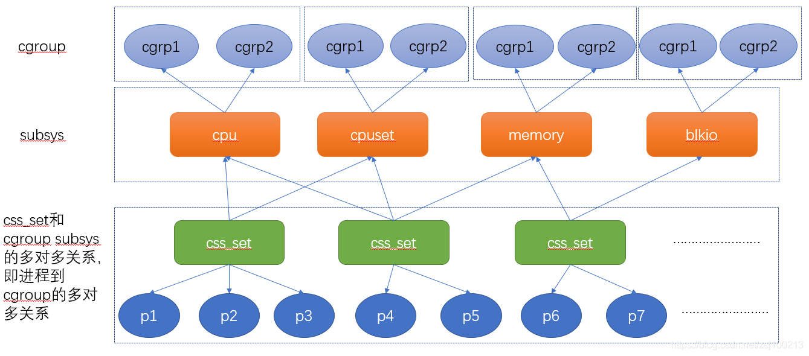

前置：这里使用的linux版本是4.8，x86体系。

cgroup_init_early();

聊这个函数就需要先了解cgroup。

# cgroup概念

这个函数就是初始化cgroup所需要的参数的。cgroup最初是在2006年由google的一名工程师提出的，目的是把一些共同目标的进程放在一个组里面，而这个组里面的进程能共享指定数额的资源。而后就有了cgroup这个概念了。

我们把每种资源叫做子系统，比如CPU子系统，内存子系统。为什么叫做子系统呢，因为它是从整个操作系统的资源衍生出来的。然后我们创建一种虚拟的节点，叫做cgroup，然后这个虚拟节点可以扩展，以树形的结构，有root节点，和子节点。这个父节点和各个子节点就形成了层级（hierarchiy）。每个层级都可以附带继承一个或者多个子系统，就意味着，我们把资源按照分割到多个层级系统中，层级系统中的每个节点对这个资源的占比各有不同。

下面我们想办法把进程分组，**进程分组**的逻辑叫做`css_set`。这里的css是`cgroup_subsys_state`的缩写。所以`css_set`和进程的关系是一对多的关系。另外，在cgroup眼中，进程请不要叫做进程，叫做task。这个可能是为了和内核中进程的名词区分开吧。

进程分组css_set、不同层级中的**节点cgroup**也都有了。那么，就要把节点cgroup和层级进行关联，和数据库中关系表一样。这个是一个多对多的关系。为什么呢？首先，**一个节点**可以隶属于**多个css_set**，这就代表这**这批css_set**中的**进程**都拥有**这个cgroup**所代表的**资源**。其次，**一个css_set**需要**多个cgroup**。因为一个层级的cgroup只代表一种或者几种资源，而一般进程是需要多种资源的集合体。

美团的这个图片描写的非常清晰，一看就了解了：

>cgroups层级结构示意图

# 参考

https://www.cnblogs.com/muahao/p/10280998.html (ing)

https://tech.meituan.com/2015/03/31/cgroups.html (none)