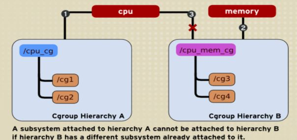
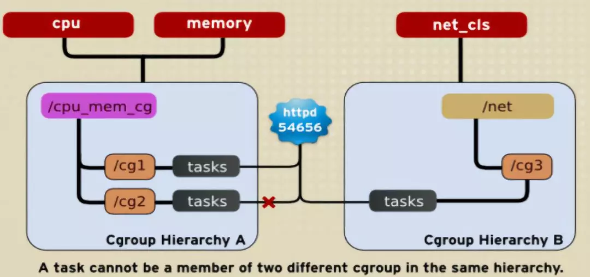
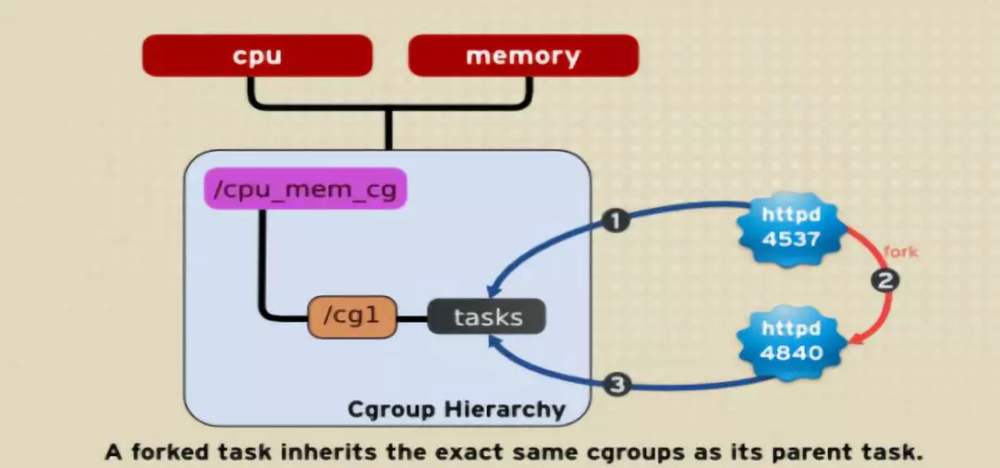

<!-- @import "[TOC]" {cmd="toc" depthFrom=1 depthTo=6 orderedList=false} -->

<!-- code_chunk_output -->

- [1. Cgroups 介绍](#1-cgroups-介绍)
- [2. Cgroups 作用](#2-cgroups-作用)
- [3. Cgroups 组成](#3-cgroups-组成)
  - [3.1. task](#31-task)
  - [3.2. cgroup](#32-cgroup)
  - [3.3. subsystem/controller](#33-subsystemcontroller)
  - [3.4. hierarchy](#34-hierarchy)
  - [3.5. 组件之间的关系](#35-组件之间的关系)
- [4. Cgroups 使用](#4-cgroups-使用)
  - [4.1. 创建 Hierarchy](#41-创建-hierarchy)
    - [4.1.1. centos 默认](#411-centos-默认)
  - [4.2. 挂载 Cgroup Controller](#42-挂载-cgroup-controller)
    - [4.2.1. centos 默认](#421-centos-默认)
  - [4.3. 卸载cgroup controller](#43-卸载cgroup-controller)
  - [4.4. 创建 Control Groups](#44-创建-control-groups)
  - [4.5. 进程或线程与 cgroup 的绑定](#45-进程或线程与-cgroup-的绑定)
  - [4.6. 限制进程派生的进程数量](#46-限制进程派生的进程数量)
  - [4.7. 设置 Control Cgroup 参数](#47-设置-control-cgroup-参数)
  - [4.8. 删除 Control Groups](#48-删除-control-groups)
  - [4.9. Cgroup为空时, 进行回调通知](#49-cgroup为空时-进行回调通知)
    - [4.9.1. centos默认](#491-centos默认)
- [5. Subsystem 介绍](#5-subsystem-介绍)
- [6. 容器使用 Cgroups 进行资源限制](#6-容器使用-cgroups-进行资源限制)
  - [6.1. 使用docker run方式创建容器](#61-使用docker-run方式创建容器)
    - [6.1.1. 限制 CPU share](#611-限制-cpu-share)
    - [6.1.2. 限制容器内存使用量](#612-限制容器内存使用量)
  - [6.2. 使用 Kubenetes 容器编排工具创建容器](#62-使用-kubenetes-容器编排工具创建容器)

<!-- /code_chunk_output -->

说起容器监控，首先会想到通过 Cadvisor, Docker stats 等多种方式获取容器的监控数据，并同时会想到容器通过 Cgroups 实现对容器中的资源进行限制。但是这些数据来自哪里，并且如何计算的？答案是 Cgroups。最近在写 docker 容器监控组件，在深入 Cadvisor 和 Docker stats 源码发现数据都来源于 Cgroups。了解之余，并对 Cgroups 做下笔记。

# 1. Cgroups 介绍

Cgroups 是 control groups 的缩写，是 Linux 内核提供的一种可以限制，记录，隔离进程组(process groups)所使用物理资源的机制。最初有 google 工程师提出，后来被整合进 Linux 的内核。

因此，Cgroups 为容器实现虚拟化提供了基本保证，是构建 Docker,LXC 等一系列虚拟化管理工具的基石。

# 2. Cgroups 作用

* **资源限制**(Resource limiting): Cgroups可以对进程组使用的资源总额进行限制。如对**特定的进程**进行**内存**使用**上限**限制，当超出上限时，会触发OOM。
* **优先级分配**(Prioritization): 通过分配的**CPU时间片数量**及硬盘**IO带宽**大小，实际上就相当于控制了进程运行的优先级。
* **资源统计**(Accounting): Cgroups可以统计系统的资源使用量，如CPU使用时长、内存用量等等，这个功能非常适用于计费。
* **进程控制**(ControlCgroups): 可以对进程组执行挂起、恢复等操作。

# 3. Cgroups 组成

Cgroups 主要由 task, cgroup, subsystem 及 hierarchy 构成。下面分别介绍下各自的概念。

## 3.1. task

* `task`: 在Cgroups中，task就是系统的**一个进程**。

## 3.2. cgroup

* `cgroup`: Cgroups中的**资源控制**都以**cgroup为单位**实现的。cgroup表示按照某种**资源控制标准**划分而成的**任务组**，包含**一个或多个subsystem子系统**。

**一个任务**可以加入**某个cgroup**，也可以从某个cgroup迁移到另外一个cgroup。

从**使用的角度**看，**cgroup**就是一个**目录树**，目录中可以创建**子目录**，这些目录称为“**cgroup 目录**”，在一些场景中为了体现层级关系，还会称为“**cgroup 子目录**”。

## 3.3. subsystem/controller

* `subsystem`: Cgroups中的subsystem就是一个**资源调度控制器**（`Resource Controller`）。`cpu controller`、`memory controller`等, 统一称为`cgroup controller`, **cgroup控制器**.

subsystem = controller

比如**CPU子系统**可以控制cgroup的**CPU时间分配**，**内存子系统**可以限制**cgroup内存使用量**。

## 3.4. hierarchy

* `hierarchy`: hierarchy由**一系列cgroup**以一个**树状结构**排列而成, **每个hierarchy**通过绑定对应的**subsystem**进行**资源调度**。

这是一个整体概念, 树状结构(一个目录, 本身可以是一个挂载点, 也可以不是).

hierarchy中的**cgroup节点**可以包含零或多个子节点，子节点继承父节点的属性。**整个系统**可以有**多个hierarchy**。

## 3.5. 组件之间的关系

`Subsystems`, `Hierarchies`, `Control Group` 和 `Tasks` 之间有许多的规则，下面介绍下:

1. 同**一个 hierarchy** 能够挂载**一个或多个 subsystem**

如下图，将 cpu 和 memory subsystems(或者任意多个 subsystems)附加到同一个 hierarchy。


2. **一个 subsystem** 只能附加到**一个 hierarchy** 上。

如下图，cpu subsystem 已经附加到了 hierarchy A，并且 memory subsystem 已经附加到了 hierarchy B。因此 cpu subsystem 不能在附加到 hierarchy B。



3. 系统**每次新建一个 hierarchy** 时，该系统上的**所有 task** 默认构成了这个新建的 hierarchy 的**初始化 cgroup**，这个 cgroup 也称为 **root cgroup**。对于你创建的每个 hierarchy，task 只能存在于其中一个 cgroup 中，即**一个 task 不能**存在于**同一个 hierarchy** 的**不同 cgroup** 中，但是**一个 task** 可以存在在**不同 hierarchy** 中的**多个 cgroup** 中。如果操作时把一个 task 添加到同一个 hierarchy 中的另一个 cgroup 中，则会从第一个 cgroup 中移除。

如下图，subsystem cpu 和 memory 被附加到 `cpu_mem_cg` 的 hierarchy。而 `net_cls` 被附加到 `net_cls hierarchy`。并且 httpd 进程被同时加到了 `cpu_mem_cg hierarchy` 的 `cg1 cgroup` 中和 `net hierarchy` 的 `cg3 cgroup` 中。并通过**两个 hierarchy** 的 **subsystem** 分别对 httpd 进程进行 **cpu**, **memory** 及**网络带宽**的限制。



4. 系统中的任何一个 task(Linux 中的进程)fork 自己创建一个**子task**(子进程)时，子 task 会自动的**继承**父 task cgroup 的关系，在同一个 cgroup 中，但是子 task 可以根据需要移到其它不同的 cgroup 中。**父子 task** 之间是**相互独立不依赖**的。

如下图，httpd 进程在 `cpu_and_mem hierarchy` 的`/cg1 cgroup` 中并把 PID 4537 写到该 cgroup 的 tasks 中。之后 httpd(PID=4537)进程 fork 一个子进程 httpd(PID=4840)与其父进程在同一个 hierarchy 的同一个 cgroup 中，但是由于父 task 和子 task 之间的关系独立不依赖的，所以子 task 可以移到其它的 cgroup 中。



# 4. Cgroups 使用

我们直接使用 shell 命令直接操作 hierarchy 并设置 cgroup 参数。在 centos 上也可以直接使用 libcgroup 提供的工具可简化对 cgroup 的使用。

```
yum install libcgroup
```

## 4.1. 创建 Hierarchy

hierarchy, 本身是一个目录, 也可以是一个挂载点


```bash
mkdir $hierarchy

mkdir /XXX

mkdir /XXX/XXX
```

当然一般情况下, 可以认为**这个目录叶节点名字**就是这个**hierarchy的名字**

例如:

```bash
mkdir /data/cg_test
```

### 4.1.1. centos 默认

在Centos中默认情况下只用了一个hierarchy, 是`/sys/fs/cgroup`, (也是因为只用了一个, 所以名字就直接是cgroup了, 没有专门的含义), 而且centos以**tmpfs文件系统**的样式挂载了过去.

```bash
# df
tmpfs            8046096        0   8046096   0% /sys/fs/cgroup

# mount
tmpfs on /sys/fs/cgroup type tmpfs (ro,nosuid,nodev,noexec,mode=755)
```

## 4.2. 挂载 Cgroup Controller

**controller(即subsystem)** 要使用`mount -t cgroup`样式的命令**挂载到一个目录**中，这个操作称呼为“**挂载cgroup controller**”。

可以一个或多个.

```bash
mount -t cgroup -o subsystems XXX $hierarchy_path/name

// 示例
mkdir /data/cg_test/mem_test
mount -t cgroup -o memory mem_test /data/cg_test/mem_test
```

`-t cgroup`指定挂载类型，`-o`指定挂载的controller(可以有多个，用`“,”`间隔), xxx可以是任意字符, name可以认为就是想要挂载的controller的名字(其实就是目录名)

如果想要挂载所有的subsystem, 使用下面命令

```bash
mount -t cgroup XXX $hierarchy_path

或

mount -t cgroup -o all cgroup $hierarchy_path

// 示例
mount -t cgroup cg_test /data/cg_test
```

不挂载任何controller：

```
mount -t cgroup -o none,name=somename none /some/mount/point
```

**没有挂载controller的cgroup**可以用来**跟踪进程**，例如在进程消失导致cgroup为空时，cgroup的通知回调会被触发。

>注: 这时就不需要自己手动创建的controller的目录

在hierarchy所在目录下面就是这个 hierarchy 所有可用的subsystem.

例如:

```shell
// 创建hierarchy
# mkdir /data/cg_test

// 在hierarchy下创建controller目录
# mkdir -p /data/cg_test/mem_test

// 挂载controller
# mount -t cgroup -o memory mem_test /data/cg_test/mem_test

// 查找mount point
# mount
mem_test on /data/cg_test/mem_test type cgroup (rw,relatime,memory)

// 查看这个hierarchy的所有controller/subsystem
# ll /data/cg_test
total 0
drwxr-xr-x 5 root root 0 Dec 16 16:30 mem_test

// 查看mem_test这个controller的文件接口
# ls /data/cg_test/mem_test/
cgroup.clone_children       memory.kmem.max_usage_in_bytes      memory.memsw.failcnt             memory.stat
cgroup.event_control        memory.kmem.slabinfo                memory.memsw.limit_in_bytes      memory.swappiness
cgroup.procs                memory.kmem.tcp.failcnt             memory.memsw.max_usage_in_bytes  memory.usage_in_bytes
cgroup.sane_behavior        memory.kmem.tcp.limit_in_bytes      memory.memsw.usage_in_bytes      memory.use_hierarchy
init.scope                  memory.kmem.tcp.max_usage_in_bytes  memory.move_charge_at_immigrate  notify_on_release
memory.failcnt              memory.kmem.tcp.usage_in_bytes      memory.numa_stat                 release_agent
memory.force_empty          memory.kmem.usage_in_bytes          memory.oom_control               system.slice
memory.kmem.failcnt         memory.limit_in_bytes               memory.pressure_level            tasks
memory.kmem.limit_in_bytes  memory.max_usage_in_bytes           memory.soft_limit_in_bytes       user.slice
```

从结果看:
* 有了mount点
* 在`/data/cg_test/mem_test`下面创建了很多文件

### 4.2.1. centos 默认

在centos中, `/sys/fs/cgroup/`目录下就是当前系统**所有可用的subsystem**:

```bash
# ls /sys/fs/cgroup
blkio  cpu  cpu,cpuacct  cpuacct  cpuset  devices  freezer  hugetlb  memory  net_cls  oom  perf_event  pids  systemd
```

不同的subsystem有不同的用法。

## 4.3. 卸载cgroup controller

如果想在已有的 hierarchy 上 **attch** 或 **detach subsystem**, 可以使用 **remount** 操作

例如我们想 detach 掉 memory subsystem。

```
mount -t cgroup -o remount,cpu,cpuset cpu_and_mem /cgroup/cpu_and_mem
```

可以直接用 umount 命令来卸载一个已有的 controller(`/data/cg_test/`是hierarchy):

```bash
umount $hierarchy_path/XXX
```

卸载的时候要注意，需要先将**所有子目录卸载**，否则，umount只会让挂载点不可见，而不是真正将其卸载。

例如:

```
umount /data/cg_test/mem_test
```

注: `/data/cg_test/`是hierarchy

## 4.4. 创建 Control Groups

cgroup是以**目录的形式**呈现的，`/`是cgroup的**根目录**，注意**cgroup的根目录**和**挂载目录**(hierarchy所在目录)不是一回事，cgroup可能**挂载**在`/sys/fs/cgroup`或者`/tmp/cgroup`等任意目录，无论挂载在哪里，cgroup的**根目录**都是`“/”`。

假设cgroup的`cpu controller`的挂载点是`/sys/fs/cgroup/cpu`，那么目录`/sys/fs/cgroup/cpu/cg1`对应的**cgroup的目录**是`/cg1`.

为什么要强调这个，因为在调查一个kubelet的问题的时候，不确定`--runtime-cgroups`参数值中**要不要包含挂载点路径**，直到用cadvisor查出所有cgroup后，才确定不应该带有挂载路径。现在从Linux手册中找到支持了：

```
A cgroup filesystem initially contains a single root cgroup, '/',
which all processes belong to.  A new cgroup is created by creating a
directory in the cgroup filesystem:

      mkdir /sys/fs/cgroup/cpu/cg1
```

可以在**每个controller(即subsystem)目录**下建立**多个目录**，**每个目录**就是**一个cgroup**，可以分别设置每个cgroup. cgroup中可以继续创建cgroup.

直接使用 mkdir 创建一个子 cgroup:

```bash
mkdir $hierarchy_path/$controller/$cg_name
```

例如:

```
# mkdir /data/cg_test/mem_test/group1
# ls /data/cg_test/mem_test/group1
cgroup.clone_children           memory.kmem.tcp.failcnt             memory.memsw.limit_in_bytes      memory.swappiness
cgroup.event_control            memory.kmem.tcp.limit_in_bytes      memory.memsw.max_usage_in_bytes  memory.usage_in_bytes
cgroup.procs                    memory.kmem.tcp.max_usage_in_bytes  memory.memsw.usage_in_bytes      memory.use_hierarchy
memory.failcnt                  memory.kmem.tcp.usage_in_bytes      memory.move_charge_at_immigrate  memory.vmstat
memory.force_empty              memory.kmem.usage_in_bytes          memory.numa_stat                 notify_on_release
memory.kmem.failcnt             memory.limit_in_bytes               memory.oom_control               tasks
memory.kmem.limit_in_bytes      memory.max_usage_in_bytes           memory.pressure_level
memory.kmem.max_usage_in_bytes  memory.meminfo                      memory.soft_limit_in_bytes
memory.kmem.slabinfo            memory.memsw.failcnt                memory.stat
```

## 4.5. 进程或线程与 cgroup 的绑定

将**进程的进程号**直接写入到对应`cgroup.procs`文件中，就完成了进程与cgroup的绑定

例如, 将当前shell进程关联到`cg1`：

```bash
echo $$ > /sys/fs/cgroup/cpu/cg1/cgroup.procs
```

将进程绑定到cgroup之后，**该进程创建的线程**也一同被绑定到**同一个cgroup**。

每个进程只能绑定**每个controller**的**一个cgroup目录**，把进程的ID加到controller中的另一个cgroup目录的`cgroup.procs`文件中时，会自动将其从**原先**的`cgroup.procs`文件中**移除**。

每次只能向`cgroup.procs`中添加一个进程号，**不能批量添加**。

从`cgroup.procs`中读取的进程号的**顺序是随意的**，并且是**可以重复的**。

cgroup v1支持将**线程**（task）绑定到cgroup目录，只需将线程的**线程ID**写入目标cgroup目录的`tasks`文件中。

注意，**tasks文件**中是**线程ID**，`cgroup.procs`文件中是**进程ID**。

## 4.6. 限制进程派生的进程数量

pids用来限制一个进程可以派生出的进程数量。

如果系统中没有挂载pids，先挂载:

```
mkdir -p /sys/fs/cgroup/pids
mount -t cgroup -o pids none /sys/fs/cgroup/pids
```

然后创建一个名为parent的目录，也就是一个cgroup：

```
mkdir -p /sys/fs/cgroup/pids/parent
```

设置最大进程数为3:

```
echo 3 > /sys/fs/cgroup/pids/parent/pids.max
```

将当前的shell进程关联到cgroup:

```
echo $$ > /sys/fs/cgroup/pids/parent/cgroup.procs
```

## 4.7. 设置 Control Cgroup 参数

在 **group1** 中使用 echo 命令插入 `0-1` 到 `cpuset.cpus`，来限制该 cgroup 中的 tasks 只能跑在 0 和 1 的 cpu core 上。如下：

```
echo 0-1 > /cgroup/cpu_and_mem/group1/cpuset.cpus
```

## 4.8. 删除 Control Groups

删除直接使用命令rmdir

```
rmdir /data/cg_test/mem_test/group1
```

注: 在cgroup子目录已经全部删除，并且没有绑定任何进程、线程的情况下，直接删除cgroup目录即可。

## 4.9. Cgroup为空时, 进行回调通知

**每个cgroup**中目录中都有下面两个文件：

```
notify_on_release   release_agent
```

`notify_on_release`的内容是0或者1，指示kernel是否要在**cgroup为空时**（**没有cgroup子目录**、**没有绑定任何进程**）发出通知，0为不通知，1为通知。

`release_agent`是**自行设置的**、kernel通知时**调用的命令**， 它的命令行参数有且只有一个，就是当前为空的cgroup目录。仅存在于最上层的cgroup.

`release_agent`也可以在挂载cgroup的时候设置：

```
mount -o release_agent=pathname ...
```

### 4.9.1. centos默认

比如

```
# cat /sys/fs/cgroup/systemd/release_agent
/usr/lib/systemd/systemd-cgroups-agent
```

# 5. Subsystem 介绍

这个是重点，使用cgroup主要就是和各种controller打交道

* `cpu`: 主要限制进程的**cpu使用率**。

[CFS Scheduler](https://www.kernel.org/doc/Documentation/scheduler/sched-design-CFS.txt)、 [CFS Bandwidth Control](https://www.kernel.org/doc/Documentation/scheduler/sched-bwc.txt) :

>since 2.6.24，限制CPU份额，只会在cpu忙碌的时候限制cpu使用，如果cpu空闲不做限制。
>since 3.2.0， 引入了`CONFIG_CFS_BANDWIDTH`编译选项，限制进程在每个调度周期占用的时间，无论CPU是否空闲。

* `cpuacct`: 可以统计cgroup中进程的**cpu使用报告**。

`Documentation/cgroup-v1/cpuacct.txt`

>since 2.6.24，统计一组task的cpu使用情况。

* `cpuset`: 可以为cgroup中的进程分配**独立的cpu和内存节点**。

`Documentation/cgroup-v1/cpusets.txt`

>since 2.6.24，绑定到特定的cpu

* `memory`: 自动生成cgroup中task使用的**内存资源报告**，并对该cgroup的task进行**内存使用限制**。

`Documentation/cgroup-v1/memory.txt`

>since 2.6.25，报告和限制内存使用情况

* `devices`: 可以控制进程**能否访问某些设备**。

`Documentation/cgroup-v1/devices.txt`

>since 2.6.26，限制设备文件的创建，和对设备文件的读写

* `freezer`: 可以**挂起或恢复**cgroup中的进程。

`Documentation/cgroup-v1/freezer-subsystem.txt`

>since 2.6.28，暂停、重载指定cgroup目录中的、以及它的子目录中的task

* `net_cls`: 使用**等级标识符**(clssid)标记网络数据包，可允许Linux**流量控制程序**(tc)**识别**从具体cgroup中生成的数据包。

`Documentation/cgroup-v1/net_cls.txt`

>since 2.6.29，为该cgroup内的task产生的报文打上classid

* `blkio`: blkio 子系统控制并监控cgroup中的task**对块设备的I/O的访问**。如:限制访问及带宽等。

`Documentation/cgroup-v1/blkio-controller.txt`

>since 2.6.33，限制和控制对块设备的读写

* `perf_event`

`tools/perf/Documentation/perf-record.txt`

>since 2.6.39，允许perf观测cgroup中的task

* `net_prio`

`Documentation/cgroup-v1/net_prio.txt`

>since 3.3，设置net优先级

* `hugetlb`

`Documentation/cgroup-v1/hugetlb.txt`

>since 3.5，限制huge page的使用

* `pids`

`Documentation/cgroup-v1/pids.txt`

>since 4.3，限制cgroup中可创建的进程数

* `rdma`

`Documentation/cgroup-v1/rdma.txt`

>since 4.11，限制RDMA/IB 资源

# 6. 容器使用 Cgroups 进行资源限制

无论是使用 `docker run` 方式**直接创建容器**，还是通过各类**容器编排工具**(如: `Kubernetes`)**创建容器**，对于容器的限制本质都是通过 **Cgroups**。

我们分别使用这两种方式来创建容器并观察 cgroups.

## 6.1. 使用docker run方式创建容器

创建容器，则会在运行该容器宿主的 `/sys/fs/cgroup/cpu/docker/` 下分别创建**两个子 cgroup**, 格式如下。

```
/sys/fs/cgroup/cpu/docker/<container_id>/
```

### 6.1.1. 限制 CPU share

当 **CPU 资源充足**时，设置 **CPU 的权重**是没有意义的。只有在容器**争用 CPU 资源**的情况下， CPU 的权重才能让不同的容器分到不同的 CPU 用量。`--cpu-shares` 选项用来设置 CPU 权重.

**两个容器分享一个 CPU**，所以**总量**应该是 `100%`。具体每个容器分得的负载则取决于 `--cpu-shares` 选项的设置！假设设置分别是 512 和 1024，则它们分得的比例为 1:2。

1. 创建一个stress容器，并设置`–cpu-shares` 参数为`10240 = 1024*10`。

```
# docker run -it --rm --cpu-shares 10240 dkuffner/docker-stress:latest -c 10
stress: info: [1] dispatching hogs: 10 cpu, 0 io, 0 vm, 0 hdd
```

创建容器前后对比, mount多了两个

```
# mount
overlay on /var/lib/docker/overlay2/8adadcff1506ec44d7b1a55da587f1e7c60e973730adc66740dd32712cc8f63f/merged type overlay (rw,relatime,lowerdir=/var/lib/docker/overlay2/l/D3DFRKDESO6X44VLQVM3ACGCZW:/var/lib/docker/overlay2/l/AP7ZQJC4J5PTLJ562E2HPRGGOK:/var/lib/docker/overlay2/l/WM5BGFTZ7WTTQDGUBTJE4GZD7Z:/var/lib/docker/overlay2/l/ZBWWWDYBG2LFNG5DPTRYXNPYQQ:/var/lib/docker/overlay2/l/Z2M4WVV5CL7UZYTRPYDHKWUGDH,upperdir=/var/lib/docker/overlay2/8adadcff1506ec44d7b1a55da587f1e7c60e973730adc66740dd32712cc8f63f/diff,workdir=/var/lib/docker/overlay2/8adadcff1506ec44d7b1a55da587f1e7c60e973730adc66740dd32712cc8f63f/work)
proc on /run/docker/netns/d68816f738a1 type proc (rw,relatime)
```

查看该容器 cgroup 的 `cpu.shares` 文件内容

```
# cat /sys/fs/cgroup/cpu/docker/9f4b3ad59267723230d2e117f671db1dd365aec00ed56d4948db545bd2528ba3/cpu.shares
10240
```

2. 再创建一个stress容器, 并设置 `–cpu-shares` 参数为: `20480 = 1024*20`

```
# # docker run -it --rm --cpu-shares 20480 dkuffner/docker-stress:latest -c 20
stress: info: [1] dispatching hogs: 20 cpu, 0 io, 0 vm, 0 hdd
```

查看该容器 cgroup 的 `cpu.shares` 文件内容

```
# cat /sys/fs/cgroup/cpu/docker/fab5759883772cad4c725cf61d64c882d8cbaf6487621f3affcba5afafbf8fa7/cpu.shares
20480
```

3. 查看两个容器使用 cpu 的 stats, 一个容器分到 14 核的相对 cpu 计算时间，另一个容器分到 10 核的相对 cpu 计算时间:

```
# docker container ls
CONTAINER ID        IMAGE                           COMMAND             CREATED              STATUS              PORTS               NAMES
fab575988377        dkuffner/docker-stress:latest   "stress -c 20"      34 seconds ago       Up 32 seconds                           trusting_chatelet
9f4b3ad59267        dkuffner/docker-stress:latest   "stress -c 10"      About a minute ago   Up About a minute                       epic_khayyam

# docker stats --no-stream
CONTAINER ID        NAME                CPU %               MEM USAGE / LIMIT   MEM %               NET I/O             BLOCK I/O           PIDS
fab575988377        trusting_chatelet   528.07%             644KiB / 15.35GiB   0.00%               0B / 0B             0B / 0B             21
9f4b3ad59267        epic_khayyam        264.10%             404KiB / 15.35GiB   0.00%               0B / 0B             0B / 0B             11
```

CPU占比基本`2:1`

### 6.1.2. 限制容器内存使用量

1. 创建一个容器，通过参数`--memory`限制容器能使用的内存上限为 1024M

```
# docker run -it --rm --memory 1024M dkuffner/docker-stress:latest --vm 1 --vm-bytes 1023M
```
2. 查看容器的memory stats, 内存使用率

```
# docker stats --no-stream
CONTAINER ID        NAME                CPU %               MEM USAGE / LIMIT   MEM %               NET I/O             BLOCK I/O           PIDS
3276d3819fdd        recursing_lalande   99.73%              1023MiB / 1GiB      99.91%              0B / 0B             0B / 0B             2
```

3. 当容器使用的内存量超过 1024M，则容器会被 `kill -9` 掉

```
# docker run -it --rm --memory 1024M dkuffner/docker-stress:latest --vm 1 --vm-bytes 1025M
stress: info: [1] dispatching hogs: 0 cpu, 0 io, 1 vm, 0 hdd
stress: FAIL: [1] (415) <-- worker 6 got signal 9
stress: WARN: [1] (417) now reaping child worker processes
stress: FAIL: [1] (421) kill error: No such process
stress: FAIL: [1] (451) failed run completed in 1s
```


## 6.2. 使用 Kubenetes 容器编排工具创建容器

使用 kubernetes 编排工具创建的容器，则与容器关联的 cgroup 均在运行该容器宿主机的`/sys/fs/cgroup/cpu/kubepods/`下,具体的格式如下所示:

```
/sys/fs/cgroup/cpu/kubepods/pod<pod_id>/<container_id>

/sys/fs/cgroup/memory/kubepods/pod<pod_id>/<container_id>
```

使用Pod创建一个容器，对应的yaml文件内容如下:

```yaml
apiVersion: v1
kind: Pod
metadata:
  name: nginx
  labels:
    env: test
spec:
  terminationGracePeriodSeconds: 30
  containers:
  - name: nginx
    image: nginx
    imagePullPolicy: IfNotPresent
    resources:
      limits:
        cpu: 1000m
        memory: 2048Mi
      requests:
        cpu: 1000m
        memory: 2048Mi
```

在运行该容器的宿主机上查看该容器的cgroup信息，会观察到`cpu.shares`为1核，`memory.limit_in_bytes`为2G.

```
# cat /sys/fs/cgroup/cpu/kubepods/pod64db38a6-3f6e-11eb-9dfe-525400db21aa/932d58a22da5bf92a24a6a04c1a3ecb29b25970da829582fde4a40757108a1db/cpu.shares
1024

# cat /sys/fs/cgroup/memory/kubepods/pod64db38a6-3f6e-11eb-9dfe-525400db21aa/932d58a22da5bf92a24a6a04c1a3ecb29b25970da829582fde4a40757108a1db/memory.limit_in_bytes
2147483648
```