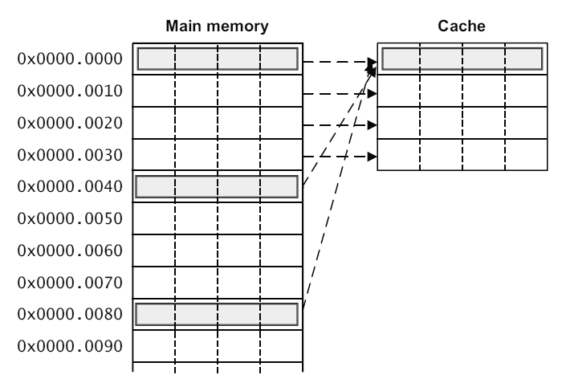
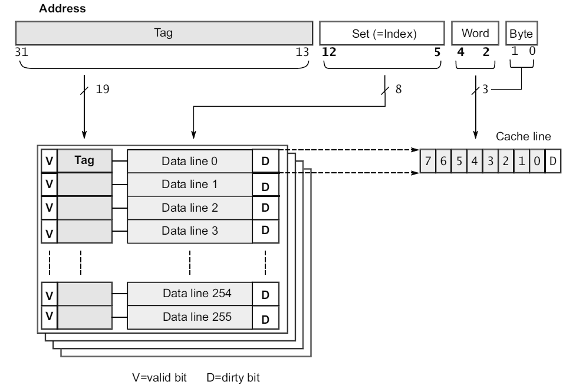
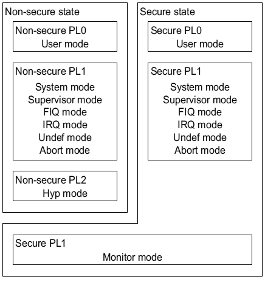
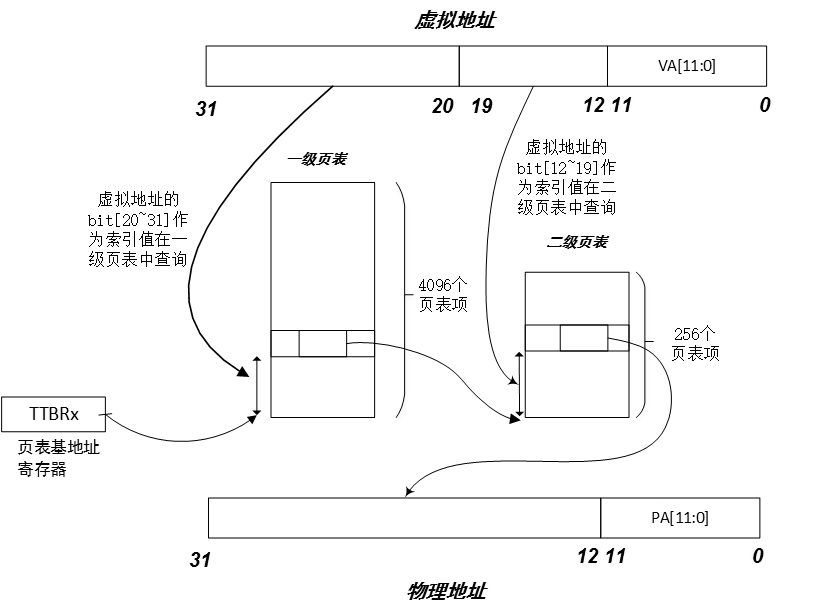

该章内容通过问题形式展开的。

1. 请简述精简指令集 RISC 和复杂指令集 CISC 的区别。

2. 请简述数值 0x12345678 在大小端字节序处理器的存储器中的存储方式。

3. 请简述在你所熟悉的处理器（比如双核Cortex-A9）中一条存储读写指令的执行全过程。

4. 请简述内存屏障（memory barrier）产生的原因。

5. ARM 有几条 memory barrier 的指令？分别有什么区别？

6. 请简述 cache 的工作方式。

7. cache 的映射方式有 full-associative（全关联）、direct-mapping（直接映射）和set-associative（组相联）3 种方式，请简述它们之间的区别。为什么现代的处理器都使用组相联的 cache 映射方式？

8. 在一个 32KB 的 4 路组相联的 cache 中，其中 cache line 为 32Byte，请画出这个cache的cache line、way 和 set 的示意图。

9. ARM9 处理器的 Data Cache 组织方式使用的 VIVT，即虚拟 Index 虚拟 Tag，而在Cortex-A7 处理器中使用 PIPT，即物理 Index 物理 Tag，请简述 PIPT 比 VIVT 有什么优势？

10. 请画出在二级页表架构中虚拟地址到物理地址查询页表的过程。

11. 在多核处理器中，cache 的一致性是如何实现的？请简述 MESI 协议的含义。

12. cache 在 Linux 内核中有哪些应用？

13. 请简述 ARM big.LITTLE 架构，包括总线连接和 cache 管理等。

14. cache coherency 和 memory consistency 有什么区别？

15. 请简述 cache 的 write back 有哪些策略。

16. 请简述 cache line 的替换策略。

17. 多进程间频繁切换对 TLB 有什么影响？现代的处理器是如何面对这个问题的？

18. 请简述 NUMA 架构的特点。

19. ARM 从 Cortex 系列开始性能有了质的飞越，比如 Cortex-A8/A15/A53/A72，请说说 Cortex 系列在芯片设计方面做了哪些重大改进？

Linux 4.x 内核已经支持几十种的处理器体系结构，目前市面上最流行的两种体系结构是 x86 和 ARM。

关于 ARM 体系结构，描述 ARMv7-A和 ARMv8-A 架构的手册包括：

- \<ARM Architecture Reference Manual, ARMv7-A and ARMv7-R edition\>
- \<ARM Architecture Reference Manual, ARMv8, for ARMv8-A architecture profile\>

ARM Coxtex 系统处理器编程技巧：

- <ARM Coxtex-A Series Programmer’s Guide, version 4.0>
- <ARM Coxtex-A Series Programmer’s Guide for ARMv8-A, version 1.0>

**虚拟化和安全特性**在**ARMv7**上已经实现，但是大内存的支持显得有点捉襟见肘，虽然可以通过 LPAE（Large Physical Address Extensions）技术支持**40位的物理地址空间**，但是由于**32位的处理器最高支持4GB的虚拟地址空间**，因此不适合虚拟内存需求巨大的应用。

ARM公司设计了一个全新的指令集，即ARMv8-A指令集，支持 64 位指令集，并且保持向前兼容ARMv7-A指令集。

因此**定义AArch64和AArch32两套运行环境分别来运行64位和32位指令集，软件可以动态切换运行环境**。

## 1. 简述精简指令集RISC和复杂指令集CISC的区别

20%的简单指令经常被用到，占程序总指令数的80%，而指令集里其余80%的复杂指令很少被用到，只占程序总指令数的 20%。

## 2．请简述数值 0x12345678 在大小端字节序处理器的存储器中的存储方式

计算机中**以字节为单位**的，每个地址单元对应一个字节，一个字节为8个比特位。但存在着**如何安排多个字节**的问题，因此导致了**大端存储模式（Big-endian）和小端存储模式（Little-endian）**。

例如一个16比特的short型变量X，在内存中的地址为0x0010，X 的值为 0x1122，那么 0x11 为高字节，0x22为低字节。对于大端模式，就将 0x11 放在低地址中；0x22 放在高地址中。小端模式则刚好相反。很多的ARM处理器默认使用小端模式，有些ARM处理器还可以由硬件来选择是大端模式还是小端模式。**Cortex-A系列的处理器可以通过软件来配置大小端模式**。大小端模式是在处理器Load/Store访问内存时用于描述寄存器的字节顺序和内存中的字节顺序之间的关系。

大端模式：指数据的高字节保存在内存的低地址中，而数据的低字节保存在内存的高地址中。例如：

```
内存视图：

0000430: 1234 5678 0100 1800 53ef 0100 0100 0000
0000440: c7b6 1100 0000 3400 0000 0000 0100 ffff
```

在大端模式下，前32位(**整个作为一个数据**)应该这样读：12 34 56 78。

因此，大端模式下地址的增长顺序与值的增长顺序相同。

小端模式：指数据的高字节保存在内存的高地址中，而数据的低字节保存在内存的低
地址中。例如：

```
内存视图：

0000430: 7856 3412 0100 1800 53ef 0100 0100 0000
0000440: c7b6 1100 0000 3400 0000 0000 0100 ffff
```

在小端模式下，前32位(整个作为一个数据)应该这样读：12 34 56 78。

因此，小端模式下地址的增长顺序与值的增长顺序相反。

如何检查处理器是大端模式还是小端模式？**联合体Union的存放顺序**是所有成员都从低地址开始存放的，利用该特性可以轻松获取CPU对内存采用大端模式还是小端模式读写。

```
int checkCPU(void)
{
    union w
    {
        int a;
        char b;
    } c;
    c.a = 1;
    return (c.b == 1);
}
```

如果输出结果是 true，则是小端模式，否则是大端模式。

## 3．请简述在你所熟悉的处理器（比如双核Cortex-A9）中一条存储读写指令的执行全过程

经典处理器架构的流水线是五级流水线：**取指（IF）、译码（ID）、执行（EX）、数据内存访问（MEM）和写回**。

现代处理器在设计上都采用了**超标量体系结构**（Superscalar Architecture）和**乱序执行**（out-of-order）技术。

超标量技术能够**在一个时钟周期内执行多个指令**，实现**指令级的并行**，有效提高了 ILP（Instruction Level Parallelism）指令级的并行效率，同时也增加了整个 cache 和 memory 层次结构的实现难度。

一条**存储读写指令**的执行全过程很难用一句话来回答。在一个支持超标量和乱序执行技术的处理器当中，一条**存储读写指令**的执行过程被分解为若干步骤。指令首先进入**流水线（pipeline）的前端（Front-End）**，包括预取（fetch）和译码（decode），经过分发（dispatch）和调度（scheduler）后进入执行单元，最后提交执行结果。

所有的指令采用**顺序方式**（In-Order）通过**前端（Front-End）**，并采用**乱序的方式（Out-of-Order，OOO）**进行发射，然后**乱序执行**，最后用**顺序方式提交结果**，并将最终结果更新到**LSQ（Load-Store Queue）部件**。

**LSQ部件**是指令流水线的一个执行部件，可以理解为存储子系统的最高层，其上接收来自**CPU的存储器指令**，其下连接着**存储器子系统**。其主要功能是将来自**CPU的存储器请求**发送到**存储器子系统（多数是L1数据缓存）**，并处理其下存储器子系统的应答数据和消息。

很多程序员对乱序执行的理解有误差。对于一串给定的指令序列，为了提高效率，处理器会找出非真正数据依赖和地址依赖的指令，让它们并行执行。但是在提交执行结果时，是按照指令次序的。总的来说，**顺序提交指令，乱序执行，最后顺序提交结果**。例如有两条没有数据依赖的数据指令，后面那条指令的读数据先被返回，它的结果也不能先写回到最终寄存器，而是必须等到前一条指令完成之后才可以。

对于读指令，当处理器在等待数据从缓存或者内存返回时，它处于什么状态呢？是等在那不动，还是继续执行别的指令？对于乱序执行的处理器，可以执行后面的指令；对于顺序执行的处理器，会使流水线停顿，直到读取的数据返回。

如图 1.1 所示，在 x86 微处理器经典架构中，存储指令从**L1指令cache（L1指令缓存！！！）中读取指令**，L1指令cache会做**指令加载、指令预取、指令预解码，以及分支预测**。然后进入Fetch&Decode单元，会把指令解码成macro-ops微操作指令，然后由 Dispatch 部件分发到 IntegerUnit 或者 FloatPoint Unit。Integer Unit 由 Integer Scheduler 和 Execution Unit 组成，Execution Unit包含算术逻辑单元（arithmetic-logic unit，ALU）和地址生成单元（address generation unit，AGU），在ALU计算完成之后进入AGU，计算有效地址完毕后，将**结果发送到LSQ部件**。**LSQ部件**首先根据处理器系统要求的**内存一致性**（memory consistency）模型确定**访问时序**，另外LSQ还需要处理存储器指令间的依赖关系，最后LSQ需要**准备L1 cache使用的地址**，包括有效地址的计算和虚实地址转换，将地址发送到L1 Data Cache（**L1数据缓存，不是指令缓存**）中。

图1.1 x86微处理器经典架构图：


如图1.2所示，在ARM Cortex-A9处理器中，存储指令首先通过**主存储器**或者**L2 cache（L2 cache中！！！）**加载到**L1指令cache**中。在**指令预取**阶段（instruction prefetch stage），主要是做**指令预取**和**分支预测**，然后指令通过 Instruction Queue 队列被送到解码器进行指令的解码工作。解码器（decode）支持两路解码，可以同时解码两条指令。在寄存器重命名阶段（Register rename stage）会做寄存器重命名，避免机器指令不必要的顺序化操作，提高处理器的指令级并行能力。在指令分发阶段（Dispatch stage），这里支持4路猜测发射和乱序执行（Out-of-Order Multi-Issue with Speculation），然后在执行单元（ALU/MUL/FPU/NEON）中乱序执行。存储指令会计算有效地址并发送到内存系统中的 LSU 部件（Load Store Unit），最终LSU部件会去访问 **L1 数据 cache**。在 ARM 中，只有 cacheable 的内存地址才需要访问 cache。

图1.2 Cortex-A9结构框图：


在**多处理器环境（！！！）**下，还需要考虑 Cache 的一致性问题。**L1和L2 Cache控制器需要保证cache的一致性**，在 Cortex-A9 中 cache 的一致性是由**MESI协议**来实现的。Cortex-A9处理器内置了L1 Cache模块，由**SCU（Snoop Control Unit）单元**来实现Cache的一致性管理。L2 Cache需要**外接芯片**（例如PL310）。在最糟糕情况下需要访问主存储器，并将数据重新传递给LSQ，完成一次存储器读写的全过程。

- **超标量体系结构**（Superscalar Architecture）：早期的单发射结构微处理器的流水线设计目标是做到每个周期能平均执行一条指令，但这一目标不能满足处理器性能增长的要求，为了提高处理器的性能，要求处理器具有**每个周期能发射执行多条指令的能力**。因此超标量体系结构是描述一种微处理器设计理念，它能够在**一个时钟周期执行多个指令**。
- **乱序执行**（Out-of-order Execution）：指 CPU 采用了允许将多条指令不按程序规定的顺序分开发送给各相应电路单元处理的技术，避免处理器在计算对象不可获取时的等待，从而导致流水线停顿。
- **寄存器重命名**（Register Rename）：现代处理器的一种技术，用来避免机器指令或者微操作的不必要的顺序化执行，从而提高处理器的指令级并行的能力。它在乱序执行的流水线中有两个作用，一是消除指令之间的寄存器读后写相关（Write-after-Read，WAR）和写后写相关（Write-after-Write，WAW）；二是当指令执行发生例外或者转移指令猜测错误而取消后面的指令时，可用来保证现场的精确。其思路为当一条指令写一个结果寄存器时不直接写到这个结果寄存器，而是先写到一个中间寄存器过渡，当这条指令提交时再写到结果寄存器中。
- **分支预测**（Branch Predictor）：当处理一个分支指令时，有可能会产生跳转，从而打断流水线指令的处理，因为处理器无法确定该指令的下一条指令，直到分支指令执行完毕。流水线越长，处理器等待时间便越长，分支预测技术就是为了解决这一问题而出现的。因此，分支预测是处理器在程序分支指令执行前预测其结果的一种机制。在 ARM 中，使用全局分支预测器，该预测器由转移目标缓冲器（Branch Target Buffer，BTB）、全局历史缓冲器（Global History Buffer，GHB）、MicroBTB，以及 Return Stack 组成。
- **指令译码器**（Instruction Decode）：指令由操作码和地址码组成。操作码表示要执行的操作性质，即执行什么操作；地址码是操作码执行时的操作对象的地址。计算机执行一条指定的指令时，必须首先分析这条指令的操作码是什么，以决定操作的性质和方法，然后才能控制计算机其他各部件协同完成指令表达的功能，这个分析工作由译码器来完成。例如，Cortex-A57 可以支持3路译码器，即同时执行3条指令译码，而Cortex-A9处理器只能同时译码 2 条指令。
- **调度单元**（Dispatch）：调度器负责把指令或微操作指令派发到相应的执行单元去执行，例如，Cortex-A9 处理器的调度器单元有 4 个接口和执行单元连接，因此每个周期可以同时派发 4 条指令。
- **ALU 算术逻辑单元**：ALU 是处理器的执行单元，主要是进行算术运算，逻辑运算和关系运算的部件。
- **LSQ/LSU 部件**（Load Store Queue/Unit）：LSQ 部件是指令流水线的一个执行部件，其主要功能是将来自 CPU 的存储器请求发送到存储器子系统，并处理其下存储器子系统的应答数据和消息。

## 4. 请简述内存屏障（memory barrier）产生的原因

程序在运行时的**实际内存访问顺序**和**程序代码编写的访问顺序**不一致，会导致内存乱序访问。内存乱序访问的出现是为了提高**程序运行时的性能**。内存乱序访问主要发生在如下两个阶段。

（1）编译时，**编译器优化**导致内存乱序访问。

（2）运行时，**多CPU间**交互引起的内存乱序访问。

编译器了解底层CPU的思维逻辑，因此它会在翻译成汇编时进行优化。例如内存访问指令的重新排序，提高指令级并行效率。然而，这些优化可能会违背程序员原始的代码逻辑，导致发生一些错误。编译时的乱序访问可以通过barrier()函数来规避。

```
#define barrier() __asm__ __volatile__ ("" ::: "memory")
```

barrier()函数告诉编译器，不要为了性能优化而将这些代码重排。

由于现代处理器普遍采用**超标量技术**、**乱序发射**以及**乱序执行**等技术来提高指令级并行的效率，因此**指令的执行序列**在处理器的流水线中有可能**被打乱**，与程序**代码编写时序列**的不一致。另外现代处理器采用**多级存储结构**，如何保证**处理器对存储子系统访问的正确性**也是一大挑战。

例如，在一个系统中含有n个处理器P1～Pn，假设每个处理器包含Si个存储器操作，那么从全局来看可能的**存储器访问序列有多种组合**。为了保证内存访问的一致性，需要按照某种规则来选出**合适的组合**，这个规则叫做**内存一致性模型**（Memory Consistency Model）。这个规则需要保证正确性的前提，同时也要保证多处理器访问较高的并行度。

在一个**单核处理器系统**中，访问内存的正确性比较简单。每次存储器**读操作**所获得的结果是**最近写入的结果**，但是在**多处理器并发访问存储器**的情况下就很难保证其正确性了。我们很容易想到使用一个**全局时间比例部件**（Global Time Scale）来决定存储器访问时序，从而判断最近访问的数据。这种内存一致性访问模型是严格一致性（Strict Consistency）内存模型，也称为 Atomic Consistency。全局时间比例方法实现的代价比较大，那么退而求其次，采用每一个处理器的**本地时间比例部件**（Local Time Scale）的方法来确定最新数据的方法被称为顺序一致性内存模型（Sequential Consistency）。处理器一致性内存模型（Processor Consistency）是进一步弱化，仅要求来自**同一个处理器**的**写操作**具有一致性的访问即可。

以上这些内存一致性模型是针对**存储器读写指令**展开的，还有一类目前广泛使用的模型，这些模型使用**内存同步指令**，也称为**内存屏障指令**。在这种模型下，**存储器访问指令**被分成**数据指令**和**同步指令**两大类，**弱一致性内存模型（weak consistency）就**是基于这种思想的。

1986 年，Dubois 等发表的论文描述了**弱一致性内存模型**的定义。

- 对同步变量的访问是顺序一致的。
- 在所有之前的写操作完成之前，不能访问同步变量。
- 在所有之前同步变量的访问完成之前，不能访问（读或者写）数据。

弱一致性内存模型要求同步访问是顺序一致的，在一个同步访问可以被执行之前，所
有之前的数据访问必须完成。在一个正常的数据访问可以被执行之前，所有之前的同步访问必须完成。这实质上**把一致性问题留给了程序员来决定**。

ARM 的 Cortex-A 系列处理器实现弱一致性内存模型，同时也提供了 3 条内存屏障指令。

## 5．ARM 有几条 memory barrier 的指令？分别有什么区别？

从 ARMv7 指令集开始，ARM 提供 3 条内存屏障指令。

（1）**数据存储屏障**（Data Memory Barrier，DMB）

数据存储器隔离。DMB指令保证：仅当所有在它前面的**存储器访问操作**都执行完毕后，才提交（commit）在它后面的存取访问操作指令。当位于此指令前的所有内存访问均完成时，DMB 指令才会完成。

（2）**数据同步屏障**（Data synchronization Barrier，DSB）

数据同步隔离。比 DMB 要严格一些，仅当所有在它前面的**存储访问操作指令**都执行完毕后，才会执行在它后面的指令，即任何指令都要等待 DSB 前面的存储访问完成。位于此指令前的所有缓存，如分支预测和 TLB（Translation Look-aside Buffer）维护操作全部完成。

（3）**指令同步屏障**（Instruction synchronization Barrier，ISB）

指令同步隔离。它最严格，冲洗流水线（Flush Pipeline）和预取 buffers（pretcLbuffers）后，才会从 cache 或者内存中预取 ISB 指令之后的指令。**ISB通常用来保证上下文切换的效果**，例如更改 ASID（Address Space Identifier）、TLB 维护操作和 C15 寄存器的修改等。

内存屏障指令的使用例子如下。

例 1：假设有两个 CPU 核 A 和 B，同时访问 Addr1 和 Addr2 地址。

```
Core A:
    STR R0, [Addr1]
    LDR R1, [Addr2]

Core B:
    STR R2, [Addr2]
    LDR R3, [Addr1]
```

对于上面代码片段，没有任何的同步措施。对于 Core A、寄存器 R1、Core B 和寄存器R3，可能得到如下 4 种不同的结果。

- A 得到旧的值，B 也得到旧的值。
- A 得到旧的值，B 得到新的值。
- A 得到新的值，B 得到旧的值。
- A 得到新的值，B 得到新的值。

例 2：假设 Core A 写入新数据到 Msg 地址，Core B 需要判断 flag 标志后才读入新数据。

```
Core A:
    STR R0, [Msg] @ 写新数据到Msg地址
    STR R1, [Flag] @ Flag标志新数据可以读

Core B:
    Poll_loop:
        LDR R1, [Flag]
        CMP R1,#0 @ 判断flag有没有置位
        BEQ Poll_loop
        LDR R0, [Msg] @ 读取新数据
```

在上面的代码片段中，Core B 可能读不到最新的数据，因为 Core B 可能因为乱序执行的原因先读入Msg，然后读取Flag。在弱一致性内存模型中，处理器不知道Msg和Flag存在数据依赖性，所以程序员必须使用内存屏障指令来显式地告诉处理器这两个变量有数据依赖关系。Core A 需要在两个存储指令之间插入 DMB 指令来保证两个 store 存储指令的执行顺序。Core B 需要在“LDR R0, [Msg]”之前插入 DMB 指令来保证直到 Flag 置位才读入 Msg。

例 3：在一个设备驱动中，写入一个命令到一个外设寄存器中，然后等待状态的变化。

```
STR R0, [Addr] @ 写一个命令到外设寄存器
DSB
Poll_loop:
    LDR R1, [Flag]
    CMP R1,#0 @ 等待状态寄存器的变化
    BEQ Poll_loop
```

在STR 存储指令之后插入DSB 指令，强制让写命令完成，然后执行读取Flag 的判断循环。

## 6．请简述 cache 的工作方式

处理器访问主存储器使用**地址编码方式**。**cache**也使用类似的**地址编码方式**，因此处理器使用这些编码地址可以访问**各级cache**。如图 1.3 所示，是一个经典的 cache 架构图。

图1.3  经典cache架构：


**处理器在访问存储器**时，会把**地址（虚拟地址）同时**传递给 **TLB**（Translation Lookaside Buffer）和**cache**。**TLB**是一个用于存储**虚拟地址到物理地址转换**的小缓存，处理器先使用EPN（effective page number）在 TLB 中进行查找最终的 RPN（Real Page Number）。如果这期间发生**TLB miss**，将会带来一系列严重的系统惩罚，处理器需要**查询页表**。假设这里TLB Hit，此时很快获得合适的 RPN，并得到相应的物理地址（Physical Address，PA）。

同时，处理器通过cache编码地址的**索引域**（Cache Line Index）可以很快找到**相应的cache line组**。但是这里的cache block的数据不一定是处理器所需要的，因此有必要进行一些**检查**，将cache line中存放的**地址(物理地址)**和通过虚实地址转换得到的**物理地址(来自TLB或查询页表得到)**进行比较。如果**相同并且状态位匹配**，那么就会发生cache命中（Cache Hit），那么处理器经过**字节选择和偏移**（Byte Select and Align）部件，最终就可以获取**所需要的数据（不需要访问主存了）**。如果发生 cache miss，处理器需要用物理地址进一步访问主存储器来获得最终数据，数据也会填充到相应的 cache line 中。上述描述的是 **VIPT**（virtual Index phg sical Tag）的 cache 组织方式，将会在问题 9 中详细介绍。

如图 1.4 所示，是 cache 的基本的结构图。

图1.4  cache结构图：


- **cache地址编码**：处理器访问cache时的地址编码，分成3个部分，分别是**偏移域（Offset）、索引域（Index）和标记域（Tag）**。
- **Cache Line**：cache中**最小的访问单元**，包含一小段**主存储器中的数据**，常见的 cache line 大小是 **32Byte(字节) 或 64Byte（字节）** 等。
- 索引域（Index）：cache地址编码的一部分，用于索引和查找是在**cache中的哪一行**。
- 组（Set）：**相同索引域**的cache line组成一个组（**类似于磁盘的柱面<所有盘面的相同磁道>概念，相同索引域一般在每个路中，所以这个组分布在多个cache路中，通过索引域索引出来的是组，而不是具体的cache line，cache line通过tag得到**）。
- 路（Way）：在**组相联**的cache中，cache被分成**大小相同的几个块（类似于磁盘的盘面的概念）**。
- 标记（Tag）：cache地址编码的一部分，用于判断cache line存放的数据是否和处理器想要的一致（**通过tag可以获取set中的特定路，即特定的cache line，类似于查找具体盘面中磁道的概念**）。

## 7．cache 的映射方式有full-associative（全关联）、direct-mapping（直接映射）和set-associative（组相联）3种方式，请简述它们之间的区别。为什么现代的处理器都使用组相联的 cache 映射方式？

（1）直接映射（Direct-mapping）

根据**每个组（set）的高速缓存行数**，cache可以分成不同的类。当每个组只有一行cache line时，称为直接映射高速缓存。

如图 1.5 所示，下面用一个简单的cache来说明，这个cache只有4行cache line，**每行有4个字**（word，一个字是4个Byte），共64Byte。这个cache控制器可以使用**两个比特位**（bits[3:2]）来**选择cache line中的字**，以及使用另外**两个比特位**（bits[5:4]）作为**索引**（Index），选择**4个cache line中的一个**，其余的比特位用于存储标记值（Tag）。

在这个cache中查询，当索引域和标记域的值和查询的地址相等，并且有效位显示这个cache line包含有效数据时，则发生cache命中，那么可以使用偏移域来寻址cache line中的数据。如果cache line包含有效数据，但是标记域是其他地址的值，那么这个cache line需要被替换。因此，在这个cache中，主存储器中所有bit[5:4]相同值的地址都会映射到同一个 cache line 中，并且同一时刻只有一个 cache line，因为cache line被频繁换入换出，会导致严重的cache颠簸（**cache thrashing**）。

图1.5 直接映射的cache和cache地址：



假设在下面的代码片段中，result、data1 和 data2 分别指向 0x00、0x40 和 0x80 地址，它们都会使用同一个 cache line。

```
void add_array(int  * data1, int  * data2, int  * result, int size)
{
    int i;
    for (i=0 ; i<size ; i++) {
        result[i] = data1[i] + data2[i];
    }
}
```

- 当第一次读data1即 0x40 地址时，因为不在cache里面，所以读取从0x40到 0x4f地址的数据填充到cache line中。
- 当读data2即 0x80地址的数据时，数据不在 cache line 中，需要把从 0x80 到 0x8f地址的数据填充到 cache line 中，因为地址 0x80 和 0x40 映射到同一个 cache line，所以 cache line 发生替换操作。
- result 写入到 0x00 地址时，同样发生了 cache line 替换操作。
- 所以这个代码片段发生严重的 cache 颠簸，性能会很糟糕。

（2）组相联（set associative）

为了解决直接映射高速缓存中的cache颠簸（cache thrashing）问题，组相联的cache结构在现代处理器中得到广泛应用。

如图 1.6 所示，下面以一个2路组相联的cache为例，**每个路（way）包括4个cache line**，那么**每个组（set，相同索引域）有两个cache line（分布在两个路中）**可以提供cache line替换。

图1.6 2路组相联的映射关系：


地址 0x00、0x40或者0x80（**四个cache line，所以需要以4为单位映射cache line**）的数据可以映射到**同一个组中任意一个cache line**。当cache line要发生替换操作时，就有**50%的概率可以不被替换**，从而减小了cache颠簸。

## 8．在一个 32KB 的 4 路组相联的 cache 中，其中 cache line 为 32Byte，请画出这个cache 的 cache line、way 和 set 的示意图。

在 Cortex-A7 和 Cortex-A9 的处理器上可以看到32KB大小的4路组相联cache。下面来分析这个cache的结构图。

cache 的总大小为 32KB，并且是4路（way，**大小相同的块**），所以每一路的大小为 8KB：

```
way_size = 32 / 4 = 8（KB）
```

**cache Line的大小为32Byte**，所以每一路包含的 cache line 数量为：

```
num_cache_line = 8KB/32B = 256
```

所以在 cache 编码地址 Address 中，bit[4:0]用于**选择cache line中的数据**，其中bit\[4\:2\]可以用于**寻址8个字（2\^3）**，bit\[1\:0\]可以用于寻址**每个字中的字节（这里一个字4个字节）**。bit\[12\:5\]用于索引（Index）选择每一路上cache line（因为每路有256个cache line，所以需要lg256 =8位来索引），其余的bit\[31\:13\]用作标记位（Tag），如图 1.7 所示。

## 9．ARM9 处理器的 Data Cache 组织方式使用的 VIVT，即虚拟 Index 虚拟 Tag，而在Cortex-A7 处理器中使用 PIPT，即物理 Index 物理 Tag，请简述 PIPT 比 VIVT 有什么优势？

处理器在进行存储器访问时，处理器访问地址是虚拟地址（virtual address，VA），经过TLB和MMU的映射，最终变成了物理地址（physical address，PA）。那么**查询cache组**是用虚拟地址，还是物理地址的**索引域**（Index，**通过索引域索引出来的是set，而不是具体cache line**）呢？当找到cache组时，我们是用虚拟地址，还是物理地址的**标记域**（Tag）来**匹配cache line**呢？

**cache**可以设计成通过**虚拟地址**或者**物理地址**来**访问**，这个在处理器设计时就确定下来了，并且对 cache 的管理有很大的影响。cache 可以分成如下 3 类。

- VIVT（Virtual Index Virtual Tag）：使用虚拟地址索引域和虚拟地址的标记域。
- VIPT（Virtual Index Physical Tag）：使用虚拟地址索引域和物理地址的标记域。
- PIPT（Physical Index Physical Tag）：使用物理地址索引域和物理地址的标记域。

图1.7 32KB 4路组相联cache结构图



在早期的ARM处理器中（比如ARM9处理器）采用VIVT的方式，不用经过MMU的翻译，直接使用虚拟地址的**索引域和标记域来查找cache line**，这种方式会导致**高速缓存别名**（cache alias）问题。例如**一个物理地址的内容可以出现在多个 cache line 中**，当系统改变了虚拟地址到物理地址映射时，需要清洗（clean）和无效（invalidate）这些 cache，导致系统性能下降。

ARM11 系列处理器采用VIPT方式，即处理器输出的虚拟地址同时会发送到TLB/MMU单元进行地址翻译，以及在 cache 中进行索引和查询 cache 组。这样 cache 和 TLB/MMU 可以同时工作，当 TLB/MMU 完成地址翻译后，再用物理标记域来匹配 cache line。采用 VIPT方式的好处之一是在**多任务操作系统**中，修改了虚拟地址到物理地址映射关系，**不需要把相应的cache进行无效**（invalidate）操作。

ARM Cortex-A系列处理器的数据 cache 开始采用 PIPT 的方式。对于 PIPT 方式，索引域和标记域都采用物理地址，cache中只有一个cache组与之对应，不会产生高速缓存别名的问题。PIPT 的方式在芯片设计里的逻辑比 VIPT 要复杂得多。

采用 VIPT 方式也有可能导致高速缓存别名的问题。在 VIPT 中，使用虚拟地址的索引域来查找cache组，这时有可能导致多个cache组映射到同一个物理地址上。以Linux kernel为例，它是以4KB大小为一个页面进行管理的，那么对于一个页来说，虚拟地址和物理地址的低12bit（bit\[11\:0\]）是一样的。因此，**不同的虚拟地址映射到同一个物理地址，这些虚拟页面的低12位是一样的**。如果索引域位于bit\[11\:0\]范围内，那么就不会发生高速缓存别名。例如，cache line是32Byte，那么数据偏移域offset占5bit，有128个cache组，那么索引域占7bit，这种情况下刚好不会发生别名。另外，对于ARM Cortex-A系列处理器来说，**cache 总大小**是可以在芯片集成中**配置**的。如表 1.1 所示，列举出了 Cortex-A 系列处理器的 cache 配置情况。


## 10. 请画出在二级页表架构中虚拟地址到物理地址查询页表的过程。

如图1.8，ARM处理器的**内存管理单元**（Memory Management Unit, MMU）包括**TLB**和**Table Walk Unit**两个部件。**TLB是一块高速缓存**，用于缓存**页表转换的结果**，从而减少内存访问的时间。一个完整的**页表翻译和查找**的过程叫作**页表查询**（Translation table walk），页表查询的过程由硬件自动完成，但是页表的维护需要软件来完成。页表查询是一个相对耗时的过程，理想的状态下是 TLB 里存有页表相关信息。当 TLB Miss 时，才会去查询页表，并且开始读入页表的内容。

图1.8 ARM内存管理架构：


#### （1）ARMv7-A 架构的页表

ARMv7-A 架构支持**安全扩展**（Security Extensions），其中 Cortex-A15 开始支持大物理地址扩展（Large Physical AddressExtension，LPAE）和虚拟化扩展，使得MMU的实现比以前的 ARM 处理器要复杂得多。

如图 1.9 所示，如果使能了安全扩展，ARMv7-A 处理器分成安全世界（Secure World）和非安全世界（Non-secure World，也称为 Normal World）。

如果处理器使能了虚拟化扩展，那么处理器会在非安全世界中增加一个**Hyp模式**。

在非安全世界中，运行特权被划分为 PL0、PL1 和 PL2。

图1.9 ARMv7-A架构的运行模式和特权：



- PL0等级：这个特权等级运行在**用户模式**（User Mode），用于运行用户程序，它是没有系统特权的，比如没有权限访问处理器内部的硬件资源。
- PL1等级：这个等级包括 ARMv6 架构中的 System 模式、SVC 模式、FIQ 模式、IRQ 模式、Undef 模式，以及 Abort 模式。Linux 内核运行在 PL1 等级，应用程序运行在 PL0 等级。如果使能了安全扩展，那么安全模式里有一个 Monitor 模式也是运行在secure PL1等级，管理安全世界和非安全世界的状态转换。
- PL2 等级：如果使能了虚拟化扩展，那么超级管理程序（Hypervisor）就运行这个等级，它运行在 Hyp 模式，管理 GuestOS 之间的切换。

当处理器使能了虚拟化扩展，MMU 的工作会变得更复杂。我们这里只讨论处理器**没有使能安全扩展和虚拟化扩展**的情况。ARMv7 处理器的二级页表根据最终页的大小可以分为如下 4 种情况。

- 超级大段（SuperSection）：支持 16MB 大小的超级大块。
- 段（section）：支持 1MB 大小的段。
- 大页面（Large page）：支持 64KB 大小的大页。
- 页面（page）：4KB 的页，Linux 内核默认**使用4KB的页**。

如果只需要支持超级大段和段映射，那么只需要一级页表即可。如果要支持 4KB 页面或 64KB 大页映射，那么需要用到二级页表。不同大小的映射，一级或二级页表中的页表项的内容也不一样。如图 1.10 所示，以 4KB 页的映射为例。

图1.10 ARMv7-A二级页表查询过程：



当TLB Miss时，处理器查询页表的过程如下。

- 处理器根据页表基地址控制寄存器TTBCR和虚拟地址来判断使用哪个页表基地址寄存器，是 TTBR0 还是 TTBR1。页表基地址寄存器中存放着一级页表的基地址。
- 处理器根据虚拟地址的bit[31:20]作为索引值，在一级页表中找到页表项，一级页表一共有 4096 个页表项。
- 第一级页表的表项中存放有二级页表的物理基地址。处理器根据虚拟地址的bit[19:12]作为索引值，在二级页表中找到相应的页表项，二级页表有 256 个页表项。
- 二级页表的页表项里存放有 4KB 页的物理基地址，因此处理器就完成了页表的查询和翻译工作。

如图 1.11 所示的 4KB 映射的一级页表的表项，bit[1:0]表示是一个页映射的表项，bit[31:10]指向二级页表的物理基地址。

图1.11 4KB映射的一级页表的表项：


如图 1.12 所示的 4KB 映射的二级页表的表项，bit[31:12]指向 4KB 大小的页面的物理基地址。

图1.12 4KB映射的二级页表的表项

