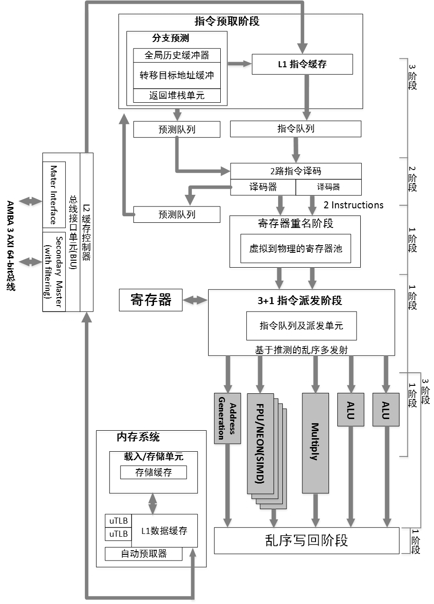

Linux 4.x 内核已经支持几十种的处理器体系结构，目前市面上最流行的两种体系结构是 x86 和 ARM。操作系统只是为处理器服务的。基于 ARM 体系结构来讲述 Linux 内核的设计与实现。

关于 ARM 体系结构，ARM 公司的官方文档已经有很多详细资料，其中描述 ARMv7-A和 ARMv8-A 架构的手册包括：

- <ARM Architecture Reference Manual, ARMv7-A and ARMv7-R edition>
- <ARM Architecture Reference Manual, ARMv8, for ARMv8-A architecture profile>

ARM Coxtex 系统处理器编程技巧：

- <ARM Coxtex-A Series Programmer’s Guide, version 4.0>
- <ARM Coxtex-A Series Programmer’s Guide for ARMv8-A, version 1.0>

虚拟化和安全特性在ARMv7上已经实现，但是大内存的支持显得有点捉襟见肘，虽然可以通过 LPAE（Large Physical Address Extensions）技术支持 40 位的物理地址空间，但是由于32位的处理器最高支持4GB的虚拟地址空间，因此不适合虚拟内存需求巨大的应用。于是ARM公司设计了一个全新的指令集，即ARMv8-A指令集，支持 64 位指令集，并且保持向前兼容ARMv7-A指令集。因此**定义AArch64和AArch32两套运行环境分别来运行64位和32位指令集，软件可以动态切换运行环境**。

## 1. 简述精简指令集RISC和复杂指令集CISC的区别

20%的简单指令经常被用到，占程序总指令数的80%，而指令集里其余80%的复杂指令很少被用到，只占程序总指令数的 20%。

## 2．请简述数值 0x12345678 在大小端字节序处理器的存储器中的存储方式

计算机中以字节为单位的，每个地址单元对应一个字节，一个字节为8个比特位。但存在着如何安排多个字节的问题，因此导致了大端存储模式（Big-endian）和小端存储模式（Little-endian）。

例如一个16比特的short型变量X，在内存中的地址为0x0010，X 的值为 0x1122，那么 0x11 为高字节，0x22为低字节。对于大端模式，就将 0x11 放在低地址中；0x22 放在高地址中。小端模式则刚好相反。很多的ARM处理器默认使用小端模式，有些ARM处理器还可以由硬件来选择是大端模式还是小端模式。**Cortex-A系列的处理器可以通过软件来配置大小端模式**。大小端模式是在处理器Load/Store访问内存时用于描述寄存器的字节顺序和内存中的字节顺序之间的关系。

大端模式：指数据的高字节保存在内存的低地址中，而数据的低字节保存在内存的高地址中。例如：

```
内存视图：

0000430: 1234 5678 0100 1800 53ef 0100 0100 0000
0000440: c7b6 1100 0000 3400 0000 0000 0100 ffff
```

在大端模式下，前32位(整个作为一个数据)应该这样读：12 34 56 78。

因此，大端模式下地址的增长顺序与值的增长顺序相同。

小端模式：指数据的高字节保存在内存的高地址中，而数据的低字节保存在内存的低
地址中。例如：

```
内存视图：

0000430: 7856 3412 0100 1800 53ef 0100 0100 0000
0000440: c7b6 1100 0000 3400 0000 0000 0100 ffff
```

在小端模式下，前32位(整个作为一个数据)应该这样读：12 34 56 78。

因此，小端模式下地址的增长顺序与值的增长顺序相反。

如何检查处理器是大端模式还是小端模式？**联合体Union的存放顺序**是所有成员都从低地址开始存放的，利用该特性可以轻松获取CPU对内存采用大端模式还是小端模式读写。

```
int checkCPU(void)
{
    union w
    {
        int a;
        char b;
    } c;
    c.a = 1;
    return (c.b == 1);
}
```

如果输出结果是 true，则是小端模式，否则是大端模式。

## 3．请简述在你所熟悉的处理器（比如双核Cortex-A9）中一条存储读写指令的执行全过程

经典处理器架构的流水线是五级流水线：取指、译码、发射、执行和写回。

现代处理器在设计上都采用了超标量体系结构（Superscalar Architecture）和乱序执行（out-of-order）技术。超标量技术能够**在一个时钟周期内执行多个指令**，实现指令级的并行，有效提高了 ILP（Instruction Level Parallelism）指令级的并行效率，同时也增加了整个 cache 和 memory 层次结构的实现难度。

一条存储读写指令的执行全过程很难用一句话来回答。在一个支持超标量和乱序执行技术的处理器当中，一条存储读写指令的执行过程被分解为若干步骤。指令首先进入流水线（pipeline）的前端（Front-End），包括预取（fetch）和译码（decode），经过分发（dispatch）和调度（scheduler）后进入执行单元，最后提交执行结果。所有的指令采用顺序方式（In-Order）通过前端，并采用乱序的方式（Out-of-Order，OOO）进行发射，然后乱序执行，最后用顺序方式提交结果，并将最终结果更新到LSQ（Load-Store Queue）部件。LSQ部件是指令流水线的一个执行部件，可以理解为存储子系统的最高层，其上接收来自CPU的存储器指令，其下连接着存储器子系统。其主要功能是将来自 CPU 的存储器请求发送到存储器子系统，并处理其下存储器子系统的应答数据和消息。

很多程序员对乱序执行的理解有误差。对于一串给定的指令序列，为了提高效率，处理器会找出非真正数据依赖和地址依赖的指令，让它们并行执行。但是在提交执行结果时，是按照指令次序的。总的来说，顺序提交指令，乱序执行，最后顺序提交结果。例如有两条没有数据依赖的数据指令，后面那条指令的读数据先被返回，它的结果也不能先写回到最终寄存器，而是必须等到前一条指令完成之后才可以。

对于读指令，当处理器在等待数据从缓存或者内存返回时，它处于什么状态呢？是等在那不动，还是继续执行别的指令？对于乱序执行的处理器，可以执行后面的指令；对于顺序执行的处理器，会使流水线停顿，直到读取的数据返回。

如图 1.1 所示，在 x86 微处理器经典架构中，存储指令从L1指令cache中读取指令，L1指令cache会做指令加载、指令预取、指令预解码，以及分支预测。然后进入Fetch&Decode单元，会把指令解码成macro-ops微操作指令，然后由 Dispatch 部件分发到 IntegerUnit 或者 FloatPoint Unit。Integer Unit 由 Integer Scheduler 和 Execution Unit 组成，Execution Unit包含算术逻辑单元（arithmetic-logic unit，ALU）和地址生成单元（address generation unit，AGU），在ALU计算完成之后进入AGU，计算有效地址完毕后，将结果发送到LSQ部件。LSQ部件首先根据处理器系统要求的内存一致性（memory consistency）模型确定访问时序，另外LSQ还需要处理存储器指令间的依赖关系，最后LSQ需要准备 L1 cache使用的地址，包括有效地址的计算和虚实地址转换，将地址发送到L1 Data Cache 中。

图1.1 x86微处理器经典架构图：


如图1.2所示，在ARM Cortex-A9处理器中，存储指令首先通过主存储器或者L2 cache加载到L1指令cache中。在指令预取阶段（instruction prefetch stage），主要是做指令预取和分支预测，然后指令通过 Instruction Queue 队列被送到解码器进行指令的解码工作。解码器（decode）支持两路解码，可以同时解码两条指令。在寄存器重名阶段（Register rename stage）会做寄存器重命名，避免机器指令不必要的顺序化操作，提高处理器的指令级并行能力。在指令分发阶段（Dispatch stage），这里支持4路猜测发射和乱序执行（Out-of-Order Multi-Issue with Speculation），然后在执行单元（ALU/MUL/FPU/NEON）中乱序执行。存储指令会计算有效地址并发射到内存系统中的 LSU 部件（Load Store Unit），最终LSU部件会去访问 L1 数据 cache。在 ARM 中，只有 cacheable 的内存地址才需要访问 cache。

图1.2 Cortex-A9结构框图：



在多处理器环境下，还需要考虑 Cache 的一致性问题。L1 和 L2 Cache 控制器需要保证 cache 的一致性，在 Cortex-A9 中 cache 的一致性是由MESI协议来实现的。Cortex-A9处理器内置了 L1 Cache 模块，由 SCU（Snoop Control Unit）单元来实现 Cache 的一致性管理。L2 Cache需要外接芯片（例如PL310）。在最糟糕情况下需要访问主存储器，并将数据重新传递给 LSQ，完成一次存储器读写的全过程。

- 超标量体系结构（Superscalar Architecture）：早期的单发射结构微处理器的流水线设计目标是做到每个周期能平均执行一条指令，但这一目标不能满足处理器性能增长的要求，为了提高处理器的性能，要求处理器具有每个周期能发射执行多条指令的能力。因此超标量体系结构是描述一种微处理器设计理念，它能够在一个时钟周期执行多个指令。
- 乱序执行（Out-of-order Execution）：指 CPU 采用了允许将多条指令不按程序规定的顺序分开发送给各相应电路单元处理的技术，避免处理器在计算对象不可获取时的等待，从而导致流水线停顿。
- 寄存器重命名（Register Rename）：现代处理器的一种技术，用来避免机器指令或者微操作的不必要的顺序化执行，从而提高处理器的指令级并行的能力。它在乱序执行的流水线中有两个作用，一是消除指令之间的寄存器读后写相关（Write-after-Read，WAR）和写后写相关（Write-after-Write，WAW）；二是当指令执行发生例外或者转移指令猜测错误而取消后面的指令时，可用来保证现场的精确。其思路为当一条指令写一个结果寄存器时不直接写到这个结果寄存器，而是先写到一个中间寄存器过渡，当这条指令提交时再写到结果寄存器中。
- 分支预测（Branch Predictor）：当处理一个分支指令时，有可能会产生跳转，从而打断流水线指令的处理，因为处理器无法确定该指令的下一条指令，直到分支指令执行完毕。流水线越长，处理器等待时间便越长，分支预测技术就是为了解决这一问题而出现的。因此，分支预测是处理器在程序分支指令执行前预测其结果的一种机制。在 ARM 中，使用全局分支预测器，该预测器由转移目标缓冲器（Branch Target Buffer，BTB）、全局历史缓冲器（Global History Buffer，GHB）、MicroBTB，以及 Return Stack 组成。
- 指令译码器（Instruction Decode）：指令由操作码和地址码组成。操作码表示要执行的操作性质，即执行什么操作；地址码是操作码执行时的操作对象的地址。计算机执行一条指定的指令时，必须首先分析这条指令的操作码是什么，以决定操作的性质和方法，然后才能控制计算机其他各部件协同完成指令表达的功能，这个分析工作由译码器来完成。例如，Cortex-A57 可以支持3路译码器，即同时执行3条指令译码，而Cortex-A9处理器只能同时译码 2 条指令。
- 调度单元（Dispatch）：调度器负责把指令或微操作指令派发到相应的执行单元去执行，例如，Cortex-A9 处理器的调度器单元有 4 个接口和执行单元连接，因此每个周期可以同时派发 4 条指令。
- ALU 算术逻辑单元：ALU 是处理器的执行单元，主要是进行算术运算，逻辑运算和关系运算的部件。
- LSQ/LSU 部件（Load Store Queue/Unit）：LSQ 部件是指令流水线的一个执行部件，其主要功能是将来自 CPU 的存储器请求发送到存储器子系统，并处理其下存储器子系统的应答数据和消息。

## 4. 请简述内存屏障（memory barrier）产生的原因

## 6．请简述 cache 的工作方式

处理器访问主存储器使用地址编码方式。cache也使用类似的地址编码方式，因此处理器使用这些编码地址可以访问各级 cache。如图 1.3 所示，是一个经典的 cache 架构图。

图1.3  经典cache架构：


处理器在访问存储器时，会把地址同时传递给 TLB（Translation Lookaside Buffer）和cache。TLB是一个用于存储虚拟地址到物理地址转换的小缓存，处理器先使用EPN（effective page number）在 TLB 中进行查找最终的 RPN（Real Page Number）。如果这期间发生TLB miss，将会带来一系列严重的系统惩罚，处理器需要查询页表。假设这里TLB Hit，此时很快获得合适的 RPN，并得到相应的物理地址（Physical Address，PA）。

同时，处理器通过 cache 编码地址的索引域（Cache Line Index）可以很快找到相应的cache line组。但是这里的 cache block 的数据不一定是处理器所需要的，因此有必要进行一些检查，将cache line中存放的地址和通过虚实地址转换得到的物理地址进行比较。如果相同并且状态位匹配，那么就会发生 cache 命中（Cache Hit），那么处理器经过字节选择和偏移（Byte Select and Align）部件，最终就可以获取所需要的数据。如果发生 cache miss，处理器需要用物理地址进一步访问主存储器来获得最终数据，数据也会填充到相应的 cache line 中。上述描述的是 VIPT（virtual Index phg sical Tag）的 cache 组织方式，将会在问题 9 中详细介绍。

如图 1.4 所示，是 cache 的基本的结构图。

图1.4  cache结构图：


- cache 地址编码：处理器访问cache时的地址编码，分成3个部分，分别是偏移域（Offset）、索引域（Index）和标记域（Tag）。
- Cache Line：cache 中最小的访问单元，包含一小段主存储器中的数据，常见的 cache line 大小是 32Byte 或 64Byte 等。
- 索引域（Index）：cache 地址编码的一部分，用于索引和查找是在 cache 中的哪一行。
- 组（Set）：相同索引域的 cache line 组成一个组。
- 路（Way）：在组相联的 cache 中，cache 被分成大小相同的几个块。
- 标记（Tag）：cache 地址编码的一部分，用于判断 cache line 存放的数据是否和处理器想要的一致。

