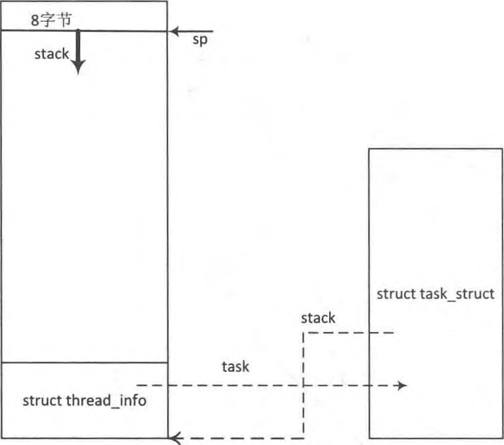

- 1 init进程

- 2 fork

- 3 小结

**本节思考题**

1. 在内核中如何获取当前进程的task\_struct数据结构？
2. 下面程序会打印出几个“\_”？

```cpp
int main(void)
{
    int i ;
    for(i=0; i<2; i++){
        fork();
        printf("_\n");
    }
    wait(NULL);
    wait(NULL);
    return 0;
}
```

3. 用户空间进程的页表是什么时候分配的，其中一级页表什么时候分配？二级页表呢？
4. 请简述fork，vfork和clone之间的区别？

进程并不仅局限于一段可执行代码（代码段)，它还包括进程需要的其他资源,例如打开的文件、挂起的信号量、内存管理、处理器状态、一个或者多个执行线程和数据段等。Linux内核通常把进程叫作是任务（task)，因此进程控制块（processing control block，PCB)也被命名为struct task_struct。进程最开始被称为工作（job)，后来改名为进程（process)。

线程被称为**轻量级进程**，它是**操作系统调度的最小单元**，通常**一个进程**可以拥有**多个线程**。线程和进程的区别在于**进程拥有独立的资源空间**，而**线程则共享进程的资源空间**。Linux内核并**没有对线程有特别的调度算法**或**定义特别的数据结构来标识线程**，**线程和进程**都使用相同的**进程PCB数据结构**。内核里使用**clone方法来创建线程**，其工作方式和创建进程fork方法类似，但会**确定哪些资源和父进程共享**，哪些**资源**为**线程独享**。

**进程**通常通过**fork系统调用**来创新一个**新的进程**，新创建的**进程**可以通过**exec**()函数创建**新的地址空间**，并载入新的程序。进程结束可以自愿退出或非自愿退出。

本章主要讲述fork系统调用的实现.fork的实现会涉及到进程管理、内存管理、文件系统和信号处理等内容，本章会讲述一些核心的实现过程。

# 1 init进程

Linux内核在**启动**时会有一个**init\_task进程**，它是系统**所有进程的“鼻袓**”，称为**0号进程**(也被称为**idle进程**或**swapper进程**),当系统**没有进程需要调度**时，调度器就会去执行**idle进程**.

idle进程在内核启动 （**start\_kernel**()函数）时**静态创建**，所有的核心数据结构都**预先静态赋值**。init\_task进程的**task\_struct**数据结构通过**INIT\_TASK宏**来赋值，定义在include/linux/init\_task.h文件中。

```cpp
[init/init_task.c]
struct task_struct  init_task  = INIT_TASK(init_task);
EXPORT_SYMBOL(init_task);

[include/linux/init_task.h]
#define INIT_TASK(tsk)	\
{									\
	.state		= 0,						\
	// 第1处
	.stack		= &init_thread_info,				\
	.usage		= ATOMIC_INIT(2),				\
	// 第2处
	.flags		= PF_KTHREAD,					\
	.prio		= MAX_PRIO-20,					\
	.static_prio	= MAX_PRIO-20,					\
	.normal_prio	= MAX_PRIO-20,					\
	.policy		= SCHED_NORMAL,					\
	.cpus_allowed	= CPU_MASK_ALL,					\
	.nr_cpus_allowed= NR_CPUS,					\
	.mm		= NULL,						\
	// 第3处
	.active_mm	= &init_mm,					\
	.restart_block = {						\
		.fn = do_no_restart_syscall,				\
	},								\
	.se		= {						\
		.group_node 	= LIST_HEAD_INIT(tsk.se.group_node),	\
	},								\
	.rt		= {						\
		.run_list	= LIST_HEAD_INIT(tsk.rt.run_list),	\
		.time_slice	= RR_TIMESLICE,				\
	},								\
	.tasks		= LIST_HEAD_INIT(tsk.tasks),			\
	INIT_PUSHABLE_TASKS(tsk)					\
	INIT_CGROUP_SCHED(tsk)						\
	.ptraced	= LIST_HEAD_INIT(tsk.ptraced),			\
	.ptrace_entry	= LIST_HEAD_INIT(tsk.ptrace_entry),		\
	.real_parent	= &tsk,						\
	.parent		= &tsk,						\
	.children	= LIST_HEAD_INIT(tsk.children),			\
	.sibling	= LIST_HEAD_INIT(tsk.sibling),			\
	.group_leader	= &tsk,						\
	RCU_POINTER_INITIALIZER(real_cred, &init_cred),			\
	RCU_POINTER_INITIALIZER(cred, &init_cred),			\
	.comm		= INIT_TASK_COMM,				\
	.thread		= INIT_THREAD,					\
	.fs		= &init_fs,					\
	.files		= &init_files,					\
	.signal		= &init_signals,				\
    ···
}

[arch/arm/include/asm/thread_info.h]
#define init_thread_info	(init_thread_union.thread_info)
```

init/init\_task.c的头文件在include/linux/init\_task.h

init\_task进程的task\_struct数据结构中**stack**成员指向**thread\_info**数据结构。

通常**内核栈大小是8KB**，即两个物理页面的大小，它存放在**内核映像文件中data段**中，在**编译链接时预先分配**好，具体见arch/arm/kernel/vmlinux.lds.S链接文件。

```cpp
[arch/arm/kernel/vmlinux.lds.S]
SECTIONS
{
    
	.data : AT(__data_loc) {
		_data = .;		/* address in memory */
		_sdata = .;

		/*
		 * first, the init task union, aligned
		 * to an 8192 byte boundary.
		 */
		// 重点位置，x86也是
		INIT_TASK_DATA(THREAD_SIZE)
		···
		_edata = .;
	}
}

[arch/arm/include/asm/thread_info.h]
#define THREAD_SIZE_ORDER  1
#define THREAD_SIZE  {PAGE_SIZE << THREAD_SIZE_ORDER)
#define THREAD_START_SP  (THREAD_SIZE - 8)

[include/asm-generic/vmlinux.Ids.h]
#define INIT_TASK_DATA (align)  \
    . = ALIGN(align);  \
    *(.data..init_task)
```

由链接文件可以看到**data段预留了8KB的空间**用于**内核栈（！！！**），存放在data段**的“.data..init\_task**”中。

\_**init\_task\_data**宏会直接读**取“.data..init\_task**”段内存，并且存放了一个**thread\_union联合数据结构**，从联合数据结构可以看出其分布情况：**开始的地方**存放了**struct thread\_info**数据结构，**顶部往下的空间用于内核栈空间**。

```cpp
[include/linux/init_task.h]
/* Attach to the init_task data structure for proper alignment */
// __init_task_data 存放在 .data..init_task段
#define __init_task_data __attribute__((__section__(".data..init_task")))

[init/init_task.c]
/*
 * Initial thread structure. Alignment of this is handled by a special
 * linker map entry.
 */
// __init_task_data声明为thread_union类型，描述了整个内核栈stack[]
// __init_task_data通过INIT_THREAD_INFO初始化
union thread_union init_thread_union __init_task_data =
	{ INIT_THREAD_INFO(init_task) };
	
[include/linux/sched.h]
union thread_union {
	struct thread_info thread_info;
	unsigned long stack[THREAD_SIZE/sizeof(long)];
};

[arch/arm/include/asm/thread_info.h]
#define INIT_THREAD_INFO(tsk)						\
{									\
	.task		= &tsk,						\
	.exec_domain	= &default_exec_domain,				\
	.flags		= 0,						\
	.preempt_count	= INIT_PREEMPT_COUNT,				\
	.addr_limit	= KERNEL_DS,					\
	.cpu_domain	= domain_val(DOMAIN_USER, DOMAIN_MANAGER) |	\
			  domain_val(DOMAIN_KERNEL, DOMAIN_MANAGER) |	\
			  domain_val(DOMAIN_IO, DOMAIN_CLIENT),		\
}
```

\_\_**init\_task\_data存放在".data..init\_task"段**中，\_\_**init\_task\_data声明为thread\_union类型**，thread\_union类型**描述了整个内核栈stack**[]，栈的**最下面存放struct thread_info数据结构**，因此\_\_**init\_task\_data**也通过**INIT\_THREAD\_INFO宏**来**初始化**struct thread\_info数据结构。**init进程**的task\_struct数据结构通过**INIT\_TASK宏**来初始化。

ARM32处理器从汇编代码跳转到C语言的入口点在start\_kernel()函数之前，设置了SP寄存器指向**8KB内核栈顶部**区域（要**预留8Byte<字节>的空洞**）。

```cpp
[arch/arm/kernel/head-common.S]
__mmap_switched:
    // 重点1
	adr	r3, __mmap_switched_data
    
	ldmia	r3!, {r4, r5, r6, r7}
	cmp	r4, r5				@ Copy data segment if needed
1:	cmpne	r5, r6
	ldrne	fp, [r4], #4
	strne	fp, [r5], #4
	bne	1b

	mov	fp, #0				@ Clear BSS (and zero fp)
1:	cmp	r6, r7
	strcc	fp, [r6],#4
	bcc	1b

//重点2
 ARM(	ldmia	r3, {r4, r5, r6, r7, sp})
 THUMB(	ldmia	r3, {r4, r5, r6, r7}	)
 THUMB(	ldr	sp, [r3, #16]		)
	str	r9, [r4]			@ Save processor ID
	str	r1, [r5]			@ Save machine type
	str	r2, [r6]			@ Save atags pointer
	cmp	r7, #0
	strne	r0, [r7]			@ Save control register values
	// 跳转到start_kernel
	b	start_kernel
ENDPROC(__mmap_switched)

	.align	2
	.type	__mmap_switched_data, %object
__mmap_switched_data:
	.long	__data_loc			@ r4
	.long	_sdata				@ r5
	.long	__bss_start			@ r6
	.long	_end				@ r7
	.long	processor_id			@ r4
	.long	__machine_arch_type		@ r5
	.long	__atags_pointer			@ r6
#ifdef CONFIG_CPU_CP15
	.long	cr_alignment			@ r7
#else
	.long	0				@ r7
#endif
    //重点3 THREAD_START_SP
	.long	init_thread_union + THREAD_START_SP @ sp
	.size	__mmap_switched_data, . - __mmap_switched_data

[arch/arm/include/asm/thread_info.h]
#define THREAD_START_SP		(THREAD_SIZE - 8)
```

汇编代码\_\_mmap\_switched标签处设置相关r3\~r7以及SP寄存器,其中,**SP寄存器指向data段预留8KB空间的顶部(8KB\-8**),然后**跳转到start\_kernel**().

**x86**情况下,在arch/x86/kernel/head\_32.S中,然后会跳转到函数i386\_start\_kernel(arch/x86/kernel/head32.c中),然后里面会调用start\_kernel(init/main.c).

\_\_mmap\_switched\_data标签处定义了r4\~sp寄存器的值，相当于一个表，通过adr指令把这表读取到r3寄存器中，然后再通过ldmia指令写入相应寄存器中。

内核有一个常用的**常量current**用于获取**当前进程task\_struct数据结构**，它利用了**内核栈**的特性。首先通过**SP寄存器**获取**当前内核栈的地址**，**对齐**后可以获取struct **thread\_info数据结构指针**，最后通过thread\_info->task成员获取**task\_struct数据结构**。如图3.1所示是Linux内核栈的结构图。

```
[include/asm-generic/current.h]
#define get_current() (current_thread_info()->task)
#define current get_current()

[arch/arm/include/asm/thread_info.h]
register unsigned long current_stack_pointer asm ("sp");
static inline struct thread_info *current_thread_info(void)
{
	return (struct thread_info *)
		(current_stack_pointer & ~(THREAD_SIZE - 1));
}
```

图3.1 内核栈:



struct thread\_info数据结构定义如下：

```
[arch/arm/include/asm/thread_info.h]

/*
 * low level task data that entry.S needs immediate access to.
 * __switch_to() assumes cpu_context follows immediately after cpu_domain.
 */
struct thread_info {
	unsigned long		flags;		/* low level flags */
	int			preempt_count;	/* 0 => preemptable, <0 => bug */
	mm_segment_t		addr_limit;	/* address limit */
	struct task_struct	*task;		/* main task structure */
	struct exec_domain	*exec_domain;	/* execution domain */
	__u32			cpu;		/* cpu */
	__u32			cpu_domain;	/* cpu domain */
	struct cpu_context_save	cpu_context;	/* cpu context */
	__u32			syscall;	/* syscall number */
	__u8			used_cp[16];	/* thread used copro */
	unsigned long		tp_value[2];	/* TLS registers */
#ifdef CONFIG_CRUNCH
	struct crunch_state	crunchstate;
#endif
	union fp_state		fpstate __attribute__((aligned(8)));
	union vfp_state		vfpstate;
#ifdef CONFIG_ARM_THUMBEE
	unsigned long		thumbee_state;	/* ThumbEE Handler Base register */
#endif
};
```

# 2 fork

在 Linux系统中，进程或线程是通过**fork**、**vfork**或**clone**等**系统调用**来建立的。在**内核中**，这3个系统的调用都是**通过同一个函数来实现**，即**do\_fork()函数**,该函数定义在fork.c文件中。

```
[kernel/fork.c]
long do_fork(unsigned long clone_flags,
	      unsigned long stack_start,
	      unsigned long stack_size,
	      int __user *parent_tidptr,
	      int __user *child_tidptr)
```

