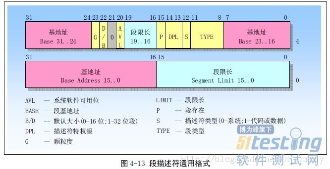
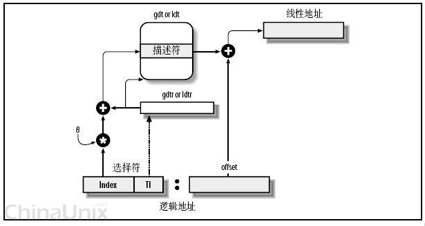
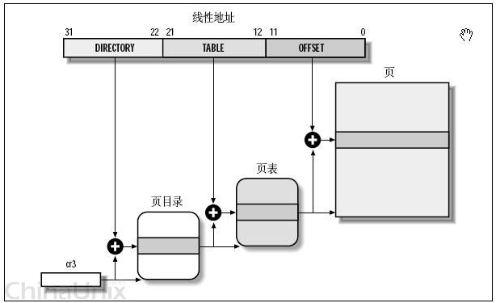

1. 概念

物理地址（physical address）  
用于内存芯片级的单元寻址。它们与从微处理器的地址引脚发送到内存总线上的电信号相对应。虽然可以直接把物理地址理解成插在机器上那根内存本身，把内存看成一个从0字节一直到最大空量逐字节的编号的大数组，然后把这个数组叫做物理地址，但是事实上，这只是一个硬件提供给软件的抽像，内存的寻址方式并不是这样。所以，说它是“与地址总线相对应”，是更贴切一些。

虚拟内存(virtual memory)  
这是对整个内存（不要与机器上插那条对上号）的抽像描述。它是相对于物理内存来讲的，可以直接理解成“不真实的”，“假的”内存，例如，一个0x08000000内存地址，它并不对就物理地址上那个大数组中0x08000000 - 1那个地址元素；之所以是这样，是因为现代操作系统都提供了一种内存管理的抽像，即虚拟内存（virtual memory）。进程使用虚拟内存中的地址，由操作系统协助相关硬件，把它“转换”成真正的物理地址。这个“转换”，是所有问题讨论的关键。  
有了这样的抽像，一个程序，就可以使用比真实物理地址大得多的地址空间。甚至多个进程可以使用相同的地址。不奇怪，因为转换后的物理地址并非相同的。  
可以把连接后的程序反编译看一下，发现连接器已经为程序分配了一个地址，例如，要调用某个函数A，代码不是call A，而是call 0x0811111111 ，也就是说，函数A的地址已经被定下来了。没有这样的“转换”，没有虚拟地址的概念，这样做是根本行不通的。

逻辑地址(logical address)  
Intel为了兼容，将远古时代的段式内存管理方式保留了下来。逻辑地址指的是机器语言指令中，用来指定一个操作数或者是一条指令的地址。以上例，我们说的连接器为A分配的0x08111111这个地址就是逻辑地址。  
这样说，好像又违背了Intel中段式管理中，对逻辑地址要求，“一个逻辑地址，是由一个段标识符加上一个指定段内相对地址的偏移量，表示为 [段标识符：段内偏移量]，也就是说，上例中那个0x08111111，应该表示为[A的代码段标识符: 0x08111111]”

线性地址(linear address)或也叫虚拟地址(virtual address)  
跟逻辑地址类似，它也是一个不真实的地址，如果逻辑地址是对应的硬件平台段式管理转换前地址的话，那么线性地址则对应了硬件页式内存的转换前地址。

CPU将一个虚拟内存空间中的地址转换成物理地址，需要进行两步：首先将一个逻辑地址（其实是段内偏移量，一定要理解），CPU要利用其段式内存管理单元，先将逻辑地址转换成一个线性地址，再利用其页式内存管理单元，转换成最终物理地址。

这样做两次转换，的确是非常麻烦而且没有必要的，因为直接可以把线性地址抽像给进程。之所以这样冗余，Intel完全是为了兼容而已。

2. CPU段式内存管理，逻辑地址如何转换成线性地址

我们写个最简单的hello world程序，用gcc编译，再反汇编后会看到以下指令：

mov    0x80495b0, %eax

这里的内存地址0x80495b0 就是一个逻辑地址（偏移量），必须加上隐含的DS 数据段的基地址，才能构成线性地址。也就是说 0x80495b0 是当前任务的DS数据段内的偏移。

一个逻辑地址由两部分组成，段标识符：段内偏移量。**段标识符**是由一个16位长的字段组成，称为**段选择符**。其中前13位是一个索引号。后面3位包含一些硬件细节。如图：


索引号是“段描述符(segment desciptor)”的索引，**段描述符**具体描述了一个段（包含段基线性地址、长度、权限等），段的信息（段描述符）无法直接存放在段寄存器中（段寄存器只有2字节）。很多段描述符组成“段描述符表”。这样，可以通过段标识符的前13位，直接在段描述符表中找到一个具体的段描述符，这个描述符就描述了一个段。

每一个段描述符（段的信息）由8个字节组成，如下：




这个很复杂，可以使用一个数据结构来定义。在这里，只关心Base字段，它描述了一个段的开始位置的线性地址。

Intel设计的本意是，一些全局的段描述符，就放在“全局段描述符表(GDT)”中，一些局部的，例如每个进程自己的，就放在所谓的“局部段描述符表(LDT)”中。那究竟什么时候该用GDT，什么时候该用LDT呢？这是由段选择符中的T1字段表示的，=0，表示用GDT，=1表示用LDT。

GDT在内存中的地址和大小存放在CPU的gdtr控制寄存器中，而LDT则在ldtr寄存器中。段寄存器中存放的是段描述符在GDT或LDT内的索引值（index）。



首先，给定一个完整的逻辑地址[段选择符:段内偏移地址]，

1. 看段选择符的T1=0还是1，知道当前要转换是GDT中的段，还是LDT中的段，再根据相应寄存器，得到其地址和大小。我们就有了一个数组了。
2. 拿出段选择符中前13位，可以在这个数组中，查找到对应的段描述符，这样，它的Base，即基地址就知道了。
3. 把Base + offset，就是要转换的线性地址了。

还是挺简单的，对于软件来讲，原则上就需要把硬件转换所需的信息准备好，就可以让硬件来完成这个转换了。OK，来看看Linux怎么做的。

3. Linux的段式管理

Intel要求两次转换，这样虽说是兼容了，但是却是很冗余，呵呵，没办法，硬件要求这样做了，软件就只能照办，怎么着也得形式主义一样。

另一方面，其它某些硬件平台，没有二次转换的概念，Linux也需要提供一个高层抽像，来提供一个统一的界面。所以，Linux的段式管理，事实上只是“哄骗”了一下硬件而已。

按照Intel的本意，全局的用GDT，每个进程自己的用LDT——不过Linux则对所有的进程都使用了相同的段来对指令和数据寻址。即用户数据段，用户代码段，对应的，内核中的是内核数据段和内核代码段。这样做没有什么奇怪的，本来就是走形式嘛，像我们写年终总结一样。

```
__USER_CS：用户代码段
__USER_DS：用户数据段
__KERNEL_CS：内核代码段
__KERNEL_DS：内核数据段
```

include/asm-i386/segment.h

```
#define GDT_ENTRY_DEFAULT_USER_CS        14
#define __USER_CS (GDT_ENTRY_DEFAULT_USER_CS * 8 + 3)
#define GDT_ENTRY_DEFAULT_USER_DS        15
#define __USER_DS (GDT_ENTRY_DEFAULT_USER_DS * 8 + 3)
#define GDT_ENTRY_KERNEL_BASE        12
#define GDT_ENTRY_KERNEL_CS                (GDT_ENTRY_KERNEL_BASE + 0)
#define __KERNEL_CS (GDT_ENTRY_KERNEL_CS * 8)
#define GDT_ENTRY_KERNEL_DS                (GDT_ENTRY_KERNEL_BASE + 1)
#define __KERNEL_DS (GDT_ENTRY_KERNEL_DS * 8)
```

把其中的宏替换成数值，则为：

```
#define __USER_CS 115        [00000000 1110  0  11]
#define __USER_DS 123        [00000000 1111  0  11]
#define __KERNEL_CS 96      [00000000 1100  0  00]
#define __KERNEL_DS 104    [00000000 1101  0  00]
```

方括号后是这四个段选择符的16位二制表示，它们的索引号和T1字段值也可以算出来了

```
__USER_CS             index= 14   T1=0
__USER_DS             index= 15   T1=0
__KERNEL_CS           index= 12   T1=0
__KERNEL_DS           index= 13   T1=0
```

T1均为0，则表示都使用了GDT，再来看初始化GDT的内容中相应的12-15项(arch/i386/head.S)：

```
.quad 0x00cf9a000000ffff        /* 0x60 kernel 4GB code at 0x00000000 */
.quad 0x00cf92000000ffff        /* 0x68 kernel 4GB data at 0x00000000 */
.quad 0x00cffa000000ffff        /* 0x73 user 4GB code at 0x00000000 */
.quad 0x00cff2000000ffff        /* 0x7b user 4GB data at 0x00000000 */
```

按照前面段描述符表中的描述，可以把它们展开，发现其16-31位全为0，即四个段的基地址全为0。

这样，给定一个段内偏移地址，按照前面转换公式，0 + 段内偏移，转换为线性地址，可以得出重要的结论，“在Linux下，逻辑地址与线性地址总是一致（是一致，不是有些人说的相同）的，即逻辑地址的偏移量字段的值与线性地址的值总是相同的。！！！”

内核任务使用__KERNEL_CS和__KERNEL_DS。所有的用户任务共用__USER_CS和__USER_DS，也就是说不需要给每个任务再单独分配段描述符。内核段描述符和用户段描述符虽然起始线性地址和长度都一样，但是DPL（描述符特权级）不一样，__KERNEL_CS 和__KERNEL_DS 的DPL值为0（最高特权），__USER_CS 和__USER_DS的DPL值为3。

忽略了太多的细节，例如段的权限检查。

用gdb调试程序的时候，用info reg 显示当前寄存器的值：

```
cs             0x73     115

ss             0x7b     123

ds             0x7b     123

es             0x7b     123
```

ds的值为0x7b，转换成二进制为 00000000 01111011，TI字段是0，表明使用GDT，GDT的索引值是 0111，即十进制15，对应的就是GDT内__USER_DS用户数据段描述符。


Linux中，绝大部份进程并不利用LDT，除非使用Wine ，仿真Windows程序的时候。

4. CPU的页式内存管理

在保护模式下，控制寄存器CR0的最高位PG位控制着分页管理机制是否生效，如果PG=1，分页机制生效，需通过页表查找才能把线性地址转换物理地址。如果PG=0，则分页机制无效，线性地址就直接做为物理地址。

CPU的页式内存管理单元，负责把一个线性地址，最终翻译为一个物理地址。从管理和效率的角度出发，线性地址被分为以固定长度为单位的组，称为页(page)，例如一个32位的机器，线性地址最大可为4G，可以用4KB为一个页来划分（先不考虑扩展分页的情况），这样，每页的起始地址都是4K字节对齐，而整个线性地址就被划分为一个tatol_page[2^20]的大数组，共有2的20次方个页。这个大数组我们称之为页目录。目录中的每一个目录项，就是一个地址——对应的页的地址。

另一类“页”，我们称之为物理页，或者是页框、页桢的。是分页单元把所有的物理内存也划分为固定长度的管理单位，它的长度一般与内存页是一一对应的。

这里注意到，这个total_page数组有2^20个成员，每个成员是一个地址（32位机，一个地址也就是4字节），那么要单单要表示这么一个数组，就要占去4MB的内存空间。为了节省空间，引入了一个二级管理模式的机器来组织分页单元。文字描述太累，看图直观一些：



如上图：

```
1. 分页单元中，页目录是唯一的，它的地址放在CPU的CR3寄存器中，是进行地址转换的开始点。
2. 每个活动的进程，因为都有其独立的对应的虚拟内存（页目录也是唯一的），那么它也对应一个独立的页目录地址。————运行一个进程，需要将它的页目录地址放在CR3寄存器中，将别个的保存下来。
3. 每一个32位的线性地址被划分为三部分，页目录索引（10位）：页表索引（10位）：物理页内的字节偏移（12位）
```

我们需要给CPU提供**当前任务**的线性地址转物理地址的查找表，即页表（page table）。注意，为了实现每个任务的平摊的虚拟内存，每个任务都有自己的页目录表和页表。

页目录表的大小为4k（刚好是一个页的大小），包含1024项，每个项4字节（32位），项目里存储的内容就是**页表的物理地址**。如果页目录表中的页表尚未分配，则物理地址填0。

页表的大小也是4k，同样包含1024项，每个项4字节，内容为最终物理页的物理内存起始地址。

每个活动的任务，必须要先分配给它一个页目录表，并把页目录表的物理地址存入cr3寄存器。页表可以提前分配好，也可以在用到的时候再分配。

依据以下步骤进行转换：

1、从cr3中取出进程的页目录地址（操作系统负责在调度进程的时候，把这个地址装入对应寄存器）；

2、根据线性地址前十位，在数组中，找到对应的索引项，因为引入了二级管理模式，页目录中的项，不再是页的地址，而是一个页表的地址。（又引入了一个数组），页的地址被放到页表中去了。

3、根据线性地址的中间十位，在页表（也是数组）中找到页的起始地址；

4、将页的起始地址与线性地址中最后12位相加，得到最终我们想要的物理地址。

以 mov    0x80495b0, %eax 中的地址为例分析一下线性地址转物理地址的过程。

前面说到Linux中逻辑地址等于线性地址，那么我们要转换的线性地址就是0x80495b0。转换的过程是由CPU自动完成的，Linux所要做的就是准备好转换所需的页目录表和页表（假设已经准备好，给页目录表和页表分配物理内存的过程很复杂，后面再分析）。

- 内核先将当前任务的页目录表的物理地址填入cr3寄存器。

- 线性地址 0x80495b0 转换成二进制后是 0000 1000 0000 0100 1001 0101 1011 0000，最高10位0000 1000 00的十进制是32，CPU查看页目录表第32项，里面存放的是页表的物理地址。线性地址中间10位00 0100 1001 的十进制是73，页表的第73项存储的是最终物理页的物理起始地址。物理页基地址加上线性地址中最低12位的偏移量，CPU就找到了线性地址最终对应的物理内存单元。


我们知道Linux中用户进程线性地址能寻址的范围是0 － 3G，那么是不是需要提前先把这3G虚拟内存的页表都建立好呢？一般情况下，物理内存是远远小于3G的，加上同时有很多进程都在运行，根本无法给每个进程提前建立3G的线性地址页表。Linux利用CPU的一个机制解决了这个问题。进程创建后我们可以给页目录表的表项值都填0，CPU在查找页表时，如果表项的内容为0,则会引发一个缺页异常，进程暂停执行，Linux内核这时候可以通过一系列复杂的算法给分配一个物理页，并把物理页的地址填入表项中，进程再恢复执行。当然进程在这个过程中是被蒙蔽的，它自己的感觉还是正常访问到了物理内存。

这个转换过程，应该说还是非常简单地。全部由硬件完成，虽然多了一道手续，但是节约了大量的内存，还是值得的。那么再简单地验证一下：

1、这样的二级模式是否仍能够表示4G的地址；

页目录共有：2^10项，也就是说有这么多个页表
每个目表对应了：2^10页；
每个页中可寻址：2^12个字节。
还是2^32 = 4GB

2、按<深入理解计算机系统>中的解释,二级模式空间的节约是从两个方面实现的:

A、如果一级页表中的一个页表条目为空，那么那所指的二级页表就根本不会存在。这表现出一种巨大的潜在节约，因为对于一个典型的程序，4GB虚拟地址空间的大部份都会是未分配的；

B、只有一级页表才需要总是在主存中。虚拟存储器系统可以在需要时创建，并页面调入或调出二级页表，这就减少了主存的压力。只有最经常使用的二级页表才需要缓存在主存中。——不过Linux并没有完全享受这种福利，它的页表目录和与已分配页面相关的页表都是常驻内存的。

值得一提的是，虽然页目录和页表中的项，都是4个字节，32位，但是它们都只用高20位，低12位屏蔽为0——把页表的低12屏蔽为0，是很好理解的，因为这样，它刚好和一个页面大小对应起来，大家都成整数增加。计算起来就方便多了。但是，为什么同时也要把页目录低12位屏蔽掉呢？因为按同样的道理，只要屏蔽其低10位就可以了，不过我想，因为12>10，这样，可以让页目录和页表使用相同的数据结构，方便。

这个只是一般性转换的原理，扩展分页、页的保护机制、PAE模式的分页这些麻烦点的东西可以参考其它专业书籍。

5. Linux的页式内存管理

原理上来讲，Linux只需要为每个进程分配好所需数据结构，放到内存中，然后在调度进程的时候，切换寄存器cr3，剩下的就交给硬件来完成了（呵呵，事实上要复杂得多，不过我们只分析最基本的流程）。

前面说了i386的二级页管理架构，不过有些CPU，还有三级，甚至四级架构，Linux为了在更高层次提供抽像，为每个CPU提供统一的界面。提供了一个四层页管理架构，来兼容这些二级、三级、四级管理架构的CPU。这四级分别为：

```
页全局目录PGD（对应刚才的页目录）
页上级目录PUD（新引进的）
页中间目录PMD（也就新引进的）
页表PT（对应刚才的页表）
```

整个转换依据硬件转换原理，只是多了二次数组的索引罢了，如下图：


那么，对于使用二级管理架构的32位硬件，现在又是四级转换，它们怎么协调的呢？

从硬件的角度，32位地址被分为了三部分。也就是说，不管软件怎么做，最终落实到硬件，也只认识三部分。

从软件的角度，由于多引入了两部分，也就是说共有五部分。要让二层架构的硬件认识五部分也容易，在地址划分的时候，将页上级目录和页中间目录的长度设置为0即可。

这样，操作系统见到的是五部分，硬件还是按照三部分划分，也不会出错。

这样，虽说多此一举，但是考虑到64位地址，使用四层转换架构的CPU，我们就不再把中间两个设为0了。

例如，一个逻辑地址已经被转换成线性地址，0x08147258，换成二进制，也就是：

0000 1000 0001 0100 0111 0010 0101 1000

0000100000 0101000111 001001011000

内核对这个地址进行划分

- PGD = 0000100000
- PUD = 0
- PMD = 0
- PT = 0101000111
- offset = 001001011000

现在理解Linux怎么向下对硬件的，因为硬件根本不感知PUD和PMD，所以，本质上要求PGD索引，直接就对应了PT的地址。而不是去PUD和PMD中去查数组（虽然他们两个在线性地址中，长度为0，2^0=1，也就是说，他们都是有一个数组元素的数组），那么，内核会如何安排地址呢？

从软件上来讲，因为它的项只有一个，32位，刚好可以存放与PGD长度一样的地址指针。那么所谓先到PUD，到PMD中做映射转换，就变成了保持原值不变，转手就可以了。这样，就实现了“逻辑上指向一个PUD，再指向一个PDM，但在物理上是直接指向相应的PT的这个抽象，因为硬件不感知PUD、PMD”。

然后交给硬件，硬件对这个地址进行划分，看到的是：

- 页目录 = 0000100000
- PT = 0101000111
- offset = 001001011000

先根据0000100000（32），在页目录数组中索引，找到其元素中的地址，取其高20位，找到页表的地址，页表的地址是由内核动态分配的，接着，再加上offset，就是最终的物理地址了。

地址转换总览：

