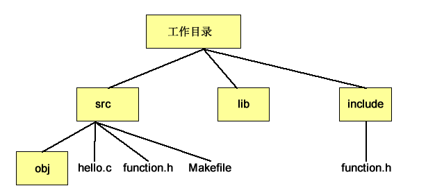

# 简介

Makefile是Linux下程序开发的**自动化编译工具**，用以识别**编译目标**、**源文件**及**其依赖关系**，并且有着高效的编译效率。

每次执行 `make` 时，就能够**自动寻找 Makefile（makefile）文件**，执行编译工作。

Makefile拥有很多复杂的功能，为了简化问题的复杂性，本文仅和大家讨论针对单目录下的`C/C++`项目开发，如何写一个通用的 Makefile。

我们一般在 Linux 中经常看到项目用有 Makefile，而在 Windows 中很少看到，原因是因为 Windows 上的IDE工具已经自动生成了Makefile 文件，编译工程的时候自动调用 Makefile 进行编译，所以在 Windows 上我们经常是在不知情的情况下和Makefile打交道。

## Makefile的构成

一个Makefile中通常包含下面内容：

1、需要由make工具创建的**目标体**（`target`），通常是**目标文件**或**可执行文件**。

2、要创建的**目标体**所**依赖的文件**（`dependency`）。

3、创建**每个目标体**时需要运行的**命令**（`command`）。

基本语法规则如下：


注意：如果“command”不和目标文件所在一行时，在command前要加 Tab 键。

# 基本例子

下面以一个简单的程序为例，包括`主程序（hello.c）`、`函数代码（function.c）`、`头文件（function.h）`，内容如下。

主函数`hello.c`：

```cpp
#include <stdio.h>
#include "function.h"

int main()
{
    fun1();
    fun2();
    fun3();
    return 0;
}
```

函数`function.c`：

```cpp
#include<stdio.h>

int fun1()
{
    printf("This is first function!\n");
    return 0;
}

int fun2()
{
    printf("This is second function!\n");
    return 0;
}

int fun3()
{
    printf("This is third function!\n");
    return 0;
}
```

头文件`function.h`：

```cpp
#ifndef _FUN_H
#define _FUN_H

int fun1(void);
int fun2(void);
int fun3(void);

#endif
```

## 编译命令

一般的，我们会使用

```
gcc -o hello hello.c function.c -I.
```

来编译。“`-I.`”是指gcc在**当前目录**下（.）下去寻找**头文件**。

如果不用makefile，在“`测试-修改-调试`”过程中，我们必须不停地在终端中按上下键来寻找最后的那条编译指令。

## 使用命令的两个缺陷

这种编译方法有两个缺陷：

a. 当你把**编译指令丢失**或者换电脑的时候，这样效率会很低；

b. 当我们**只修改了一个.c文件**时，每一次都将必须**重新编译所有的文件**，非常**耗时**，不划算。

# 简单makefile

所以我们需要用 Makefile 文件来统一管理这种编译规则，这样只要我们在目录下敲入“make”命令，就可以编译了。本例最简单的 Makefile 写法：

```makefile
hello: hello.c fucntion.c
	gcc -o hello hello.c function.c -I.
```

注意：第一行中并**没有任何参数**，只是在冒号（:）后列出**编译中所需的文件**，当**第一行**中的**任何文件中更改**时，make 就知道 hello  需要**重新编译**了。

还有一点非常重要：gcc 前面必须有一个Tab，在**任何指令之前**都要有一个Tab，不然make就会罢工的。

## 问题B依旧存在

现在我们已经解决了问题a，不用上下按箭头了，但是对于**问题b**依旧没有很好地解决。

# 使用变量

为了让事情变得更通用，我们将 Makefile 改成：

```makefile
TARGET = hello
CC = gcc
CFLAGS = -I.

$(TARGET): hello.c function.c
	$(CC) -o $(TARGET) hello.c function.c $(CFLAGS)
```

这里我们新定义了**三个变量** `TARGET`、`CC` 和 `CFLAGS` 。`TARGET`是**目标文件名**，`CC`是**编译器**，`CFLAGS`是**编译用的参数**。

make 会**先**分别编译 .c 文件，**然后**生成可执行文件 hello。

## 头文件改变但不会重新编译

这种形式的makefile在小项目中非常有效，但是有一个遗憾：**include 头文件的变动**。

如果我们**修改**了 `function.h` 文件，make是**不会重新编译！！！** `.c` 文件的，事实上我们需要重新编译。

为了解决这一问题，我们必须告诉 `make` **所有**的 `.c` 文件**依赖**于 `.h` 文件。

## 变量引用的格式

一般在书写Makefile时，各部分变量引用的格式如下：

- make**变量**（**Makefile** 中**定义**的或者是 **make** 的**环境变量**）的**引用**使用“`$(VAR)`”格式，无论“VAR”是单字符变量名还是多字符变量名。

- 出现在**规则命令行**中**shell变量**（一般为执行命令过程中的临时变量，它不属于Makefile变量，而是一个shell变量）引用使用shell的“`$tmp`”格式。

- 对出现在**命令行**中的 **make 变量**同样使用“`$(CMDVAR)`” 格式来引用。

# 自动变量

自动变量可以让 make 看到一个`.o`文件，**自动**把对应的 `.c` 文件加到**依赖文件**中，这样 Makefile 就简化了。

我们可以在 Makefile 中增加一条规则：

```makefile
TARGET = hello
CC = gcc
CFLAGS = -I.
DEPS = function.h

%.o: %.c $(DEPS)
    $(CC) -c -o $@ $< $(CFLAGS)

$(TARGET): hello.o function.o
    $(CC) -o $@ $^ $(CFLAGS)
```

首先定义 **DEPS**，声明 `.c` 文件**所依赖**的 `.h` 文件。

然后我们**定义一条规则**，为**所有！！！** 的 `.c` 文件**生成**一个 `.o` 文件。

最后再定义生成**目标文件**。

其中，

- `-c`：意味着**产生object文件**；

- `$@`：**目标文件**（`%.o`），即**冒号**（:）的**左边**；

- `$^`：**所有的依赖文件**（`%.c`），即**冒号**（:）的**右边**；

- `$<`：**第一个依赖文件**。

```
# make
gcc -c -o hello.o hello.c -I.
gcc -c -o function.o function.c -I.
gcc -o hello hello.o function.o -I.
```

如果是`$(TARGET): hello.c function.c`

```
# make
gcc -o hello hello.c function.c -I.
```

注意参数是不同的, 而且也不执行生成obj文件

# OBJ和伪命令

在这个版本中，我们把所有 object 文件作为 OBJ 的一部分：

```makefile
TARGET = hello
CC = gcc
CFLAGS = -I.
DEPS = function.h
OBJ = hello.o function.o

%.o: %.c $(DEPS)
    $(CC) -c -o $@ $< $(CFLAGS)

$(TARGET): $(OBJ)
    $(CC) -o $@ $^ $(CFLAGS)
```

这一步中会**生成**两个 `.o` 文件和**目标文件**，有时候我们需要**清除它们**，就要加入一个伪目标：`clean`，在最后加上这样的两行：

```
clean:
    rm -f $(TARGET) *.o
```

有的目标可能**没有依赖**，只有动作（指定的命令）。比如上面的“clean”伪目标，没有依赖，只有命令。它所指定的命令用来删除 make 过程产生的中间文件，我们使用”make clean“就可以实现清理工作。

```
# make
gcc -c -o hello.o hello.c -I.
gcc -c -o function.o function.c -I.
gcc -o hello hello.o function.o -I.

# make clean
rm -f hello *.o
```

# 目录结构

如果我们想把 `.h` 文件放在 `include` 目录下，`.c` 文件放在 `src` 目录下，以及一些`本地的库`放在 lib 目录下，同时我们想把 `.o` 文件整理一下，避免整个目录的凌乱。

在这个版本中，我们同时还包含任何要包含的库（比如说**math库** `-lm`）。这份 Makefile 将放在 src 目录下。目录结构如下：



Makefile 文件内容相应改为：

```makefile
TARGET = hello
IDIR = ../include
CC = gcc
CFLAGS = -I$(IDIR)
ODIR = obj
LDIR = ../lib
LIBS = -lm
DEPS = function.h
DEPS = $(patsubst %,$(IDIR)/%,$(_DEPS))
_OBJ = hello.o function.o
OBJ = $(patsubst %,$(ODIR)/%,$(_OBJ))

$(ODIR)/%.o: %.c $(DEPS)
    $(CC) -c -o $@ $< $(CFLAGS)

$(TARGET): $(OBJ)
    gcc -o $@ $^ $(CFLAGS) $(LIBS)

clean:
    rm -f $(TARGET) $(ODIR)/*.o *~ $(IDIR)/*~
```

其中 `patsubst` 是 Makefile 的一个**函数**，实现**替换通配符**，它包含 **3 个参数**：需要**匹配的式样**，用**什么来替换**它，需要被处理的**由空格分隔的字符串**。如：`patsubst %,$(ODIR)/%,$(_OBJ)` 实现把`$(_OBJ)` 中的所有变量前面都加上`$(ODIR)/`。

```
# make
gcc -c -o obj/hello.o hello.c -I../include
gcc -c -o obj/function.o function.c -I../include
gcc -o hello obj/hello.o obj/function.o -I../include -lm

# make clean
rm -f hello obj/*.o *~ ../include/*~
```


# 参考

* 本文来自 https://www.veryarm.com/1226.html
* 一个简单的通用Makefile实现：http://www.cnblogs.com/fanzhidongyzby/p/3141041.html
* makefile的简单使用：http://blog.csdn.net/bdss58/article/details/40667907
* 手动建立makefile简单实例解析：http://wenku.baidu.com/view/0911e4abd1f34693dbef3e05.html
* 跟我一起写 Makefile：http://www.chinaunix.net/old_jh/23/408225.html