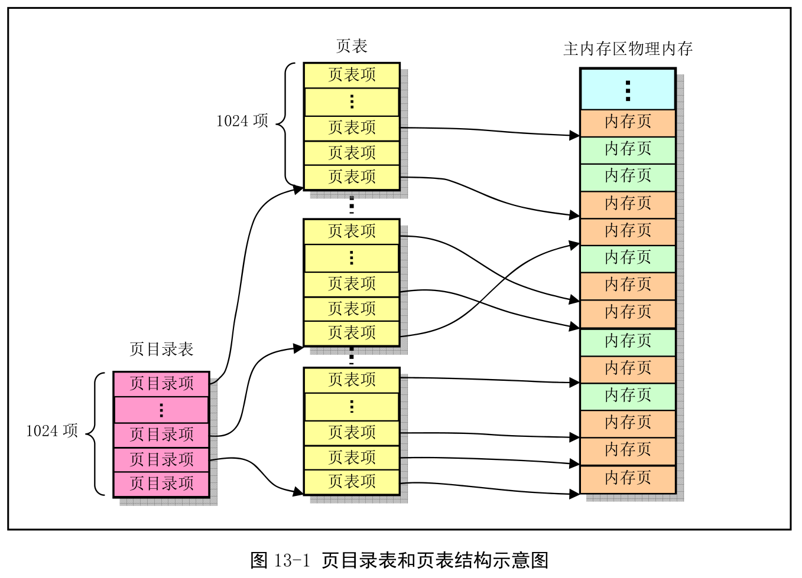
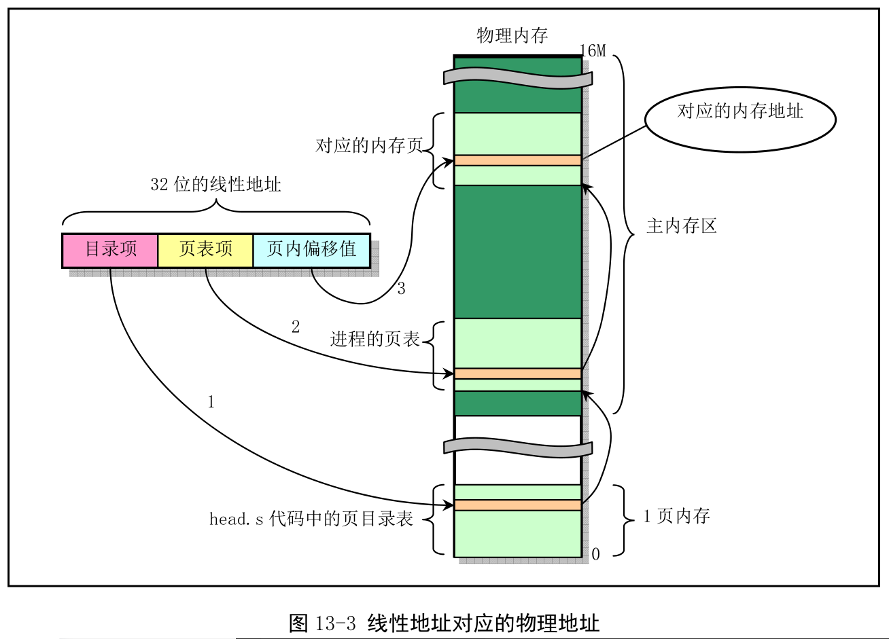

Intel 80X86体系结构中，Linux内核的内存管理程序采用分页管理方式。利用页目录和页表结构处理内核中其他部分代码对内存的申请和释放操作。内存的管理是以内存页面为单位进程的，一个内存页面是指地址连续的4KB物理内存。

Linux 0.12内存管理目录中有4个文件。

page.s仅包含内存页异常的中断处理过程（int 14），主要实现对缺页和页写保护的处理。memory.c是内存页面管理的核心文件，用户内存初始化、页目录和页表的管理和内核其他部分对内存的申请处理过程。swap.c是内存页面交换管理文件，主要包括交换映射位图管理和交换设备访问。

## 1. 内存分页管理机制

Intel 8086中，内存分页通过页目录项和页表所组成的二级表组成，如图。其中页目录项和页表结构一样，表项结构也相同。页目录表中每个表项（4B字节）用来寻址一个页表，而每个页表项（4B）用来指定一个页物理内存页。页目录项占用一页内存，最多可寻址1024个页表。而每个页表占用一页，因此最多可寻址1024个物理内存页面。这样，一个页目录表所寻址的所有页表共可以寻址1024X1024X4096B=4GB内存空间。Linux 0.12中，所有进程都使用一个页目录表，每个进程有自己的页表。内核代码和数据有16MB，使用了4个页表（即4个页目录项）。这4个页表直接位于页目录表后，参见head.s的109\~125行。经过分段，内核代码和数据段位于线性地址空间的前16MB范围，经过分页变换，被直接一一对应到16MB的物理内存上。所以对于内核段，线性地址就是物理地址。

下图形象表示了一个给定的线性地址映射到物理内存页上的。对于第一个进程（任务0），页表是在页目录表之后，共4页。对于应用程序的进程，其页表所使用的内存是在进程创建时向内存管理程序申请的，因此在主内存区内。

一个系统中可同时存在多个页目录项，而某个时刻只有一个页目录项可用。当前页目录表由CPU寄存器CR3确定，它存储**当前页目录表的物理内存地址**。Linux 0.12只用了一个页目录表。

当CPU试图使用一个页表项进行地址转换时，若此时任意一级页表项P=0，则处理器就发出页异常信号。此时缺页中断异常处理程序就可以把所请求的页加入到物理内存中，并且导致异常的指令会被重新执行。

## 2. Linux中物理内存的管理和分配

Linux 0.12最多支持16MB物理内存。内核只占用物理内存最前面一部分，如图end标出位置。随后是高速缓存区，醉倒内存地址是4MB。高速缓冲区被显示内存和ROM BIOS分为两段。剩余是主内存区。主内存区就是本章程序进行分配管理的。若系统还存在RAM 虚拟盘，主内存区前面还要扣除虚拟盘。当需要使用主内存区时就需要向本章内存管理程序申请，所申请基本单位是内存页。

Linux的页目录和页表是在head.s中设置的。