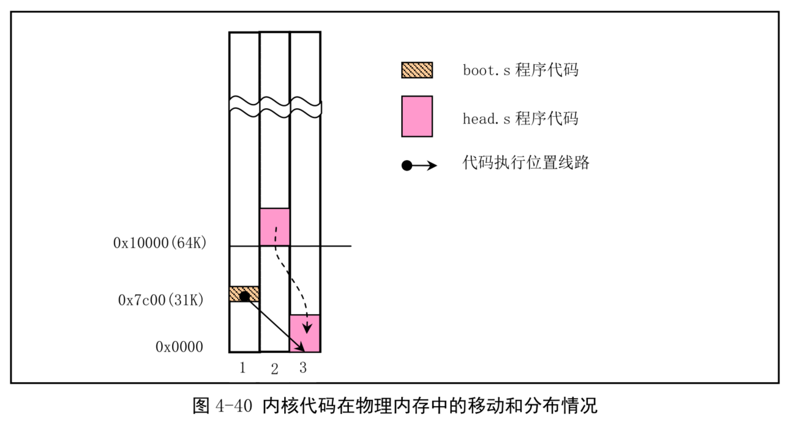
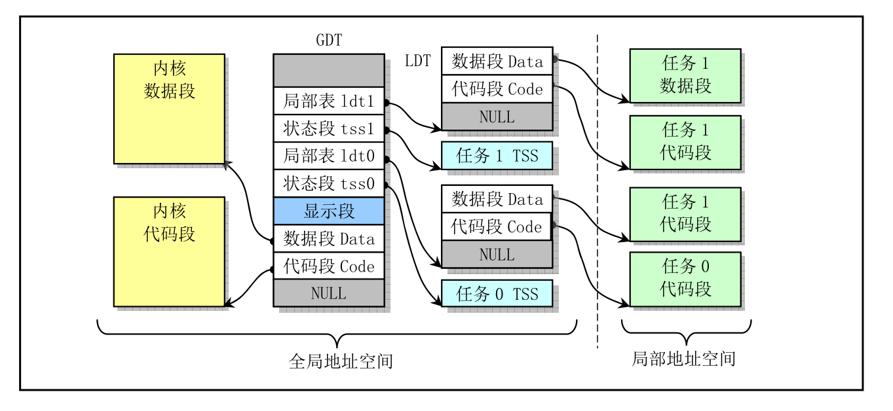

- 4.9 一个简单的多任务内核实例
    - 4.9.1 多任务程序结构和工作原理
    - 4.9.2 引导启动程序boot.s
    - 4.9.3 多任务内核程序head.s

该实例包含两个特权级3的用户任务和一个系统调用中断过程。首先说明这个简单内核的基本结构和加载运行的基本原理，然后描述是如何被加载进机器RAM内存中以及两个任务是如何进行切换运行的。最后给出源码：启动引导程序boot.s和保护模式多任务内核程序head.s。

## 1. 多任务程序结构和工作原理

2个文件。一个是使用as86语言编制的引导启动程序boot.s，用于上电时从启动盘上把内核代码加载到内存中；另一个是使用GNU as汇编编写的内核程序head.s，其中实现了两个运行在特权级3上的任务在时钟中断控制下相互切换运行，并且还实现了在屏幕上显示字符的一个系统调用。这两个任务分别称为任务A和任务B，它们会调用显示系统调用在屏幕上分别显示出字符‘A’和字符‘B’，直到每个10毫秒切换到另一个任务。若要终止该程序，需要重启机器。

boot.s编译出来的代码一共512字节，会存放在可启动设备的第一个扇区，如图。PC加电后，ROM BIOS会把启动盘第一个扇区加载到物理内存0x7c00（31KB）处，并把执行权转移到0x7c00处开始运行boot程序代码。

boot程序的主要功能是把head内核代码加载到内存某处，并在设置好临时GDT表等信息后，把处理器设置为运行在保护模式下，然后跳转到head代码处去运行内核代码。实际上，boot.s程序会首先利用ROM BIOS中断int 0x13把软盘中的head代码读入到内存0x10000（64KB）位置开始处，然后把这段head代码移动到到内存0开始处。最后设置控制器CR0中的开启保护运行模式标志，并跳转到内存0处开始执行head代码。boot程序代码在内存中移动head代码的示意图如下。

把head代码移动到物理内存0开始处主要原因是为了设置GDT表可以简单点，因而也能让head.s程序尽量短一些。但是不能让boot程序把head代码从软盘或映像文件中直接加载到内存0处。因为加载操作需要使用ROM BIOS提供的中断过程，而BIOS使用的中断向量表正处于内存0开始的地方，并且在内存1KB开始处是BIOS程序使用的数据区。当然也可以把head代码加载到内存0x10000处就直接跳转到该处运行head代码，使用这种方式的源码可从oldlinux.org下载，见下面说明。

head.s运行在32位保护模式下，其中主要包括初始化设置的代码、时钟中断int 0x80的过程代码、系统调用中断int 0x80的过程代码和任务A和B的代码数据。

其中初始化设置工作主要包括：

1. 重新设置GDT表；

2. 设置系统定时器芯片；

3. 重新设置IDT表并设置时钟和系统调用中断；

4. 移动到任务A中执行。
 
在虚拟地址空间中head.s程序的内核代码和任务代码分配如图。实际上，该内核示例中所有代码和数据段都对应到物理内存同一个区域上，即从物理内存0开始的区域。GDT中全局代码段和数据段描述符的内容都设置为：基地址位0x0000；段限长值0x07ff。因为颗粒度为1（Granularity，0表示单位是字节，1表示单位是4KB），所以实际段长度是8MB。而全局显示数据段被设置为：基地址0xb8000；段限长值0x0002，所以实际长度为8KB，对应到显示内存区域。

内核和任务在虚拟地址空间中的分配示意图：

