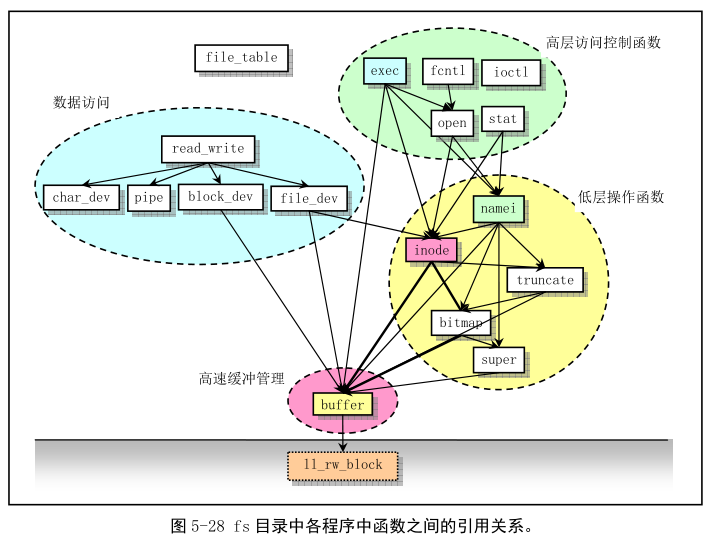
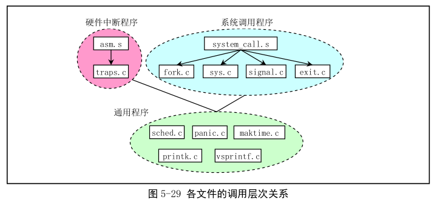

Linux内核是一种单内核模式的系统，所以内核中程序依赖和调用关系很密切。所以很有必须要先熟悉下源码文件的目录结构。

目录结构见下图：

该版本目录14个，102个代码文件。

## 1. 内核主目录linux

主目录，除了14个子目录外，还有一个Makefile文件。该文件是编译辅助工具软件make的参数配置文件。make工具主要是通过识别哪些文件已经被修改过，从而自动地决定在一个含有多个源文件的程序系统中哪些文件需要被重新编译。因此，make工具软件是程序项目的管理软件。

这个Makefile还嵌套调用了所有子目录的Makefile文件。这样，当linux以及子目录下任何文件被修改过，make都会对其重新编译。因此编译整个内核所有的源文件，只要在linux目录下运行一次make软件即可。

## 2. 引导启动程序目录boot

有3个汇编语言文件，是内核源码文件中最先被编译的程序。其中bootsect.S和setup.s需要使用as86软件编译，使用as86的汇编语言格式；head.s使用GNU as来编译，时AT&T格式的汇编。

bootsect.S时磁盘引导块程序，编译后在磁盘的第一个扇区中（引导扇区，0磁道（柱面），0磁头，1扇区）。PC加电ROM BIOS自检后，将被BIOS加载到内存0x7c00运行。

setup.s用于读取机器的硬件配置参数，并把内核模块system移动到合适的内存位置。

head.s会被编译连接在system模块最前部分，主要进行硬件设备的探测设置和内存管理页面的初始设置工作。

## 3. 文件系统目录fs

Linux 0.12采用了1.0版本的MINIX文件系统，但Linux对其处理方式与MINIX系统不同。主要区别在于MINIX对文件系统采用单线程处理方式，而Linux采用多线程方式。由于多线程，必须处理多线程带来的竞争条件、死锁等，因此Linux文件系统要复杂得多。为避免竞争条件的发生，Linux对资源分配进行了严格检查，并在**内核模式下运行时，若任务没有主动睡眠（调用sleep()），就不让内核切换任务**。

fs是文件系统实现程序的目录，共18个C文件程序。这些程序之间引用关系如图。图中每个方框代表一个文件，从上到下按基本引用关系放置。虚线框的程序文件不属于文件系统，带箭头的线条表示引用关系，粗线条表示有互相引用关系。

由图可知，该目录的程序可以划分成4个部分：高速缓冲区管理、低层文件操作、文件数据访问和文件高层函数。

对于文件系统，可以看做时内存高速缓冲区的扩展部分。所有对文件系统中数据的访问，都需要先读取到高速缓冲区。本目录中程序主要用来管理高速缓冲区中缓冲块的使用分配和块设备上的文件系统。管理高速缓冲区的程序时buffer.c，其他程序主要用于文件系统管理。

file\_table.c文件中，目前仅定义了一个文件句柄（描述符）结构数组。ioctl.c引用kernel/chr\_drv/tty.c中函数，实现字符设备的I/O控制功能。exec.c主要包含一个执行程序函数do\_execve()，它是所有exec()函数簇中的主要函数。fcntl.c用于实现文件I/O控制的系统调用函数。read\_write.c用于实现文件读写和定位的3个系统调用函数。stat.c实现了两个获取文件状态的系统调用函数。open.c主要包含实现修改文件属性和创建与关闭文件的系统调用函数。

char\_dev.c主要包含字符设备读写函数rw\_char()。pipe.c中包含管道读写函数和创建管道的系统调用。file\_dev.c中包含基于i节点和描述符结构的文件读写函数。nameei.c包括文件系统中目录名和文件名的操作函数和系统调用函数。block\_dev.c包含块数据读写函数。inode.c包含针对文件系统i节点操作的函数。truncate.c用于在删除文件时释放文件所占的设备数据空间。bitmap.c用于处理文件系统中i节点和逻辑数据块的位图。super.c包含对文件系统中超级块的处理函数。buffer.c主要对内存高速缓冲区进行处理。虚线框中ll\_rw\_block时块设备的底层读函数，不在fs中，而在kernel/blk\_drv/ll\_rw\_block.c中的块设备读写驱动函数。放这里只是说明，文件系统对块设备中数据的读写，都需要通过高速缓冲区与块设备的驱动程序（ll\_rw\_block()）来操作进行，文件系统程序本书不直接与块设备的驱动程序打交道。

## 4. 头文件主目录include

共有32个.h文件。各自功能如下，具体作用以及包含的信息见14章。

## 5. 内核初始化程序目录init

仅有main.c。用于内核所有初始化工作，然后移到用户模式创建新进程，并在控制台设备上运行shell程序。

首先根据机器内存多少对缓冲区内容容量进行分配，如果还设置了要使用虚拟盘，则在缓冲区内存后面也为它留下空间。之后所有硬件的初始化，包括人工创建第一个任务（task 0），并设置中断允许。在执行从内核态移到用户态之后，系统第一次调用创建进程函数fork()，创建出一个用于运行init()的进程，在该进程中，系统将进行控制台环境设置，并再生成一个子进程用来运行shell程序。

## 6. 内核程序主目录kernel

所有处理任务的程序都保存在kernel/目录中。各文件大概引用关系如下。

asm.s处理硬件异常引起的中断，对各硬件异常的实际处理程序在trap.c中，在各个中断处理过程中，将分别调用traps.c中相应函数。

exit.c处理进程终止的系统调用。进程释放、会话（进程组）终止和程序退出处理函数以及杀死进程、终止进程、挂起等系统调用。

fork.c给了sys\_fork()系统调用，其中使用了find\_empty\_process()和copy\_process()。

mktime.c包含一个内核使用的时间函数mktime()，用于计算自1970年1月1日0时起到开机当日的秒数，作为开机秒时间。仅在init/main.c被调用一次。

panic.c包含一个显示内核出错信息并停机函数panic()。

printk.c包含一个内核专用信息显示函数printk()。

sched.c包含有关调度的基本函数和一些简单系统调用函数。还有几个与定时相关的软盘操作函数。

signal.c包含了有关信号处理的4个系统调用以及一个在对应的中断处理程序中处理信号的函数do\_signal()。

sys.c包含很多系统调用函数，有些没实现。

system\_call.s实现Linux系统调用（int 0x80）的接口处理程序，实际处理在相应处理函数中（分布在整个内核代码）。

vsprintf.c程序实现了现在已经归入标准库函数中的字符串格式化函数。

（1）块设备驱动程序子目录kernel/blk\_drv

通常，用户通过文件系统来访问设备的，因此设备驱动程序为文件系统实现了调用接口。为高效率使用块设备上数据，用户程序与块设备之间使用了高速缓冲机制。访问块设备上的数据时，系统首先以数据块形式把块设备上的数据读入到高速缓冲区中，然后提供给用户。

文件关系如图。

blk.h中定义了3个程序中共用的块设备结构和数据块请求结构。hd.c实现对硬盘数据块进行读/写的底层驱动函数；floppy.c实现对软盘数据块的读/写驱动函数。ll\_rw\_blk.c实现底层块设备数据读/写函数ll\_rw\_block()，内核中所有其他程序都是通过该函数对块设备进行数据读写。很多地方都会调用，尤其在高速缓冲区处理文件fs/buffer.c中。

（2）字符设备驱动程序子目录kernel/chr\_drv

实现了对**串行端口RS-232、串行终端、键盘和控制台终端设备**的驱动。下图是文件之间的大致调用层次关系。

tty\_io.c包含tty字符设备读写函数tty\_read()、tty\_write()，为文件系统提供上层访问接口。另外还包括在串行中断处理过程中调用的do\_tty\_interrupt()，这将在中断类型为读字符处理中被调用。

console.c包含控制台初始化程序和控制台写函数con\_write()，用于被tty设备调用。对显示器和键盘中断的初始化设置程序con\_init()。

rs\_io.s实现两个串行接口的中断处理程序。该程序会根据从中断标识寄存器（端口0x3fa或0x2fa）中取得4种中断类型分别处理，并在类型为读字符的代码中调用do\_tty\_interrupt()。

serial.c对异步串行通信芯片UART进行初始化操作，并设置两个通信端口的中断向量。还包括tty用于往串口输出的rs\_write()函数。

tty\_ioctl.c实现tty的I/O控制接口函数tty\_ioctl()以及对termio(s)终端I/O结构的读写，会在实现系统调用sys\_ioctl()的fs/ioctl.c程序中调用。

keyboard.S实现了键盘中断处理过程keyboard\_interrupt。

（3）协处理器仿真和操作程序子目录kernel/math

math\_emulate()是中断int7的中断处理程序调用的。当机器中没有数学协处理器，而CPU却又执行了协处理器的指令时，引发该中断。因此，使用该中断就可用软件仿真协处理器。

## 7. 内核库函数lib

完整C库很大，该目录只提供内核需要用的函数。

## 8. 内存管理程序目录mm

主要用于管理程序对主内存区的使用，并实现进程逻辑地址到线性地址以及线性地址到物理内存地址的映射操作，并通过内存分页管理机制，在进程的虚拟内存页与主内存区的物理内存页之间建立对应关系，同时真正实现虚拟存储技术。

Linux内核对内存使用了分页和分段。首先将386的4GB虚拟地址空间分成64个段，每段4MB。所有内核程序只占第一个段，并且物理地址与该段线性地址相同。然后每个任务分配一个段使用。分页把指定的物理内存页面映射到段内，检测fork创建的任何重复的副本，并执行写时复制机制。

page.s包含内存页面异常中断（int 14）处理程序，主要用于处理程序由于缺页而引起的页异常中断和访问非法地址而引起的页保护。

memory.c包括对内存初始化的函数mem\_init()，有page.s的内存处理中断过程调用的do\_no\_page()和do\_wp\_page()函数。创建新进程而执行复制进程操作时，即使用其中的内存处理函数来分配管理内存空间。

swap.c管理主内存中物理页面和高速二级存储（硬盘）空间之间的页面交换。主内存空间不够可将暂时不用的内存页面保存在硬盘中。缺页异常就首先在硬盘中查看要求的页面是否在硬盘交换空间中。

## 9. 编译内核工具程序目录tools

build.c用于将Linux各个目录中被分别编译生成的目标代码连接合并成一个可运行的内核映像文件image。