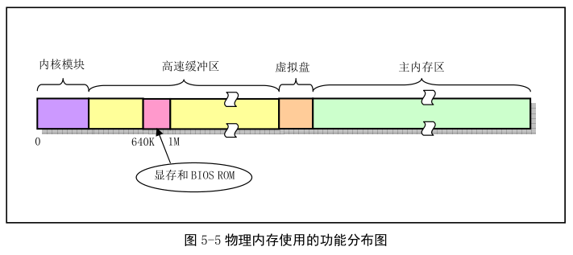

先说明Linux 0.12中比较直观的物理内存使用情况，然后结合Linux 0.12内核中应用情况，再分别概述内存的分段和分页机制以及CPU多任务操作和保护方式。最后综合说明Linux 0.12中内核代码和数据以及各个任务的代码和数据在虚拟地址、线性地址和物理地址之间的对应关系。

## 1. 物理内存

Linux 0.12中，为有效使用机器中的物理内存，在系统初始化阶段内存被分为几个功能区域，见图5-5。



其中，Linux内核程序占据物理内存最开始部分，接下来是硬盘或软盘等快设备使用的高速缓冲区（其中要扣除显卡内存和ROM BIOS占据的内存范围640KB~1MB）。

当一个进程需要读取块设备中的数据时，系统会首先将数据读到高速缓冲区；当有数据需要写到块设备上时，系统也是先将数据写到高速缓冲区中，然后由块设备驱动程序写入到相应的设备上。

对于含有RAM虚拟盘的系统，主内存区头部还要划去一部分，供虚拟盘存放数据。

最后部分是可供所有程序使用的主内存区。

Linux同时采用了内存分段和分业管理机制。

## 2. 内存地址空间概念

Linux 0.12内核中，进行地址映射操作时，需要首先分清3种地址以及之间的变换概念：程序（进程）的虚拟和逻辑地址、CPU的线性地址、实际物理内存地址。

虚拟地址（Virtual Address）由程序产生的由段选择符和段内偏移地址两部分组成。虚拟地址空间由GDT映射的全局地址空间和由LDT映射的局部地址空间组成。最大虚拟地址空间有64TB。

逻辑地址（Logical Address）指由程序产生的与段相关的偏移地址部分。保护模式下即代码段或数据段的限长内的偏移地址。应用程序仅需与逻辑地址打交道，而分段和分页机制对其是完全透明的。有些资料不区分逻辑地址和虚拟地址，统称为逻辑地址。

线性地址（Linear Address）是虚拟地址到物理地址变换中间层。程序代码产生逻辑地址，或者说段中的逻辑地址，加上相应段的基地址，构成线性地址。Intel 80386的线性地址空间容量是4GB。

物理地址（Physical Address）是出现在CPU外部地址总线桑的寻址物理内存的地址信号。

虚拟存储（虚拟内存）（Virtual Memory）是指计算机呈现出来的要比实际拥有的内存大得多的内存量。**在Linux 0.12内核中，给每个程序（进程）都划分了总容量为64MB的虚拟内存空间**。因此程序的逻辑地址范围是0x0000000到0x4000000。

## 3. 内存分段机制

一个程序的逻辑地址通过分段机制自动地映射（变换）到中间层地4GB（2\^32）线性地址空间中。整体变换过程如下：


CPU进行地址转换主要目的是为了解决虚拟内存空间到物理内存空间的映射问题。通常虚拟内存空间要比实际物理内存量大得多。

虚拟内存管理怎么实现的？首先，当一个程序需要使用一块不存在的内存时（即在内存页表项中已标出相应内存页面不在内存中），CPU就需要一种方法来得知这种情况。通过80386的页错误异常中断来实现。当一个进程引用一个不存在页面中的地址时，就会触发CPU产生页出错异常中断，并**把引起中断的线性地址放到CR2控制寄存器中**。因此处理器中断的过程就知道发生页异常的确切地址，此时可以把进程要求的页面从二级存储空间（如硬盘）加载到物理内存中。如果此时物理内存已经被全部占用，那么可以借助二级存储空间的一部分作为交换缓冲区（Swapper）把内存中暂时不使用的页面交换到二级缓冲区中，然后把要求的页面调入内存中。这就是内存管理的缺页加载机制，在Linux 0.12内核中在mm/memory.c中实现。

Intel使用段（Segment）来对程序进行寻址。每个段定义了内存中的某个区域以及访问的优先级等信息。见下图。


保存描述符项的描述符表有三种。

**全局描述符表GDT**（Global Descriptor Table）可被所有程序用于引用访问一个内存段。

**中断描述符表IDT**（Intertupt Descriptor Table）保存定义中断或异常处理过程的段描述符。IDT表直接代替了8086（实模式）中的中断向量表（IVT）。

为了在8086保护模式下运行，必须为CPU定义一个GDT表和一个IDT表。

局部描述符表LDT（Local Descriptor Table）用于多任务系统，通常每个任务一个LDT表。

为了让CPU能定位GDT表、IDT表和当前的LDT表，需要为CPU分别设置GDTR、IDTR和LDTR寄存器。

每个程序都可由若干个内存段组成。程序的逻辑地址（虚拟地址）即是用于寻址这些段和段中具体地址位置。Linux 0.12中，程序逻辑地址到线性地址的变换使用了GDT和LDT。由GDT映射的地址空间称为全局地址空间，由LDT映射的地址空间称为局部地址空间，这两部分构成虚拟地址空间。使用方法如下。


图中画出了有两个任务时候的情况。

可看出，每个任务的LDT本身也是由GDT中描述符定义的一个内存段，在该段中存放着对应的代码段和数据段描述符，因此LDT段很短，其段限长通常只要24字节即可。

同样，每个任务的任务状态段TSS也是由GDT中描述符定义的一个内存段。、，其限长也只要满足能够存放一个TSS数据结构即可。

对于IDT（中断描述符表），它保存在内核代码段中。

在Linux 0.12中，内核和各任务的代码段和数据段都分别被映射到线性地址空间中相同基址处，且段限长一样，因此内核的数据段和代码段是重叠的，各任务的代码段和数据段也是重叠的，参见图5-10或5-11。

任务状态段TSS（Task State Segment）用于在任务切换时CPU自动保存或恢复相关任务的当前执行上下文。

在Linux 0.12中，每个任务的TSS段内容被保存在该任务的任务数据结构中。另外，Linux 0.12没有使用到GDT中第4个描述符（图中syscall描述符项）。从include/linux/sched.h文件中第201行的注释可以猜到，Linus本来想把系统调用的代码放在这个专门的段中。

```
200  /*
201  * Entry into gdt where to find first TSS. 0-nul, 1-cs, 2-ds, 3-syscall
202  * 4-TSS0, 5-LDT0, 6-TSS1 etc ...
203  */
```

## 4. 内存分页管理

