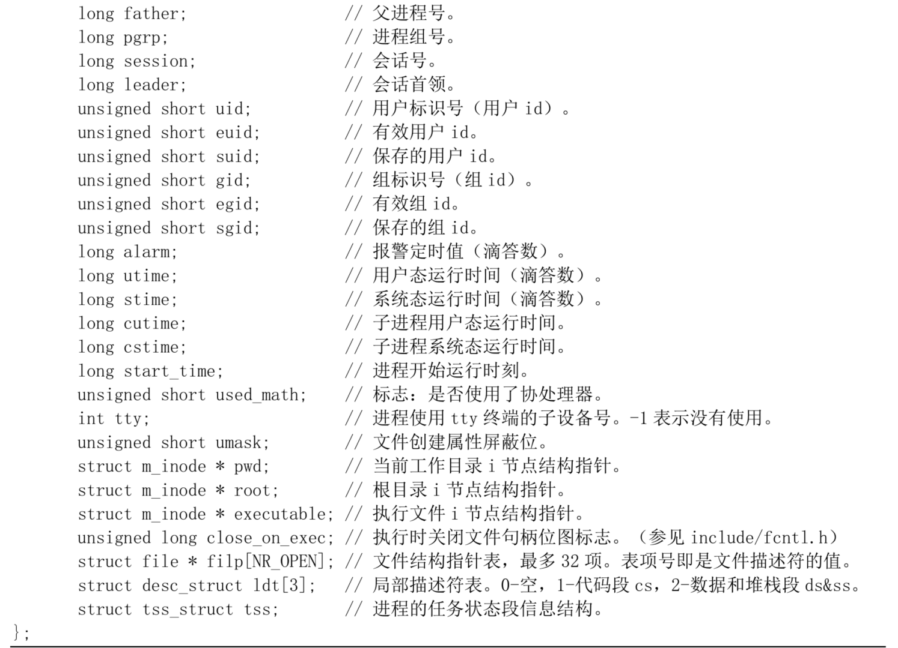
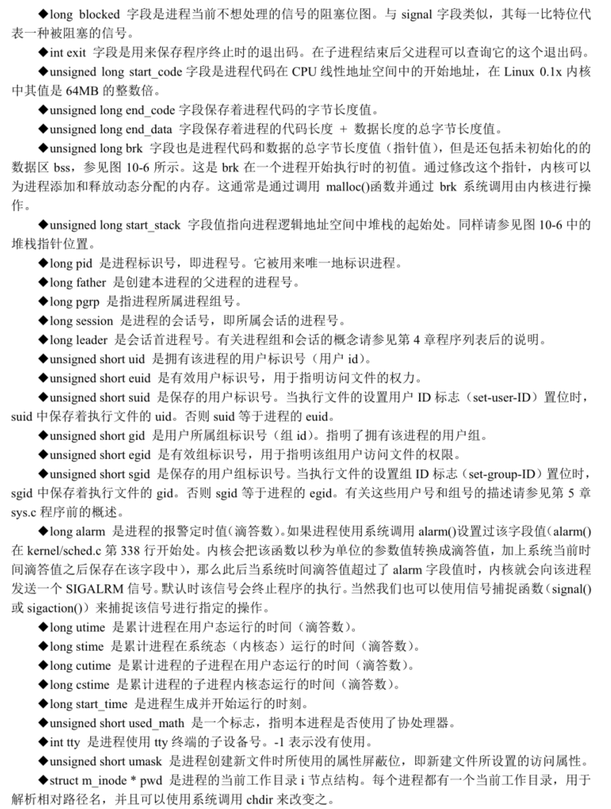
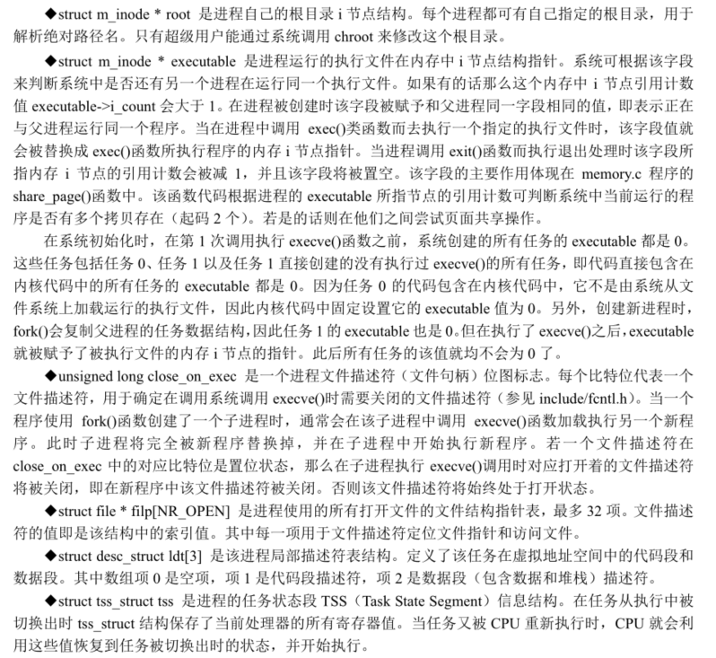
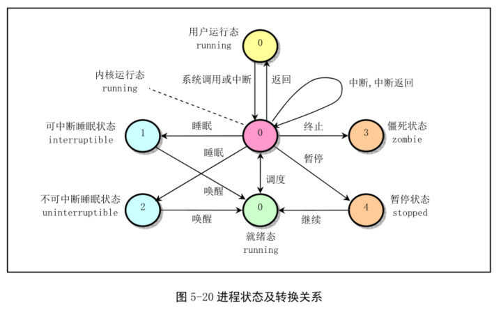
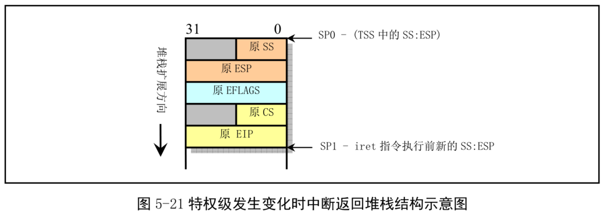

利用分时技术，在Linux操作系统上同时可以运行多个进程。分时技术的基本原理是把CPU的运行时间划分成一个个规定长度的时间片（time slice），让每个进程在一个时间片内运行。时间片用完就利用调度程序切换到另一个进程去运行。

对于Linux 0.12内核来讲，系统最多可有64个进程同时存在。除了第一个进程“手工”建立以外，其余都是现有进程使用系统调用fork创建的新进程，被创建的进程称为子进程（child process），创建者是父进程(parent process)。

Linux系统中一个进程可以在内核态（kernel mode）或用户态（user mode）下执行，并且分别使用各自独立的内核态堆栈和用户态堆栈。

## 1. 任务数据结构

内核程序通过进程表对进程管理，每个进程在进程表中占有一项。在Linux中，进程表项是一个task_struct任务结构指针。任务数据结构定义在头文件include/linux/sched.h中。有些称为进程控制块（Process Control Block，PCB）或进程描述符（Processor Descriptor，PD）。其中保存着用于控制和管理进程的所有信息。主要包括进程当前运行的状态信息、信号、进程号、父进程号、运行时间累计值、正在使用的文件和本任务的局部描述符以及任务状态段信息。该结构每个字段如下。

（1）long state字段含有进程的当前状态代号。

（2）long counter保存进程在被暂时停止本次运行之前还能执行的时间滴答数，即正常情况下还需要几个系统时钟周期才切换到另一个进程。调度程序会根据counter选择下一个执行的进程。初始值等于priority。

（3）long prriority用于给counter赋值。Linux 0.12 中为15个系统时钟周期时间（15个滴答）。当然单位也是时间滴答数。

（4）long signal进程当前所收到信号的位图，共32位，每位代表一种信号，信号值=位偏移值+1。因此Linux 内核最多有32个信号。每个系统调用处理最后，系统会使用该信号位图对信号进行预处理。

（5）struct sigaction sigaction[32]结构数组用来保存处理各信号所使用的操作和属性。数字每一项对应一个信号。

进程执行时，CPU的所有寄存器中的值、进程状态以及堆栈中的内容被称为该进程的上下文。Linux中，当前进程上下文均保存在进程的任务数据结构中。发生中断时，内核就在被中断进程的上下文中，在内核态下执行中断服务例程。但同时会保留所有需要用到的资源，以便中断服务结束时能恢复被中断进程的执行。

## 2. 进程运行状态

如图。当进程正在等待系统中的资源而处于等待状态时，称为睡眠等待状态。Linux中，睡眠等待状态分为可中断和不可中断的等待。

- 运行状态（TASK\_RUNNING）。当进程正在被CPU执行，或已经准备就绪随时可由调度程序执行，称为运行状态。若没有被CPU执行，称为就绪运行状态。图中3个标号为0的状态。当系统资源可用时，进程就被唤醒而进入准备状态，称为就绪态。
    
- 可中断睡眠状态（TASK\_INTERRUPTIBLE）。进程处于可中断等待（睡眠）状态，系统不会调度该进程执行。当系统产生一个中断或释放了进程正在等待的资源，或者收到了一个信号，都可以唤醒进程转换到就绪状态（可运行状态）。

- 不可中断睡眠状态（TASK\_UNIBTERRUPTIBLE）。进程通常在直接或间接等待硬件条件的满足因而不接受任何信号。只有使用wake\_up()明确唤醒才能转换到可运行的就绪状态。

- 暂停状态（TASK\_STOPPED）。进程收到SIGSTOP、SIGTSTP、SIGTTIN或SIGTTOU便进入暂停状态。可向其发送SIGCONT信号转换到可运行状态。进程在调试期间接受任何信号都会进入该状态。Linux 0.12中还未实现该状态的转换处理。处于该状态的进程将被作为进程终止来处理。

- 僵死状态（TASK\_ZOMBIE）。当进程已停止运行，但父进程没有调用wait()询问其状态。为了让父进程能获取其停止运行的信息，此时子进程的任务数据结构信息还需要保留。一旦父进程调用wait()取得子进程的信息，该进程的任务数据结构就会释放。

当一个进程的运行时间片用完，系统就会使用调度程序强制切换。

另外，如果进程在内核态执行时需要等待系统的某个资源，此时该进程就会调用sleep\_on()或interruptible\_sleep\_on()自愿放弃CPU使用权，而让调度程序去执行其他程序。进程进入睡眠状态（TASK\_INTERRUPTIBLE或TASK\_UNIBTERRUPTIBLE）。

只有当进程从“内核运行态”转移到“睡眠状态”时，内核才会进行进程切换。在内核态下运行的进程不能被其他进程抢占，而且一个进程不能改变另一个进程的状态。为避免进程切换造成内核数据错误，内核在执行临界区代码时会禁止一切中断。

## 3. 进程初始化

boot目录下，引导程序将内核从磁盘加载到内存，并让系统进入保护模式下运行后，就开始执行系统初始化程序init/main.c。该程序首先确定如何分配使用系统物理内存，然后调用内核各部分的初始化函数分别对内存管理、中断处理、块设备和字符设备、进程管理以及硬盘和软盘硬件进行初始化处理。完成这些操作后，系统各部分已经处于可运行状态。此后程序将自己“手动”移动到任务0（进程0）中运行，并使用fork()调用创建进程1。进程1程序将继续初始化环境并执行shell登录程序。原进程0则会在系统空闲时被调度执行，此时任务0仅执行pause()系统调用，其中又会去执行调度函数。

“移动到任务0中执行”由宏move\_to\_user\_mode（include/asm/system.h）完成。它把main.c程序执行流从内核态（特权级0）移动到用户态（特权级3）的任务0中继续执行。移动前，系统在对调度程序的初始化过程（sched\_init()）中，首先对任务0的运行环境进行了设置。包括人工预先设置好任务0数据结构各字段的值（include/linux/sched.h）、在全局描述符表中添加任务0的任务状态段（TSS）描述符和局部描述符表（LDT）的段描述符，并把它们分别加载到任务寄存器TR和局部描述符表LDTR中。

内核初始化是一个特殊过程，内核初始化代码也即是任务0的代码。从任务0数据结构中设置的初始数据可知，任务0的代码段和数据段基址为0，段限长640KB。而内核代码段和数据段基址是0，段限长16MB。内核初始化程序main.c是任务0的代码。宏move\_to\_user\_mode就是把运行特权级从内核态0级变到用户态3级，但仍执行原来的代码指令流。

在移动到任务0过程中，**宏move\_to\_user\_mode使用了中断返回指令造成特权级改变的方法**。使用这种方式进行控制转移是由CPU保护机制造成的。CPU允许低级别代码通过调用门或中断、陷阱门来调用或转移到高级别代码中执行（**控制转移！！！并非任务切换！！！**），反之不行。因此内核使用了这种模拟iret返回低级别代码的方法。该方法主要思想就是在堆栈中构筑中断返回指令需要的内容，把返回地址的段选择符设置成任务0代码段选择符，其特权级为3。此后iret（中断返回指令，没有EFLAGS中NT）将导致系统CPU从特权级0跳到特权级3上运行。下图是特权级变化时中断返回堆栈结构。

详细见“ Assembly/x86/x86汇编语言_从实模式到保护模式/第三部分 32位保护模式/14. 任务和特权级保护/5. 用户程序的执行（调用门转移控制以及进入3特权级用户程序）”。

