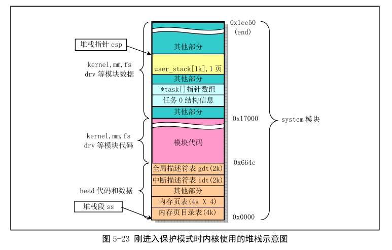
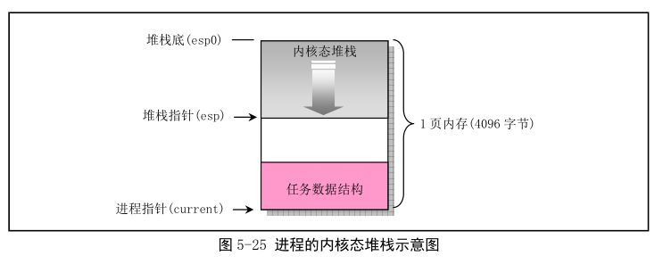

本节概要描述Linux内核从开机引导到系统正常运行过程中对堆栈的使用方式。

Linux 0.12中共用了4种堆栈。第1种是系统引导初始化时临时使用的堆栈；第2种是保护模式后提供内核程序初始化使用的堆栈，位于内核代码地址空间固定位置处。该堆栈也是任务0使用的用户态堆栈；第3种是每个任务通过系统调用，执行内核程序时使用的堆栈，任务的内核态堆栈。每个任务都有自己独立的内核态堆栈；第4种是任务在用户态执行的堆栈，位于任务（进程）逻辑地址空间近末端处。

## 1. 初始化阶段

（1）开机初始化时（bootsect.S，setup.s）

当bootsect代码被ROM BIOS加载到物理内存0x7c00时，并没有设置堆栈段。直到bootsect被移动到0x9000:0时，才把堆栈段寄存器SS设置为0x9000，堆栈指针esp设为0xff00，参见boot/bootsect.s第61、62行。setup.s也沿用了这个。这就是系统初始化时临时使用的堆栈。

（2）进入保护模式时（head.s）

从head.s起，系统正式在保护模式下运行。此时堆栈段被设为内核数据段（0x10），堆栈指针esp设置成指向user\_stack数组的顶端（head.s，31行），保留1页内存（4KB）作为堆栈使用。user\_stack数组定义在sched.c的67\~72行，共1024个长字。它在物理内存位置见下图。此时该堆栈是内核程序自己使用的堆栈。其中地址是大约值，取决于编译时实际设置参数。**这些地址位置从编译内核时生成的system.map文件中查到**。



（3）初始化时（main.c）

在init/main.c中，执行move\_to\_user\_mode()代码把控制权移交给任务0之前，系统一直使用上述堆栈。而在执行move\_to\_user\_mode()后，main.c的代码被“切换”成任务0中执行。通过执行fork()系统调用，main.c中init()将在任务1中执行，并使用任务1的堆栈。而main()本身则在被“切换”成任务0后，仍然继续使用上述内核程序自己的堆栈作为任务0的用户态堆栈。

## 2. 任务的堆栈

每个任务有两个堆栈，分别用于用户态和内核态程序的执行，并且分别称为用户态堆栈和内核态堆栈。除了处于不同CPU特权级，主要区别在于任务的内核态堆栈很小，所保存的数据量最多不能超过4096-任务数据结构块个字节，约3KB。而任务的用户态堆栈却可以在用户的64MB空间内延伸。

（1）在用户态运行时

除了任务0和1，每个任务有自己的64MB地址空间。当一个任务（进程）刚被创建时，它的用户态堆栈指针被设置在其地址空间靠近末端（64MB）部分。实际上末端先是执行程序的参数和环境变量，然后是用户堆栈空间。如下图。实际使用的物理内存则由CPU分页机制确定。由于Linux写时复制（Copy On Write），因此，进程创建后，若该进程以及父进程没有使用堆栈，则两者共享同一堆栈对应的物理内存页面。只有当其中一个进程执行堆栈写操作（如push）内核内存管理才会为写操作进程分配新内存页面。进程0和1的用户栈比较特殊。


（2）在内核态运行时

每个任务有自己的内核态堆栈，用于任务在内核代码中执行。在线性地址中位置由该任务TSS段中ss0和esp0指定。ss0是内核态堆栈的段选择符，esp0是栈底指针。因此每当任务从用户代码转移到内核代码中执行（纯控制转移，不涉及任务切换），任务的内核态栈总是空的。任务内核态堆栈被设置在位于其任务数据结构（stask\_struct）所在页面的末端（同一页面）。这是fork()陈旭在任务tss段的内核级堆栈字段（tss.esp0和tss.ss0）中设置的，参见kernel/fork.c，92行：

```
p->tss.esp0 = PAGE_SIZE + (long)p;
p->tss.ss0 = 0x10;  //内核数据段描述符
```

其中，p是新任务的任务数据结构指针。

