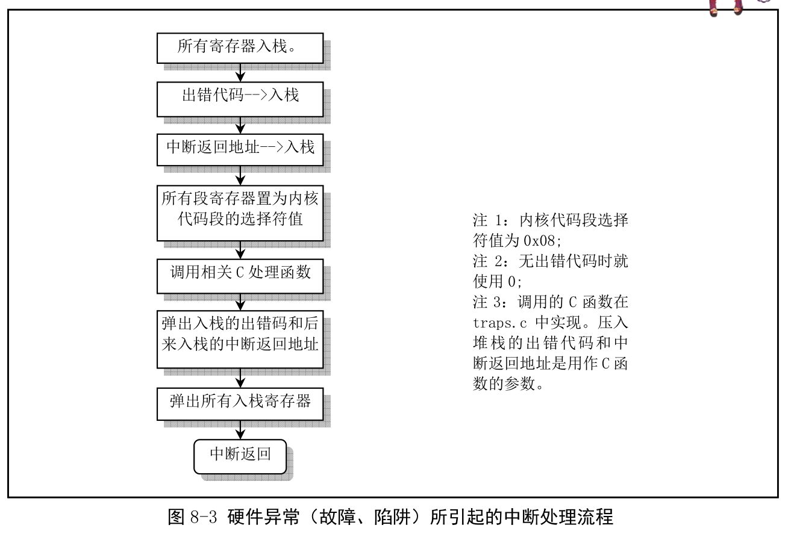

linux/kernel目录。

该目录下代码从功能上可分为三类，一类是硬件（异常）中断处理程序文件，一类是系统调用服务处理程序文件，还有进程调度等通用功能。

## 1. 中断处理程序

主要两个文件：asm.s和traps.c。asm.s实现大部分硬件异常所引起的中断的汇编语言处理程序。traps.c则实现了asm.s的中断处理过程中调用的C函数。另外几个硬件中断处理过程在文件sys\_call.s和mm/page.s中实现。关于PC中825A可编程中断控制芯片见其他章节。

在用户程序（进程）将控制权交给中断处理程序前，CPU会首先将至少12字节（EFLAGS、CS和EIP）信息压入中断处理程序的堆栈中，即**进程的内核态栈中(这不是任务切换，只是控制权转移，详细见Assembly相应内容！！！)**。见图8-2a所示，这与一个远调用（段间子程序调用）类似。CPU会将代码段选择符CS和返回地址的偏移值压入堆栈。另一个与段间调用相似地方是将信息压入到目的代码（中断处理程序代码）的堆栈上，而不是被中断代码的堆栈中。

若优先级变化，例如从用户级改变到内核系统级，CPU还会将原代码的堆栈段值和堆栈指针压入中断程序的堆栈中。但内核初始化完成后，内核代码执行使用的是进程的内核态栈，而被中断代码的堆栈当然也就是指进程的用户态堆栈了。所以发生中断时，中断处理过程使用的是进程的内核态堆栈。另外，CPU还总将EFLAGS内容压入隧站。

asm.s主要涉及对Intel保留中断int0~int16的处理，其余保留的中断int17~int31由Intel保留。Linux系统调用中断int128（0x80）处理将在kernel/sys\_call.s给出。

有些异常的中断，CPU内部产生一个出错码压入堆栈（异常中断int8和int10\~int14），如图8-2b，而其他中断并不带有这个出错码，因此，asm.s中会根据是否携带出错码将中断分为两类处理。但处理流程还是一样。

一个硬件异常引起的中断处理过程如图8-3。

## 2. 系统调用处理相关程序