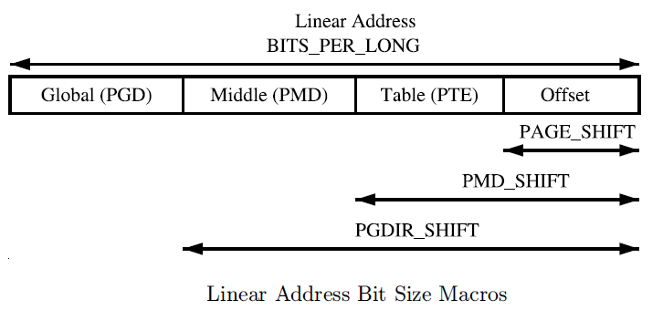
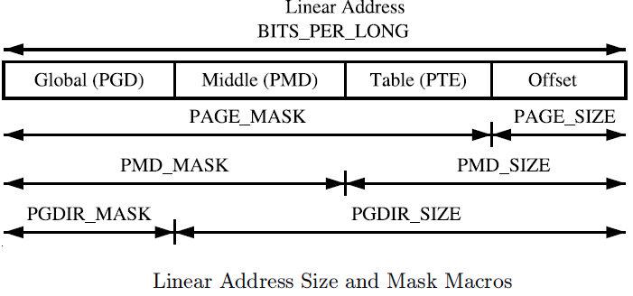

参考：

http://blog.csdn.net/MyArrow/article/details/8624687

## 1. Linux物理内存三级架构


对于内存管理，Linux采用了与具体体系结构不相关的设计模型，实现了良好的可伸缩性。它主要由内存节点node、内存区域zone和物理页框page三级架构组成。

### 内存节点node

内存节点node是计算机系统中对物理内存的一种描述方法，一个总线主设备访问位于同一个节点中的任意内存单元所花的代价相同，而访问任意两个不同节点中的内存单元所花的代价不同。在一致存储结构(Uniform Memory Architecture，简称UMA)计算机系统中只有一个节点，而在非一致性存储结构(NUMA)计算机系统中有多个节点。Linux内核中使用数据结构pg_data_t来表示内存节点node。如常用的ARM架构为UMA架构。

### 内存区域zone

内存区域位于同一个内存节点之内，由于各种原因它们的用途和使用方法并不一样。如基于IA32体系结构的个人计算机系统中，由于历史原因使得ISA设备只能使用最低16MB来进行DMA传输。又如，由于Linux内核采用

## 2. Linux虚拟内存三级页表

Linux虚拟内存三级管理由以下三级组成：

- PGD: Page Global Directory (页目录)

- PMD: Page Middle Directory (页目录)

- PTE:  Page Table Entry  (页表项)

每一级有以下三个关键描述宏：

- SHIFT

- SIZE

- MASK

如页的对应描述为：

```
/* PAGE_SHIFT determines the page size  asm/page.h */  
#define PAGE_SHIFT      12  
#define PAGE_SIZE       (_AC(1,UL) << PAGE_SHIFT)  
#define PAGE_MASK       (~(PAGE_SIZE-1))  
```

数据结构定义如下：

```
/* asm/page.h */  
typedef unsigned long pteval_t;  
  
typedef pteval_t pte_t;  
typedef unsigned long pmd_t;  
typedef unsigned long pgd_t[2];  
typedef unsigned long pgprot_t;  
  
#define pte_val(x)      (x)  
#define pmd_val(x)      (x)  
#define pgd_val(x)  ((x)[0])  
#define pgprot_val(x)   (x)  
  
#define __pte(x)        (x)  
#define __pmd(x)        (x)  
#define __pgprot(x)     (x)  
```

### 2.1 Page Directory (PGD and PMD)

每个进程有它自己的PGD(Page Global Directory)，它是一个物理页，并包含一个pgd\_t数组。其定义见<asm/page.h>。 进程的pgd\_t数据见 task\_struct -> mm\_struct -> pgd\_t * pgd;    

ARM架构的PGD和PMD的定义如下<arch/arm/include/asm/pgtable.h>：

```
#define PTRS_PER_PTE  512 // PTE中可包含的指针<u32>数 (21-12=9bit) #define PTRS_PER_PMD  1 #define PTRS_PER_PGD  2048 // PGD中可包含的指针<u32>数 (32-21=11bit)

#define PTE_HWTABLE_PTRS (PTRS_PER_PTE) #define PTE_HWTABLE_OFF  (PTE_HWTABLE_PTRS * sizeof(pte_t)) #define PTE_HWTABLE_SIZE (PTRS_PER_PTE * sizeof(u32))

/*  * PMD_SHIFT determines the size of the area a second-level page table can map  * PGDIR_SHIFT determines what a third-level page table entry can map  */ #define PMD_SHIFT  21 #define PGDIR_SHIFT  21
```

虚拟地址SHIFT宏图：



虚拟地址MASK和SIZE宏图：



### 2.2 Page Table Entry

PTEs, PMDs和PGDs分别由pte\_t, pmd\_t 和pgd\_t来描述。为了存储保护位，pgprot\_t被定义，它拥有相关的flags并经常被存储在page table entry低位(lower bits)，其具体的存储方式依赖于CPU架构。

每个pte\_t指向一个物理页的地址，并且所有的地址都是页对齐的。因此在32位地址中有PAGE\_SHIFT(12)位是空闲的，它可以为PTE的状态位。

PTE的保护和状态位如下图所示：

